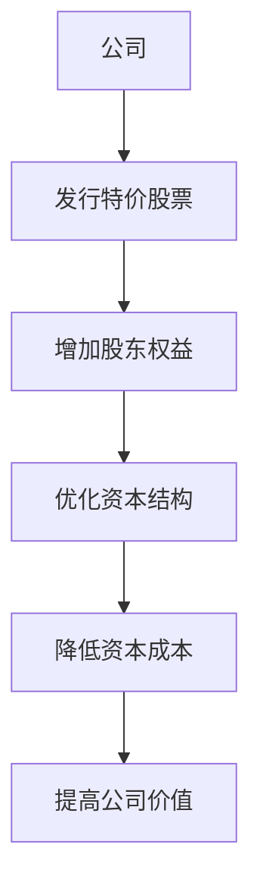
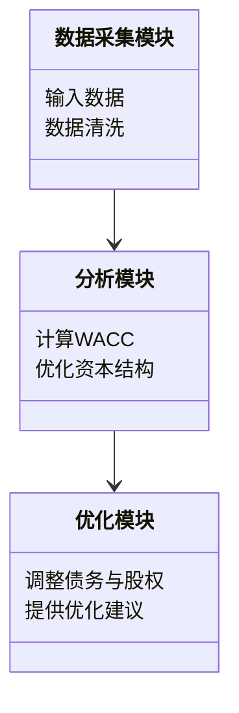
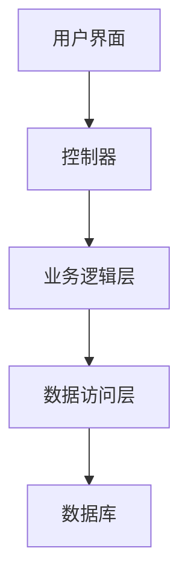
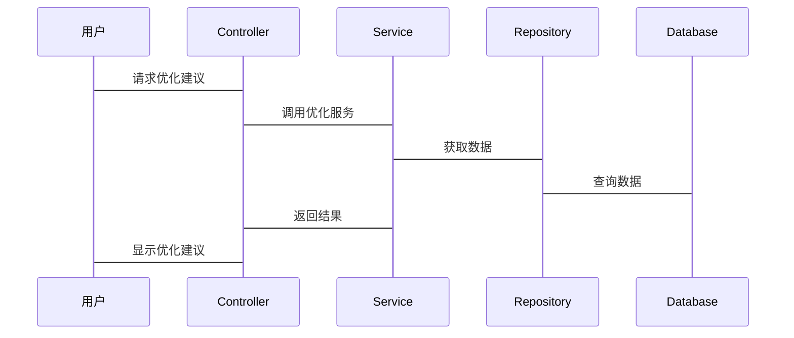

                 


# 特价股票与公司资本结构优化的关系

## 关键词
- 特价股票
- 资本结构优化
- 金融模型
- 投资策略
- 企业财务

## 摘要
本文探讨了特价股票与公司资本结构优化之间的关系，分析了特价股票的特性、资本结构优化的理论基础，以及两者如何相互影响。通过数学模型和系统设计，展示了如何利用特价股票优化资本结构，从而提升企业价值。文章结合实际案例，提供了详细的实现步骤和最佳实践建议。

## 第一章：特价股票与资本结构优化的背景

### 1.1 特价股票的定义与特性
#### 1.1.1 特价股票的定义
特价股票是指以低于面值的价格发行的股票。这种股票通常用于公司资本结构调整或吸引投资者。

#### 1.1.2 特价股票的特性
- 发行价格低于面值
- 可能附带优先权或额外股息
- 用于资本结构调整

#### 1.1.3 特价股票的发行机制
- 配股
- 送股
- 增发

### 1.2 资本结构优化的定义与重要性
#### 1.2.1 资本结构的定义
资本结构指公司债务和股权的比例。

#### 1.2.2 资本结构优化的重要性
- 降低资本成本
- 降低财务风险
- 提高企业价值

#### 1.2.3 资本结构优化的目标
- 最小化加权平均资本成本
- 优化债务与股权比例

### 1.3 特价股票与资本结构优化的关系
#### 1.3.1 特价股票对资本结构的影响
- 增加股东权益
- 降低负债比例

#### 1.3.2 资本结构优化对股价的影响
- 提高股价稳定性
- 增加投资者信心

#### 1.3.3 特价股票与资本结构优化的相互作用
- 特价股票用于优化资本结构
- 优化资本结构提升股价

## 第二章：资本结构优化的理论基础

### 2.1 资本结构优化的理论模型
#### 2.1.1 Modigliani-Miller定理
- 无税情况下的资本结构无关
- 税务庇护下的资本结构最优

#### 2.1.2 净收益理论
- 利息的税务优惠降低了资本成本

#### 2.1.3 净价格理论
- 股票价格受资本结构影响

### 2.2 资本结构优化的影响因素
#### 2.2.1 利息税盾效应
- 利息支出的税务优惠

#### 2.2.2 财务风险与资本成本
- 高负债增加财务风险和资本成本

#### 2.2.3 行业特点与企业规模
- 不同行业和规模企业的资本结构不同

### 2.3 资本结构优化的数学模型
#### 2.3.1 加权平均资本成本（WACC）公式
$$ WACC = \frac{D}{V} \times r_d \times (1 - t) + \frac{E}{V} \times r_e $$

其中：
- D：债务总额
- E：股权总额
- V：公司总价值
- r_d：债务成本
- r_e：股权成本
- t：税率

## 第三章：特价股票与资本结构优化的核心概念

### 3.1 特价股票的属性对比
| 特性         | 特价股票       | 普通股票       |
|--------------|----------------|----------------|
| 发行价格     | 低于面值       | 等于或高于面值 |
| 股息权利     | 可能优先       | 普通股         |
| 投票权       | 可能受限       | 完全投票权     |

### 3.2 特价股票与资本结构优化的实体关系


## 第四章：资本结构优化的数学模型

### 4.1 优化模型的数学公式
$$ V = \frac{E \times (1 - t) \times r_d}{r_e - r_d} $$

其中：
- E：股权
- t：税率
- r_d：债务成本
- r_e：股权成本

### 4.2 模型实现
```python
def calculate_optimal_debt_equity(r_d, r_e, t):
    # 计算最优债务与股权比例
    return (r_e * (1 - t)) / (r_d * (1 - t))

# 示例计算
r_d = 0.05  # 债务成本
r_e = 0.10  # 股权成本
t = 0.20    # 税率
optimal_ratio = calculate_optimal_debt_equity(r_d, r_e, t)
print(f"最优债务与股权比例为：{optimal_ratio}")
```

## 第五章：系统分析与架构设计

### 5.1 系统功能模块


### 5.2 系统架构


### 5.3 接口设计
- RESTful API：提供数据接口，用于数据采集和分析。

### 5.4 交互流程


## 第六章：项目实战

### 6.1 环境安装
- Python 3.8+
- 安装必要的库：pandas, numpy, matplotlib

### 6.2 核心代码实现
```python
import pandas as pd
import numpy as np

def optimize_capital_structure(data):
    # 数据处理
    df = pd.DataFrame(data)
    # 计算WACC
    wacc = np.average(df['wacc'], weights=df['market_value'])
    return wacc

data = {
    'market_value': [100, 200, 300],
    'wacc': [0.08, 0.09, 0.10]
}
result = optimize_capital_structure(data)
print(f"优化后的加权平均资本成本为：{result}")
```

### 6.3 案例分析
- 某公司发行特价股票，优化资本结构，降低资本成本，提高股价稳定性。

## 第七章：总结与展望

### 7.1 内容回顾
- 特价股票与资本结构优化的关系
- 数学模型与系统设计
- 项目实战与案例分析

### 7.2 最佳实践
- 合理使用特价股票优化资本结构
- 定期评估和调整资本结构

### 7.3 注意事项
- 考虑市场环境和企业具体情况
- 风险与收益的平衡

### 7.4 拓展阅读
- Modigliani-Miller定理
- 企业价值评估模型

## 作者
作者：AI天才研究院  
联系方式：contact@aitalentinstitute.com  
博客：https://blog.aitalentinstitute.com

---

# 结语
通过本文的详细分析，读者可以理解特价股票与资本结构优化之间的关系，并掌握相关的数学模型和系统设计方法。希望本文能为企业的资本结构优化提供有价值的参考和指导。

