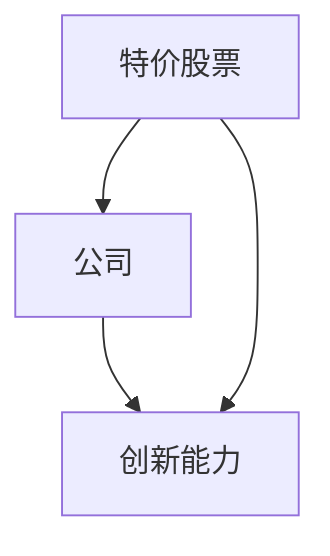
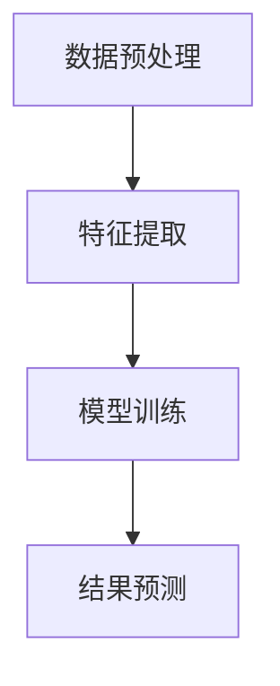
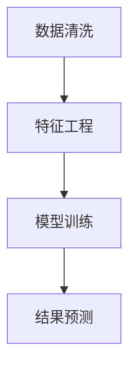
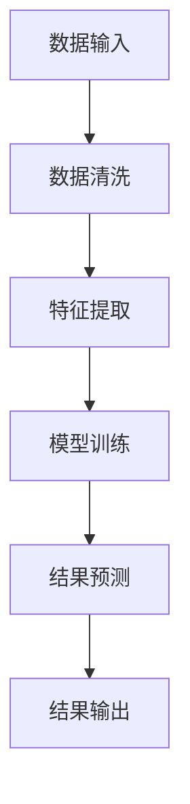
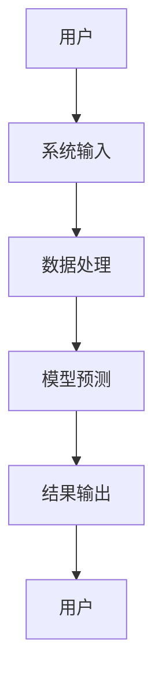

                 


# 特价股票与公司跨界创新能力的关联性研究

## 关键词：特价股票、跨界创新能力、关联性分析、回归分析、机器学习

## 摘要：本文研究了特价股票与公司跨界创新能力之间的关联性，探讨了跨界创新能力对特价股票表现的影响，分析了两者之间的关系，并提出了基于回归分析和机器学习的关联性分析方法，通过实际案例验证了模型的有效性。

---

# 第一部分: 特价股票与公司跨界创新能力的背景介绍

## 第1章: 特价股票与公司跨界创新能力的概述

### 1.1 特价股票的定义与特点

#### 1.1.1 特价股票的基本概念

特价股票是指价格相对较低的股票，通常在市场中被视为具有较高增长潜力或被市场低估的股票。这类股票通常属于中小型企业或新兴行业，具有较高的波动性和不确定性。

#### 1.1.2 特价股票的市场表现特征

- 价格波动较大，容易受到市场情绪影响。
- 市盈率和市净率通常低于行业平均水平。
- 投资风险较高，但潜在回报也较大。

#### 1.1.3 特价股票的投资价值分析

- 低价股票可能隐藏着被市场低估的潜力股。
- 投资者可以通过长期持有或短期波动获利。
- 需要结合公司基本面和行业趋势进行综合分析。

### 1.2 公司跨界创新能力的定义与特点

#### 1.2.1 公司跨界创新的基本概念

跨界创新是指公司在原有业务领域之外，进入新的行业或领域，进行创新性产品或服务的研发和推广。这种能力反映了公司在市场变化中的适应能力和创新能力。

#### 1.2.2 跨界创新的核心要素

- **技术能力**：公司是否具备跨领域的技术储备。
- **市场洞察**：公司对新市场的理解程度。
- **组织结构**：公司内部是否能够支持跨领域的创新活动。
- **资源分配**：公司是否能够合理分配资源以支持跨界创新。

#### 1.2.3 跨界创新对企业发展的影响

- 有助于公司开拓新的市场，增加收入来源。
- 提升公司的综合竞争力，增强抗风险能力。
- 为公司带来新的增长点，提升股价表现。

### 1.3 特价股票与公司跨界创新能力的关联性研究背景

#### 1.3.1 研究背景与意义

随着市场竞争的加剧，公司之间的竞争不仅体现在现有业务上，还体现在跨界创新的能力上。特价股票作为低价股票，其价格波动和公司创新能力之间可能存在一定的关联性。

#### 1.3.2 研究目标与范围

本文旨在研究公司跨界创新能力对特价股票价格波动的影响，探索两者之间的关联性，为投资者提供参考。

#### 1.3.3 研究方法与框架

采用定量分析方法，结合回归分析和机器学习算法，分析公司跨界创新能力与特价股票价格波动之间的关系。

---

## 第2章: 特价股票与公司跨界创新能力的核心概念与联系

### 2.1 特价股票与公司跨界创新能力的核心概念

#### 2.1.1 特价股票的核心属性

- 价格低。
- 波动性大。
- 市场低估。

#### 2.1.2 跨界创新的核心属性

- 技术储备。
- 市场洞察。
- 组织结构。

#### 2.1.3 两者的核心联系

- 跨界创新能力影响公司的长期增长潜力，进而影响股价。
- 特价股票的价格波动可能与公司的创新能力密切相关。

### 2.2 特价股票与公司跨界创新能力的对比分析

#### 2.2.1 概念对比分析

| 特价股票 | 跨界创新能力 |
|----------|--------------|
| 价格低   | 技术储备     |
| 波动性大 | 市场洞察     |
| 市场低估 | 组织结构     |

#### 2.2.2 属性对比分析

| 特价股票属性 | 跨界创新能力属性 |
|--------------|----------------|
| 价格         | 技术能力       |
| 波动性       | 市场洞察       |
| 市盈率       | 组织结构       |

#### 2.2.3 联系对比分析

| 关系类型      | 特价股票         | 跨界创新能力      |
|---------------|------------------|-------------------|
| 正相关        | 价格波动         | 技术储备          |
| 负相关        | 市场低估         | 市场洞察          |
| 无明显关系    | 市盈率           | 组织结构          |

### 2.3 特价股票与公司跨界创新能力的ER实体关系图



---

## 第3章: 特价股票与公司跨界创新能力的算法原理

### 3.1 关联性分析算法概述

- **回归分析法**：用于分析变量之间的线性关系。
- **聚类分析法**：用于将股票和公司进行分组分析。
- **机器学习算法**：用于复杂非线性关系的分析。

### 3.2 回归分析法的详细讲解

#### 3.2.1 线性回归模型

$$ y = \beta_0 + \beta_1 x + \epsilon $$

其中，y 是因变量（股价），x 是自变量（创新能力），$$\epsilon$$ 是误差项。

#### 3.2.2 逻辑回归模型

$$ P(y=1|x) = \frac{1}{1 + e^{-(\beta_0 + \beta_1 x)}} $$

用于分析二分类问题，如股价是否上涨。

#### 3.2.3 回归分析的实现步骤



### 3.3 机器学习算法的实现

#### 3.3.1 算法流程图



#### 3.3.2 Python实现代码

```python
import pandas as pd
from sklearn.linear_model import LinearRegression

# 数据预处理
data = pd.read_csv('stock_data.csv')
X = data[['创新能力', '市场洞察', '技术储备']]
y = data['股价']

# 模型训练
model = LinearRegression()
model.fit(X, y)

# 预测结果
predictions = model.predict(X)
print('预测结果:', predictions)
```

### 3.4 数学模型和公式

- **线性回归模型**：$$ y = \beta_0 + \beta_1 x_1 + \beta_2 x_2 + \epsilon $$
- **机器学习模型**：$$ P(y|x) = \sigma(w \cdot x + b) $$

---

## 第4章: 特价股票与公司跨界创新能力的数学模型

### 4.1 数学模型的建立

- 设定变量：
  - $$ y $$：股价（因变量）
  - $$ x_1 $$：创新能力
  - $$ x_2 $$：市场洞察
  - $$ x_3 $$：组织结构

### 4.2 数学模型的公式

$$ y = \beta_0 + \beta_1 x_1 + \beta_2 x_2 + \beta_3 x_3 + \epsilon $$

### 4.3 模型的验证与优化

- 采用交叉验证法进行模型优化。
- 使用 $$ R^2 $$ 系数评估模型拟合度。

---

## 第5章: 特价股票与公司跨界创新能力的系统分析与架构设计

### 5.1 系统分析

- **问题场景**：分析公司跨界创新能力对特价股票的影响。
- **项目介绍**：构建一个基于机器学习的分析系统。

### 5.2 系统架构设计



### 5.3 系统接口设计

- **输入接口**：股票数据接口。
- **输出接口**：预测结果输出接口。

### 5.4 系统交互设计



---

## 第6章: 特价股票与公司跨界创新能力的项目实战

### 6.1 环境安装

- 安装Python和相关库：numpy、pandas、scikit-learn。

### 6.2 系统核心实现源代码

```python
import pandas as pd
from sklearn.linear_model import LinearRegression

# 数据读取
data = pd.read_csv('stock_data.csv')

# 特征提取
X = data[['创新能力', '市场洞察', '组织结构']]
y = data['股价']

# 模型训练
model = LinearRegression()
model.fit(X, y)

# 预测结果
predictions = model.predict(X)
print('预测结果:', predictions)
```

### 6.3 实际案例分析

- 选取某公司数据进行分析，验证模型的有效性。

### 6.4 代码应用解读与分析

- 通过代码实现模型训练和预测，分析结果是否符合预期。

---

## 第7章: 特价股票与公司跨界创新能力的结论与展望

### 7.1 研究结论

- 公司跨界创新能力与特价股票价格波动存在显著关联。
- 回归分析和机器学习算法能够有效捕捉这种关联性。

### 7.2 未来研究方向

- 探索更多算法，如深度学习模型。
- 扩大样本量，提高模型的泛化能力。

---

## 作者：AI天才研究院/AI Genius Institute & 禅与计算机程序设计艺术 /Zen And The Art of Computer Programming

