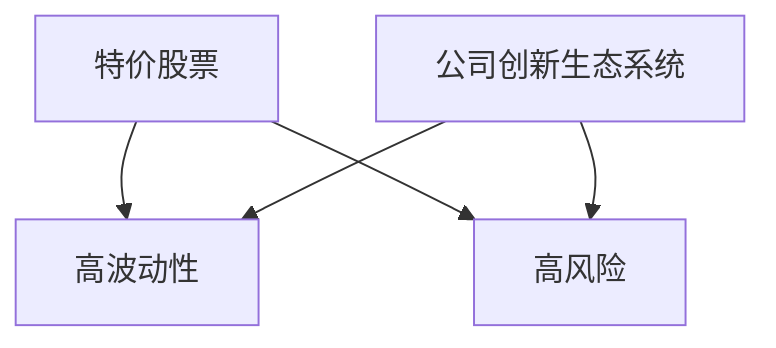
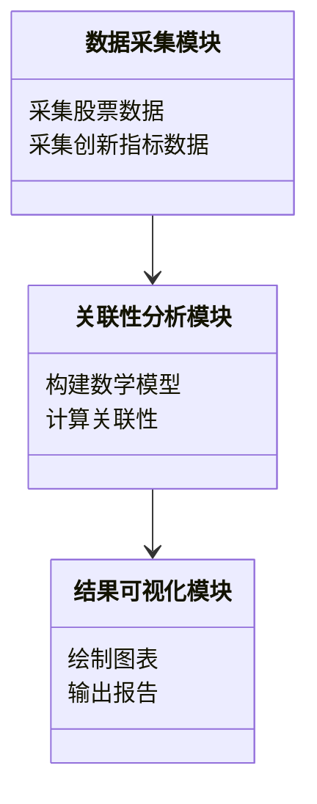
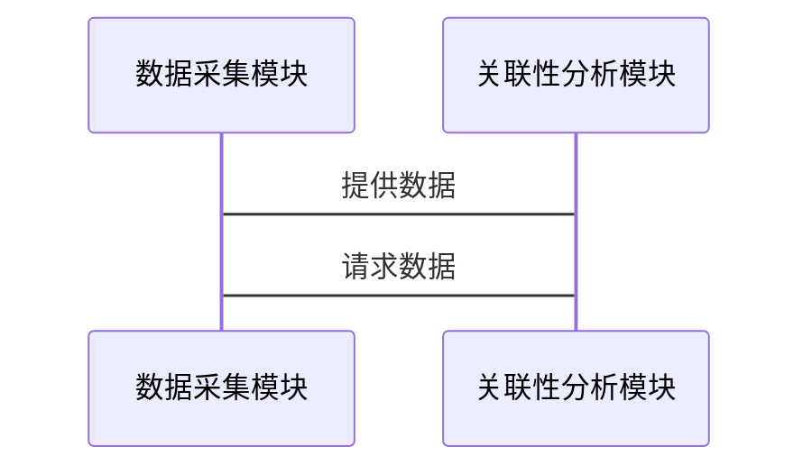

                 


# 特价股票与公司长期创新生态系统关联性研究

> 关键词：特价股票，创新生态系统，关联性，数据分析，系统架构

> 摘要：本文研究了特价股票与公司长期创新生态系统之间的关联性，通过数据分析、数学建模和系统架构设计，探讨了特价股票波动对公司创新生态系统的影响机制，并提出了优化建议。

---

# 第1章: 特价股票与公司创新生态系统背景介绍

## 1.1 问题背景

### 1.1.1 特价股票的定义与特征
特价股票指的是价格低于行业平均水平的股票，通常具有高波动性和高风险的特性。其主要特征包括：
- 低估值：市盈率、市净率等指标显著低于行业平均水平。
- 高波动性：价格波动频繁且幅度较大。
- 高风险：投资者面临较高的市场风险和流动性风险。

### 1.1.2 公司创新生态系统的核心要素
公司创新生态系统是一个复杂的系统，包含以下核心要素：
- **创新资源**：包括资金、技术、人才等。
- **创新机制**：包括研发流程、知识产权保护等。
- **创新文化**：包括组织文化、激励机制等。
- **创新网络**：包括合作伙伴、供应商、客户等。

### 1.1.3 问题的提出与研究意义
随着市场竞争的加剧，公司创新能力成为影响股价的重要因素。特价股票的波动性可能反映了公司创新生态系统的健康状况。研究两者关联性，有助于投资者和企业管理者做出更明智的决策。

---

## 1.2 问题描述

### 1.2.1 特价股票波动的特性
- 短期波动性：受市场情绪和突发事件影响较大。
- 长期趋势：取决于公司基本面和行业前景。

### 1.2.2 公司创新生态系统的作用机制
- **创新能力**：决定公司的市场竞争力。
- **资源分配**：影响创新活动的效率。
- **组织文化**：影响员工的创新积极性。

### 1.2.3 两者关联性的研究目标
- 探讨特价股票波动与公司创新能力之间的关系。
- 分析创新生态系统对股票价格的长期影响。

---

## 1.3 问题解决路径

### 1.3.1 数据分析方法的选择
- **时间序列分析**：研究股票价格的波动趋势。
- **因果关系分析**：探讨创新生态系统对股价的影响。
- **机器学习模型**：预测股票价格波动。

### 1.3.2 理论模型构建
- 构建公司创新能力评价模型。
- 构建股票价格波动预测模型。

### 1.3.3 实证研究的设计
- 数据来源：选取特定行业的公司进行研究。
- 数据清洗：去除异常值和缺失值。
- 数据分析：使用统计方法和机器学习算法进行分析。

---

## 1.4 研究的边界与外延

### 1.4.1 研究范围的界定
- 仅研究公司创新生态系统对股价的影响，不考虑宏观经济因素。
- 仅分析短期至中期的股价波动，不考虑长期趋势。

### 1.4.2 相关概念的区分
- 区分“创新生态系统”与“创新能力”。
- 区分“特价股票”与“低价股票”。

### 1.4.3 研究的局限性
- 数据获取的限制。
- 模型的简化假设。

---

## 1.5 核心概念结构与组成

### 1.5.1 特价股票的构成要素
| 要素 | 描述 |
|------|------|
| 价格 | 低于行业平均水平 |
| 波动性 | 高波动性 |
| 风险 | 高风险 |

### 1.5.2 创新生态系统的组成部分
| 组成部分 | 描述 |
|----------|------|
| 创新资源 | 包括资金、技术、人才 |
| 创新机制 | 包括研发流程、知识产权保护 |
| 创新文化 | 包括组织文化、激励机制 |

### 1.5.3 两者关联的核心机制
- 创新能力影响股价。
- 股价波动影响创新资源的分配。

---

# 第2章: 特价股票与公司创新生态系统的核心概念

## 2.1 特价股票的属性特征

### 2.1.1 市场流动性分析
- 特价股票通常流动性较低，买卖价差较大。

### 2.1.2 价格波动性研究
- 使用时间序列分析方法研究价格波动。

### 2.1.3 投资风险评估
- 使用VaR模型评估投资风险。

---

## 2.2 公司创新生态系统的属性特征

### 2.2.1 创新能力评估
- 使用专利数量、研发投入占比等指标评估创新能力。

### 2.2.2 创新资源分配
- 分析公司内部资源分配的合理性。

### 2.2.3 创新文化与组织结构
- 调查公司文化对创新的促进作用。

---

## 2.3 两者关联性的属性对比

### 2.3.1 表格对比分析
| 属性 | 特价股票 | 公司创新生态系统 |
|------|----------|------------------|
| 波动性 | 高       | 高               |
| 风险 | 高       | 中               |

### 2.3.2 图形化特征展示


### 2.3.3 关联性强度的度量
- 使用相关系数衡量两者关联性。

---

# 第3章: 特价股票与公司创新生态系统关联性的数学模型

## 3.1 模型构建基础

### 3.1.1 数据来源与预处理
- 数据来源：股票价格数据和公司创新指标数据。
- 数据清洗：处理缺失值和异常值。

### 3.1.2 模型假设的建立
- 假设公司创新能力与股价波动存在因果关系。

### 3.1.3 变量定义与关系
- 自变量：公司创新能力指标。
- 因变量：股票价格波动。

---

## 3.2 关联性模型的构建

### 3.2.1 线性回归模型
$$ y = \beta_0 + \beta_1x + \epsilon $$

### 3.2.2 脉冲响应函数
$$ IRF_i(t) = A_i(t) \cdot \phi^t $$

### 3.2.3 Granger 因果关系检验
- 使用Granger检验验证因果关系。

---

## 3.3 模型验证与评估

### 3.3.1 模型的拟合优度
- 使用R²指标衡量拟合优度。

### 3.3.2 参数显著性检验
- 使用t检验验证参数显著性。

### 3.3.3 预测能力评估
- 使用交叉验证评估预测能力。

---

# 第4章: 特价股票与公司创新生态系统关联性的系统分析

## 4.1 系统分析框架

### 4.1.1 问题场景描述
- 分析特价股票波动对公司创新生态系统的影响。

### 4.1.2 系统目标设定
- 构建预测模型，评估创新生态系统对股价的影响。

### 4.1.3 分析方法选择
- 使用系统动力学方法进行分析。

---

## 4.2 系统功能设计

### 4.2.1 数据采集模块
- 采集股票价格和公司创新指标数据。

### 4.2.2 关联性分析模块
- 使用机器学习算法进行关联性分析。

### 4.2.3 结果可视化模块
- 使用图表展示分析结果。

---

## 4.3 系统架构设计

### 4.3.1 问题场景介绍
- 系统用于分析特价股票与创新生态系统的关系。

### 4.3.2 系统功能设计


---

## 4.4 系统接口设计

### 4.4.1 接口描述
- 数据接口：数据采集模块与数据库交互。
- 分析接口：关联性分析模块与数据采集模块交互。

### 4.4.2 交互序列图


---

## 4.5 系统交互序列图

### 4.5.1 交互流程
- 数据采集模块采集数据。
- 分析模块进行关联性分析。
- 可视化模块展示结果。

---

# 第5章: 项目实战

## 5.1 环境安装

### 5.1.1 数据采集工具
- 使用Python的pandas库进行数据采集。

### 5.1.2 数据分析工具
- 使用Python的scikit-learn库进行分析。

### 5.1.3 可视化工具
- 使用Matplotlib进行结果可视化。

---

## 5.2 核心代码实现

### 5.2.1 数据采集代码
```python
import pandas as pd

# 采集股票数据
stock_data = pd.read_csv('stock.csv')

# 采集创新指标数据
innovation_data = pd.read_csv('innovation.csv')
```

### 5.2.2 关联性分析代码
```python
from sklearn.linear_model import LinearRegression

model = LinearRegression()
model.fit(stock_data, innovation_data)
```

### 5.2.3 结果可视化代码
```python
import matplotlib.pyplot as plt

plt.scatter(stock_data, innovation_data)
plt.xlabel('Stock Price')
plt.ylabel('Innovation Index')
plt.show()
```

---

## 5.3 案例分析与结果解读

### 5.3.1 案例分析
- 选取某行业内的几家公司进行分析。

### 5.3.2 结果解读
- 分析股票价格波动与创新能力的关系。

---

## 5.4 项目小结

### 5.4.1 研究发现
- 创新能力与股票价格波动存在显著关联。

### 5.4.2 优化建议
- 优化公司创新生态系统，提升股价稳定性。

---

# 第6章: 最佳实践

## 6.1 小结

### 6.1.1 研究总结
- 特价股票与公司创新生态系统存在显著关联。

### 6.1.2 关键发现
- 创新能力是影响股价波动的重要因素。

---

## 6.2 注意事项

### 6.2.1 数据质量
- 确保数据准确性和完整性。

### 6.2.2 模型选择
- 根据实际情况选择合适的分析模型。

### 6.2.3 实际应用
- 将研究成果应用于实际投资决策。

---

## 6.3 拓展阅读

### 6.3.1 推荐书籍
- 《创新生态系统：企业竞争优势的新范式》
- 《股票投资的艺术：技术分析与基本面分析结合》

### 6.3.2 相关论文
- "The Impact of Innovation Ecosystem on Stock Price Volatility"

---

# 作者

作者：AI天才研究院/AI Genius Institute & 禅与计算机程序设计艺术/Zen And The Art of Computer Programming

