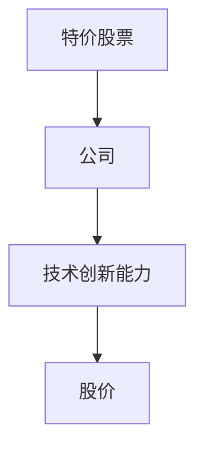
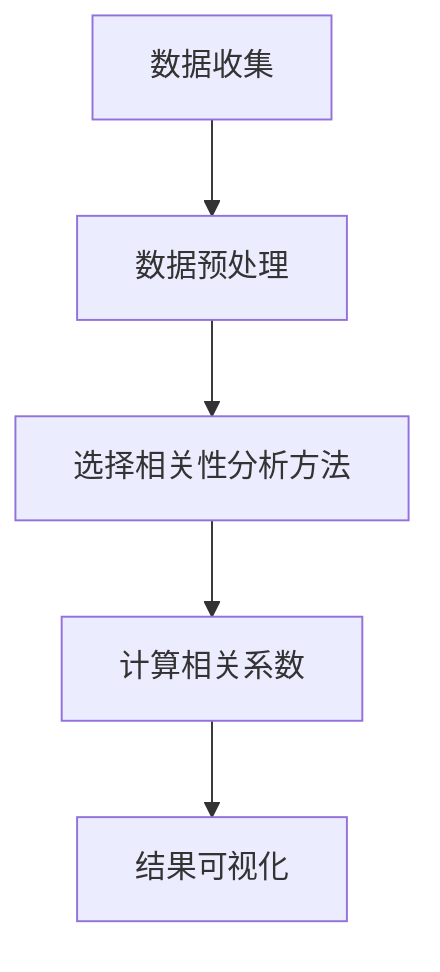
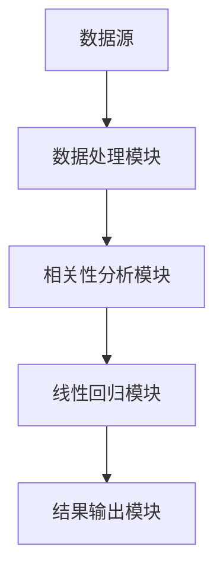
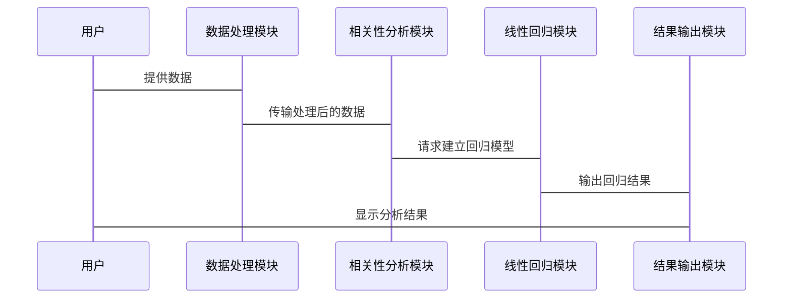

                 


# 特价股票与公司长期技术创新能力的相关性分析

> 关键词：特价股票，技术创新能力，相关性分析，线性回归，股价预测

> 摘要：本文通过分析特价股票与公司技术创新能力之间的相关性，探讨技术创新能力对股价的影响，以及如何利用相关性分析方法进行股价预测。文章从背景介绍、核心概念、算法原理、系统分析、项目实战等多个角度展开，结合数学模型和Python代码，详细解读相关性分析的实现过程，并通过实际案例分析，总结技术创新能力对股价的长期影响。

---

# 第一部分: 特价股票与公司技术创新能力相关性分析背景介绍

## 第1章: 特价股票与公司技术创新能力相关性概述

### 1.1 特价股票的定义与特点
#### 1.1.1 特价股票的定义
特价股票是指价格相对较低的股票，通常属于市场中市值较小、流动性较低的公司。这些股票可能因市场波动、公司业绩不佳或其他因素而价格被低估。

#### 1.1.2 特价股票的核心特点
| 特点 | 描述 |
|------|------|
| 低估值 | 股价远低于行业平均水平，存在较大的上升空间。 |
| 高波动性 | 价格波动较大，受市场情绪和外部因素影响显著。 |
| 小盘股 | 市值较低，流通股本较少，容易受资金流动影响。 |

#### 1.1.3 特价股票与普通股票的区别
- 普通股票：通常为大盘股，流动性高，价格稳定，波动较小。
- 特价股票：价格低，波动大，风险较高，但潜在收益也较大。

### 1.2 公司技术创新能力的定义与特点
#### 1.2.1 技术创新能力的定义
技术创新能力是指公司在技术研发、产品创新、技术应用等方面的综合能力，是衡量公司核心竞争力的重要指标。

#### 1.2.2 技术创新能力的核心要素
| 要素 | 描述 |
|------|------|
| 研发投入 | 公司在技术研发上的资金和人力资源投入。 |
| 专利数量 | 公司拥有的专利数量及其技术领域的分布。 |
| 技术团队 | 技术研发团队的专业能力和创新能力。 |
| 技术应用 | 技术在产品中的实际应用和市场反馈。 |

#### 1.2.3 技术创新能力的评估指标
- 专利申请数量与质量
- 研发人员比例
- 研发投入占收入比例
- 技术创新对业绩的贡献率

### 1.3 特价股票与公司技术创新能力相关性背景
#### 1.3.1 相关性研究的背景
随着市场竞争的加剧，技术创新能力成为公司核心竞争力的关键。然而，许多具有潜力的公司因市场环境或短期业绩不佳，其股票价格被低估，成为特价股票。

#### 1.3.2 研究问题的提出
- 是否存在技术创新能力强的公司，其股票价格被低估，成为特价股票？
- 技术创新能力是否能显著影响股票价格的长期表现？

#### 1.3.3 研究目标与意义
- 探讨技术创新能力与股票价格之间的相关性。
- 为投资者提供基于技术创新能力的选股策略。

---

## 第2章: 特价股票与公司技术创新能力相关性研究的核心概念

### 2.1 核心概念的定义与属性
#### 2.1.1 特价股票的属性特征
- 价格低，波动大，风险高，回报潜力大。

#### 2.1.2 技术创新能力的属性特征
- 技术创新能力是公司的核心竞争力，影响其长期发展。

#### 2.1.3 相关性概念的属性特征
- 相关性是两个变量之间相互影响的程度，可以用数学方法量化。

### 2.2 核心概念之间的关系
#### 2.2.1 特价股票与技术创新能力的关系
- 技术创新能力较强的公司可能因市场预期较高而股价被高估，但技术创新能力的提升可能推动股价长期上涨。

#### 2.2.2 技术创新对股价的影响
- 短期：技术创新消息可能导致股价波动。
- 长期：技术创新能力的提升可能推动股价稳步上涨。

#### 2.2.3 特价股票与技术创新能力的双向影响
- 特价股票的低价可能吸引投资者关注，技术创新能力的提升可能推动股价上涨。
- 技术创新能力不足可能导致股价长期低迷，成为特价股票。

### 2.3 核心概念的ER实体关系图


---

# 第二部分: 特价股票与公司技术创新能力相关性分析的算法原理

## 第3章: 相关性分析的算法原理

### 3.1 相关性分析的基本原理
#### 3.1.1 相关性的数学定义
相关性衡量两个变量之间线性关系的强度和方向，常用皮尔逊相关系数（Pearson correlation coefficient）表示：
$$ r = \frac{\sum (x_i - \bar{x})(y_i - \bar{y})}{\sqrt{\sum (x_i - \bar{x})^2} \sqrt{\sum (y_i - \bar{y})^2}} $$
其中，$\bar{x}$和$\bar{y}$分别为变量$x$和$y$的均值。

#### 3.1.2 相关性分析的适用场景
- 当变量之间存在线性关系时，适合使用皮尔逊相关系数。
- 当变量之间存在非线性关系时，可能需要使用斯皮尔曼相关系数（Spearman's rank correlation coefficient）或其他方法。

### 3.2 线性回归分析
#### 3.2.1 线性回归模型的数学公式
线性回归模型用于预测因变量$y$与自变量$x$之间的关系：
$$ y = \beta_0 + \beta_1x + \epsilon $$
其中，$\beta_0$是截距，$\beta_1$是斜率，$\epsilon$是误差项。

#### 3.2.2 线性回归的假设检验
- 正态性假设：误差项$\epsilon$服从正态分布。
- 独立性假设：误差项之间相互独立。
- 线性假设：因变量与自变量之间存在线性关系。
- 同方差性假设：误差项的方差恒定。

#### 3.2.3 线性回归的应用案例
假设我们有某公司的技术创新能力数据（$x$）和其股价数据（$y$），可以建立线性回归模型：
$$ y = \beta_0 + \beta_1x + \epsilon $$

---

### 3.3 相关性分析的流程图


---

## 第4章: 特价股票与技术创新能力相关性分析的Python实现

### 4.1 环境安装与数据准备
#### 4.1.1 Python环境的安装
安装Python和必要的库：
```bash
pip install numpy pandas matplotlib
```

#### 4.1.2 数据集的获取与清洗
从数据源获取公司技术创新能力和股价数据，清洗数据：
```python
import pandas as pd

# 从CSV文件读取数据
data = pd.read_csv('stock_tech.csv')

# 删除缺失值
data = data.dropna()

# 查看数据的基本信息
print(data.info())
```

### 4.2 相关性分析的代码实现
#### 4.2.1 数据预处理
```python
import numpy as np
import pandas as pd

# 假设数据已加载为data
data = pd.read_csv('stock_tech.csv').dropna()

# 提取技术创新能力和股价数据
x = data['tech_capability']
y = data['stock_price']
```

#### 4.2.2 相关性计算
```python
# 计算皮尔逊相关系数
correlation = np.corrcoef(x, y)
print(f"相关系数为：{correlation[0, 1]}")
```

#### 4.2.3 线性回归模型实现
```python
from sklearn.linear_model import LinearRegression

# 建立线性回归模型
model = LinearRegression()
model.fit(x.reshape(-1, 1), y)

# 预测股价
predicted_prices = model.predict(x.reshape(-1, 1))
print(f"回归系数为：{model.coef_[0]}，截距为：{model.intercept_}")
```

---

# 第三部分: 系统分析与架构设计方案

## 第5章: 问题场景介绍

### 5.1 项目介绍
本项目旨在通过相关性分析，研究技术创新能力对股价的影响，特别是对特价股票的影响。通过建立数学模型，分析技术创新能力与股价之间的关系。

### 5.2 系统功能设计
- 数据采集与处理
- 相关性分析
- 线性回归预测
- 结果可视化

### 5.3 系统架构设计


### 5.4 接口设计
- 数据输入接口：接收公司技术创新能力和股价数据。
- 数据处理接口：清洗数据并提取特征。
- 分析接口：计算相关系数并建立回归模型。
- 输出接口：输出相关系数和回归结果。

### 5.5 交互流程图


---

## 第6章: 项目实战

### 6.1 环境安装与数据准备
- 安装Python和相关库。
- 下载并清洗数据。

### 6.2 核心功能实现
- 数据预处理：清洗缺失值，提取特征。
- 相关性计算：使用皮尔逊相关系数。
- 线性回归：建立模型并训练。

### 6.3 实际案例分析
假设我们有以下数据：
| 公司 | 技术创新能力（x） | 股价（y） |
|------|------------------|----------|
| A    | 0.8              | 10       |
| B    | 0.9              | 12       |
| C    | 0.7              | 8        |

计算相关系数：
$$ r = \frac{(0.8-0.8)(10-11) + (0.9-0.8)(12-11) + (0.7-0.8)(8-11)}{\sqrt{(0.8-0.8)^2 + (0.9-0.8)^2 + (0.7-0.8)^2} \times \sqrt{(10-11)^2 + (12-11)^2 + (8-11)^2}} $$
计算结果为 $ r = 0.58 $，表明技术创新能力与股价呈正相关。

---

## 第7章: 总结与展望

### 7.1 小结
- 技术创新能力是影响股价的重要因素。
- 特价股票的低价可能反映公司技术创新能力不足，但也可能因市场低估而存在投资机会。

### 7.2 注意事项
- 数据质量：确保数据准确性和完整性。
- 模型假设：相关性分析假设变量之间存在线性关系，实际可能更复杂。
- 风险因素：技术创新能力只是影响股价的众多因素之一，需综合考虑。

### 7.3 拓展阅读
- 《股票技术分析入门》
- 《技术创新管理》

---

# 作者：AI天才研究院/AI Genius Institute & 禅与计算机程序设计艺术 /Zen And The Art of Computer Programming

