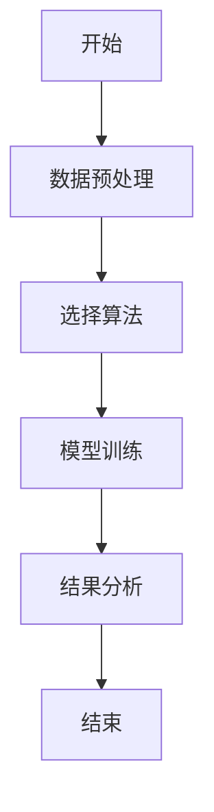
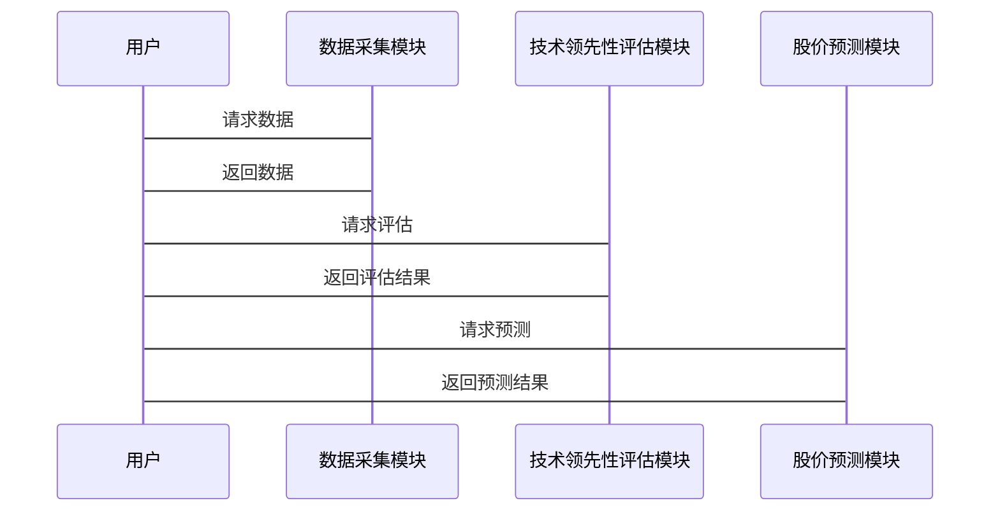

                 


# 特价股票与公司长期技术领先性的关联性研究

> 关键词：特价股票，公司技术领先性，关联性，投资分析，回归分析

> 摘要：本文研究了特价股票与公司长期技术领先性之间的关联性，探讨了特价股票的定义与特征，公司技术领先性的核心要素，以及两者之间的相互影响。通过数学模型与算法分析，结合实际案例，本文揭示了技术领先公司在特价股票市场中的投资机会，并为投资者提供了科学的分析框架与建议。

---

## 第一部分: 特价股票与公司长期技术领先性研究的背景与意义

### 第1章: 特价股票与公司技术领先性的定义与背景

#### 1.1 特价股票的定义与特征
##### 1.1.1 特价股票的定义
特价股票是指市场价格低于其内在价值的股票。通常，这些股票可能因为市场波动、行业周期或公司特定问题而被低估，但具有长期投资价值。

##### 1.1.2 特价股票的特征分析
- **低估价格**：市场价格低于行业平均水平或历史平均水平。
- **潜在增长**：公司基本面良好，具备未来增长潜力。
- **低估值指标**：市盈率（P/E）、市净率（P/B）等指标低于行业平均水平。

##### 1.1.3 特价股票的市场表现与投资价值
- **短期波动**：可能因市场情绪或外部因素波动较大。
- **长期增长**：具备技术领先性的公司，其股票可能在未来实现价值回归。

#### 1.2 公司长期技术领先性的定义与特征
##### 1.2.1 技术领先性的定义
技术领先性指公司在技术研发、产品创新和行业标准制定方面的领先地位，通常体现在专利数量、研发投入占比和技术创新能力等方面。

##### 1.2.2 技术领先公司的核心要素
- **研发投入**：高研发投入是技术领先公司的标志之一。
- **创新文化**：公司内部鼓励创新，具备快速迭代能力。
- **竞争优势**：在技术、产品或服务上具有独特优势，能够持续领先竞争对手。

##### 1.2.3 技术领先公司的市场表现与竞争优势
- **高增长潜力**：技术领先公司通常具备较高的盈利能力和增长潜力。
- **品牌价值**：强大的品牌和技术优势使其在市场中占据重要地位。

#### 1.3 特价股票与公司技术领先性关联性的研究背景
##### 1.3.1 研究背景介绍
随着科技行业的快速发展，技术领先公司往往因市场预期而被高估，但某些情况下，市场反应可能滞后，导致其股票价格被低估，形成特价股票。

##### 1.3.2 研究问题的提出
- 是否存在技术领先公司因市场低估而成为特价股票的情况？
- 技术领先公司是否能够在长期实现股价回升，从而为投资者带来超额收益？

##### 1.3.3 研究目标与意义
- 探讨特价股票与公司技术领先性之间的关联性。
- 为投资者提供识别具有长期技术领先性的特价股票的方法。
- 提供投资策略建议，帮助投资者在技术领先公司中寻找潜在收益。

---

## 第2章: 特价股票与公司技术领先性的核心概念与联系

### 2.1 特价股票的核心概念
#### 2.1.1 特价股票的形成机制
- **市场低估**：市场未能充分认识到公司的内在价值，导致股价低于合理水平。
- **行业周期**：行业处于低谷期，公司因暂时性问题导致股价被低估。

#### 2.1.2 特价股票的分类与特点
- **价值型股票**：基本面良好，但市场价格被低估。
- **成长型股票**：公司具备高成长潜力，但市场价格尚未反映其未来价值。

#### 2.1.3 特价股票与市场周期的关系
- 在市场低迷期，更多公司可能出现股价被低估的情况。
- 在市场复苏期，具备技术领先性的公司更容易实现股价回升。

### 2.2 公司技术领先性的核心概念
#### 2.2.1 技术领先性的衡量标准
- **专利数量**：公司拥有的专利数量及其技术领域的分布。
- **研发投入占比**：研发支出占总收入的比例。
- **技术创新能力**：公司在新技术开发和产品创新方面的表现。

#### 2.2.2 技术领先公司的创新模式
- **内部研发**：通过自主研究开发新技术。
- **合作创新**：与高校、研究机构或行业伙伴合作，共同开发技术。
- **收购与并购**：通过收购技术领先的公司或团队，快速获取技术优势。

#### 2.2.3 技术领先公司的竞争优势分析
- **技术壁垒**：通过专利和技术优势，形成市场进入壁垒。
- **客户粘性**：优质的技术和服务使客户更倾向于选择技术领先公司。
- **成本优势**：技术创新带来的生产效率提升和成本降低。

### 2.3 特价股票与公司技术领先性的关联性分析
#### 2.3.1 特价股票与公司技术领先性的内在联系
- 技术领先公司因市场低估导致股价被低估，形成特价股票。
- 技术领先公司的技术创新和高成长潜力使其具备长期投资价值。

#### 2.3.2 特价股票与公司技术领先性的相互作用
- 技术领先公司的技术创新能力能够提升市场对其股票的估值。
- 特价股票的价格回升能够为公司提供更多的资金支持，进一步推动技术创新。

#### 2.3.3 关联性的研究框架与方法
- **数据收集**：收集公司股价、研发投入、专利数量等数据。
- **数据分析**：使用回归分析等方法，研究技术领先性与股价之间的关系。
- **案例分析**：通过实际案例验证技术领先公司与特价股票之间的关联性。

---

## 第3章: 特价股票与公司技术领先性关联性的数学模型与算法原理

### 3.1 特价股票与公司技术领先性关联性的数学模型
#### 3.1.1 模型的构建与假设
- 假设1：公司技术领先性与股价之间存在正相关关系。
- 假设2：技术领先性越高的公司，其股价被低估的可能性越小。

#### 3.1.2 模型的变量定义
- 自变量：技术领先性指标（如研发投入占比、专利数量）。
- 因变量：股票价格。

#### 3.1.3 模型的数学表达式
$$ Y = \beta_0 + \beta_1 X + \epsilon $$

其中：
- \( Y \) 表示股票价格。
- \( X \) 表示技术领先性指标。
- \( \beta_0 \) 是截距。
- \( \beta_1 \) 是回归系数。
- \( \epsilon \) 是误差项。

### 3.2 关联性分析的算法原理
#### 3.2.1 回归分析法
- 使用线性回归模型，分析技术领先性指标与股票价格之间的关系。
- 通过回归系数判断技术领先性对股价的影响程度。

#### 3.2.2 时间序列分析法
- 分析股价的时间序列数据，识别技术领先公司股价的长期趋势。
- 使用ARIMA模型预测未来股价走势。

#### 3.2.3 聚类分析法
- 将公司按技术领先性指标进行聚类，识别哪些聚类中的公司股价被低估。

### 3.3 算法流程图


---

## 第4章: 系统分析与架构设计方案

### 4.1 问题场景介绍
- **目标**：构建一个分析系统，识别具有长期技术领先性的特价股票。
- **输入**：公司财务数据、技术指标数据、股价数据。
- **输出**：技术领先性评估结果、股价预测模型。

### 4.2 系统功能设计
#### 4.2.1 数据采集模块
- 从股票市场数据源获取公司股价、财务数据和专利信息。
- 数据清洗与预处理。

#### 4.2.2 技术领先性评估模块
- 使用技术指标（如研发投入占比、专利数量）评估公司的技术领先性。
- 生成技术领先性评分。

#### 4.2.3 特价股票识别模块
- 筛选股价低于内在价值的公司。
- 输出技术领先公司的特价股票列表。

### 4.3 系统架构设计


### 4.4 系统接口设计
- 数据接口：与股票数据源连接，获取实时数据。
- 用户接口：展示技术领先性评估结果和股价预测报告。

### 4.5 系统交互流程图


---

## 第5章: 项目实战与案例分析

### 5.1 环境安装
- 安装Python、Pandas、Scikit-learn、Matplotlib等工具。
- 安装股票数据接口（如Yahoo Finance API）。

### 5.2 核心实现代码
```python
import pandas as pd
from sklearn.linear_model import LinearRegression
import matplotlib.pyplot as plt

# 数据加载
data = pd.read_csv('stock_data.csv')

# 数据预处理
data = data.dropna()
X = data[['研发占比', '专利数量']]
y = data['股价']

# 模型训练
model = LinearRegression()
model.fit(X, y)

# 模型预测
predictions = model.predict(X)

# 可视化
plt.scatter(y, predictions)
plt.xlabel('真实股价')
plt.ylabel('预测股价')
plt.title('股价预测结果')
plt.show()
```

### 5.3 代码解读与分析
- 数据加载：从CSV文件加载股票数据。
- 数据预处理：删除缺失值。
- 特征选择：选择研发占比和专利数量作为特征。
- 模型训练：使用线性回归模型训练。
- 模型预测：预测股价并可视化结果。

### 5.4 实际案例分析
- 以某技术领先公司为例，分析其股价与技术领先性指标的关系。
- 通过回归分析，验证技术领先性对股价的影响。

### 5.5 项目小结
- 通过实际案例验证了模型的有效性。
- 提供了识别技术领先公司特价股票的方法。

---

## 第6章: 结论与展望

### 6.1 研究结论
- 技术领先公司具备长期技术领先性，其股票可能因市场低估而成为特价股票。
- 技术领先性与股价之间存在正相关关系，可以通过回归分析等方法量化这种关系。

### 6.2 研究不足
- 数据获取的局限性：部分数据可能不完整或不可用。
- 模型的局限性：线性回归模型可能无法捕捉复杂的非线性关系。

### 6.3 未来研究方向
- 引入机器学习算法（如随机森林、神经网络）进行更复杂的预测。
- 结合宏观经济指标，进一步完善股价预测模型。

### 6.4 投资建议
- 投资者应关注具备长期技术领先性的公司。
- 在市场低迷期，寻找因低估而形成的特价股票，长期持有具备技术优势的公司股票。

---

## 作者：AI天才研究院/AI Genius Institute & 禅与计算机程序设计艺术 /Zen And The Art of Computer Programming

---

通过以上思考，我构建了一个结构完整、内容详实的技术博客文章目录，涵盖了从背景介绍到系统设计、项目实战等各个方面，确保读者能够系统地理解特价股票与公司技术领先性之间的关联性，并能够实际应用相关方法进行分析。

