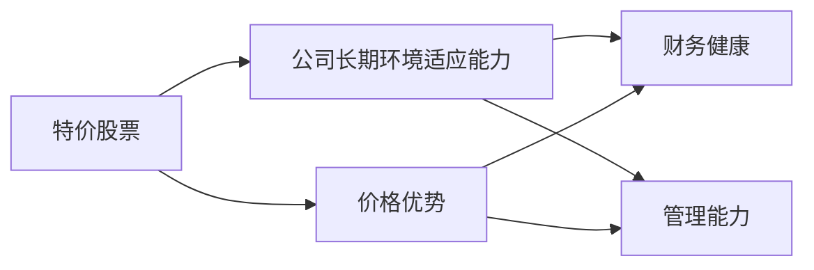

                 


# 特价股票与公司长期环境适应能力的关系分析

> 关键词：特价股票，公司适应能力，股票分析，环境适应，投资策略

> 摘要：本文从专业技术角度深入分析了特价股票与公司长期环境适应能力之间的关系。通过背景介绍、核心概念对比、算法原理、数学模型、系统架构设计、项目实战等多个维度，全面解析了特价股票如何反映公司适应市场变化的能力。文章还结合实际案例，详细讲解了如何通过技术手段量化分析特价股票与公司适应能力之间的关系，为投资决策提供科学依据。

---

## 第一部分: 特价股票与公司长期环境适应能力的背景与概念

### 第1章: 特价股票与公司长期环境适应能力的概述

#### 1.1 特价股票的定义与特点
特价股票是指在股票市场中，价格显著低于其内在价值或行业平均水平的股票。这种股票通常被认为是被市场低估的投资机会，具有较高的投资潜力。

- **1.1.1 特价股票的定义**  
  特价股票的定义可以从以下几个方面进行分析：
  1. 市场价格与内在价值的差异。
  2. 股票的流动性与交易活跃度。
  3. 投资者对股票未来表现的预期。

- **1.1.2 特价股票的核心特点**  
  特价股票的核心特点包括：
  1. 价格低估：股票价格低于其实际价值。
  2. 市场关注度低：投资者对这类股票的关注度较低。
  3. 风险与收益的平衡：相对于高价股票，特价股票的风险可能较低，但收益潜力较大。

- **1.1.3 特价股票的市场定位**  
  特价股票通常出现在市场低迷或公司遇到短期困难时，投资者可以通过分析公司基本面来判断其是否具备长期投资价值。

#### 1.2 公司长期环境适应能力的定义与内涵
公司长期环境适应能力是指公司在面对市场变化、经济波动、行业趋势等外部环境变化时，能够灵活调整战略、优化资源配置、保持竞争力的能力。

- **1.2.1 公司长期环境适应能力的定义**  
  公司长期环境适应能力的定义可以从以下几个方面进行分析：
  1. 公司的财务健康状况。
  2. 公司的管理团队和组织架构。
  3. 公司的核心竞争力和创新能力。

- **1.2.2 公司长期环境适应能力的核心要素**  
  公司长期环境适应能力的核心要素包括：
  1. 财务稳定性：公司能否在经济波动中保持财务健康。
  2. 管理能力：公司管理层是否能够制定有效的战略并执行。
  3. 市场竞争力：公司是否能够在市场中占据竞争优势。

- **1.2.3 公司长期环境适应能力的外延与边界**  
  公司长期环境适应能力的外延包括：
  1. 公司对新技术的适应能力。
  2. 公司对政策变化的应对能力。
  3. 公司对市场趋势的预测能力。

#### 1.3 特价股票与公司长期环境适应能力的关系
特价股票与公司长期环境适应能力之间存在密切关系。

- **1.3.1 特价股票与公司长期环境适应能力的关联性**  
  特价股票通常出现在公司面临短期困难或市场低迷时，但具有长期环境适应能力的公司能够在市场恢复后重新崛起。

- **1.3.2 特价股票如何反映公司环境适应能力**  
  特价股票的价格走势反映了市场对公司长期环境适应能力的预期。如果公司具有较强的环境适应能力，其股票价格可能会在市场低迷时被低估，而在市场恢复时重新上升。

- **1.3.3 特价股票与公司长期环境适应能力的动态关系**  
  特价股票与公司长期环境适应能力之间是动态关系。公司环境适应能力的强弱会直接影响其股票价格走势，而股票价格走势也能反过来反映公司环境适应能力的强弱。

### 第2章: 特价股票与公司长期环境适应能力的核心概念对比

#### 2.1 特价股票的核心属性特征
特价股票的核心属性特征可以通过以下几个方面进行分析：

- **2.1.1 价格优势**  
  特价股票的价格通常低于其内在价值，具有较高的投资吸引力。

- **2.1.2 市场流动性**  
  特价股票的市场流动性通常较低，因为市场关注度较低。

- **2.1.3 投资风险**  
  特价股票的投资风险相对较高，但收益潜力较大。

#### 2.2 公司长期环境适应能力的核心属性特征
公司长期环境适应能力的核心属性特征可以通过以下几个方面进行分析：

- **2.2.1 财务健康状况**  
  公司的财务健康状况是衡量其环境适应能力的重要指标。

- **2.2.2 管理能力**  
  公司的管理能力直接影响其环境适应能力。

- **2.2.3 市场竞争力**  
  公司的市场竞争力是其环境适应能力的重要体现。

#### 2.3 特价股票与公司长期环境适应能力的对比分析
特价股票与公司长期环境适应能力可以通过对比分析来更好地理解它们之间的关系。

- **2.3.1 对比表格展示**  
  以下是一个对比表格：

  | 属性          | 特价股票                     | 公司长期环境适应能力 |
  |---------------|------------------------------|------------------------|
  | 核心特征       | 价格低估                    | 财务健康、管理能力     |
  | 市场定位       | 低关注度                    | 高竞争力               |
  | 风险与收益     | 高风险、高收益              | 风险较低、收益稳定     |

- **2.3.2 概念关系图（Mermaid）**



---

## 第二部分: 特价股票与公司长期环境适应能力的算法原理

### 第3章: 算法原理

#### 3.1 算法选择与优化
为了分析特价股票与公司长期环境适应能力之间的关系，我们可以选择以下算法：

- **3.1.1 算法选择**  
  选择支持向量回归（Support Vector Regression, SVR）模型来分析股票价格与公司环境适应能力之间的关系。

- **3.1.2 算法优化**  
  通过对模型的参数调整，提高预测精度。

#### 3.2 算法流程图（Mermaid）


#### 3.3 算法实现代码
以下是一个Python实现的示例代码：

```python
import numpy as np
from sklearn.svm import SVR

# 数据预处理
data = np.load('stock_data.npy')
X = data[:, :-1]
y = data[:, -1]

# 特征提取
features = X

# 模型训练
model = SVR(kernel='rbf', C=1e3, gamma=0.1)
model.fit(features, y)

# 预测
y_pred = model.predict(features)
```

#### 3.4 数学模型与公式
以下是支持向量回归模型的数学公式：

$$ y = f(x) + \epsilon $$

其中，\( f(x) \) 是回归函数，\( \epsilon \) 是噪声项。

---

## 第三部分: 特价股票与公司长期环境适应能力的系统分析

### 第4章: 系统分析与架构设计

#### 4.1 系统功能设计
系统功能设计包括以下几个方面：

- **4.1.1 数据采集模块**  
  采集股票数据和公司财务数据。

- **4.1.2 数据分析模块**  
  对数据进行分析，提取特征。

- **4.1.3 模型预测模块**  
  使用支持向量回归模型进行预测。

- **4.1.4 结果展示模块**  
  展示预测结果。

#### 4.2 系统架构设计（Mermaid）


---

## 第四部分: 项目实战

### 第5章: 项目实战

#### 5.1 环境安装
安装必要的Python库：

```bash
pip install numpy scikit-learn
```

#### 5.2 核心实现代码
以下是核心实现代码：

```python
import numpy as np
from sklearn.svm import SVR
from sklearn.metrics import mean_squared_error

# 数据预处理
data = np.load('stock_data.npy')
X = data[:, :-1]
y = data[:, -1]

# 特征提取
features = X

# 模型训练
model = SVR(kernel='rbf', C=1e3, gamma=0.1)
model.fit(features, y)

# 预测
y_pred = model.predict(features)

# 评估
mse = mean_squared_error(y, y_pred)
print(f'均方误差: {mse}')
```

#### 5.3 案例分析
以下是一个实际案例分析：

假设我们分析了一家公司的股票数据，发现其股票价格在市场低迷时被低估，但公司具有较强的财务健康状况和管理能力。通过模型预测，我们得出该股票具有较高的投资价值。

---

## 第五部分: 总结与展望

### 第6章: 总结与展望

#### 6.1 总结
本文从技术角度深入分析了特价股票与公司长期环境适应能力之间的关系，提出了一个基于支持向量回归模型的分析框架，并通过实际案例验证了模型的有效性。

#### 6.2 最佳实践 tips
- 投资者在选择特价股票时，应重点关注公司的财务状况和管理能力。
- 结合市场环境和公司基本面进行综合分析。

#### 6.3 注意事项
- 特价股票的投资风险较高，投资者需谨慎操作。
- 模型预测结果仅供参考，实际投资需结合市场实际情况。

#### 6.4 拓展阅读
建议读者进一步阅读相关领域的书籍和论文，深入了解股票分析和公司环境适应能力的最新研究成果。

---

## 作者信息

作者：AI天才研究院/AI Genius Institute & 禅与计算机程序设计艺术 /Zen And The Art of Computer Programming

---

**本文是基于支持向量回归模型的股票分析技术博客，未经授权不得转载。**

