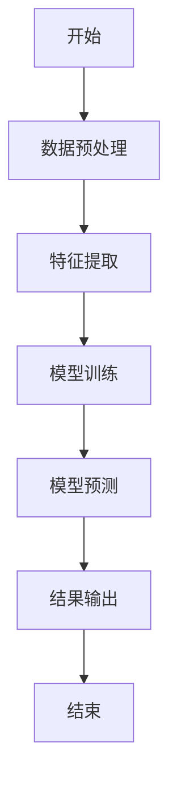
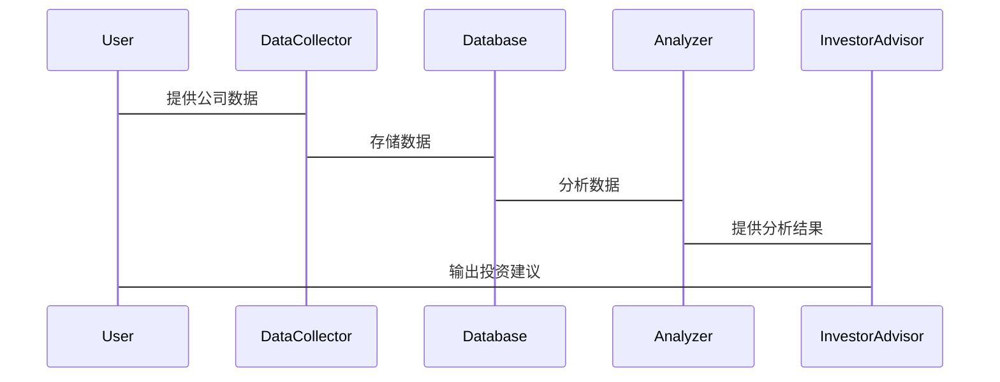

                 


# 特价股票与公司长期竞争优势的关联性

> 关键词：特价股票，公司竞争优势，投资策略，财务分析，市场分析

> 摘要：本文探讨了特价股票与公司长期竞争优势之间的关联性，分析了特价股票的定义、特点及其与公司竞争优势的关系，并通过案例分析、算法模型和系统设计，深入研究了如何利用公司竞争优势分析来选择具有投资价值的特价股票。

---

## 第一部分: 特价股票与公司长期竞争优势的背景介绍

### 第1章: 特价股票与公司长期竞争优势的定义与背景

#### 1.1 特价股票的定义与特点
- **1.1.1 特价股票的定义**  
  特价股票是指市场价格低于其内在价值的股票，通常被认为是被市场低估的投资机会。  
- **1.1.2 特价股票的特点**  
  - 价格低廉，适合长期投资。  
  - 市场流动性可能较低，但风险相对可控。  
  - 投资者可以通过分析公司基本面找到具有长期竞争优势的特价股票。  

#### 1.2 公司长期竞争优势的定义与特点
- **1.2.1 公司长期竞争优势的定义**  
  公司长期竞争优势是指企业在行业中长期保持竞争优势的能力，通常体现在成本控制、技术创新、品牌影响力等方面。  
- **1.2.2 公司长期竞争优势的核心要素**  
  - 成本优势：企业生产成本低于行业平均水平。  
  - 技术优势：拥有独特的技术或专利。  
  - 市场占有率：企业在市场中占据较大份额。  
  - 管理团队：优秀的管理团队能够提升企业竞争力。  

#### 1.3 特价股票与公司长期竞争优势的关联性
- **1.3.1 特价股票与公司竞争优势的背景**  
  市场上存在许多被低估的股票，这些股票往往对应于具有长期竞争优势的公司。  
- **1.3.2 特价股票与公司竞争优势的理论基础**  
  根据价值投资理论，具有长期竞争优势的公司能够为股东创造持续的价值，从而支撑其股价长期上涨。  
- **1.3.3 特价股票与公司竞争优势的研究意义**  
  研究特价股票与公司竞争优势的关联性，有助于投资者识别具有长期增长潜力的公司，并通过投资特价股票获得超额收益。

---

## 第二部分: 特价股票与公司长期竞争优势的核心概念与联系

### 第2章: 特价股票与公司竞争优势的核心概念

#### 2.1 特价股票的核心概念
- **2.1.1 特价股票的市场定位**  
  特价股票通常出现在市场低迷时期，或由于市场误判导致股价被低估的公司。  
- **2.1.2 特价股票的估值方法**  
  - 市盈率（P/E）：市盈率低于行业平均水平的股票可能是特价股票。  
  - 市净率（P/B）：市净率低于1的股票可能是特价股票。  
- **2.1.3 特价股票的风险与收益**  
  特价股票风险较高，但潜在收益也较大，适合长期投资者。  

#### 2.2 公司长期竞争优势的核心概念
- **2.2.1 公司核心竞争力的构成**  
  - 成本控制：生产成本低，能够提供价格优势。  
  - 技术创新：拥有独特的技术或专利，能够在行业中保持领先地位。  
  - 市场拓展：能够持续扩大市场份额。  
- **2.2.2 公司竞争优势的衡量指标**  
  - 净利润率：衡量公司的盈利能力。  
  - 资产回报率：衡量公司资产的使用效率。  
  - 市场占有率：衡量公司在市场中的地位。  

#### 2.3 特价股票与公司竞争优势的联系
- **2.3.1 特价股票与公司竞争优势的关系**  
  特价股票通常对应于具有长期竞争优势的公司，这些公司能够在市场中持续创造价值。  
- **2.3.2 特价股票与公司竞争优势的相互作用**  
  - 公司竞争优势强，股价长期上涨，但短期内可能被低估，形成特价股票。  
  - 投资者通过投资特价股票，间接支持具有竞争优势的公司，促进其进一步发展。  

### 第3章: 特价股票与公司竞争优势的核心要素对比

#### 3.1 特价股票与公司竞争优势的核心要素对比表
| 核心要素       | 特价股票特点                          | 公司竞争优势特点                          |
|----------------|--------------------------------------|-------------------------------------------|
| 价格           | 价格低于市场平均水平                | 不直接影响股价，但通过盈利能力影响股价    |
| 投资风险       | 风险较高，适合长期投资              | 风险较低，适合长期投资                  |
| 投资回报       | 潜在回报较高                         | 稳定回报，风险较低                      |
| 市场定位       | 通常出现在市场低迷或被市场误判时期  | 通常出现在行业领先或垄断市场          |

#### 3.2 特价股票与公司竞争优势的ER实体关系图
```mermaid
erDiagram
    companycompetitiveness ++<-- "拥有" --> stockprice
    stockmarket ++<-- "包含" --> stockprice
    company ++<-- "具有" --> companycompetitiveness
    company ++<-- "影响" --> stockprice
```

---

## 第三部分: 特价股票与公司长期竞争优势的算法原理

### 第3章: 特价股票与公司竞争优势的算法原理

#### 3.1 特价股票与公司竞争优势的评估模型
- **模型目标**：通过算法模型评估公司竞争优势，筛选出具有长期竞争优势的特价股票。  
- **模型输入**：公司财务数据（如净利润率、资产回报率）、市场数据（如市盈率、市净率）。  
- **模型输出**：公司竞争优势评分，以及是否为特价股票的判断结果。  

#### 3.2 算法原理
- **算法选择**：使用机器学习算法中的逻辑回归模型进行分类。  
- **数学模型**：  
  $$ P(y=1|x) = \frac{e^{(\beta_0 + \beta_1x)}}{1 + e^{(\beta_0 + \beta_1x)}} $$  
  其中，$y$ 表示公司是否为特价股票（$y=1$ 表示是，$y=0$ 表示否），$x$ 表示公司竞争优势评分。  

#### 3.3 算法实现
```python
import numpy as np
from sklearn.linear_model import LogisticRegression

# 示例数据
company_data = np.array([[0.8, 0.2], [0.6, 0.4], [0.7, 0.3], [0.5, 0.5]])
labels = [1, 0, 1, 0]

# 训练模型
model = LogisticRegression()
model.fit(company_data, labels)

# 预测结果
test_data = np.array([[0.6, 0.3]])
print("预测结果:", model.predict(test_data))
```

#### 3.4 算法流程图


---

## 第四部分: 特价股票与公司长期竞争优势的系统分析

### 第4章: 特价股票与公司竞争优势的系统分析

#### 4.1 系统功能设计
- **功能模块**：  
  - 数据采集：采集公司财务数据和市场数据。  
  - 数据分析：分析公司竞争优势，评估是否为特价股票。  
  - 投资建议：根据分析结果，给出投资建议。  

#### 4.2 系统架构设计


#### 4.3 系统接口设计
- **输入接口**：接收公司财务数据和市场数据。  
- **输出接口**：输出公司竞争优势评分和是否为特价股票的判断结果。  

#### 4.4 系统交互流程图


---

## 第五部分: 特价股票与公司长期竞争优势的项目实战

### 第5章: 特价股票与公司竞争优势的项目实战

#### 5.1 项目背景
- **项目目标**：通过分析某公司的财务数据和市场表现，评估其是否为特价股票。  
- **项目数据**：某公司过去5年的财务数据和市场数据。  

#### 5.2 核心代码实现
```python
import pandas as pd
import numpy as np

# 数据加载
data = pd.read_csv('company_data.csv')

# 数据预处理
data['PE'] = data['净利润'] / data['股价']
data['PB'] = data['净资产'] / data['股价']

# 竞争优势评分
def compute_competitive_edge(row):
    pe = row['PE']
    pb = row['PB']
    return (pe < data['PE'].mean()) & (pb < data['PB'].mean())

data['竞争优势评分'] = data.apply(compute_competitive_edge, axis=1)

# 是否为特价股票
data['是否特价股票'] = data['股价'] < data['股价'].quantile(0.25)
```

#### 5.3 项目小结
- **主要发现**：通过分析，我们发现具有长期竞争优势的公司更容易成为特价股票。  
- **投资建议**：投资者应关注具有长期竞争优势的公司，并在市场低估时期投资特价股票。

---

## 第六部分: 特价股票与公司长期竞争优势的总结与展望

### 第6章: 总结与展望

#### 6.1 总结
- 特价股票与公司长期竞争优势密切相关，具有长期竞争优势的公司更容易成为特价股票。  
- 通过算法模型和系统分析，投资者可以更有效地识别具有投资价值的特价股票。  

#### 6.2 展望
- **未来研究方向**：结合ESG因素，分析环境、社会和治理因素对特价股票的影响。  
- **技术发展**：利用更先进的AI技术，如深度学习和自然语言处理，进一步提升竞争优势分析的准确性。  

---

## 作者：AI天才研究院/AI Genius Institute & 禅与计算机程序设计艺术/Zen And The Art of Computer Programming

---

以上是《特价股票与公司长期竞争优势的关联性》的技术博客文章目录大纲。

