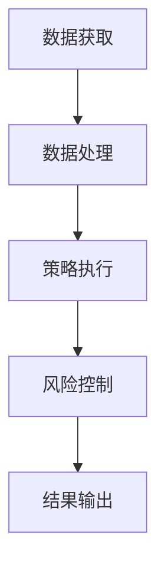
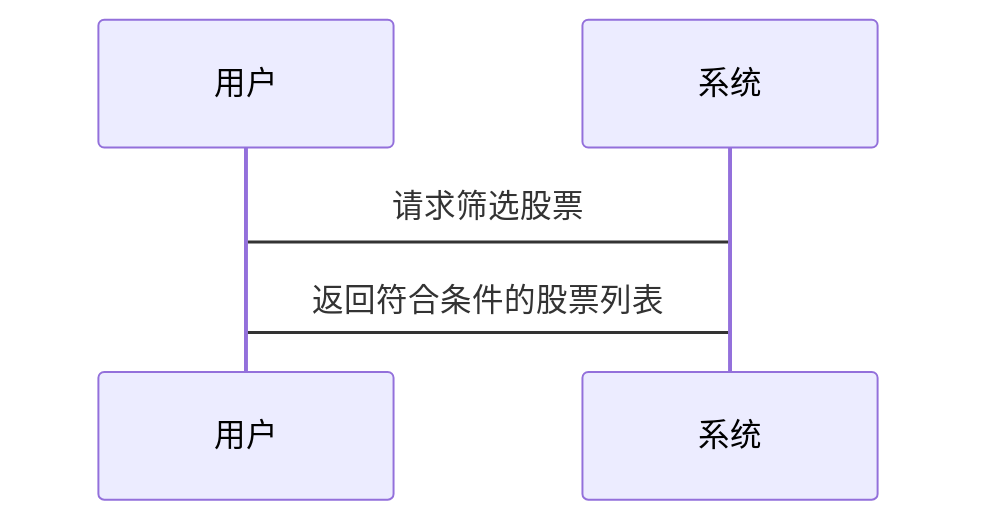

                 


# 特价股票与其他价值投资策略的比较

> 关键词：特价股票、价值投资策略、投资组合优化、风险管理、股票估值

> 摘要：本文将深入探讨特价股票与其他价值投资策略的比较，分析它们的优缺点，并提供实际的投资策略和数学模型。通过比较不同策略的适用场景，为投资者提供科学的决策支持。

---

## 第一章: 价值投资策略的基础

### 1.1 价值投资的核心概念

#### 1.1.1 价值投资的定义
价值投资是一种通过分析股票的内在价值，寻找市场价低于内在价值的股票进行投资的策略。其核心在于寻找被市场低估的机会。

#### 1.1.2 价值投资的基本原理
价值投资基于“市场先生”的理念，认为市场的短期波动不可预测，但长期趋势由基本面决定。投资者应关注企业的长期价值，而非短期价格波动。

#### 1.1.3 价值投资的目标与意义
目标是通过长期持有优质资产，实现资本的稳定增长。意义在于帮助投资者在市场波动中保持理性，避免情绪化决策。

### 1.2 特价股票的定义与特点

#### 1.2.1 特价股票的定义
特价股票指市场价格远低于其内在价值的股票，通常具有较高的上涨潜力。

#### 1.2.2 特价股票的特点
- 价格低廉：通常属于低价股，适合小资金投资者。
- 高成长性：可能来自新兴行业或有潜在增长点的公司。
- 被市场忽视：可能因市场关注度低而被低估。

#### 1.2.3 特价股票与其他股票的区别
| 特性 | 特价股票 | 其他股票 |
|------|----------|----------|
| 价格 | 低于内在价值 | 可能高于或低于内在价值 |
| 市场关注度 | 较低 | 较高 |
| 风险 | 较高 | 较低 |

### 1.3 价值投资策略的分类

#### 1.3.1 基本分析法
通过分析公司的财务报表、行业地位等基本面因素，评估其内在价值。

#### 1.3.2 技术分析法
利用历史价格和成交量数据，预测股票未来的走势。

#### 1.3.3 综合分析法
结合基本分析和技术分析，综合评估股票的投资价值。

---

## 第二章: 价值投资策略的核心要素

### 2.1 市场价值与内在价值的比较

#### 2.1.1 市场价值的定义
市场价值指股票在市场上的当前价格，受市场情绪和外部因素影响。

#### 2.1.2 内在价值的定义
内在价值是基于公司基本面因素计算出的理论价值，是股票的长期合理价格。

#### 2.1.3 市场价值与内在价值的关系
$$ V_{market} \neq V_{intrinsic} $$
当 $V_{market} < V_{intrinsic}$ 时，存在投资机会。

### 2.2 股票估值方法

#### 2.2.1 市盈率法
$$ P/E = \frac{Price}{Earnings} $$
低市盈率可能意味着低估，但需考虑行业特性。

#### 2.2.2 市净率法
$$ P/B = \frac{Price}{Book\ Value} $$
适用于银行等资产密集型行业。

#### 2.2.3 股息率法
$$ Dividend\ Yield = \frac{Dividend}{Price} $$
高股息率可能表明收益稳定，但需考虑派息能力。

### 2.3 价值投资中的风险管理

#### 2.3.1 风险的定义
风险是未来收益的不确定性，包括市场风险、流动性风险等。

#### 2.3.2 价值投资中的风险来源
- 市场波动
- 公司基本面变化
- 分析错误

#### 2.3.3 风险管理策略
- 分散投资
- 设置止损点
- 定期复盘

---

## 第三章: 特价股票与其他价值投资策略的比较

### 3.1 特价股票与低市盈率策略

#### 3.1.1 低市盈率策略的定义
寻找市盈率低于行业平均水平的股票，认为其具有较高的安全边际。

#### 3.1.2 特价股票与低市盈率策略的异同
- 相同：都关注估值低于市场平均水平。
- 不同：特价股票更注重价格低廉，低市盈率策略注重市盈率指标。

#### 3.1.3 低市盈率策略的优缺点
优点：风险较低，回报潜力大。缺点：可能遗漏高成长性股票。

### 3.2 特价股票与股息率策略

#### 3.2.1 股息率策略的定义
投资于股息率高且稳定的股票，追求稳定的现金流。

#### 3.2.2 特价股票与股息率策略的异同
- 相同：关注低估股票。
- 不同：股息率策略更关注收益能力。

#### 3.2.3 股息率策略的优缺点
优点：收入稳定。缺点：可能错过成长性高的股票。

### 3.3 特价股票与成长股策略

#### 3.3.1 成长股策略的定义
投资于高成长性的公司，即使当前估值较高。

#### 3.3.2 特价股票与成长股策略的异同
- 相同：寻找低估股票。
- 不同：成长股策略注重未来增长潜力。

#### 3.3.3 成长股策略的优缺点
优点：潜在高回报。缺点：风险较高，波动性大。

---

## 第四章: 特价股票的数学模型和量化分析

### 4.1 多因子模型的构建

#### 4.1.1 因子选择
- 市盈率（低）
- 市净率（低）
- 股息率（高）

#### 4.1.2 模型构建
$$ Score = a \times P/E + b \times P/B + c \times Dividend\ Yield $$

### 4.2 量化筛选标准

#### 4.2.1 筛选条件
- P/E < 行业平均
- P/B < 行业平均
- Dividend Yield > 行业平均

### 4.3 模型优缺点

#### 优点
- 客观量化
- 筛选效率高

#### 缺点
- 可能忽视行业特殊性
- 模型参数调整复杂

---

## 第五章: 系统性投资策略分析

### 5.1 系统架构设计

#### 5.1.1 系统功能模块
- 数据获取
- 策略执行
- 风险控制

#### 5.1.2 系统架构图


### 5.2 接口设计与交互

#### 5.2.1 关键接口
- 数据接口：从数据库获取股票数据。
- 策略接口：执行筛选策略。
- 风险接口：实时监控风险指标。

#### 5.2.2 交互流程图


---

## 第六章: 实战指导

### 6.1 环境配置

#### 6.1.1 工具安装
- Python 3.8+
- Pandas、NumPy库
- Matplotlib或Seaborn

### 6.2 代码实现

#### 6.2.1 股票筛选代码
```python
import pandas as pd

# 数据获取
df = pd.read_csv('stocks.csv')

# 筛选条件
low_pe_stocks = df[df['P/E'] < df['P/E'].mean()]
cheap_stocks = low_pe_stocks[low_pe_stocks['Price'] < 5]

print(cheap_stocks)
```

#### 6.2.2 可视化代码
```python
import matplotlib.pyplot as plt

cheap_stocks = pd.read_csv('cheap_stocks.csv')
plt.scatter(cheap_stocks['P/E'], cheap_stocks['Price'])
plt.xlabel('P/E Ratio')
plt.ylabel('Price')
plt.title('Cheap Stocks Visualization')
plt.show()
```

### 6.3 案例分析

#### 案例：假设当前市场中，某公司的P/E为10，行业平均为15，Price为4，行业平均Price为8。该股票符合低市盈率和特价股票的条件，值得进一步研究。

---

## 第七章: 总结与展望

### 7.1 总结

通过比较分析，特价股票在特定市场环境下具有较高的投资潜力，但需结合其他策略和模型进行综合评估。投资者应根据自身风险承受能力和投资目标选择合适的策略。

### 7.2 优缺点分析

| 策略 | 优点 | 缺点 |
|------|------|------|
| 特价股票 | 风险较低，回报潜力大 | 市场波动大，流动性差 |
| 低市盈率 | 风险控制好 | 可能错过成长股 |
| 股息率 | 稳定收益 | 收益有限 |
| 成长股 | 高回报 | 风险高 |

### 7.3 风险分析与未来趋势

未来，随着市场波动加剧，综合策略的投资方式将更具优势。投资者需不断提升分析能力，优化投资组合，降低风险。

### 7.4 最佳实践 tips

- 分散投资，降低风险。
- 定期复盘，及时调整。
- 长期持有，避免短期波动影响。

---

## 参考文献

1. Graham, B. (1974). *The Intelligent Investor*.
2. Fama, E. F. (1970). *Efficient Capital Markets: A Review of Theory and Practice*.
3. Sharpe, W. F. (1964). *The Sharpe Ratio*.

---

## 作者信息

作者：AI天才研究院 & 禅与计算机程序设计艺术

---

通过以上结构，文章系统地介绍了特价股票与其他价值投资策略的比较，提供了丰富的理论和实践指导，帮助投资者更好地进行决策。

