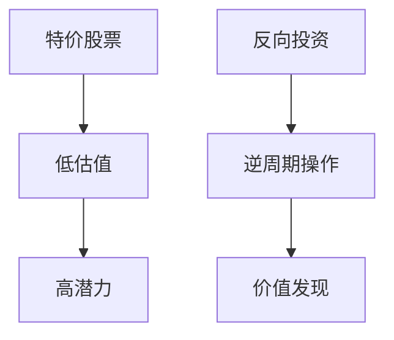
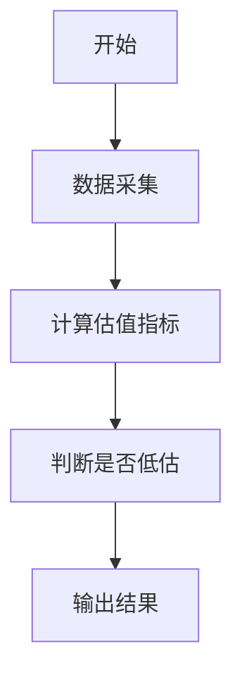
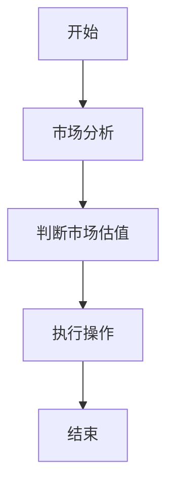
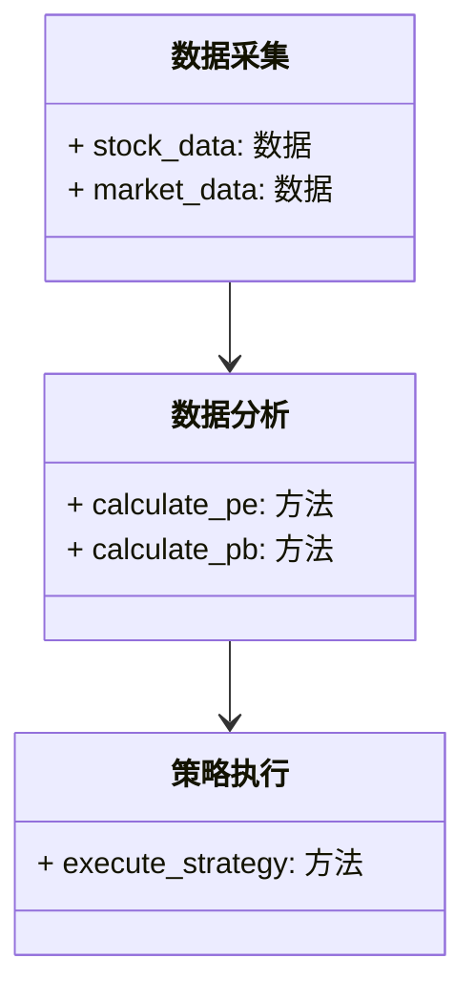
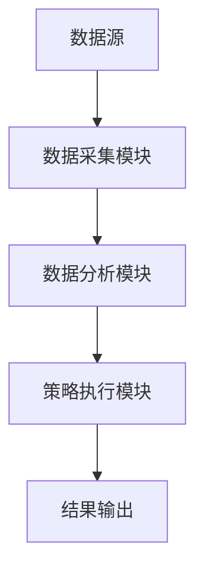

                 


# 特价股票与反向投资策略的异同

## 关键词
- 特价股票
- 反向投资策略
- 投资策略
- 股票分析
- 数学模型

## 摘要
本文系统地分析了特价股票与反向投资策略的异同，从背景介绍、核心概念对比、数学模型与算法、系统架构设计、项目实战等方面进行了详细探讨。通过对比分析，揭示了两者在投资目标、风险控制、收益预期等维度的异同，帮助投资者更好地理解这两种策略的特点及应用场景。同时，本文还提供了具体的数学模型和Python代码实现，为实际投资操作提供了参考。

---

# 第一部分: 特价股票与反向投资策略的背景与概念

## 第1章: 特价股票与反向投资策略的背景介绍

### 1.1 特价股票的定义与特点
#### 1.1.1 特价股票的定义
特价股票是指市场价格显著低于其内在价值的股票，通常被视为被市场低估的投资标的。

#### 1.1.2 特价股票的核心属性
- **低估值**：市盈率、市净率等估值指标远低于行业平均水平。
- **高潜力**：公司基本面良好，未来有较大的增长潜力。
- **流动性**：部分特价股票可能流动性较差，尤其是在市场低迷时期。

#### 1.1.3 特价股票的市场定位
特价股票通常出现在市场低迷时期，投资者认为其价格被过度低估，具有较高的投资吸引力。

---

### 1.2 反向投资策略的定义与特点
#### 1.2.1 反向投资策略的定义
反向投资策略是一种逆市场周期的投资方法，强调在市场低迷时买入，在市场高涨时卖出。

#### 1.2.2 反向投资的核心理念
- **逆周期操作**：在市场恐慌时买入，在市场狂热时卖出。
- **价值发现**：寻找被市场忽视或低估的投资机会。
- **风险管理**：通过逆向操作降低投资组合的波动性。

#### 1.2.3 反向投资与传统投资的区别
- **操作时机**：反向投资与市场趋势相反，而传统投资通常顺势而为。
- **风险承受**：反向投资需要较强的心理承受能力，因为市场低迷时买入容易遭受短期亏损。

---

### 1.3 特价股票与反向投资策略的异同
#### 1.3.1 特价股票与反向投资的共同点
- 都强调低估值和高潜力。
- 都适合在市场低迷时期操作。

#### 1.3.2 特价股票与反向投资的区别
- **目标**：特价股票注重单个股票的估值，反向投资注重整体市场周期。
- **操作**：特价股票是选股策略，反向投资是选时策略。

---

# 第二部分: 特价股票与反向投资策略的核心概念对比

## 第2章: 特价股票与反向投资策略的核心概念对比

### 2.1 特价股票与反向投资的核心要素对比
#### 2.1.1 投资目标对比
| 对比维度 | 特价股票 | 反向投资 |
|----------|----------|----------|
| 投资目标 | 选择低估股票 | 判断市场周期 |
| 风险承受 | 较高 | 较低 |
| 收益周期 | 中长期 | 长期 |

#### 2.1.2 投资策略对比
- 特价股票：基于基本面分析，寻找被低估的股票。
- 反向投资：基于市场情绪分析，逆周期操作。

#### 2.1.3 投资风险对比
- 特价股票：流动性风险较高，且个股风险较大。
- 反向投资：系统性风险较低，但需要准确判断市场周期。

---

### 2.2 特价股票与反向投资的ER实体关系图


---

# 第三部分: 特价股票与反向投资策略的数学模型与算法原理

## 第3章: 特价股票选择的算法模型

### 3.1 算法原理概述
特价股票的选择基于基本面分析，主要指标包括市盈率（PE）、市净率（PB）等。

#### 3.1.1 算法流程图（Mermaid）


#### 3.1.2 数学公式
$$市盈率 = \frac{股票价格}{每股收益}$$
$$市净率 = \frac{股票价格}{每股净资产}$$

### 3.2 Python代码实现
```python
def calculate_pe(stock_price, eps):
    return stock_price / eps

def calculate_pb(stock_price, bvps):
    return stock_price / bvps

# 示例数据
stock_price = 10
eps = 2
bvps = 5

pe = calculate_pe(stock_price, eps)
pb = calculate_pb(stock_price, bvps)

print(f"市盈率：{pe}, 市净率：{pb}")
```

---

## 第4章: 反向投资策略的数学模型

### 4.1 算法原理概述
反向投资策略基于市场情绪分析，主要指标包括市场指数的市盈率、市净率等。

#### 4.1.1 算法流程图（Mermaid）


#### 4.1.2 数学公式
$$价值评估 = \frac{企业未来现金流的现值}{当前股价}$$

### 4.2 Python代码实现
```python
def calculate_market_value(future_cash_flows, discount_rate, current_price):
    present_value = sum(future_cash_flows / (1 + discount_rate)**i for i in range(len(future_cash_flows)))
    return present_value / current_price

# 示例数据
future_cash_flows = [100, 150, 200]
discount_rate = 0.1
current_price = 50

market_value = calculate_market_value(future_cash_flows, discount_rate, current_price)
print(f"市场价值：{market_value}")
```

---

# 第四部分: 特价股票与反向投资策略的系统架构设计

## 第5章: 系统分析与架构设计方案

### 5.1 问题场景介绍
构建一个基于特价股票和反向投资策略的投资决策系统，实现数据采集、分析、策略执行等功能。

### 5.2 系统功能设计（领域模型Mermaid类图）


### 5.3 系统架构设计（Mermaid架构图）


---

# 第五部分: 项目实战

## 第6章: 项目实战

### 6.1 环境安装
- Python 3.8+
- 数据分析库：pandas、numpy
- 可视化库：matplotlib

### 6.2 系统核心实现源代码
```python
import pandas as pd
import numpy as np

def get_stock_data(ticker):
    # 示例数据获取函数
    return pd.DataFrame({'price': [10, 15, 20], 'volume': [100, 200, 300]})

# 示例数据处理
ticker = 'AAPL'
stock_data = get_stock_data(ticker)
print(stock_data)
```

### 6.3 代码应用解读与分析
- 数据采集：从API获取股票数据。
- 数据分析：计算估值指标。
- 策略执行：根据策略判断是否买入或卖出。

### 6.4 实际案例分析
- 数据来源：某股票的历史数据。
- 分析结果：计算出该股票的市盈率低于行业平均水平，符合特价股票的条件。

---

# 第六部分: 最佳实践

## 第7章: 最佳实践

### 7.1 小结
- 特价股票与反向投资策略各有优劣，投资者应根据市场环境和个人风险偏好选择合适策略。

### 7.2 注意事项
- 特价股票投资需关注流动性风险。
- 反向投资需准确判断市场周期。

### 7.3 拓展阅读
- 建议阅读《投资学基础》和《反向投资策略》相关书籍。

---

# 结语

本文通过系统分析和对比，揭示了特价股票与反向投资策略的异同，为投资者提供了理论依据和实践指导。无论是选择特价股票还是反向投资策略，投资者都需要结合市场环境和个人能力进行合理配置。

---

作者：AI天才研究院/AI Genius Institute & 禅与计算机程序设计艺术 /Zen And The Art of Computer Programming

