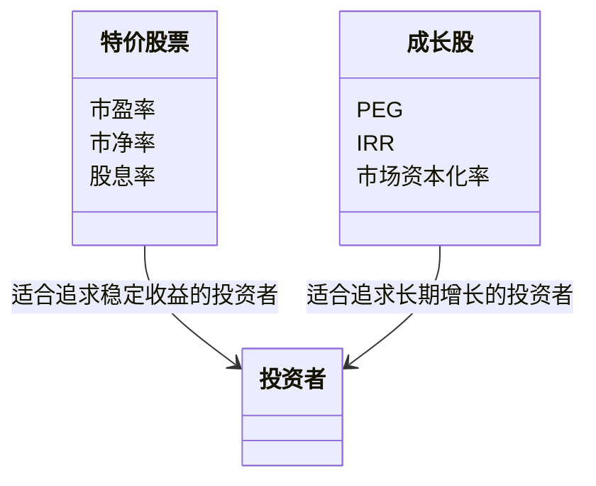
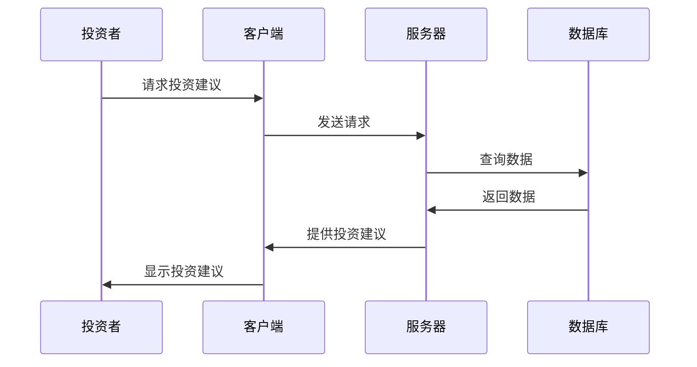

                 


# 特价股票与成长股的投资区别

> 关键词：股票投资，特价股票，成长股，投资策略，风险管理

> 摘要：本文系统分析了特价股票和成长股的区别，深入探讨了两者的投资策略、数学模型和系统架构，结合实际案例进行详细解读，帮助投资者在不同市场环境下做出明智的投资决策。

---

## 第1章: 特价股票与成长股的背景介绍

### 1.1 投资市场的基本概念
- 1.1.1 股票市场的基本构成
  - 股票市场的参与者
  - 股票的分类与特点
- 1.1.2 投资者的基本分类
  - 机构投资者与个人投资者
  - 长期投资者与短期投资者
- 1.1.3 特价股票与成长股的市场定位
  - 特价股票的市场定位
  - 成长股的市场定位

### 1.2 特价股票与成长股的定义
- 1.2.1 特价股票的定义与特点
  - 特价股票的定义
  - 特价股票的特点：低估值、高分红、股价波动大
- 1.2.2 成长股的定义与特点
  - 成长股的定义
  - 成长股的特点：高增长、高市盈率、股价波动小
- 1.2.3 两者的区别与联系
  - 区别：价值与成长的双重考量
  - 联系：市场环境变化下的投资机会

### 1.3 投资者的需求与目标
- 1.3.1 不同类型投资者的投资目标
  - 保守型投资者：追求稳定收益
  - 进取型投资者：追求高增长
- 1.3.2 投资者对特价股票与成长股的需求
  - 特价股票：适合追求高分红和低估值的投资者
  - 成长股：适合追求长期增长的投资者
- 1.3.3 投资目标与股票类型的选择
  - 根据市场环境调整投资策略

### 1.4 本章小结
- 本章介绍了特价股票和成长股的定义、特点及其在投资市场中的定位，分析了不同类型投资者的需求与目标，为后续章节的分析奠定基础。

---

## 第2章: 特价股票与成长股的核心概念对比

### 2.1 特价股票的核心要素
- 2.1.1 特价股票的市场表现
  - 市场表现的波动性分析
  - 市场表现与宏观经济的关系
- 2.1.2 特价股票的估值方法
  - 市盈率法（P/E）
  - 市净率法（P/B）
  - 股息率法（Dividend Yield）
- 2.1.3 特价股票的风险特征
  - 市场风险
  - 估值风险
  - 经营风险

### 2.2 成长股的核心要素
- 2.2.1 成长股的市场表现
  - 市场表现的稳定性分析
  - 市场表现与公司增长的关系
- 2.2.2 成长股的估值方法
  - 市盈率增长比（PEG）
  - 内部收益率（IRR）
  - 市场资本化率（Market Cap）
- 2.2.3 成长股的风险特征
  - 市场风险
  - 成长风险
  - 周期性风险

### 2.3 两者的核心概念对比
- 2.3.1 估值方法的对比
  - 市盈率法 vs PEG
  - 市净率法 vs 市场资本化率
  - 股息率法 vs 内部收益率
- 2.3.2 风险特征的对比
  - 市场风险：相似性分析
  - 估值风险 vs 成长风险
  - 经营风险 vs 周期性风险
- 2.3.3 市场表现的对比
  - 短期波动 vs 长期增长
  - 市场环境变化的影响

### 2.4 本章小结
- 本章通过对比分析，揭示了特价股票和成长股在估值方法、风险特征和市场表现上的差异，帮助投资者更好地理解两者的特点。

---

## 第3章: 特价股票与成长股的投资策略

### 3.1 特价股票的投资策略
- 3.1.1 价值投资策略
  - 价值投资的定义与特点
  - 价值投资的实施步骤
- 3.1.2 技术分析策略
  - 技术分析的定义与特点
  - 常用技术指标（如RSI、MACD等）
- 3.1.3 事件驱动策略
  - 公司重组、并购等事件的影响
  - 事件驱动策略的应用场景

### 3.2 成长股的投资策略
- 3.2.1 市盈率增长比（PEG）法
  - PEG的计算与应用
  - 选择低PEG公司的策略
- 3.2.2 市场资本化率法
  - 市场资本化率的计算与应用
  - 市场资本化率与公司规模的关系
- 3.2.3 市场预期收益法
  - 市场预期收益的计算与应用
  - 市场预期收益与公司成长性的关系

### 3.3 两者的投资策略对比
- 3.3.1 价值投资与成长投资的优缺点
  - 价值投资的优势：低估值、高分红
  - 成长投资的优势：长期增长潜力
  - 价值投资的缺点：短期波动风险
  - 成长投资的缺点：估值过高风险
- 3.3.2 不同市场环境下的策略选择
  - 牛市中的策略选择
  - 熊市中的策略选择
- 3.3.3 投资组合的配置建议
  - 投资组合的多样化配置
  - 根据市场环境动态调整

### 3.4 本章小结
- 本章详细探讨了特价股票和成长股的投资策略，分析了不同策略的优缺点及适用场景，为投资者提供了实用的指导。

---

## 第4章: 特价股票与成长股的数学模型与公式

### 4.1 特价股票的数学模型
- 4.1.1 市盈率模型
  - 公式：$$P/E = \frac{Price}{Earnings}$$
  - 应用场景：评估公司估值
- 4.1.2 市净率模型
  - 公式：$$P/B = \frac{Price}{Book\ Value}$$
  - 应用场景：评估公司资产质量
- 4.1.3 股息率模型
  - 公式：$$Dividend\ Yield = \frac{Dividend}{Price}$$
  - 应用场景：评估投资回报率

### 4.2 成长股的数学模型
- 4.2.1 市盈率增长比模型
  - 公式：$$PEG = \frac{P/E}{Earnings\ Growth\ Rate}$$
  - 应用场景：评估成长公司的估值
- 4.2.2 内部收益率模型
  - 公式：$$IRR = \frac{CASH\ FLOWS}{INITIAL\ INVESTMENT}$$
  - 应用场景：评估投资项目回报率
- 4.2.3 市场资本化率模型
  - 公式：$$Market\ Cap = Price \times Shares\ Outstanding$$
  - 应用场景：评估公司规模

### 4.3 两者的数学模型对比
- 4.3.1 模型的适用场景
  - 特价股票：适用于低估值、高分红的公司
  - 成长股：适用于高增长、高市盈率的公司
- 4.3.2 模型的优缺点
  - 特价股票模型：简单直观，但忽视了公司的成长性
  - 成长股模型：考虑了公司的成长性，但计算复杂
- 4.3.3 实际案例中的应用
  - 案例分析：某公司A的市盈率与PEG分析
  - 案例分析：某公司B的市净率与市场资本化率分析

### 4.4 本章小结
- 本章通过数学模型的对比分析，揭示了特价股票和成长股在估值方法上的差异，为投资者提供了科学的分析工具。

---

## 第5章: 特价股票与成长股的系统架构设计

### 5.1 问题场景介绍
- 投资者在选择股票时面临的挑战
  - 信息过载
  - 市场波动
  - 个人风险偏好

### 5.2 项目介绍
- 本项目的目标
  - 构建一个基于特价股票和成长股的投资分析系统
  - 提供个性化的投资建议

### 5.3 系统功能设计（领域模型）


### 5.4 系统架构设计


### 5.5 系统接口设计
- API接口
  - 获取特价股票数据
  - 获取成长股数据
  - 计算估值模型

### 5.6 系统交互设计


### 5.7 本章小结
- 本章通过系统架构设计，展示了如何利用技术手段辅助投资者进行投资决策，提高了投资的科学性和效率。

---

## 第6章: 特价股票与成长股的项目实战

### 6.1 环境安装
- 安装必要的软件和工具
  - Python编程环境（如Anaconda）
  - 数据分析工具（如Pandas、Matplotlib）
  - 股票数据源（如Yahoo Finance）

### 6.2 系统核心实现源代码
```python
import pandas as pd
import matplotlib.pyplot as plt

# 特价股票分析
def value_stock_analysis(prices, earnings):
    pe = prices / earnings
    return pe

# 成长股分析
def growth_stock_analysis(prices, earnings_growth):
    peg = value_stock_analysis(prices, earnings_growth)
    return peg

# 示例数据
prices = [100, 120, 130]
earnings = [20, 30, 40]
earnings_growth = [0.1, 0.15, 0.2]

# 计算
pe = value_stock_analysis(prices, earnings)
peg = growth_stock_analysis(prices, earnings_growth)

# 可视化
plt.plot(prices, label='Prices')
plt.plot(pe, label='PE Ratio')
plt.plot(peg, label='PEG Ratio')
plt.legend()
plt.show()
```

### 6.3 代码应用解读与分析
- 代码功能解读
  - 计算市盈率和PEG比率
  - 绘制可视化图表
- 应用场景分析
  - 如何通过代码快速评估公司估值
  - 如何利用可视化工具分析股票走势

### 6.4 实际案例分析
- 案例1：某公司A的特价股票分析
  - 数据来源：Yahoo Finance
  - 分析结果：市盈率低，适合价值投资
- 案例2：某公司B的成长股分析
  - 数据来源：Yahoo Finance
  - 分析结果：PEG比率合理，适合成长投资

### 6.5 本章小结
- 本章通过实际案例和代码实现，展示了如何将理论应用于实践，帮助投资者更好地理解和应用特价股票和成长股的分析方法。

---

## 第7章: 总结与展望

### 7.1 本章总结
- 特价股票与成长股的区别
  - 特价股票：低估值、高分红、风险较高
  - 成长股：高增长、高市盈率、风险较低
- 投资策略的选择
  - 根据市场环境和个人风险偏好选择投资策略

### 7.2 未来展望
- 投资理论的发展
  - 人工智能在投资分析中的应用
  - 大数据技术在股票分析中的应用
- 投资工具的创新
  - 更加智能化的投资系统
  - 更加个性化的投资建议

### 7.3 本章小结
- 本章总结了全文的主要内容，并展望了未来投资领域的发展趋势，为投资者提供了长期的学习和实践方向。

---

## 作者：AI天才研究院/AI Genius Institute & 禅与计算机程序设计艺术 /Zen And The Art of Computer Programming

---

通过以上目录大纲，文章系统地分析了特价股票和成长股的投资区别，结合理论与实践，帮助投资者在不同市场环境下做出明智的投资决策。

