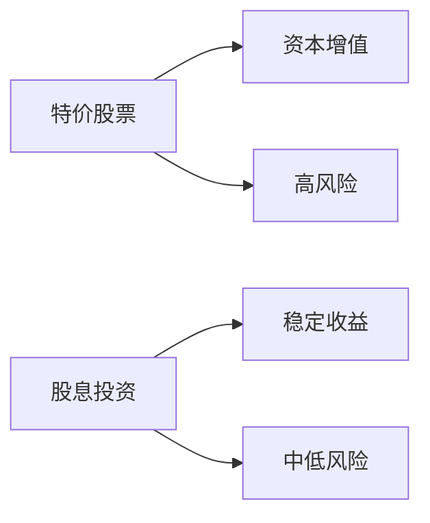
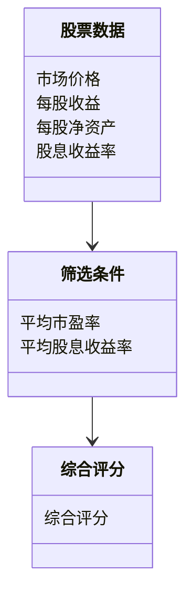
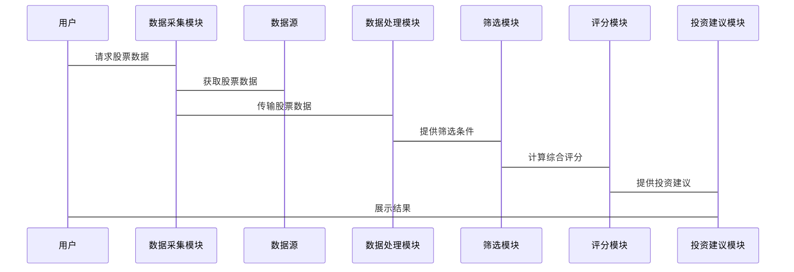

                 


# 特价股票与股息投资策略的结合

## 关键词：
- 特价股票
- 股息投资策略
- 股票投资
- 股票分析
- 股票策略

## 摘要：
本文探讨了如何将特价股票与股息投资策略相结合，以实现投资收益最大化。通过对特价股票和股息投资策略的深入分析，结合数学模型、算法设计和系统架构，提出了一个综合投资策略，帮助投资者在风险可控的前提下，实现资本增值和稳定收益。

---

# 第1章: 特价股票与股息投资策略的背景介绍

## 1.1 特价股票的定义与特点

### 1.1.1 特价股票的定义
特价股票是指市场价格低于其内在价值的股票。这种股票通常被市场低估，具有较大的上涨潜力。

### 1.1.2 特价股票的核心特点
- **低估性**：市场价格低于内在价值。
- **高回报潜力**：随着市场重新评估，股价可能上涨。
- **风险较高**：低估可能源于公司基本面问题。

### 1.1.3 特价股票与普通股票的区别
- 普通股票：市场价格反映市场情绪，不一定低于内在价值。
- 特价股票：市场价格显著低于内在价值。

## 1.2 股息投资策略的定义与特点

### 1.2.1 股息投资策略的定义
股息投资策略是指投资于那些能够稳定派发股息的公司，以获取稳定的现金流收益。

### 1.2.2 股息投资策略的核心特点
- **稳定性**：股息收入提供稳定的现金流。
- **防御性**：股息支付能力强的公司通常较为稳定。
- **长期收益**：股息再投资可带来复利效应。

### 1.2.3 股息投资策略与普通投资的区别
- 普通投资：关注资本增值，不强调股息收入。
- 股息投资：注重股息收入，同时兼顾资本增值。

## 1.3 特价股票与股息投资策略的结合

### 1.3.1 结合的必要性
- 利用特价股票的低估特性，降低投资成本。
- 通过股息投资策略，获取稳定的现金流，降低投资风险。

### 1.3.2 结合的优势
- **双重收益**：股价上涨带来资本增值，股息收入提供稳定收益。
- **风险分散**：特价股票的低估特性与股息投资的稳定性相结合，降低整体风险。

### 1.3.3 结合的潜在风险
- **市场波动**：特价股票可能因市场波动进一步下跌。
- **股息风险**：公司可能因经营问题减少或取消股息支付。

## 1.4 本章小结
特价股票与股息投资策略的结合，能够在风险可控的前提下，实现资本增值与稳定收益的双重目标。然而，投资者需要充分考虑市场波动和公司基本面，以降低潜在风险。

---

# 第2章: 特价股票与股息投资策略的核心概念与联系

## 2.1 特价股票与股息投资的核心概念

### 2.1.1 特价股票的核心概念
- **内在价值**：股票的真实价值，与市场价格对比判断是否低估。
- **低估标准**：通常通过市盈率、市净率等指标判断。

### 2.1.2 股息投资的核心概念
- **股息收益率**：股息收入与股价的比率。
- **股息支付率**：公司利润用于股息支付的比例。

### 2.1.3 两者概念的对比分析
| 比较维度 | 特价股票 | 股息投资 |
|----------|----------|----------|
| 核心目标 | 获得资本增值 | 获得稳定股息收入 |
| 风险特征 | 高风险 | 中低风险 |
| 适用场景 | 市场低迷时投资 | 稳定收益需求时投资 |

## 2.2 特价股票与股息投资的联系

### 2.2.1 两者结合的理论基础
- **价值投资**：寻找被市场低估的股票，同时具备稳定的股息支付能力。
- **复利效应**：股息再投资可加速资本增值。

### 2.2.2 两者结合的实践意义
- **收益最大化**：通过股息收入降低整体投资成本。
- **风险分散**：结合两种策略，降低单一策略的风险。

### 2.2.3 两者结合的具体应用场景
- **价值股投资**：选择股价低估且股息收益率高的股票。
- **股息再投资**：将股息用于再投资，加速资本增值。

## 2.3 特价股票与股息投资的对比分析

### 2.3.1 对比分析表格
| 比较维度 | 特价股票 | 股息投资 |
|----------|----------|----------|
| 投资目标 | 资本增值 | 稳定收益 |
| 风险特征 | 高风险 | 中低风险 |
| 适用场景 | 市场低估时 | 稳定收益需求时 |

### 2.3.2 对比分析的可视化图表


## 2.4 本章小结
通过对比分析，特价股票与股息投资策略各有优劣，结合两者可以实现收益与风险的优化配置。

---

# 第3章: 特价股票与股息投资策略的数学模型与算法原理

## 3.1 特价股票与股息投资的数学模型

### 3.1.1 特价股票的估值模型
- **市盈率（P/E）**：市场价格/每股收益。
- **市净率（P/B）**：市场价格/每股净资产。

### 3.1.2 股息投资的收益率模型
- **股息收益率**：股息/股价。
- **股息再投资收益率**：股息收入再投资的复利收益。

### 3.1.3 两者结合的综合模型
综合考虑股价低估和高股息率，建立如下综合评分模型：
$$
综合评分 = 0.5 \times (内在价值 - 市场价格) + 0.5 \times 股息收益率
$$

## 3.2 特价股票与股息投资的算法原理

### 3.2.1 算法原理的数学公式
- 筛选条件：
  - 市盈率低于行业平均值。
  - 股息收益率高于行业平均值。

### 3.2.2 算法原理的流程图


### 3.2.3 算法原理的实现步骤
1. 数据收集：获取股票的市盈率、股息收益率等数据。
2. 筛选条件：筛选市盈率低于行业平均值且股息收益率高于行业平均值的股票。
3. 综合评分：计算综合评分，给出投资建议。

## 3.3 特价股票与股息投资的算法实现

### 3.3.1 算法实现的代码
```python
import pandas as pd

# 假设df为股票数据，包含市盈率（pe）、股息收益率（div_yield）
# 行业平均市盈率和股息收益率分别为average_pe和average_div_yield

# 筛选条件
selected = df[(df['pe'] < average_pe) & (df['div_yield'] > average_div_yield)]

# 计算综合评分
selected['综合评分'] = 0.5 * (selected['内在价值'] - selected['市场价格']) + 0.5 * selected['div_yield']
```

### 3.3.2 算法实现的详细解读
- 数据预处理：清洗数据，确保数据质量。
- 筛选股票：根据市盈率和股息收益率筛选符合条件的股票。
- 计算评分：结合股票的内在价值和股息收益率，计算综合评分。

### 3.3.3 算法实现的案例分析
假设某行业平均市盈率为15，平均股息收益率为3%。筛选出市盈率低于15且股息收益率高于3%的股票，计算其综合评分，给出投资建议。

## 3.4 本章小结
通过数学模型和算法实现，投资者可以系统地筛选出符合特价股票与股息投资策略的股票，降低投资风险，提高收益。

---

# 第4章: 特价股票与股息投资策略的系统分析与架构设计

## 4.1 问题场景介绍
- 投资者希望通过系统实现特价股票与股息投资策略的结合，筛选出符合条件的股票。

## 4.2 系统功能设计

### 4.2.1 领域模型（Mermaid类图）


### 4.2.2 系统架构设计（Mermaid架构图）


## 4.3 系统接口设计
- 数据接口：与数据源对接，获取股票数据。
- 用户接口：展示筛选结果和投资建议。

## 4.4 系统交互设计（Mermaid序列图）


## 4.5 本章小结
通过系统设计，投资者可以自动化筛选符合特价股票与股息投资策略的股票，提高投资效率。

---

# 第5章: 特价股票与股息投资策略的项目实战

## 5.1 环境安装
- 数据库安装：MySQL或MongoDB。
- 开发工具：Python、Jupyter Notebook。
- 第三方库：pandas、numpy、matplotlib。

## 5.2 系统核心实现源代码

### 5.2.1 数据采集模块
```python
import pandas as pd
import requests

# 获取股票数据
url = "http://example.com/stock_data"
data = requests.get(url).json()
df = pd.DataFrame(data)
```

### 5.2.2 数据处理模块
```python
# 清洗数据
df.dropna(inplace=True)
df = df[df['市盈率'] < average_pe]
df = df[df['股息收益率'] > average_div_yield]
```

### 5.2.3 筛选模块
```python
# 筛选符合条件的股票
selected_stocks = df[df['市盈率'] < average_pe]
selected_stocks = selected_stocks[selected_stocks['股息收益率'] > average_div_yield]
```

### 5.2.4 评分模块
```python
# 计算综合评分
selected_stocks['综合评分'] = 0.5 * (selected_stocks['内在价值'] - selected_stocks['市场价格']) + 0.5 * selected_stocks['股息收益率']
```

### 5.2.5 投资建议模块
```python
# 提供投资建议
selected_stocks.sort_values('综合评分', ascending=False).head(10)
```

## 5.3 代码应用解读与分析
- 数据采集模块：从数据源获取股票数据。
- 数据处理模块：清洗数据，去除缺失值。
- 筛选模块：根据市盈率和股息收益率筛选股票。
- 评分模块：计算综合评分，排序股票。
- 投资建议模块：展示评分最高的股票。

## 5.4 实际案例分析
- 案例：假设某行业平均市盈率为15，平均股息收益率为3%。
- 筛选出市盈率低于15且股息收益率高于3%的股票。
- 计算综合评分，选择评分最高的10只股票作为投资建议。

## 5.5 本章小结
通过实际案例分析，投资者可以直观地看到特价股票与股息投资策略的结合效果。

---

# 第6章: 特价股票与股息投资策略的最佳实践与注意事项

## 6.1 最佳实践

### 6.1.1 定期评估
- 定期评估股票的市盈率、股息收益率，及时调整投资组合。

### 6.1.2 分散投资
- 通过分散投资降低风险，避免过度集中于某一只股票。

## 6.2 小结

### 6.2.1 投资注意事项
- 注意市场波动，及时调整投资策略。
- 关注公司基本面，避免选择基本面不佳的公司。

### 6.2.2 拓展阅读
- 阅读价值投资经典书籍，如《 Warren Buffett 的投资思想》。
- 关注行业动态，了解经济环境对投资策略的影响。

## 6.3 本章小结
投资者在实际操作中，应结合市场环境和个人风险承受能力，灵活运用特价股票与股息投资策略，实现长期稳定的收益。

---

# 作者：AI天才研究院/AI Genius Institute & 禅与计算机程序设计艺术 /Zen And The Art of Computer Programming

---

通过以上结构化的内容，我们可以系统地理解特价股票与股息投资策略的结合，从理论到实践，帮助投资者制定有效的投资策略，实现收益最大化。

