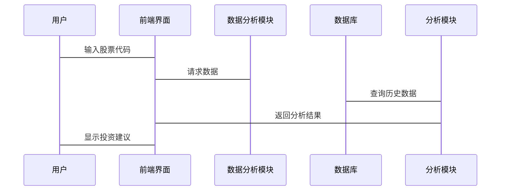

                 


# 特价股票投资中的产业互联网分析方法

> 关键词：特价股票投资、产业互联网分析、股票数据分析、互联网技术应用、金融投资分析

> 摘要：本文详细探讨了在特价股票投资中如何利用产业互联网分析方法，从背景介绍、核心概念、算法原理、系统架构到项目实战，全面解析了产业互联网在股票投资中的应用价值与实现方法。

---

## 第1章: 特价股票投资的背景与基础

### 1.1 特价股票投资的背景
#### 1.1.1 特价股票的定义与特点
特价股票（Cheap Stock）通常指价格低于其内在价值的股票，具有以下特点：
- **低估值**：市盈率、市净率等指标低于行业平均水平。
- **高潜力**：公司基本面良好，但市场尚未发现其投资价值。
- **风险可控**：相对于高价股，特价股票的风险相对较低。

#### 1.1.2 产业互联网的概念与特点
产业互联网（Industrial Internet）是互联网技术与传统产业深度融合的产物，其特点包括：
- **数据驱动**：通过数据采集、分析和挖掘，优化企业运营。
- **智能化**：利用人工智能、大数据等技术提升产业效率。
- **跨界融合**：打破传统行业边界，形成新的商业模式。

#### 1.1.3 特价股票投资与产业互联网的结合
通过产业互联网技术，投资者可以更高效地获取和分析股票数据，发现潜在的投资机会。例如：
- 利用互联网技术实时监控市场数据。
- 通过大数据分析挖掘公司基本面信息。
- 利用人工智能预测市场趋势。

---

## 第2章: 产业互联网分析的核心概念

### 2.1 产业互联网分析的基本原理
#### 2.1.1 数据采集与处理
- **数据来源**：股票价格、财务报表、行业报告等。
- **数据清洗**：去除异常值、填补缺失数据。
- **数据存储**：使用数据库或大数据平台存储结构化数据。

#### 2.1.2 数据分析与建模
- **描述性分析**：总结历史数据特征。
- **预测性分析**：利用回归、时间序列等模型预测股价走势。
- **诊断性分析**：识别影响股价的关键因素。

#### 2.1.3 数据可视化与决策支持
- **可视化工具**：如Tableau、Power BI等。
- **可视化方法**：折线图、柱状图、散点图等。
- **决策支持**：基于数据可视化结果辅助投资决策。

### 2.2 特价股票投资中的关键指标
#### 2.2.1 市盈率与市净率分析
- **市盈率（P/E）**：股价与每股收益的比率，反映市场对公司的估值。
- **市净率（P/B）**：股价与每股净资产的比率，适用于评估资产密集型行业。

#### 2.2.2 财务指标与公司基本面分析
- **净利润率**：衡量公司盈利能力。
- **资产负债率**：评估公司财务健康状况。
- **ROE（净资产收益率）**：反映公司资产使用效率。

#### 2.2.3 行业趋势与市场情绪分析
- **行业趋势**：分析宏观经济政策、行业周期对股价的影响。
- **市场情绪**：通过新闻、社交媒体等数据推测投资者情绪。

### 2.3 产业互联网分析的核心方法
#### 2.3.1 数据驱动的分析方法
- **数据挖掘**：从海量数据中提取有价值的信息。
- **机器学习**：利用算法预测股价走势。
- **自然语言处理**：分析公司财报、新闻等文本数据。

#### 2.3.2 互联网技术在股票分析中的应用
- **实时数据获取**：通过API接口实时获取股票数据。
- **分布式计算**：利用Hadoop、Spark处理海量数据。
- **自动化交易**：基于算法实现自动化的买卖决策。

#### 2.3.3 产业互联网分析的优缺点对比
| **特点**       | **优势**                              | **劣势**                              |
|----------------|-------------------------------------|---------------------------------------|
| 数据驱动       | 高度依赖数据质量                     | 数据获取成本高                         |
| 实时性          | 可实时跟踪市场动态                   | 市场波动大，模型易失效                 |
| 智能化          | 自动化分析，减少人为干扰             | 黑箱模型难解释                         |

---

## 第3章: 产业互联网分析的算法原理

### 3.1 常见的股票分析算法
#### 3.1.1 移动平均线（MA）算法
- **定义**：计算一定周期内的平均股价，用于平滑价格波动。
- **公式**：
  $$ MA_n = \frac{1}{n} \sum_{i=1}^{n} P_i $$
  其中，$P_i$ 表示第 $i$ 天的收盘价，$n$ 为周期数。

#### 3.1.2 相对强弱指数（RSI）算法
- **定义**：衡量股票在一段时间内的超买或超卖状态。
- **公式**：
  $$ RSI = \frac{N_{up} - N_{down}}{N_{up} + N_{down}} \times 100 $$
  其中，$N_{up}$ 为上涨天数，$N_{down}$ 为下跌天数。

#### 3.1.3 布林格带（Bollinger Bands）算法
- **定义**：用于衡量股价的波动范围，判断股价是否偏离正常区间。
- **公式**：
  $$ BB_{upper} = MA_n + n \times \sigma $$
  $$ BB_{lower} = MA_n - n \times \sigma $$
  其中，$\sigma$ 为标准差，$n$ 为周期数。

### 3.2 产业互联网分析的数学模型
#### 3.2.1 移动平均线的数学公式
$$ MA_n = \frac{1}{n} \sum_{i=1}^{n} P_i $$

#### 3.2.2 相对强弱指数的计算公式
$$ RSI = \frac{N_{up} - N_{down}}{N_{up} + N_{down}} \times 100 $$

### 3.3 算法实现与代码示例
```python
import pandas as pd
import numpy as np

# 示例数据：假设data是一个包含'close'列的DataFrame
data['MA_10'] = data['close'].rolling(10).mean()
data['RSI'] = data['close'].rolling(10).apply(lambda x: 
    (x - x.min()).sum() / (x.max() - x.min()))
```

---

## 第4章: 系统分析与架构设计方案

### 4.1 问题场景介绍
- **目标**：构建一个基于产业互联网的股票分析系统。
- **需求**：实时获取股票数据，分析技术指标，生成投资建议。

### 4.2 系统功能设计
- **数据采集模块**：实时获取股票数据。
- **数据分析模块**：计算技术指标，如MA、RSI等。
- **数据可视化模块**：生成图表，帮助投资者理解数据。
- **投资建议模块**：基于分析结果给出买卖建议。

### 4.3 系统架构设计


### 4.4 系统接口设计
- **输入接口**：股票代码、时间范围。
- **输出接口**：技术指标分析结果、投资建议。

### 4.5 系统交互流程


---

## 第5章: 项目实战

### 5.1 环境安装
- **工具**：Python、Jupyter Notebook、Pandas、NumPy、Matplotlib。
- **数据源**：Yahoo Finance API。

### 5.2 核心代码实现
```python
import pandas as pd
import matplotlib.pyplot as plt
import requests

# 获取股票数据
def get_stock_data(ticker, start_date, end_date):
    url = f"https://query1.finance.yahoo.com/v7/finance/d/0 UIStoryboard"
    params = {
        'tickers': ticker,
        'period1': start_date,
        'period2': end_date
    }
    response = requests.get(url, params=params)
    data = response.json()
    df = pd.DataFrame(data['rows'])
    return df

# 计算移动平均线
def calculate_ma(data, window):
    return data['close'].rolling(window).mean()

# 可视化
def plot_chart(data, ma):
    plt.figure(figsize=(12, 6))
    plt.plot(data['close'], label='Close Price')
    plt.plot(ma, label=f'MA_{window}')
    plt.legend()
    plt.show()
```

### 5.3 代码解读与分析
- **数据获取**：通过Yahoo Finance API获取股票数据。
- **计算MA**：使用Pandas的rolling函数计算移动平均线。
- **可视化**：利用Matplotlib绘制股价与MA的对比图。

### 5.4 实际案例分析
- **案例**：假设分析一只低价股票，计算其10日MA和RSI。
- **结果**：根据技术指标给出投资建议。

### 5.5 项目小结
- **实现目标**：构建了一个基于产业互联网的股票分析系统。
- **优势**：实时性强，分析效率高。
- **不足**：需要不断优化模型，提高预测准确性。

---

## 第6章: 最佳实践与小结

### 6.1 最佳实践
- **数据质量**：确保数据来源可靠，清洗充分。
- **模型优化**：定期更新算法，适应市场变化。
- **风险管理**：结合技术分析和基本面分析，降低投资风险。

### 6.2 小结
本文详细探讨了产业互联网在特价股票投资中的应用，从理论到实践，为投资者提供了一套高效的数据分析方法。

### 6.3 注意事项
- **数据隐私**：注意保护投资者的隐私数据。
- **模型局限性**：算法模型仅供参考，投资需谨慎。

### 6.4 拓展阅读
- **书籍推荐**：《股票技术分析实战》、《数据驱动的投资决策》。
- **在线课程**：推荐相关在线课程，深入学习股票分析技术。

---

## 作者信息

作者：AI天才研究院/AI Genius Institute & 禅与计算机程序设计艺术/Zen And The Art of Computer Programming

