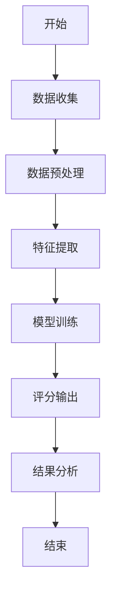
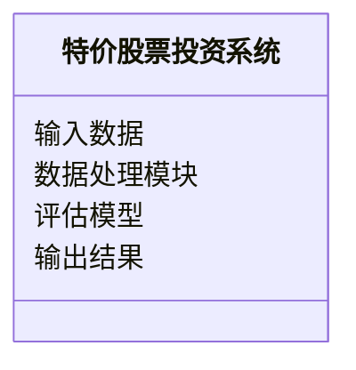
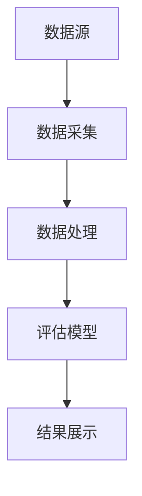
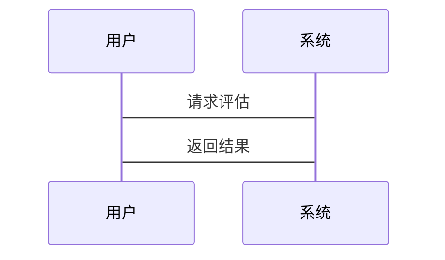

                 


# 特价股票投资中的企业数字伦理与责任评估因素考量

> 关键词：特价股票投资、企业数字伦理、责任评估、数学模型、系统架构

> 摘要：本文深入探讨了在特价股票投资中，企业数字伦理与责任评估的重要性。首先介绍了特价股票投资的基本概念和数字伦理的背景，接着详细分析了责任评估的核心要素。通过构建数学模型和系统架构，提出了一个基于企业责任评分的责任评估算法。最后，通过项目实战展示了如何将这些理论应用于实际投资决策中，强调了企业数字伦理在投资中的实际应用价值。

---

# 第一部分: 特价股票投资中的企业数字伦理与责任评估背景

## 第1章: 特价股票投资概述

### 1.1 特价股票投资的基本概念

#### 1.1.1 特价股票的定义与特点
特价股票是指在特定市场条件下，价格被低估的股票。其特点包括高性价比、低市盈率和潜在的增值空间。投资者通过分析公司基本面，寻找被市场低估的投资机会。

#### 1.1.2 特价股票投资的基本原理
特价股票投资基于价值投资理念，强调买入低于内在价值的股票。投资者需要分析公司的财务状况、行业地位和市场前景。

#### 1.1.3 特价股票投资的市场环境
市场波动、经济周期和行业趋势影响特价股票的投资机会。投资者需关注宏观经济指标和行业动态，以识别潜在的投资机会。

### 1.2 企业数字伦理的背景

#### 1.2.1 数字化对企业的影响
数字化转型改变了企业的运营模式，数据成为核心资产。企业需在数据收集、处理和使用中遵守伦理规范，避免隐私泄露和数据滥用。

#### 1.2.2 企业数字伦理的核心概念
数字伦理涉及数据隐私、算法公平性和透明度。企业需在技术应用中考虑道德责任，确保技术发展符合社会价值观。

#### 1.2.3 数字伦理在投资中的重要性
投资者需评估企业在数字伦理方面的表现，如数据治理和隐私保护。这影响企业的长期声誉和可持续发展能力。

### 1.3 责任评估因素的考量

#### 1.3.1 责任投资的定义
责任投资指在投资决策中考虑环境、社会和治理（ESG）因素。它强调企业的可持续发展能力和社会责任。

#### 1.3.2 责任评估的核心要素
责任评估包括环境表现、社会责任和公司治理。投资者需评估企业在这些方面的表现，以识别潜在风险和机会。

#### 1.3.3 责任评估在特价股票中的应用
在特价股票投资中，责任评估用于筛选符合道德标准的公司。这不仅降低投资风险，还推动企业实践可持续发展。

---

## 第2章: 企业数字伦理与责任评估的核心概念

### 2.1 数字伦理的核心概念

#### 2.1.1 数字伦理的定义
数字伦理涉及数据的使用、算法的公平性和技术的影响。它要求企业在技术创新中考虑道德责任。

#### 2.1.2 数字伦理的特征
数字伦理具有动态性、全球性和技术性。随着技术发展，数字伦理标准也在不断更新。

#### 2.1.3 数字伦理与企业责任的关系
企业需在数字伦理框架下运营，确保技术应用符合社会价值观。这不仅提升企业声誉，还促进社会进步。

### 2.2 责任评估的核心要素

#### 2.2.1 责任评估的定义
责任评估是通过分析企业ESG表现，评估其社会责任和可持续发展能力。它帮助投资者识别潜在风险。

#### 2.2.2 责任评估的关键指标
包括碳排放、员工权益和公司治理。这些指标衡量企业在环境、社会和治理方面的表现。

#### 2.2.3 责任评估的实施步骤
从数据收集到评估分析，再到结果应用。投资者需系统地评估企业责任表现。

---

## 第3章: 责任评估模型

### 3.1 责任评估模型的原理

#### 3.1.1 模型的基本原理
责任评估模型基于企业ESG表现，构建评分系统。通过量化指标，评估企业责任表现。

#### 3.1.2 模型的输入与输出
输入包括环境数据、社会责任指标，输出为企业责任评分和投资建议。

#### 3.1.3 模型的优缺点
优点是量化评估，缺点是数据收集和处理复杂。

### 3.2 责任评估模型的流程图



### 3.3 数学模型与公式

#### 3.3.1 线性回归模型
用于预测企业责任评分：
$$ y = \beta_0 + \beta_1x_1 + \beta_2x_2 + \dots + \beta_nx_n $$

#### 3.3.2 评分系统
$$ \text{评分} = \frac{\sum w_i x_i}{\sum w_i} $$

---

## 第4章: 系统架构与设计

### 4.1 系统功能设计

#### 4.1.1 领域模型



#### 4.1.2 系统架构设计



### 4.2 系统接口设计

#### 4.2.1 API接口
提供数据获取和评估结果查询接口。

#### 4.2.2 交互流程



---

## 第5章: 项目实战

### 5.1 环境安装

#### 5.1.1 安装Python
使用Anaconda安装Python 3.8及以上版本。

#### 5.1.2 安装依赖
安装numpy、pandas和scikit-learn库。

### 5.2 代码实现

#### 5.2.1 数据预处理

```python
import pandas as pd

# 读取数据
data = pd.read_csv('data.csv')

# 数据清洗
data = data.dropna()
```

#### 5.2.2 模型训练

```python
from sklearn.linear_model import LinearRegression

model = LinearRegression()
model.fit(X, y)
```

#### 5.2.3 结果展示

```python
import matplotlib.pyplot as plt

plt.scatter(X, y)
plt.plot(X, model.predict(X), color='red')
plt.show()
```

### 5.3 案例分析

#### 5.3.1 案例选择
选择一家公司，分析其ESG表现。

#### 5.3.2 评估结果
计算公司责任评分，评估其投资价值。

### 5.4 项目小结

---

## 第6章: 总结与展望

### 6.1 总结

本文探讨了特价股票投资中的企业数字伦理与责任评估，提出了基于数学模型的责任评估方法。通过系统设计和项目实战，展示了理论的应用价值。

### 6.2 展望

未来，随着技术发展，责任评估将更加智能化。投资者需持续关注企业数字伦理，以实现可持续发展。

---

作者：AI天才研究院/AI Genius Institute & 禅与计算机程序设计艺术 /Zen And The Art of Computer Programming

