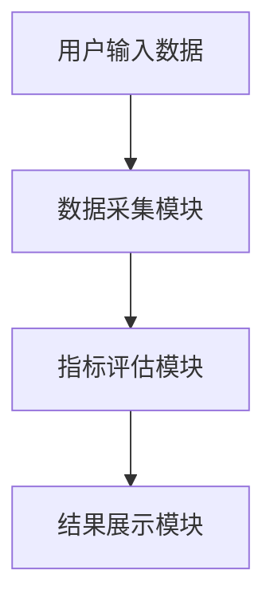
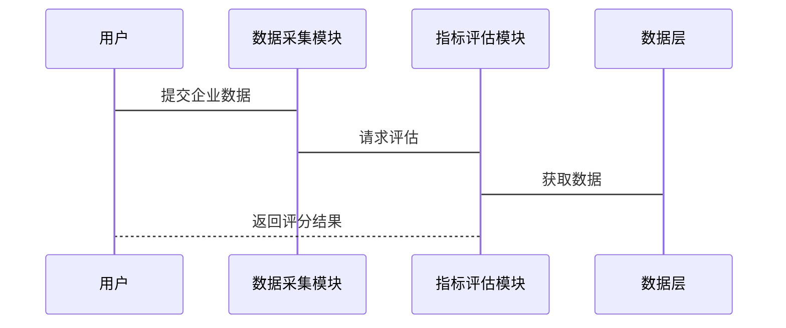

                 


# 特价股票投资中的企业数字责任评估因素考量

## 关键词：特价股票投资、企业数字责任、数字责任评估、算法原理、系统架构设计

## 摘要：在当前数字化转型的背景下，企业数字责任评估在特价股票投资中的重要性日益凸显。本文系统地探讨了数字责任评估的核心概念、算法原理、系统架构设计以及项目实战，通过详细的分析和案例，帮助投资者在特价股票投资中更好地评估和管理企业的数字责任。

---

## 第1章：特价股票投资的背景与现状

### 1.1 特价股票投资的基本概念

#### 1.1.1 特价股票的定义与特点
特价股票是指在特定市场条件下，因公司财务问题、市场波动或其他特殊原因导致股价大幅下跌的股票。其特点是价格低廉，但潜在风险较高，投资者需要对其数字责任进行全面评估。

#### 1.1.2 特价股票投资的背景
随着数字化转型的推进，企业的数字化能力直接影响其市场表现。投资者在选择特价股票时，需考虑企业是否具备良好的数字责任管理能力。

#### 1.1.3 特价股票投资的现状与趋势
当前，越来越多的投资者关注企业在数据隐私、技术合规等方面的表现，数字责任评估成为投资决策的重要因素。

### 1.2 企业数字责任评估的必要性

#### 1.2.1 数字化对企业的影响
企业数字化转型改变了其运营模式，数据隐私、技术安全等问题直接影响企业信用和市场表现。

#### 1.2.2 企业数字责任的核心概念
数字责任包括企业在数据管理、技术合规、社会责任等方面的表现，是投资者评估企业的重要指标。

#### 1.2.3 特价股票投资中的数字责任评估意义
在特价股票投资中，评估企业的数字责任有助于识别潜在风险，降低投资损失。

---

## 第2章：数字责任评估的核心概念

### 2.1 数字责任评估的基本原理

#### 2.1.1 数字责任的定义与属性
数字责任指企业在数字化过程中对数据隐私、技术安全、社会责任等方面应尽的义务和责任。

#### 2.1.2 数字责任评估的框架与模型
评估框架包括数据隐私、技术安全、社会责任三个维度，模型则综合考虑各维度的权重。

### 2.2 数字责任评估的关键因素

#### 2.2.1 数据隐私与合规性
企业的数据隐私管理能力直接影响其数字责任，需符合相关法律法规。

#### 2.2.2 技术风险与安全
技术漏洞可能导致数据泄露，影响企业信用和市场表现。

#### 2.2.3 企业社会责任与伦理
企业在社会责任方面的表现也是数字责任评估的重要因素，包括环保、员工权益等方面。

### 2.3 数字责任评估的指标体系

#### 2.3.1 指标选择的原则与方法
指标选择需考虑相关性、可操作性和全面性，采用定性与定量相结合的方法。

#### 2.3.2 指标权重的确定
采用层次分析法确定各指标权重，权重反映了各因素对企业数字责任的影响程度。

#### 2.3.3 指标评估的流程与工具
评估流程包括数据采集、指标计算、结果分析等，常用工具包括数据分析软件和评估模型。

### 2.4 数字责任评估的对比分析

#### 2.4.1 对比分析表
| 因素 | 定义 | 影响 | 评估方法 |
|------|------|------|----------|
| 数据隐私 | 数据管理的合规性 | 影响企业信用 | 符合性评估 |
| 技术安全 | 系统安全能力 | 影响市场表现 | 安全审计 |
| 社会责任 | 企业社会责任表现 | 影响投资者信任 | 问卷调查 |

#### 2.4.2 ER实体关系图
```mermaid
erd
    左右方向
    企业---数字责任评估因素
    数字责任评估因素<->数据隐私
    数字责任评估因素<->技术安全
    数字责任评估因素<->社会责任
```

---

## 第3章：数字责任评估的算法原理

### 3.1 数字责任评估模型的构建

#### 3.1.1 模型的输入与输出
输入：企业数字化相关数据；输出：数字责任评分。

#### 3.1.2 模型的训练与优化
采用机器学习算法，训练数据集以优化模型性能。

#### 3.1.3 模型的评估与验证
通过交叉验证评估模型的准确性和稳定性。

### 3.2 数字责任评估的数学模型

#### 3.2.1 数学模型的定义与公式
数字责任评分公式：
$$ DR = \sum_{i=1}^{n} w_i \times f_i $$
其中，$$ w_i $$ 为指标权重，$$ f_i $$ 为指标评分。

#### 3.2.2 数学模型的实现与应用
通过Python代码实现评分模型，应用于实际投资决策中。

#### 3.2.3 数学模型的优缺点分析
优点：计算简便，易于应用；缺点：指标权重可能受主观因素影响。

### 3.3 数字责任评估的算法实现

#### 3.3.1 算法的代码实现
```python
def calculate_drScore(data, weights):
    dr_score = 0
    for i in range(len(weights)):
        dr_score += data[i] * weights[i]
    return dr_score

# 示例
data = [80, 70, 60]
weights = [0.4, 0.3, 0.3]
print(calculate_drScore(data, weights))
```

#### 3.3.2 算法的运行流程
1. 数据采集与预处理；
2. 计算各指标评分；
3. 根据权重计算总评分；
4. 输出结果。

#### 3.3.3 算法的测试与验证
通过实际案例测试模型的准确性，调整权重以优化结果。

---

## 第4章：数字责任评估的系统架构设计

### 4.1 系统功能设计

#### 4.1.1 系统功能模块划分
- 数据采集模块；
- 指标评估模块；
- 结果展示模块。

#### 4.1.2 系统功能流程图


#### 4.1.3 系统功能的实现方式
采用模块化设计，各模块独立实现功能。

### 4.2 系统架构设计

#### 4.2.1 系统架构的组成与层次
- 数据层；
- 业务逻辑层；
- 用户界面层。

#### 4.2.2 系统架构的实现方式
采用分层架构，确保系统的可扩展性和维护性。

#### 4.2.3 系统架构的优缺点分析
优点：结构清晰，便于扩展；缺点：初期开发成本较高。

### 4.3 系统接口设计

#### 4.3.1 系统接口的定义与规范
- 输入接口：接收企业数据；
- 输出接口：返回数字责任评分。

#### 4.3.2 系统接口的实现方式
使用RESTful API实现，确保数据传输的安全性和高效性。

#### 4.3.3 系统接口的测试与验证
通过单元测试验证接口的正确性。

### 4.4 系统交互设计

#### 4.4.1 系统交互流程图


---

## 第5章：数字责任评估的项目实战

### 5.1 环境安装与配置

#### 5.1.1 开发环境安装
安装Python、数据处理工具和相关库。

#### 5.1.2 系统配置
配置数据源、权重参数等。

### 5.2 系统核心实现

#### 5.2.1 核心代码实现
```python
import pandas as pd

def main():
    data = pd.read_csv('input.csv')
    weights = [0.4, 0.3, 0.3]
    results = []
    for row in data.itertuples():
        dr_score = sum([row[i] * weights[i] for i in range(len(weights))])
        results.append(dr_score)
    results_df = pd.DataFrame({'企业': data['企业'], 'DR评分': results})
    results_df.to_csv('output.csv', index=False)

if __name__ == "__main__":
    main()
```

#### 5.2.2 代码功能解读
读取数据、计算评分、输出结果。

### 5.3 实际案例分析

#### 5.3.1 案例背景
某公司因数据泄露事件，股价大幅下跌，成为特价股票。

#### 5.3.2 案例分析
数据隐私评分低，影响数字责任评分，投资者需谨慎决策。

#### 5.3.3 案例总结
数字责任评估帮助企业识别潜在风险，辅助投资决策。

### 5.4 项目小结

通过项目实战，验证了数字责任评估模型的有效性，为投资者提供了可靠的决策依据。

---

## 第6章：数字责任评估的最佳实践

### 6.1 小结与总结

数字责任评估是特价股票投资的重要组成部分，帮助投资者降低风险，提高投资收益。

### 6.2 投资建议

投资者应综合考虑企业的数字责任评分，谨慎选择特价股票。

### 6.3 相关书籍与文章

推荐阅读《数据隐私与合规》、《企业数字转型》等书籍，深入理解数字责任评估的理论与实践。

### 6.4 注意事项

- 数据隐私风险需特别关注；
- 持续跟踪企业的数字责任表现；
- 避免过度依赖单一评估指标。

### 6.5 拓展阅读

深入学习数字责任评估的算法优化和系统设计，提升评估模型的准确性。

---

## 作者：AI天才研究院/AI Genius Institute & 禅与计算机程序设计艺术 /Zen And The Art of Computer Programming

---

这篇文章系统地探讨了特价股票投资中的企业数字责任评估因素，从背景分析、核心概念、算法原理到系统设计和项目实战，为投资者提供了全面的指导和实用的工具。通过深入分析和实际案例，帮助投资者在特价股票投资中更好地评估和管理企业的数字责任，降低投资风险，提高投资收益。

