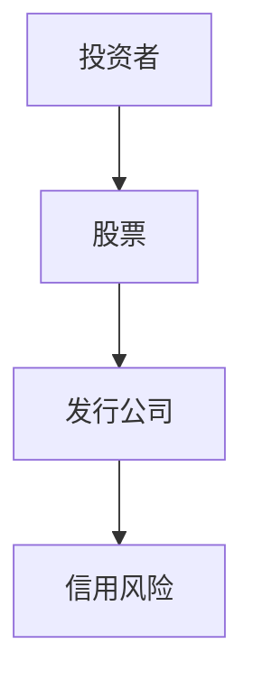
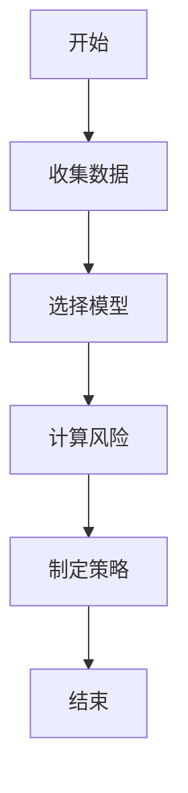
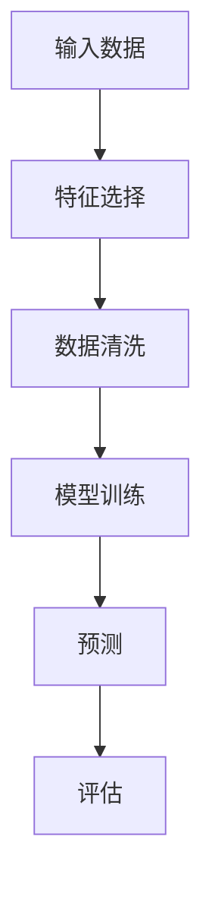

                 


# 特价股票投资中的信用风险评估方法

> 关键词：信用风险评估，特价股票，风险控制，投资策略，风险管理

> 摘要：本文深入探讨了在特价股票投资中如何有效评估和管理信用风险。通过分析信用风险的基本概念、评估方法和系统架构，结合实际案例，提供了从理论到实践的详细指导。

---

## 第一部分: 特价股票投资中的信用风险评估背景

### 第1章: 特价股票与信用风险概述

#### 1.1 特价股票的基本概念
特价股票通常指价格较低的股票，具有较高的波动性和潜在的高回报。然而，这类股票往往面临较高的信用风险，即发行人可能无法履行其财务承诺的风险。

##### 1.1.1 特价股票的定义与特点
- **定义**：特价股票是指价格低于市场平均水平的股票，通常在市场低迷或公司处于困境时出现。
- **特点**：价格波动大，流动性可能较低，风险较高，但潜在收益可能较大。

##### 1.1.2 特价股票的投资价值与风险
- **投资价值**：低价股票可能隐藏着被低估的公司，投资者有机会以较低成本获得潜在高回报。
- **风险**：公司财务状况不稳定，可能导致信用风险增加，影响投资收益。

#### 1.2 信用风险的基本概念
信用风险是指债权人可能无法按时偿还债务的风险，广泛存在于金融投资中。

##### 1.2.1 信用风险的定义与分类
- **定义**：信用风险是债务人或交易对手未能履行其合同义务的风险。
- **分类**：包括主权风险、企业风险、零售风险等，本文主要关注企业信用风险。

##### 1.2.2 信用风险在股票投资中的表现形式
- **违约风险**：公司无法偿还债券或股息的风险。
- **降级风险**：信用评级下降可能导致股价下跌。

##### 1.2.3 信用风险与市场风险的区别与联系
- **区别**：信用风险与发行人信用状况相关，而市场风险与整体市场波动相关。
- **联系**：两者相互影响，市场波动可能加剧信用风险。

#### 1.3 特价股票投资中的信用风险问题
##### 1.3.1 特价股票投资中的信用风险来源
- 公司财务状况恶化
- 行业风险或宏观经济因素
- 市场流动性不足

##### 1.3.2 信用风险对投资收益的影响
- 直接影响投资回报，如债券违约导致本金损失。
- 影响股票价格，信用评级下降可能导致股价下跌。

##### 1.3.3 信用风险评估的重要性与必要性
- 帮助投资者识别和避免高风险投资。
- 优化投资组合，降低整体风险。

---

## 第二部分: 信用风险评估的核心概念与联系

### 第2章: 信用风险评估的核心概念与联系

#### 2.1 信用风险评估的基本原理
信用风险评估旨在量化发行人违约的可能性和影响。

##### 2.1.1 信用评分模型的原理
信用评分模型通过历史数据和统计方法评估发行人的信用状况。

##### 2.1.2 违约概率的计算方法
违约概率（PD）是发行人违约的可能性，常用概率模型计算。

##### 2.1.3 信用风险的度量指标
- 违约概率（PD）
- 违约损失率（LGD）
- 非违约调整（EAD）

#### 2.2 核心概念的属性特征对比
##### 2.2.1 不同信用风险模型的对比分析
| 模型名称       | 输入变量       | 输出结果       |
|----------------|----------------|----------------|
| PD模型         | 财务指标、行业因素 | 违约概率         |
| LGD模型        | 财务指标、法律因素 | 损失率           |
| EAD模型        | 经济周期、行业因素 | 暴露风险         |

##### 2.2.2 各种信用风险评估方法的优缺点
- **优点**：PD模型简单直观，LGD模型考虑损失因素。
- **缺点**：模型复杂性高，数据要求严格。

##### 2.2.3 信用风险与资产质量的关系
资产质量差的公司更容易出现信用风险。

#### 2.3 实体关系图与流程图
##### 2.3.1 信用风险评估的ER实体关系图

##### 2.3.2 信用风险评估的流程图


---

## 第三部分: 信用风险评估的算法原理

### 第3章: 信用风险评估的算法原理

#### 3.1 常见信用风险评估算法
- **Logistic回归**
- **决策树**
- **随机森林**

#### 3.2 基于Logistic回归的信用风险评估模型
##### 3.2.1 算法流程图

##### 3.2.2 数学模型和公式
$$ P(Y=1|X) = \frac{e^{\beta_0 + \beta_1 X}}{1 + e^{\beta_0 + \beta_1 X}} $$
其中，$\beta_0$ 和 $\beta_1$ 是模型参数，通过最大似然估计确定。

##### 3.2.3 Python实现代码
```python
import pandas as pd
from sklearn.linear_model import LogisticRegression
from sklearn.metrics import accuracy_score

# 加载数据
data = pd.read_csv('credit_risk.csv')

# 分割特征和目标变量
X = data.drop('target', axis=1)
y = data['target']

# 模型训练
model = LogisticRegression()
model.fit(X, y)

# 预测
y_pred = model.predict(X)

# 评估
print(accuracy_score(y, y_pred))
```

---

## 第四部分: 系统分析与架构设计

### 第4章: 信用风险评估系统分析与架构设计

#### 4.1 系统分析
##### 4.1.1 问题场景介绍
投资者需要一个系统来评估特价股票的信用风险，优化投资决策。

#### 4.2 项目介绍
##### 4.2.1 系统功能设计
- 数据采集模块：收集公司财务数据和市场数据。
- 风险评估模块：应用算法评估信用风险。
- 报告生成模块：输出风险评估报告。

##### 4.2.2 系统架构设计


##### 4.2.3 系统接口设计
- API接口：提供数据输入和结果输出接口。
- 用户界面：简洁直观的交互界面。

##### 4.2.4 系统交互流程


---

## 第五部分: 项目实战

### 第5章: 信用风险评估系统项目实战

#### 5.1 环境安装
- 安装Python和必要的库：pandas、scikit-learn。

#### 5.2 系统核心实现
##### 5.2.1 数据预处理
```python
import pandas as pd
import numpy as np

# 加载数据
data = pd.read_csv('credit_risk.csv')

# 处理缺失值
data = data.dropna()

# 标准化数据
from sklearn.preprocessing import StandardScaler
scaler = StandardScaler()
X_scaled = scaler.fit_transform(data.drop('target', axis=1))
```

##### 5.2.2 模型训练
```python
from sklearn.linear_model import LogisticRegression

model = LogisticRegression()
model.fit(X_scaled, data['target'])
```

##### 5.2.3 结果分析
```python
from sklearn.metrics import classification_report

y_pred = model.predict(X_scaled)
print(classification_report(data['target'], y_pred))
```

#### 5.3 实际案例分析
通过具体案例展示如何应用系统进行信用风险评估，优化投资策略。

#### 5.4 项目总结
- 成功实现了信用风险评估系统。
- 提供了从数据处理到模型训练的完整流程。
- 为投资者提供了有力的决策支持工具。

---

## 第六部分: 最佳实践与拓展

### 第6章: 最佳实践与拓展阅读

#### 6.1 最佳实践 tips
- 定期更新模型和数据，保持评估的准确性。
- 结合市场动态调整风险评估策略。

#### 6.2 小结
信用风险评估是特价股票投资中的关键环节，通过科学的方法和系统支持，投资者可以有效降低风险，提高投资收益。

#### 6.3 注意事项
- 数据质量直接影响评估结果，需谨慎处理。
- 模型选择需根据具体情况，避免过度依赖单一方法。

#### 6.4 拓展阅读
推荐阅读相关书籍和文献，深入理解信用风险评估的理论和应用。

---

## 结语

通过本文的详细讲解，读者可以全面理解特价股票投资中的信用风险评估方法，并能够实际应用这些方法进行投资决策。希望本文能为投资者提供有价值的参考和指导。

---

## 作者信息

作者：AI天才研究院/AI Genius Institute & 禅与计算机程序设计艺术 /Zen And The Art of Computer Programming

--- 

如需进一步了解或合作，请访问：[AI Genius Institute](https://github.com/AI-Genius-Institute)

