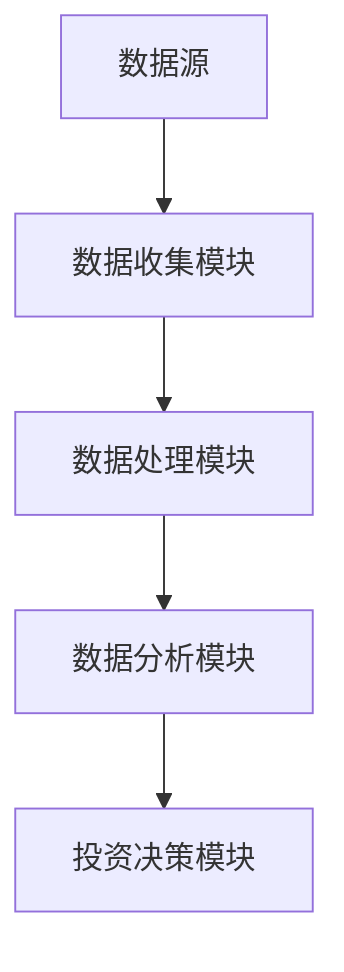

                 

# 特价股票投资中的全球产业链分析方法

> 关键词：特价股票，全球产业链，投资分析，系统架构，风险管理

> 摘要：本文探讨了在特价股票投资中如何利用全球产业链分析方法，通过系统化的方法论，从产业链的结构、驱动因素、风险等方面进行深入分析，结合实际案例和数学模型，为投资者提供科学的投资策略和决策支持。

---

# 第1章: 特价股票投资的背景与核心概念

## 1.1 特价股票的定义与特点

### 1.1.1 什么是特价股票
特价股票是指价格低于市场公允价值，具有较大投资潜力的股票。通常，这类股票可能因为市场波动、行业周期或公司特定因素而被低估。

### 1.1.2 特价股票的特点
- 价格低于内在价值
- 高股息率或潜在增长能力
- 行业地位稳固，但暂时被市场忽视

### 1.1.3 特价股票的投资价值
- 低估值带来较高的安全边际
- 潜在的上涨空间
- 抗风险能力强

## 1.2 全球产业链的基本概念

### 1.2.1 产业链的定义
产业链是指从原材料供应、生产加工、分销到最终消费者的完整链条。

### 1.2.2 产业链的分类与特点
- 上游：原材料供应
- 中游：生产加工
- 下游：分销与消费

### 1.2.3 全球化产业链的形成与发展
- 全球分工与合作
- 降低成本与提高效率

## 1.3 特价股票与全球产业链的关联

### 1.3.1 特价股票与产业链的关系
- 特价股票可能位于产业链的某个关键环节
- 产业链波动会影响特价股票的价值

### 1.3.2 产业链波动对特价股票的影响
- 市场需求变化
- 行业周期性
- 政策影响

### 1.3.3 特价股票在全球产业链中的地位
- 作为全球产业链的一部分，特价股票具有国际化特征

---

# 第2章: 全球产业链的结构与分析方法

## 2.1 全球产业链的构成

### 2.1.1 产业链的主要环节
- 原材料供应
- 生产加工
- 分销与消费

### 2.1.2 产业链的关键节点
- 核心技术和关键资源

### 2.1.3 产业链的上下游关系
- 上游依赖于下游
- 下游依赖于上游

## 2.2 产业链的分析维度

### 2.2.1 产业链的成本结构
- 原材料成本
- 生产成本
- 分销成本

### 2.2.2 产业链的竞争格局
- 市场集中度
- 主要竞争对手

### 2.2.3 产业链的风险因素
- 市场风险
- 政策风险
- 技术风险

## 2.3 产业链的驱动因素

### 2.3.1 技术进步对产业链的影响
- 技术创新降低成本
- 技术进步推动产业升级

### 2.3.2 政策变化对产业链的影响
- 政府政策支持
- 政策限制

### 2.3.3 市场需求对产业链的影响
- 消费者需求变化
- 市场趋势

---

# 第3章: 特价股票的筛选与投资策略

## 3.1 特价股票的筛选标准

### 3.1.1 基本面分析
- 盈利能力
- 财务健康状况
- 市盈率（P/E）和市净率（P/B）

### 3.1.2 技术面分析
- 股价趋势
- 成交量变化
- 技术指标（如MACD、RSI）

### 3.1.3 产业链位置分析
- 产业链中的核心环节
- 行业地位

## 3.2 特价股票的投资策略

### 3.2.1 产业链上下游的协同投资
- 投资产业链上下游相关股票
- 分散投资风险

### 3.2.2 风险分散的投资策略
- 分散投资于不同行业和地区的股票
- 通过组合投资降低风险

### 3.2.3 长期与短期结合的投资策略
- 长期投资低估股票
- 短期波段操作

## 3.3 特价股票的组合管理

### 3.3.1 组合构建的原则
- 分散投资
- 风险可控
- 长期收益最大化

### 3.3.2 组合调整策略
- 定期评估组合表现
- 根据市场变化调整持仓

---

# 第4章: 全球产业链分析系统的构建

## 4.1 系统功能设计

### 4.1.1 数据收集模块
- 采集股票价格、财务数据
- 获取行业和市场信息

### 4.1.2 数据处理模块
- 数据清洗
- 数据分析

### 4.1.3 数据分析模块
- 股票估值分析
- 产业链关联分析

## 4.2 系统架构设计

### 4.2.1 系统架构图

### 4.2.2 系统功能模块
- 数据采集
- 数据分析
- 投资决策

## 4.3 系统接口设计

### 4.3.1 数据接口
- API接口
- 数据库接口

### 4.3.2 用户接口
- �界面前端
- 后台管理

---

# 第5章: 特价股票投资的项目实战

## 5.1 项目背景与目标

### 5.1.1 项目背景
- 选择一个具体行业进行分析
- 确定投资目标

### 5.1.2 项目目标
- 找出行业中的特价股票
- 制定投资策略

## 5.2 项目实施步骤

### 5.2.1 数据收集
- 收集行业数据
- 收集股票数据

### 5.2.2 数据分析
- 产业链分析
- 股票筛选

### 5.2.3 投资策略制定
- 确定投资组合
- 制定买卖策略

## 5.3 实战案例分析

### 5.3.1 案例背景
- 某行业产业链分析
- 特价股票筛选

### 5.3.2 分析过程
- 产业链结构分析
- 股票筛选与评估

---

# 第6章: 风险管理与投资策略优化

## 6.1 风险管理的重要性

### 6.1.1 风险来源
- 市场风险
- 政策风险
- 信用风险

### 6.1.2 风险管理策略
- 风险分散
- 风险对冲

## 6.2 投资策略优化

### 6.2.1 动态调整策略
- 根据市场变化调整持仓
- 定期评估投资组合

### 6.2.2 风险控制措施
- 设置止损点
- 严格遵守投资纪律

---

# 第7章: 总结与展望

## 7.1 全文总结

### 7.1.1 核心观点回顾
- 特价股票的定义与特点
- 全球产业链的结构与分析方法
- 投资策略与风险管理

## 7.2 未来展望

### 7.2.1 技术进步对投资的影响
- AI技术的应用
- 数据分析的深入发展

### 7.2.2 产业链分析的未来发展
- 全球化趋势
- 行业整合

---

# 作者：AI天才研究院/AI Genius Institute & 禅与计算机程序设计艺术 /Zen And The Art of Computer Programming

