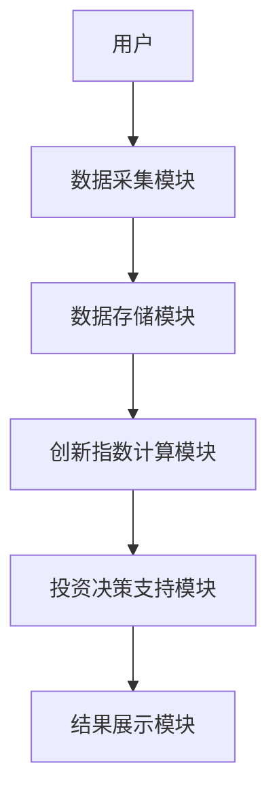
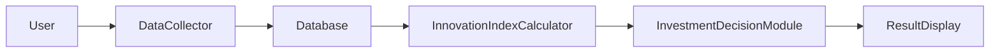

                 


# 特价股票投资中的全球创新指数分析方法

## 关键词：特价股票投资，全球创新指数，股票估值，创新指数分析，投资策略

## 摘要：本文探讨了如何利用全球创新指数分析方法来优化特价股票投资策略。通过介绍全球创新指数的核心概念、特价股票投资的基本原理，以及两者结合的分析方法，本文详细讲解了如何构建创新指数评分系统，并利用机器学习算法进行预测。同时，文章通过实战案例展示了如何设计和实现一个基于创新指数的股票投资系统，提供了从理论到实践的全面指导。

---

# 第一部分: 全球创新指数分析基础

## 第1章: 全球创新指数分析概述

### 1.1 全球创新指数的核心概念

#### 1.1.1 创新指数的定义与内涵
创新指数是衡量一个国家或企业在技术创新、研发投入、专利数量等方面表现的综合指标。它反映了创新活动的活跃程度和创新能力的强弱。

$$创新指数 = \sum_{i=1}^{n} w_i \cdot x_i$$

其中，$w_i$ 是指标 $x_i$ 的权重，$x_i$ 是各个指标的具体数值。

#### 1.1.2 创新指数的主要指标与数据来源
创新指数通常包括以下几个关键指标：
- 研发投入占GDP的比例
- 专利申请数量
- 高等教育机构的数量和质量
- 科技论文发表数量
- 创业活动的活跃程度

数据来源包括世界知识产权组织（WIPO）、世界银行、国际货币基金组织（IMF）等。

#### 1.1.3 创新指数的计算方法与模型
创新指数的计算通常采用加权平均的方法，根据各个指标的重要性分配不同的权重。例如，可以使用层次分析法（AHP）来确定各个指标的权重。

### 1.2 全球创新指数的分类与应用

#### 1.2.1 国家层面的创新指数分析
通过分析各国的创新指数，可以评估其技术创新能力，为制定科技政策提供依据。

#### 1.2.2 行业层面的创新指数评估
在特定行业（如科技、制药、信息技术等）内，创新指数可以用来评估企业的研发能力和市场竞争力。

#### 1.2.3 创新指数在投资决策中的应用
投资者可以通过分析创新指数，选择具有较高创新能力的企业进行投资，从而获得超额收益。

---

## 第2章: 特价股票投资的基本概念

### 2.1 特价股票的定义与特点

#### 2.1.1 什么是特价股票
特价股票通常指的是价格低于其内在价值的股票，具有较高的投资潜力。

#### 2.1.2 特价股票的投资策略
价值投资策略强调购买被市场低估的股票，长期持有，等待其价值回归。

#### 2.1.3 特价股票市场的特点与风险
特价股票市场波动较大，风险较高，但潜在收益也较高。投资者需要具备较强的风险承受能力和市场分析能力。

### 2.2 特价股票投资的核心原则

#### 2.2.1 价值投资的基本理念
价值投资强调购买低于内在价值的股票，注重企业的基本面分析。

#### 2.2.2 股票估值的主要方法
常用的股票估值方法包括市盈率（P/E）、市净率（P/B）、股息率等。

#### 2.2.3 投资组合的优化与风险管理
通过分散投资、风险评估等方法，优化投资组合，降低整体风险。

---

# 第二部分: 全球创新指数与股票投资的结合

## 第3章: 创新指数在股票投资中的应用

### 3.1 创新指数与股票价值的关系

#### 3.1.1 创新能力对股价的影响
企业的创新能力直接影响其市场竞争力和盈利能力，进而影响股价。

#### 3.1.2 创新指数与公司估值的关联
创新能力强的公司通常具有更高的估值，因为其未来增长潜力更大。

#### 3.1.3 创新指数在行业比较中的作用
通过比较不同行业内的创新指数，可以找到具有竞争优势的行业和企业。

### 3.2 基于创新指数的选股策略

#### 3.2.1 如何利用创新指数筛选投资标的
投资者可以通过分析企业的创新指数，筛选出具有较高创新能力的公司。

#### 3.2.2 创新指数在投资组合中的权重分配
根据企业的创新指数，合理分配投资组合中各公司的权重。

#### 3.2.3 创新指数与市场周期的结合
结合市场周期和创新指数，制定动态的投资策略。

---

## 第4章: 创新指数分析的数学模型与算法

### 4.1 创新指数评分系统构建

#### 4.1.1 指数评分模型的构建
通过加权平均的方法，构建创新指数评分模型。

$$创新指数评分 = \sum_{i=1}^{n} w_i \cdot x_i$$

#### 4.1.2 指数评分的权重分配
根据各个指标的重要性，分配不同的权重。

#### 4.1.3 指数评分的验证与优化
通过历史数据验证模型的准确性，并进行优化。

### 4.2 基于机器学习的创新指数预测

#### 4.2.1 机器学习在创新指数预测中的应用
使用机器学习算法（如随机森林、神经网络）进行创新指数预测。

#### 4.2.2 常用算法的实现
以随机森林为例，实现创新指数的预测。

```python
from sklearn.ensemble import RandomForestRegressor
import pandas as pd
import numpy as np

# 数据预处理
data = pd.read_csv('data.csv')
X = data.drop('target', axis=1)
y = data['target']

# 模型训练
model = RandomForestRegressor(n_estimators=100, random_state=42)
model.fit(X, y)

# 预测
new_data = pd.read_csv('new_data.csv')
predicted = model.predict(new_data)
```

#### 4.2.3 模型的训练与评估
通过交叉验证等方法，评估模型的性能。

---

## 第5章: 特价股票投资中的创新指数分析系统架构

### 5.1 系统功能设计

#### 5.1.1 数据采集模块
负责采集全球创新指数相关的数据，包括专利、研发投入等。

#### 5.1.2 指数计算模块
计算创新指数评分，评估企业的创新能力。

#### 5.1.3 投资决策支持模块
基于创新指数评分，提供投资建议和决策支持。

### 5.2 系统架构设计

#### 5.2.1 系统整体架构图


#### 5.2.2 数据流图


#### 5.2.3 模块交互图


---

## 第6章: 项目实战——基于创新指数的特价股票投资系统实现

### 6.1 环境搭建与数据准备

#### 6.1.1 开发环境的安装与配置
安装Python、Pandas、Scikit-learn等工具。

#### 6.1.2 数据来源与数据预处理
数据来源包括公开的专利数据、公司财务数据等。

#### 6.1.3 数据存储与管理
使用数据库存储数据，方便后续处理。

### 6.2 核心算法实现

#### 6.2.1 创新指数计算的Python代码实现
```python
import pandas as pd
import numpy as np

data = pd.read_csv('data.csv')
features = data[['R&D', 'Patents', 'Education']]
target = data['Innovation_Index']

# 标准化处理
from sklearn.preprocessing import StandardScaler
scaler = StandardScaler()
features_scaled = scaler.fit_transform(features)

# 构建创新指数模型
from sklearn.linear_model import LinearRegression
model = LinearRegression()
model.fit(features_scaled, target)
```

#### 6.2.2 机器学习模型的训练与预测
```python
from sklearn.ensemble import RandomForestRegressor
model = RandomForestRegressor(n_estimators=100, random_state=42)
model.fit(features_scaled, target)
predicted = model.predict(new_features_scaled)
```

### 6.3 系统功能实现与测试

#### 6.3.1 系统功能模块的实现
实现数据采集、创新指数计算、投资决策支持等功能。

#### 6.3.2 系统测试
通过历史数据验证系统的准确性和稳定性。

#### 6.3.3 系统优化
根据测试结果，优化系统性能和用户体验。

---

# 第三部分: 总结与展望

## 第7章: 总结与最佳实践

### 7.1 最佳实践
- 定期更新数据，保持模型的准确性。
- 结合市场趋势，动态调整投资策略。

### 7.2 小结
通过创新指数分析，投资者可以更科学地选择特价股票，提高投资收益。

### 7.3 注意事项
- 创新指数只是投资决策的一个因素，需结合其他指标综合分析。
- 市场波动较大时，需谨慎操作，避免过度依赖模型。

### 7.4 拓展阅读
- 《投资学》
- 《机器学习实战》

---

作者：AI天才研究院/AI Genius Institute & 禅与计算机程序设计艺术 /Zen And The Art of Computer Programming

