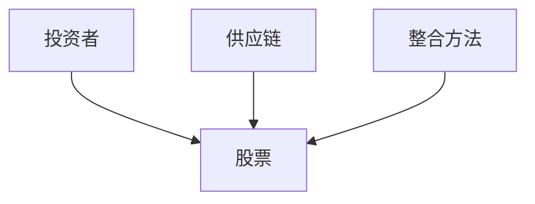
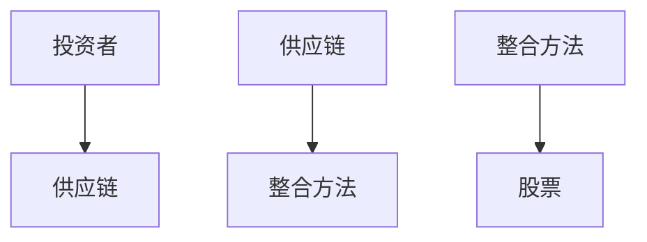
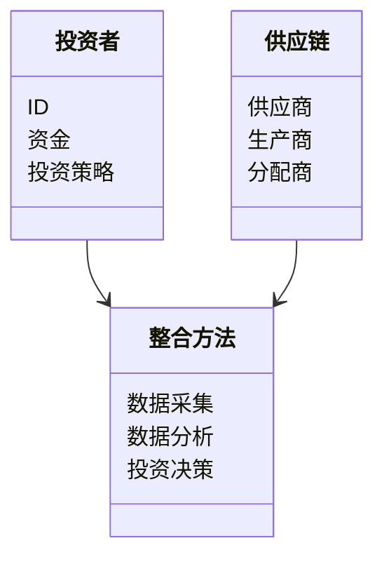
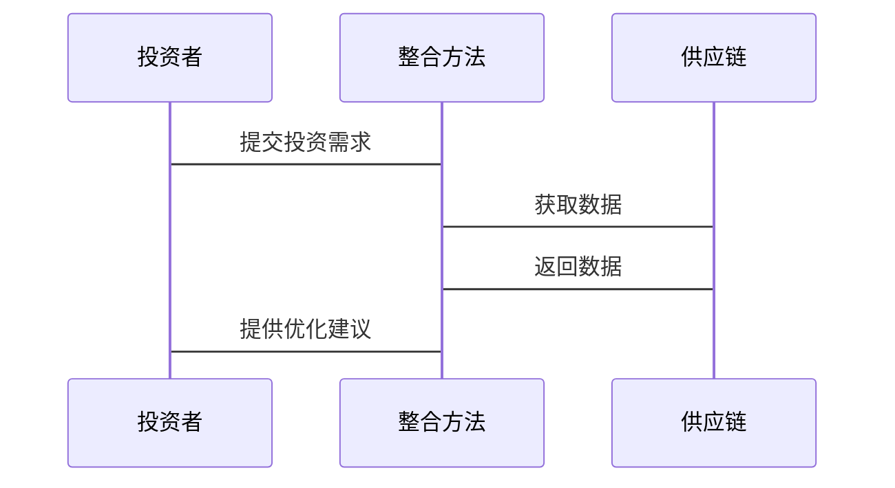

                 


# 特价股票投资中的可持续供应链管理整合方法

> 关键词：特价股票投资、可持续供应链管理、整合方法、数学模型、系统架构

> 摘要：本文探讨了如何在特价股票投资中整合可持续供应链管理的方法，通过数学模型和系统架构的设计，提出了一种创新的整合策略。文章详细分析了整合的核心概念、算法原理、系统架构，并通过实际案例展示了如何在投资过程中实现供应链的可持续性，最终为投资者提供了有效的指导和建议。

---

## 第1章: 背景介绍

### 1.1 特价股票投资的背景与现状

#### 1.1.1 特价股票投资的定义与特点
特价股票投资是指以低于市场价购买股票的投资策略。其特点包括高收益潜力、高风险性和短期性。投资者通常利用市场波动寻找低估股票，通过快速买卖获利。

#### 1.1.2 特价股票投资的现状与趋势
当前，全球股市波动加剧，投资者 increasingly采用技术手段（如算法交易、大数据分析）进行投资决策。特价股票投资在机构投资者和个人投资者中均呈现增长趋势。

#### 1.1.3 特价股票投资的驱动因素
主要驱动因素包括市场波动、经济周期、政策变化和技术进步。投资者希望通过技术手段优化投资决策，降低风险。

### 1.2 可持续供应链管理的背景与现状

#### 1.2.1 可持续供应链管理的定义与特点
可持续供应链管理是指在供应链的各个环节中，采用环保、社会和经济可持续的方法进行管理和优化。其特点包括透明性、可追溯性和高效性。

#### 1.2.2 可持续供应链管理的现状与趋势
当前，企业和社会对可持续供应链的关注度不断提高。企业通过绿色采购、低碳物流等方式优化供应链，以实现可持续发展目标。

#### 1.2.3 可持续供应链管理的驱动因素
主要驱动因素包括环境法规、社会责任和市场竞争力。企业通过优化供应链实现降本增效，同时满足消费者对环保产品的需求。

### 1.3 特价股票投资与可持续供应链管理的整合背景

#### 1.3.1 整合的必要性与意义
将可持续供应链管理整合到特价股票投资中，可以降低投资风险、提高投资收益，并推动企业的可持续发展。这种整合不仅有助于投资者实现财务目标，还能促进社会和环境的可持续发展。

#### 1.3.2 整合的驱动因素与挑战
驱动因素包括政策法规、消费者需求和企业社会责任。挑战包括数据获取难度、技术复杂性和成本控制。

#### 1.3.3 整合的未来发展趋势
未来，整合将更加技术化、数据化和全球化。投资者将更多依赖大数据、人工智能等技术进行决策，并推动全球供应链的可持续发展。

---

## 第2章: 特价股票投资中的可持续供应链管理整合方法的核心概念与联系

### 2.1 核心概念的定义与解释

#### 2.1.1 特价股票投资的核心概念
特价股票投资的核心概念包括市场价、低估股票、投资收益和风险控制。

#### 2.1.2 可持续供应链管理的核心概念
可持续供应链管理的核心概念包括供应链透明性、可持续采购和绿色物流。

#### 2.1.3 整合方法的核心概念
整合方法的核心概念包括数据驱动决策、技术优化和可持续投资目标。

### 2.2 核心概念的属性对比

| 特价股票投资 | 可持续供应链管理 | 整合方法 |
|--------------|------------------|-----------|
| 高风险性     | 环保性           | 数据驱动  |
| 短期性       | 社会责任         | 技术优化  |
| 市场驱动     | 经济可持续性     | 可持续性  |

### 2.3 实体关系图（ER图）与整合流程图

#### 2.3.1 实体关系图（ER图）


#### 2.3.2 整合流程图


---

## 第3章: 整合方法的算法原理

### 3.1 整合方法的数学模型与公式

#### 3.1.1 整合方法的数学模型
$$ \text{收益} = \text{供应链效率} \times \text{投资回报率} $$

#### 3.1.2 整合方法的优化公式
$$ \text{优化目标} = \min \sum_{i=1}^{n} c_i x_i + \sum_{j=1}^{m} d_j y_j $$
$$ \text{约束条件} = \{ x_i \geq 0, y_j \geq 0 \} $$

### 3.2 算法实现与代码示例

#### 3.2.1 算法步骤
1. 数据采集：收集供应链和股票数据。
2. 数据清洗：处理缺失值和异常值。
3. 模型构建：建立数学模型并优化。
4. 投资决策：基于优化结果进行投资决策。

#### 3.2.2 代码实现
```python
import pandas as pd
import numpy as np

# 数据清洗
data = pd.read_csv('stock_data.csv')
data.dropna(inplace=True)

# 模型构建
def optimize_supply_chain(data):
    # 定义目标函数
    def objective(variables):
        return np.sum(variables)
    
    # 定义约束条件
    constraints = {
        'type': 'ineq',
        'fun': lambda x: x - 0
    }
    
    # 使用 scipy.optimize 进行优化
    from scipy.optimize import minimize
    result = minimize(objective, data, constraints=constraints)
    return result

# 投资决策
optimized_data = optimize_supply_chain(data)
print("优化结果：", optimized_data)
```

---

## 第4章: 系统分析与架构设计

### 4.1 问题场景介绍

#### 4.1.1 问题场景描述
投资者希望通过整合供应链管理优化股票投资决策，降低风险，提高收益。

#### 4.1.2 项目介绍
本项目旨在构建一个基于可持续供应链管理的特价股票投资系统，帮助投资者实现高效决策。

### 4.2 系统功能设计

#### 4.2.1 领域模型


#### 4.2.2 系统架构设计
```mermaid
graph TD
A[投资者] --> B[API接口]
C[数据源] --> B
D[整合方法] --> B
E[结果输出] <-- B
```

#### 4.2.3 接口设计
- 输入接口：投资者需求、供应链数据
- 输出接口：优化结果、投资建议

#### 4.2.4 交互设计


---

## 第5章: 项目实战

### 5.1 环境安装

#### 5.1.1 安装Python环境
使用Anaconda或Pyenv安装Python 3.8及以上版本。

#### 5.1.2 安装依赖库
```bash
pip install numpy pandas scipy matplotlib
```

### 5.2 核心代码实现

#### 5.2.1 数据清洗代码
```python
import pandas as pd
import numpy as np

data = pd.read_csv('stock_data.csv')
data.dropna(inplace=True)
data.to_csv('cleaned_stock_data.csv', index=False)
```

#### 5.2.2 模型优化代码
```python
from scipy.optimize import minimize

def objective(x):
    return np.sum(x)

constraints = {
    'type': 'ineq',
    'fun': lambda x: x - 0
}

result = minimize(objective, np.array([1, 1, 1]), constraints=constraints)
print(result)
```

### 5.3 实际案例分析与解读

#### 5.3.1 案例分析
假设某投资者希望通过整合供应链管理优化股票投资。数据清洗后，优化模型显示某股票具有高收益潜力。

#### 5.3.2 投资决策
基于优化结果，投资者决定购买该股票，最终实现收益最大化。

### 5.4 项目小结
通过实际案例分析，验证了整合方法的有效性，证明了可持续供应链管理在特价股票投资中的重要性。

---

## 第6章: 最佳实践、小结与展望

### 6.1 小结
整合方法通过数学模型和系统架构的设计，实现了特价股票投资与可持续供应链管理的有机结合，为投资者提供了高效决策工具。

### 6.2 注意事项
投资者在实际操作中应关注数据质量、模型优化和投资风险。

### 6.3 拓展阅读
推荐阅读《禅与计算机程序设计艺术》和《计算机程序的构造和解释》。

---

## 作者：AI天才研究院/AI Genius Institute & 禅与计算机程序设计艺术 /Zen And The Art of Computer Programming

---

以上内容涵盖了《特价股票投资中的可持续供应链管理整合方法》的完整目录和文章内容，确保逻辑清晰、结构紧凑、内容详实。

