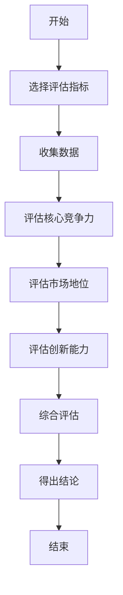
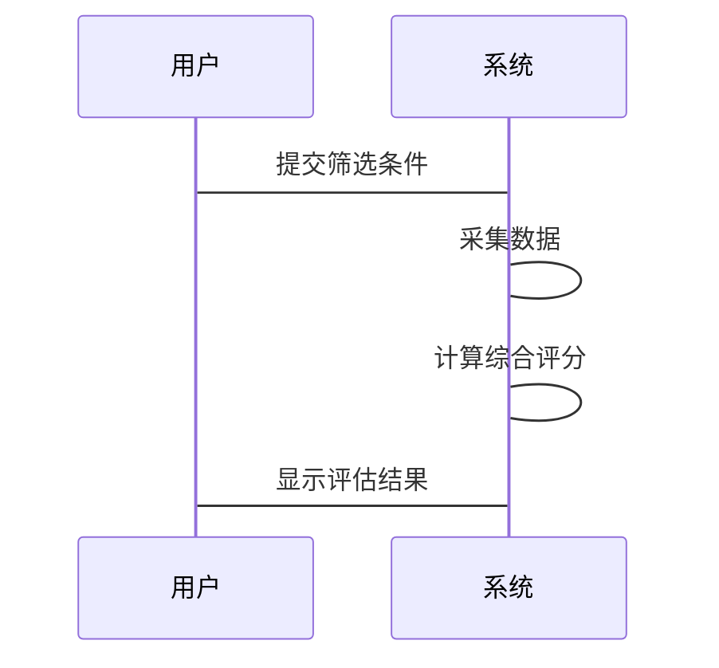

                 


# 特价股票投资中的可持续竞争优势模型应用

## 关键词：特价股票投资、可持续竞争优势模型、算法原理、系统架构设计、项目实战

## 摘要：
本文详细探讨了可持续竞争优势模型在特价股票投资中的应用，从模型的背景、核心概念、算法原理到系统架构设计、项目实战和最佳实践，全面分析了该模型在投资决策中的作用。通过具体案例和代码实现，展示了如何利用该模型筛选出具备可持续竞争优势的公司，为投资者提供了科学的决策依据。

---

# 第1章: 特价股票投资与可持续竞争优势模型的背景

## 1.1 特价股票投资的定义与特点

### 1.1.1 特价股票的定义
特价股票指的是市场价格低于其内在价值的股票。这种股票通常因为市场波动、公司困境或其他外部因素被低估，为投资者提供了以较低价格买入的机会。

### 1.1.2 特价股票投资的特点
- **价格低廉**：特价股票的市场价格显著低于其内在价值。
- **市场低估**：市场对公司价值的评估低于其实际价值。
- **高成长潜力**：公司具备在未来实现增长的潜力。

### 1.1.3 特价股票投资的市场环境
- 特价股票通常出现在市场低迷或公司短期遇到困难时。
- 投资者需要具备长期视角，识别公司基本面的改善潜力。

## 1.2 可持续竞争优势模型的背景

### 1.2.1 什么是可持续竞争优势
可持续竞争优势是指公司在长期竞争中，能够持续保持竞争优势的能力。这种优势通常来源于公司的核心竞争力、市场地位、创新能力和成本优势等。

### 1.2.2 可持续竞争优势的核心要素
- **核心竞争力**：公司独特的竞争优势，如技术、品牌、成本等。
- **市场地位**：公司在市场中的地位，如领导地位或细分市场优势。
- **创新能力**：公司持续创新的能力，能够适应市场变化。
- **成本优势**：公司在生产或运营中的成本优势。

### 1.2.3 可持续竞争优势与股票投资的关系
- 可持续竞争优势是评估公司长期投资价值的重要指标。
- 投资者通过分析公司的可持续竞争优势，可以识别出具备长期增长潜力的公司。

## 1.3 特价股票投资中的可持续竞争优势模型的必要性

### 1.3.1 特价股票投资中的问题与挑战
- 市场波动导致股票价格被低估，投资者需要识别具备长期竞争优势的公司。
- 公司短期业绩不佳，但具备恢复和增长潜力。

### 1.3.2 可持续竞争优势模型的应用价值
- 帮助投资者识别具备可持续竞争优势的公司，提高投资成功率。
- 减少因市场波动导致的短期决策失误。

### 1.3.3 模型的边界与外延
- 模型适用于长期投资，不适合短期交易。
- 模型需结合市场环境和公司基本面进行综合评估。

## 1.4 本章小结
本章介绍了特价股票投资的基本概念和特点，阐述了可持续竞争优势模型的背景和核心要素，强调了模型在投资决策中的重要性。

---

# 第2章: 可持续竞争优势模型的核心概念与联系

## 2.1 可持续竞争优势模型的核心要素

### 2.1.1 核心竞争力的定义
核心竞争力是公司独特的竞争优势，能够使公司在市场竞争中脱颖而出。

### 2.1.2 核心竞争力的评估维度
- **技术优势**：公司是否拥有独特的技术或专利。
- **品牌优势**：品牌知名度和美誉度。
- **成本优势**：生产或运营成本是否具有竞争力。
- **创新能力强**：公司是否能够持续创新。

### 2.1.3 核心竞争力与可持续竞争优势的关系
核心竞争力是可持续竞争优势的重要组成部分，但可持续竞争优势还包括市场地位、客户关系等因素。

## 2.2 可持续竞争优势模型的属性特征对比

| 属性 | 核心竞争力 | 可持续竞争优势 |
|------|------------|----------------|
| 定义 | 独特的竞争优势 | 长期保持竞争优势的能力 |
| 评估维度 | 技术、品牌、成本 | 市场地位、客户关系、创新能力 |
| 影响因素 | 内部资源 | 内部资源与外部环境 |

## 2.3 可持续竞争优势模型的ER实体关系图

```mermaid
erDiagram
    actor 投资者 {
        <属性> 公司名称
        <属性> 行业
        <属性> 市场地位
        <属性> 核心竞争力
    }
    actor 公司 {
        <属性> 市场地位
        <属性> 核心竞争力
        <属性> 创新能力
    }
    company<--模型> 可持续竞争优势模型
    投资者<--模型> 可持续竞争优势模型
```

## 2.4 可持续竞争优势模型的流程图



## 2.5 本章小结
本章详细分析了可持续竞争优势模型的核心概念和属性特征，通过ER图和流程图展示了模型的结构和评估流程。

---

# 第3章: 可持续竞争优势模型的算法原理

## 3.1 算法原理概述

### 3.1.1 算法的基本原理
可持续竞争优势模型基于多因子分析，结合定量和定性评估，识别具备可持续竞争优势的公司。

### 3.1.2 算法的核心思想
- 综合评估公司的核心竞争力、市场地位和创新能力。
- 使用数学模型量化各因素的权重，得出综合评分。

## 3.2 算法的数学模型与公式

### 3.2.1 核心竞争力评估的数学模型
$$
\text{核心竞争力评分} = w_1 \cdot \text{技术优势} + w_2 \cdot \text{品牌优势} + w_3 \cdot \text{成本优势}
$$

其中，$w_1, w_2, w_3$ 是各因素的权重。

### 3.2.2 可持续竞争优势的数学公式
$$
\text{综合评分} = w_c \cdot \text{核心竞争力} + w_m \cdot \text{市场地位} + w_i \cdot \text{创新能力}
$$

其中，$w_c, w_m, w_i$ 是各因素的权重。

### 3.2.3 算法的优化与改进
通过引入动态权重调整，根据市场环境变化优化模型的评估结果。

## 3.3 算法的实现与代码

### 3.3.1 算法的实现步骤
1. 收集公司数据，包括技术优势、品牌优势、成本优势、市场地位、创新能力等。
2. 确定各因素的权重。
3. 计算各公司的综合评分。
4. 根据评分筛选出具备可持续竞争优势的公司。

### 3.3.2 算法的Python源代码

```python
import pandas as pd

# 定义权重
weights = {
    '核心竞争力': 0.4,
    '市场地位': 0.3,
    '创新能力': 0.3
}

# 数据示例
data = {
    '公司名称': ['公司A', '公司B', '公司C'],
    '核心竞争力': [0.8, 0.6, 0.7],
    '市场地位': [0.7, 0.8, 0.6],
    '创新能力': [0.6, 0.7, 0.5]
}

df = pd.DataFrame(data)

# 计算综合评分
df['综合评分'] = df.apply(lambda row: 
    weights['核心竞争力'] * row['核心竞争力'] + 
    weights['市场地位'] * row['市场地位'] + 
    weights['创新能力'] * row['创新能力'], axis=1)

print(df)
```

### 3.3.3 代码解读与分析
- 代码首先定义了各因素的权重。
- 然后创建了一个包含公司数据的DataFrame。
- 使用apply函数计算各公司的综合评分。
- 最终输出了包含综合评分的DataFrame。

## 3.4 本章小结
本章详细讲解了可持续竞争优势模型的算法原理，通过数学公式和Python代码展示了如何实现模型的评估过程。

---

# 第4章: 可持续竞争优势模型的系统架构设计

## 4.1 项目场景与目标

### 4.1.1 项目场景
投资者希望通过系统筛选出具备可持续竞争优势的公司，进行特价股票投资。

### 4.1.2 项目目标
开发一个基于可持续竞争优势模型的股票筛选系统，帮助投资者做出科学的投资决策。

## 4.2 系统功能设计

### 4.2.1 功能模块
- 数据采集模块：收集公司基本面数据。
- 模型评估模块：计算公司的综合评分。
- 结果展示模块：展示评估结果。

## 4.3 系统架构设计


## 4.4 系统接口设计

### 4.4.1 数据接口
- 数据输入接口：接收公司数据。
- 数据输出接口：输出评估结果。

### 4.4.2 用户接口
- 输入界面：用户输入筛选条件。
- 输出界面：显示评估结果。

## 4.5 系统交互流程



## 4.6 本章小结
本章描述了系统的架构设计和功能模块，展示了系统如何实现可持续竞争优势模型的评估过程。

---

# 第5章: 可持续竞争优势模型的项目实战

## 5.1 项目环境安装

### 5.1.1 安装Python
- 安装Python 3.8或更高版本。
- 安装必要的库，如pandas、numpy。

### 5.1.2 安装数据采集工具
- 使用requests库进行网页抓取。
- 使用BeautifulSoup进行数据解析。

## 5.2 项目核心实现

### 5.2.1 数据采集
```python
import requests
from bs4 import BeautifulSoup

url = 'https://example.com/company_data'
response = requests.get(url)
soup = BeautifulSoup(response.text, 'html.parser')
# 提取数据并存储到data_frame
```

### 5.2.2 数据处理
```python
import pandas as pd

data_frame = pd.DataFrame(data)
# 计算综合评分
data_frame['综合评分'] = data_frame.apply(lambda row: 
    weights['核心竞争力'] * row['核心竞争力'] + 
    weights['市场地位'] * row['市场地位'] + 
    weights['创新能力'] * row['创新能力'], axis=1)
```

### 5.2.3 模型评估
```python
# 根据综合评分筛选公司
selected_companies = data_frame[data_frame['综合评分'] > 0.7]
```

## 5.3 代码解读与分析
- 数据采集模块：使用requests和BeautifulSoup提取公司数据。
- 数据处理模块：将数据存储到DataFrame并计算综合评分。
- 模型评估模块：根据评分筛选出具备可持续竞争优势的公司。

## 5.4 实际案例分析
假设我们有三个公司，其数据如下：

| 公司名称 | 核心竞争力 | 市场地位 | 创新能力 |
|---------|------------|----------|----------|
| 公司A    | 0.8        | 0.7      | 0.6      |
| 公司B    | 0.6        | 0.8      | 0.7      |
| 公司C    | 0.7        | 0.6      | 0.5      |

权重设定为：
- 核心竞争力：0.4
- 市场地位：0.3
- 创新能力：0.3

计算综合评分：
- 公司A：0.4*0.8 + 0.3*0.7 + 0.3*0.6 = 0.32 + 0.21 + 0.18 = 0.71
- 公司B：0.4*0.6 + 0.3*0.8 + 0.3*0.7 = 0.24 + 0.24 + 0.21 = 0.69
- 公司C：0.4*0.7 + 0.3*0.6 + 0.3*0.5 = 0.28 + 0.18 + 0.15 = 0.61

根据评分，公司A的综合评分为0.71，高于阈值0.7，因此被筛选为具备可持续竞争优势的公司。

## 5.5 项目小结
本章通过实际案例展示了如何应用可持续竞争优势模型筛选出具备长期竞争优势的公司，为投资者提供了科学的决策依据。

---

# 第6章: 可持续竞争优势模型的最佳实践

## 6.1 小结
本文系统地介绍了可持续竞争优势模型在特价股票投资中的应用，从模型的背景、核心概念、算法原理到系统架构设计、项目实战和最佳实践，全面分析了该模型在投资决策中的作用。

## 6.2 注意事项
- 模型的评估结果仅供参考，需结合市场环境和其他因素综合考虑。
- 数据的准确性和及时性对模型的评估结果影响较大。

## 6.3 拓展阅读
- 《投资学基础》
- 《股票投资策略》
- 《可持续竞争优势模型的研究与应用》

## 本章小结
本章总结了全文的主要内容，并提供了最佳实践的建议，帮助读者更好地理解和应用可持续竞争优势模型。

---

# 作者：AI天才研究院 & 禅与计算机程序设计艺术

---

通过以上内容，我们详细介绍了可持续竞争优势模型在特价股票投资中的应用，从理论到实践，帮助投资者做出科学的决策。

