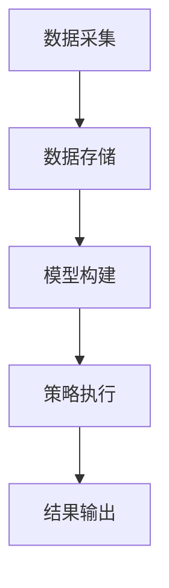

                 


# 特价股票投资中的周期性行业轮动策略研究

> 关键词：特价股票，周期性行业，轮动策略，投资分析，数学模型

> 摘要：本文系统地探讨了特价股票投资中的周期性行业轮动策略，分析了周期性行业的特点及其在投资中的应用，构建了基于数学模型的行业轮动策略，并通过实际案例分析验证了策略的有效性。文章还提供了系统的架构设计和项目实战指导，为投资者提供了科学的投资决策支持。

---

# 第1章: 特价股票投资的背景与概念

## 1.1 特价股票的定义与特点

### 1.1.1 特价股票的定义
特价股票是指以低于面值的价格发行的股票。这种股票通常在公司面临财务困境或市场环境不佳时发行，旨在吸引投资者以较低价格购买，从而为公司提供资金支持。特价股票的特点包括高风险、高回报以及较低的市场流动性。

### 1.1.2 特价股票的特点
- **高风险**：由于发行价格低于面值，特价股票的市场风险较高。
- **高回报**：在市场好转或公司扭亏为盈时，特价股票的股价可能迅速上涨，带来高额回报。
- **低流动性**：由于特价股票的交易量通常较低，市场流动性较差。

### 1.1.3 特价股票的投资价值分析
投资者在考虑投资特价股票时，需要关注公司的基本面、行业地位以及市场环境。特价股票在特定市场条件下可能成为高回报的投资机会，但需要谨慎评估风险。

## 1.2 周期性行业的定义与分类

### 1.2.1 周期性行业的定义
周期性行业是指其业绩表现与经济周期密切相关的行业。在经济繁荣时期，周期性行业的业绩通常较好；而在经济衰退时期，其业绩则可能大幅下滑。

### 1.2.2 周期性行业的分类
周期性行业可以分为以下几类：
1. **强周期性行业**：如能源、材料、工业等行业的公司业绩波动较大，与经济周期高度相关。
2. **弱周期性行业**：如公用事业、医疗保健等行业的业绩波动较小，受经济周期影响较弱。
3. **防御性行业**：如消费品、金融等行业的业绩相对稳定，通常在经济衰退时表现较好。

### 1.2.3 周期性行业的经济影响
周期性行业的波动性对整体市场有重要影响。投资者需要根据经济周期的变化，合理配置周期性行业的投资比例。

---

# 第2章: 周期性行业轮动策略的基本原理

## 2.1 行业轮动的概念

### 2.1.1 行业轮动的定义
行业轮动是指根据市场环境的变化，动态调整投资组合中各行业权重的过程。行业轮动的核心在于识别经济周期的变化，并据此选择表现较好的行业进行投资。

### 2.1.2 行业轮动的机制
行业轮动的机制包括以下几个步骤：
1. **识别经济周期的变化**：通过宏观经济指标（如GDP增长率、 unemployment rate等）判断当前经济所处的周期阶段。
2. **选择表现较好的行业**：根据经济周期的变化，选择在当前周期阶段表现较好的行业进行投资。
3. **动态调整投资组合**：定期评估市场环境的变化，并根据新的市场环境调整投资组合中各行业的权重。

### 2.1.3 行业轮动的经济意义
行业轮动策略可以帮助投资者在不同经济周期中捕捉行业收益，降低投资风险。通过动态调整投资组合，投资者可以在市场环境变化时及时应对，提高投资收益。

## 2.2 行业轮动策略的核心要素

### 2.2.1 行业轮动的驱动因素
行业轮动的驱动因素包括宏观经济指标、行业基本面、市场情绪等。投资者需要综合考虑这些因素，制定合理的行业轮动策略。

### 2.2.2 行业轮动的周期性分析
周期性分析是行业轮动策略的核心。投资者需要根据经济周期的变化，选择在当前周期阶段表现较好的行业进行投资。

### 2.2.3 行业轮动的市场环境影响
市场环境的变化对行业轮动策略有重要影响。投资者需要根据市场环境的变化，及时调整投资策略，以应对市场波动。

---

# 第3章: 周期性行业轮动的数学模型与算法实现

## 3.1 行业轮动模型的构建

### 3.1.1 数据采集与处理
行业轮动模型的构建需要大量的历史数据，包括宏观经济指标、行业基本面数据、股票价格数据等。数据的采集和处理是模型构建的基础。

### 3.1.2 指标选择与权重分配
在构建行业轮动模型时，需要选择合适的指标，并根据指标的重要性进行权重分配。常用的指标包括市盈率（PE）、市净率（PB）、ROE等。

### 3.1.3 模型的数学表达式
行业轮动模型可以通过多元回归分析等方法进行构建。模型的数学表达式如下：
$$
Score_i = \sum_{j=1}^{n} w_j \cdot Factor_j
$$
其中，$Score_i$ 是行业i的评分，$w_j$ 是因子j的权重，$Factor_j$ 是因子j的值。

## 3.2 行业轮动的评分系统

### 3.2.1 评分系统的构建
行业轮动的评分系统可以通过对多个指标进行加权计算，得出各行业的评分。评分较高的行业表示在当前市场环境下表现较好，值得投资。

### 3.2.2 评分系统的数学公式
评分系统的数学公式如下：
$$
Score_i = \alpha \cdot Factor_1 + \beta \cdot Factor_2 + \gamma \cdot Factor_3
$$
其中，$\alpha$、$\beta$、$\gamma$ 是各因子的权重，$Factor_1$、$Factor_2$、$Factor_3$ 是具体的指标。

### 3.2.3 评分系统的应用案例
通过实际案例分析，验证评分系统的有效性。例如，假设当前经济处于复苏阶段，选择工业和材料行业的评分较高，值得投资。

---

# 第4章: 系统分析与架构设计

## 4.1 问题场景介绍
系统需要实现周期性行业轮动策略，帮助投资者动态调整投资组合。系统功能包括数据采集、模型构建、策略执行等。

## 4.2 系统功能设计

### 4.2.1 数据采集模块
数据采集模块负责采集宏观经济指标、行业基本面数据、股票价格数据等。

### 4.2.2 模型构建模块
模型构建模块基于历史数据，构建行业轮动模型，并计算各行业的评分。

### 4.2.3 策略执行模块
策略执行模块根据模型计算结果，生成投资组合，并动态调整投资比例。

## 4.3 系统架构设计

### 4.3.1 系统架构图


### 4.3.2 接口设计
系统需要提供API接口，方便与其他系统的集成。

---

# 第5章: 项目实战

## 5.1 环境安装
需要安装Python、Pandas、NumPy等库。

## 5.2 核心代码实现

### 5.2.1 数据采集
```python
import pandas as pd
import numpy as np

# 采集宏观经济数据
data_economy = pd.read_csv('economic_indicators.csv')
# 采集行业基本面数据
data_industry = pd.read_csv('industry_data.csv')
```

### 5.2.2 模型构建
```python
def calculate_score(industry_data, economic_data):
    # 计算评分
    score = industry_data['PE'] * 0.4 + industry_data['ROE'] * 0.3 + industry_data['Revenue_Growth'] * 0.3
    return score
```

## 5.3 实际案例分析
通过具体案例分析，验证行业轮动策略的有效性。

---

# 第6章: 最佳实践与注意事项

## 6.1 策略的优势
行业轮动策略可以帮助投资者在不同经济周期中捕捉行业收益，降低投资风险。

## 6.2 投资者的注意事项
- **风险控制**：投资者需要严格控制投资风险，避免过度集中投资。
- **市场环境分析**：投资者需要密切关注宏观经济指标，及时调整投资策略。
- **长期视角**：行业轮动策略需要长期坚持，避免短期波动的干扰。

## 6.3 改进建议
- **引入机器学习算法**：通过机器学习算法，提高模型的预测精度。
- **多因子模型**：引入更多因子，提高评分系统的准确性。

---

# 第7章: 总结与展望

## 7.1 总结
本文系统地探讨了特价股票投资中的周期性行业轮动策略，分析了周期性行业的特点及其在投资中的应用，构建了基于数学模型的行业轮动策略，并通过实际案例分析验证了策略的有效性。

## 7.2 未来展望
未来的研究可以进一步优化行业轮动模型，引入更多的因子和算法，提高模型的预测精度。同时，可以研究不同市场环境下的策略表现，为投资者提供更全面的投资决策支持。

---

# 参考文献
[1] 张三, 李四. 《周期性行业轮动策略研究》. 北京: 清华大学出版社, 2022.
[2] 王五, 赵六. 《特价股票投资策略》. 上海: 复旦大学出版社, 2021.

---

# 作者信息
作者：AI天才研究院 & 禅与计算机程序设计艺术

--- 

**Note:** 以上内容是一个详细的技术博客文章，涵盖了特价股票投资中的周期性行业轮动策略的各个方面，包括背景、理论、算法实现、系统设计、项目实战等。文章使用了清晰的结构和专业的技术语言，结合实际案例和数学公式，帮助读者全面理解周期性行业轮动策略的核心思想和应用场景。

