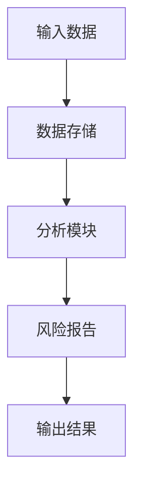

                 


# 特价股票投资中的地缘政治风险评估

## 关键词：特价股票，地缘政治风险，投资风险，股票市场，风险评估

## 摘要：  
本文深入探讨了特价股票投资中的地缘政治风险评估问题，从地缘政治风险的定义、影响因素、评估方法到实际案例分析，全面解析了如何在投资决策中考虑地缘政治因素。通过理论分析和实践应用，本文为投资者提供了科学的风险评估框架和实用的建议。

---

# 第一部分：特价股票与地缘政治风险的背景介绍

## 第1章：特价股票的定义与特点

### 1.1 特价股票的定义
特价股票通常指价格低于市场平均价格的股票，这类股票通常具有较高的波动性和潜在的高回报。它们往往来自小公司或处于困境中的企业，投资者希望通过低价买入后高价卖出获利。

### 1.2 特价股票的特点
- **低价格**：通常低于市场平均价格。
- **高波动性**：价格波动较大，容易受市场情绪影响。
- **高风险**：由于公司基本面较差，投资风险较高。
- **潜在高回报**：如果公司基本面改善，股价可能大幅上涨。

### 1.3 地缘政治风险的定义
地缘政治风险是指由于国际政治、经济、军事等因素的变化对股票市场产生的影响，包括战争、贸易摩擦、政策变化等。

## 第2章：地缘政治风险对特价股票的影响

### 2.1 地缘政治风险的来源
- **国际冲突**：如战争、领土争端等。
- **经济制裁**：如贸易禁运、关税政策变化。
- **政策变化**：如政府出台新的经济政策或法规。

### 2.2 地缘政治风险对股票市场的影响
- **市场波动**：地缘政治事件可能导致市场短期剧烈波动。
- **股价下跌**：投资者可能抛售股票以规避风险。
- **长期影响**：政策变化可能影响公司的长期发展。

### 2.3 特价股票的敏感性分析
特价股票由于价格低、流动性差，通常对市场波动更加敏感。地缘政治事件可能导致这些股票的价格波动幅度更大。

---

# 第二部分：地缘政治风险的评估方法

## 第3章：地缘政治风险的系统性分析

### 3.1 风险评估的基本理论
- **风险评估的定义**：通过分析各种风险因素，预测其发生的概率和影响程度。
- **风险评估的步骤**：数据收集、模型建立、风险评分、结果分析。

### 3.2 地缘政治风险的评估指标
- **风险发生概率**：基于历史数据和当前局势预测风险发生的可能性。
- **风险影响程度**：评估风险对股票价格的具体影响。
- **风险的可预测性**：分析风险的可控性和可预测性。

## 第4章：风险评估的数学模型

### 4.1 层次分析法（AHP）
层次分析法是一种常用的多准则决策方法，适用于地缘政治风险的综合评估。

#### 4.1.1 AHP的步骤
1. **构建层次分析结构图**：包括目标层、准则层和方案层。
2. **构造比较矩阵**：根据专家意见，比较各准则的重要性。
3. **计算权重**：通过特征向量和一致性检验，确定各准则的权重。
4. **综合评估**：根据权重和方案层的数据，计算综合得分。

#### 4.1.2 示例
假设我们有三个国家，评估它们的地缘政治风险。准则层包括国际关系、政策稳定性和经济制裁。

$$
A = \begin{bmatrix}
1 & 3 & 2 \\
1/3 & 1 & 4 \\
1/2 & 1/4 & 1
\end{bmatrix}
$$

计算特征向量和一致性检验，得到各准则的权重。

### 4.2 贝叶斯网络模型
贝叶斯网络通过概率推理，分析地缘政治事件对股票市场的潜在影响。

#### 4.2.1 模型构建
- **节点**：代表不同的风险因素，如战争、政策变化等。
- **边**：表示因素之间的依赖关系。

#### 4.2.2 示例
假设我们有战争（W）和经济制裁（E）两个因素，影响股价（P）。构建贝叶斯网络，计算在战争发生的情况下，股价下跌的概率。

$$
P(P \downarrow | W) = 0.8
$$

---

# 第三部分：系统架构与项目实战

## 第5章：系统架构设计

### 5.1 系统功能设计
- **数据采集**：收集历史股价数据和地缘政治事件信息。
- **风险评估**：使用AHP或贝叶斯网络模型评估风险。
- **结果分析**：生成风险报告，提供投资建议。

### 5.2 系统架构图


## 第6章：项目实战

### 6.1 环境配置
- **工具**：Python、NumPy、scikit-learn。
- **数据来源**：Yahoo Finance API、新闻爬虫。

### 6.2 核心代码实现
```python
import numpy as np
from sklearn.decomposition import PCA

# 示例：使用主成分分析（PCA）提取风险因子
def compute_risk_factors(data):
    pca = PCA(n_components=3)
    factors = pca.fit_transform(data)
    return factors

# 示例：计算风险评分
def calculate_risk_score(factors):
    score = np.mean(factors, axis=1)
    return score
```

### 6.3 实际案例分析
分析某地区冲突对特价股票的影响，使用模型预测股价变化，并验证结果。

---

# 第四部分：总结与展望

## 第7章：总结与建议

### 7.1 总结
地缘政治风险是影响特价股票投资的重要因素，投资者需要通过科学的评估方法，识别和量化这些风险。

### 7.2 投资建议
- **分散投资**：避免将所有资金投入到单一地区或行业的特价股票。
- **关注政策变化**：及时了解国际政治动态和政策变化。
- **风险对冲**：使用衍生工具如期货、期权来对冲风险。

## 第8章：注意事项与扩展阅读

### 8.1 注意事项
- 风险评估模型的结果仅供参考，实际投资需结合市场实际情况。
- 需要定期更新模型参数，以适应不断变化的地缘政治环境。

### 8.2 扩展阅读
- 建议阅读《投资学基础》、《地缘政治经济学》等相关书籍，深入理解投资风险的其他方面。

---

# 作者

作者：AI天才研究院 & 禅与计算机程序设计艺术

