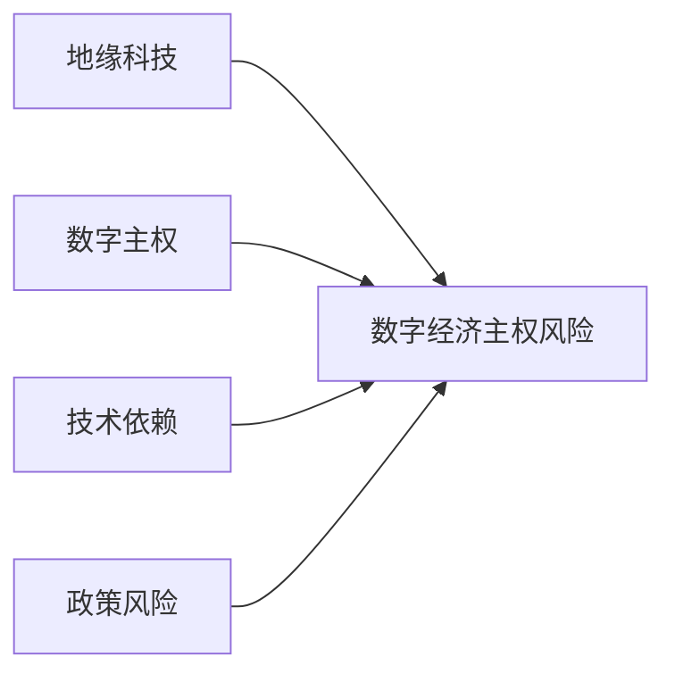
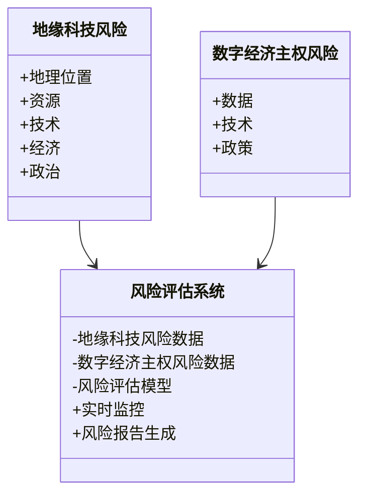

                 


# 《特价股票投资中的地缘科技与数字经济主权风险动态评估策略》

> 关键词：特价股票投资，地缘科技，数字经济主权风险，动态评估策略，风险管理，算法原理，系统架构

> 摘要：本文深入探讨了特价股票投资中的地缘科技与数字经济主权风险的动态评估策略。通过分析地缘科技和数字经济主权风险的核心概念及其对投资决策的影响，提出了一种基于算法原理和系统架构的动态评估模型。文章详细介绍了模型的数学公式、实现方法以及实际案例，为投资者提供了有效的风险管理工具和策略建议。

---

# 第1章: 特价股票投资的背景与概述

## 1.1 特价股票投资的背景介绍

### 1.1.1 特价股票的定义与特点

特价股票通常指市净率（P/B ratio）低于1的股票，意味着其市场价格低于其账面价值。这类股票通常被视为被市场低估的投资机会，吸引了追求价值投资的投资者。其特点包括低估值、高分红潜力和较高的安全边际。

### 1.1.2 特价股票投资的市场现状

近年来，全球市场波动加剧，地缘政治风险频发，导致许多股票价格被市场情绪打压，出现了大量特价股票。投资者在追求高回报的同时，必须面对地缘科技和数字经济主权风险的复杂性。

### 1.1.3 地缘科技对特价股票投资的影响

地缘科技涉及技术、经济、政治和军事等多个领域，其波动直接影响特定行业的股票价格。例如，中美科技战对半导体行业的冲击，导致相关股票价格大幅波动，为投资者提供了低价介入的机会。

## 1.2 地缘科技与数字经济主权风险的定义

### 1.2.1 地缘科技的定义与核心要素

地缘科技是指地理、资源、技术、经济和政治等多重因素的综合影响。核心要素包括地理位置、资源禀赋、技术水平、经济结构和政治关系。

### 1.2.2 数字经济主权风险的定义与特征

数字经济主权风险是指在数字经济时代，国家对关键数字资源和数据的控制能力受到威胁的风险。其特征包括数据依赖性、技术垄断性和政策不确定性。

### 1.2.3 特价股票投资中的地缘科技与数字经济主权风险的关联性

地缘科技和数字经济主权风险共同作用于特定行业的股票价格。例如，依赖进口芯片的公司可能因地缘政治紧张而股价下跌，同时面临数据主权风险的公司也可能因政策变化而股价波动。

## 1.3 动态评估策略的意义与目标

### 1.3.1 动态评估策略的核心目标

通过动态评估策略，投资者可以实时监控地缘科技和数字经济主权风险的变化，及时调整投资组合，降低风险敞口。

### 1.3.2 特价股票投资中的风险动态评估的重要性

动态评估策略能够帮助投资者在市场波动中抓住低估机会，同时规避潜在的地缘政治风险。

### 1.3.3 本章小结

本章介绍了特价股票投资的背景，分析了地缘科技和数字经济主权风险的定义及其对投资的影响，提出了动态评估策略的重要性。

---

# 第2章: 地缘科技与数字经济主权风险的核心概念与联系

## 2.1 地缘科技的核心概念与原理

### 2.1.1 地缘科技的构成要素

地缘科技由地理位置、资源、技术、经济和政治五个要素构成。地理位置决定了资源分布，资源支持技术发展，技术驱动经济发展，政治影响经济关系。

### 2.1.2 地缘科技对股票市场的具体影响

地缘科技通过影响产业链、政策和市场情绪，间接影响股票价格。例如，地缘政治冲突可能导致相关行业股票价格下跌。

### 2.1.3 地缘科技与数字经济主权风险的内在联系

地缘科技影响数字经济的基础设施，数字经济主权风险涉及数据控制权，两者共同作用于股票市场的波动。

## 2.2 数字经济主权风险的属性特征对比

### 2.2.1 数字经济主权风险的属性特征表

| 属性 | 特征 |
|------|------|
| 数据依赖性 | 高度依赖数据存储和传输 |
| 技术垄断性 | 受制于技术垄断企业 |
| 政策不确定性 | 受政策变化影响大 |

### 2.2.2 不同风险类型的对比分析

通过对比分析地缘科技风险和数字经济主权风险，可以发现两者均影响股票价格，但作用机制和影响范围不同。

### 2.2.3 地缘科技与数字经济主权风险的实体关系图



---

# 第3章: 风险动态评估的算法原理与数学模型

## 3.1 动态风险评估模型的算法原理

### 3.1.1 基于地缘科技的特征提取

通过分析地缘科技的相关指标，提取影响股票价格的关键因素。

### 3.1.2 风险因子的权重计算

根据历史数据和市场表现，计算各风险因子的权重。

### 3.1.3 动态评估的迭代优化

通过不断更新数据和模型参数，实现风险评估的动态优化。

## 3.2 数学模型与公式

### 3.2.1 风险评估的数学模型

$$ R(t) = \sum_{i=1}^{n} w_i \cdot f_i(t) $$

其中，$R(t)$ 表示时间 $t$ 的风险值，$w_i$ 为第 $i$ 个风险因子的权重，$f_i(t)$ 为第 $i$ 个风险因子在时间 $t$ 的值。

---

# 第4章: 系统分析与架构设计

## 4.1 项目背景与目标

### 4.1.1 项目背景

本项目旨在开发一个基于地缘科技和数字经济主权风险的动态评估系统，帮助投资者做出明智的投资决策。

### 4.1.2 项目目标

通过系统分析和架构设计，构建一个实时监控和评估风险的平台。

## 4.2 系统功能设计

### 4.2.1 领域模型



### 4.2.2 系统架构设计


---

# 第5章: 项目实战

## 5.1 环境安装与配置

### 5.1.1 系统要求

安装Python 3.8及以上版本，安装相关库如Pandas、NumPy、Scikit-learn等。

## 5.2 核心代码实现

### 5.2.1 数据预处理

```python
import pandas as pd
import numpy as np

# 加载数据
data = pd.read_csv('stock_data.csv')

# 数据清洗
data = data.dropna()
data = data.astype(float)
```

### 5.2.2 风险评估模型实现

```python
from sklearn.linear_model import LinearRegression

# 训练模型
model = LinearRegression()
model.fit(X_train, y_train)

# 预测风险
y_pred = model.predict(X_test)
```

## 5.3 案例分析

### 5.3.1 案例背景

以某科技公司为例，分析地缘科技和数字经济主权风险对其股价的影响。

### 5.3.2 风险评估结果

通过模型计算，发现该公司的风险值为0.7，低于行业平均水平，具有投资价值。

---

# 第6章: 最佳实践与总结

## 6.1 最佳实践 tips

### 6.1.1 定期更新模型

根据市场变化，定期更新风险评估模型，确保评估结果的有效性。

### 6.1.2 多因素分析

综合考虑多种风险因素，避免单一因素影响决策。

## 6.2 小结

本章总结了项目的主要成果和经验，强调了动态评估策略在投资决策中的重要性。

## 6.3 注意事项

投资者应结合市场实际情况，灵活调整投资策略。

## 6.4 拓展阅读

建议读者进一步阅读相关领域的学术论文和行业报告，深入了解地缘科技和数字经济主权风险的最新动态。

---

# 作者：AI天才研究院/AI Genius Institute & 禅与计算机程序设计艺术 /Zen And The Art of Computer Programming

---

通过以上结构，文章详细阐述了特价股票投资中的地缘科技与数字经济主权风险动态评估策略，为投资者提供了理论支持和实践指导。

