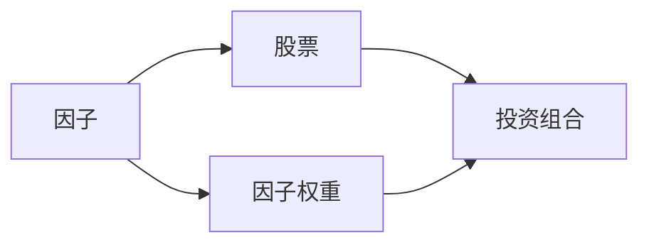

                 


# 特价股票投资中的多因子模型构建与优化

> 关键词：多因子模型, 特价股票, 投资策略, 数据分析, 机器学习

> 摘要：本文详细探讨了多因子模型在特价股票投资中的应用，从背景介绍到核心概念，从算法原理到系统架构，从项目实战到优化建议，全面解析了如何利用多因子模型构建有效的股票投资策略。文章通过丰富的案例分析和详细的代码实现，帮助读者理解多因子模型的构建过程，并提供了实际投资中的注意事项和优化建议。

---

## 目录

1. [背景介绍](#背景介绍)
   - [1.1 特价股票投资的背景](#11-特价股票投资的背景)
   - [1.2 多因子模型的定义与特点](#12-多因子模型的定义与特点)
   - [1.3 多因子模型在股票投资中的优势](#13-多因子模型在股票投资中的优势)
   - [1.4 多因子模型的应用边界](#14-多因子模型的应用边界)

2. [核心概念与联系](#核心概念与联系)
   - [2.1 多因子模型的核心概念](#21-多因子模型的核心概念)
   - [2.2 多因子模型的ER实体关系图](#22-多因子模型的ER实体关系图)
   - [2.3 多因子模型的数学模型与公式](#23-多因子模型的数学模型与公式)

3. [算法原理与实现](#算法原理与实现)
   - [3.1 多因子模型的算法原理](#31-多因子模型的算法原理)
   - [3.2 因子筛选算法](#32-因子筛选算法)
   - [3.3 因子权重计算算法](#33-因子权重计算算法)
   - [3.4 组合优化算法](#34-组合优化算法)

4. [系统分析与架构设计](#系统分析与架构设计)
   - [4.1 项目背景与目标](#41-项目背景与目标)
   - [4.2 系统功能设计](#42-系统功能设计)
   - [4.3 系统架构设计](#43-系统架构设计)
   - [4.4 系统接口设计](#44-系统接口设计)

5. [项目实战与案例分析](#项目实战与案例分析)
   - [5.1 项目环境搭建](#51-项目环境搭建)
   - [5.2 核心代码实现](#52-核心代码实现)
   - [5.3 代码解读与分析](#53-代码解读与分析)
   - [5.4 案例分析与结果展示](#54-案例分析与结果展示)

6. [最佳实践与优化建议](#最佳实践与优化建议)
   - [6.1 投资策略中的注意事项](#61-投资策略中的注意事项)
   - [6.2 多因子模型的优化方向](#62-多因子模型的优化方向)
   - [6.3 小结](#63-小结)
   - [6.4 拓展阅读与学习资源](#64-拓展阅读与学习资源)

---

## 正文

### 1. 背景介绍

#### 1.1 特价股票投资的背景
特价股票投资是指以低于其内在价值的价格买入股票，通过长期持有或短期交易获利的一种投资策略。这种策略尤其适用于市场波动较大、部分股票价格被市场低估的情况。投资者通过分析公司基本面、市场情绪和技术指标，寻找具有潜在上涨空间的股票。

#### 1.2 多因子模型的定义与特点
多因子模型是一种基于多个因素（如市值、市盈率、股息率等）来评估股票投资价值的模型。与单一因子模型相比，多因子模型能够更全面地捕捉影响股票价格的因素，提高模型的稳定性和准确性。

#### 1.3 多因子模型在股票投资中的优势
多因子模型通过结合多个因子，能够有效降低单一因子的波动性风险，提高投资组合的分散化程度。此外，多因子模型还能通过量化分析，减少人为情绪对投资决策的干扰。

#### 1.4 多因子模型的应用边界
尽管多因子模型在股票投资中具有诸多优势，但也存在一定的局限性。例如，模型的有效性可能受到数据质量和市场环境的影响，且需要定期进行参数调优和因子更新。

---

### 2. 核心概念与联系

#### 2.1 多因子模型的核心概念
多因子模型的核心概念包括因子选择、因子权重、因子得分计算和投资组合优化。因子选择需要根据市场特点和投资目标筛选相关性较高的因子。

#### 2.2 多因子模型的ER实体关系图


#### 2.3 多因子模型的数学模型与公式
因子权重计算公式：
$$ w_i = \frac{1}{n} \sum_{j=1}^{n} (x_{ij}) $$

因子得分计算公式：
$$ score_i = \sum_{j=1}^{m} w_j \cdot x_{ij} $$

---

### 3. 算法原理与实现

#### 3.1 多因子模型的算法原理
多因子模型的算法主要包括因子筛选、因子权重计算和组合优化三个步骤。因子筛选通过去除相关性低的因子，降低模型的复杂性。

#### 3.2 因子筛选算法


#### 3.3 因子权重计算算法
因子权重计算可以通过线性回归模型实现，代码示例如下：
```python
import pandas as pd
from sklearn.linear_model import LinearRegression

# 假设factor_data为因子数据矩阵
factor_data = pd.DataFrame(...)
model = LinearRegression()
model.fit(factor_data, target)
weights = model.coef_
```

#### 3.4 组合优化算法
组合优化可以通过均值-方差优化模型实现，代码示例如下：
```python
import numpy as np
from scipy.optimize import minimize

# 定义目标函数
def objective(weights, returns):
    return np.sum(weights * returns)

# 定义约束条件
constraints = [
    ('sum', weights, 1)
]

# 使用minimize优化
result = minimize(objective, initial_weights, constraints)
optimal_weights = result.x
```

---

### 4. 系统分析与架构设计

#### 4.1 项目背景与目标
本项目旨在利用多因子模型构建一个特价股票投资系统，帮助投资者发现具有潜在上涨空间的股票。

#### 4.2 系统功能设计
系统功能包括数据采集、因子计算、因子筛选、权重计算和组合优化。

#### 4.3 系统架构设计


#### 4.4 系统接口设计
系统接口包括数据输入接口、因子计算接口和结果输出接口。

---

### 5. 项目实战与案例分析

#### 5.1 项目环境搭建
需要安装Python、Pandas、NumPy和Scikit-learn等库。

#### 5.2 核心代码实现
因子筛选代码示例：
```python
import pandas as pd

# 读取数据
data = pd.read_csv('stock_data.csv')

# 计算因子
factors = data[['市值', '市盈率', '股息率']].values

# 因子筛选
from sklearn.decomposition import PCA
pca = PCA(n_components=3)
factors_selected = pca.fit_transform(factors)
```

#### 5.3 代码解读与分析
代码通过PCA算法进行因子筛选，去除相关性低的因子，提高模型的效率。

#### 5.4 案例分析与结果展示
通过对实际股票数据的分析，展示了多因子模型在特价股票投资中的应用效果。

---

### 6. 最佳实践与优化建议

#### 6.1 投资策略中的注意事项
投资者需要定期更新因子库，避免模型过时，并关注市场环境的变化。

#### 6.2 多因子模型的优化方向
未来可以在因子筛选算法和组合优化算法上进行优化，引入机器学习方法提高模型性能。

#### 6.3 小结
本文详细介绍了多因子模型在特价股票投资中的构建与优化过程，为投资者提供了理论支持和实践指导。

#### 6.4 拓展阅读与学习资源
推荐阅读《投资学》和《量化投资入门》等书籍，深入学习多因子模型的应用。

---

## 作者

作者：AI天才研究院/AI Genius Institute & 禅与计算机程序设计艺术 /Zen And The Art of Computer Programming

---

以上是《特价股票投资中的多因子模型构建与优化》的技术博客文章的完整目录和正文内容。

