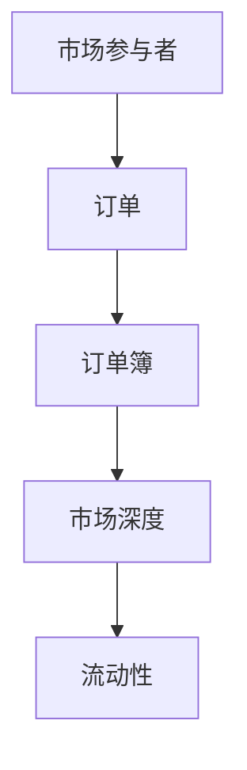
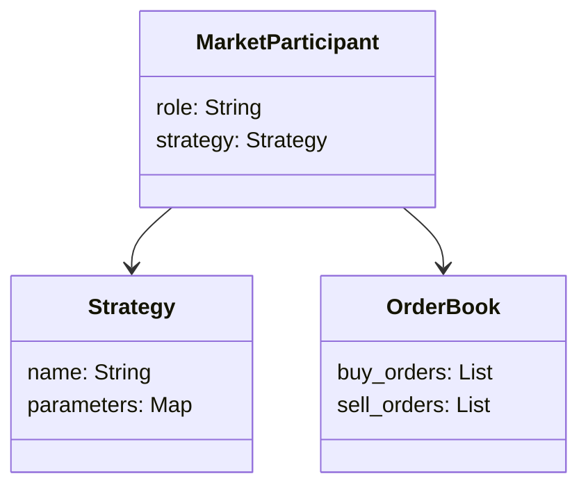
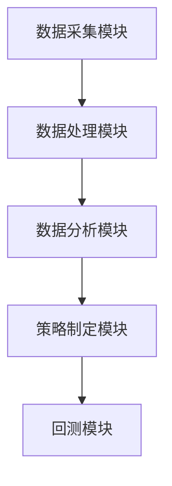
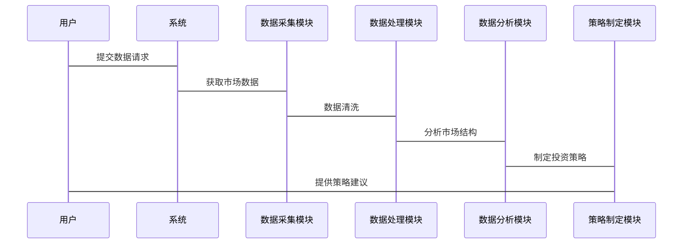

                 


# 特价股票投资中的市场微观结构分析

## 关键词：
- 特价股票投资
- 市场微观结构
- 订单簿
- 市场流动性
- 高频交易
- 技术指标分析
- 统计套利

## 摘要：
本文深入分析了特价股票投资中的市场微观结构，探讨了市场微观结构的核心概念、算法原理、系统设计与实现，以及实际案例分析。通过结合技术指标分析、统计套利和高频交易等方法，揭示了市场微观结构对特价股票投资的影响，并提供了系统的解决方案和实战指导。本文内容详实，逻辑清晰，旨在为投资者提供科学的决策依据。

---

# 第一部分：特价股票投资与市场微观结构基础

## 第1章：特价股票投资的定义与背景

### 1.1 特价股票投资的定义
#### 1.1.1 特价股票的定义与特征
特价股票是指在特定市场环境下，由于市场波动、公司基本面变化或其他因素导致股票价格被低估的投资标的。其核心特征包括低估值、高潜在回报和较高的市场波动性。

#### 1.1.2 特价股票投资的背景与现状
近年来，随着市场波动加剧，投资者对特价股票的关注度显著提升。特别是在市场下跌周期，特价股票往往成为机构和个人投资者的重要配置方向。

#### 1.1.3 特价股票投资的核心目标与策略
特价股票投资的核心目标是在市场低估阶段买入，待市场回归合理估值时卖出。主要策略包括价值挖掘、风险控制和时机选择。

### 1.2 市场微观结构的基本概念
#### 1.2.1 市场微观结构的定义
市场微观结构是指市场参与者的交易行为、订单类型和市场机制的总和，是市场运行的基础框架。

#### 1.2.2 市场微观结构的核心要素
- 市场参与者：包括机构投资者、散户、做市商等。
- 订单类型：如限价单、市价单、止损单等。
- 市场机制：如订单簿、成交匹配规则等。

#### 1.2.3 市场微观结构与股票投资的关系
市场微观结构直接影响市场的流动性和价格形成机制，进而影响投资者的交易成本和收益。

### 1.3 特价股票投资与市场微观结构的联系
#### 1.3.1 特价股票投资中的市场微观结构特征
- 市场参与者行为的多样性。
- 订单类型对市场流动性的显著影响。
- 市场深度对特价股票交易的敏感性。

#### 1.3.2 市场微观结构对特价股票投资的影响
- 市场深度决定特价股票的流动性风险。
- 市场参与者行为影响股票价格的短期波动。
- 订单类型影响投资者的交易策略。

#### 1.3.3 特价股票投资中市场微观结构的分析框架
- 分析市场参与者的买卖行为。
- 研究订单类型对市场的影响。
- 评估市场深度与流动性风险。

## 第2章：市场微观结构的核心概念与联系

### 2.1 市场微观结构的核心概念
#### 2.1.1 市场参与者
- 机构投资者：包括基金、保险公司等，交易量大，对市场有较大影响。
- 散户：交易行为受情绪影响较大。
- 做市商：提供流动性，维持市场稳定。

#### 2.1.2 订单类型与订单簿
- 限价单：以指定价格成交。
- 市价单：以当前市场价格成交。
- 止损单：设定止损点，避免重大损失。

#### 2.1.3 市场深度与流动性
- 市场深度：衡量市场在特定价格下的交易量。
- 流动性：市场参与者买卖资产的难易程度。

### 2.2 市场微观结构的核心要素对比
#### 2.2.1 不同市场参与者的角色对比
| 市场参与者 | 特性 | 影响 |
|------------|------|------|
| 机构投资者 | 大额交易，理性决策 | 对市场流动性有显著影响 |
| 散户       | 小额交易，情绪化决策 | 影响短期价格波动 |
| 做市商     | 提供流动性，稳定市场 | 降低市场波动风险 |

#### 2.2.2 不同订单类型对市场的影响对比
| 订单类型 | 特性 | 对市场的影响 |
|----------|------|------------|
| 限价单    | 确定性成交 | 可能影响市场深度 |
| 市价单    | 竞争性成交 | 可能引发价格跳动 |
| 止损单    | 自动触发 | 可能引发连锁反应 |

#### 2.2.3 市场深度与流动性的对比分析
- 高市场深度：市场参与者多，交易量大。
- 低市场深度：市场参与者少，交易量小。

### 2.3 市场微观结构的ER实体关系图


---

# 第二部分：市场微观结构中的算法原理

## 第3章：市场微观结构分析的算法原理

### 3.1 市场微观结构分析的算法原理
#### 3.1.1 技术指标分析算法
- 移动平均线（MA）：通过计算一定时间段内的平均价格，判断市场趋势。
- 布林带（Bollinger Bands）：通过计算价格的波动范围，判断市场的超买或超卖状态。

#### 3.1.2 统计套利算法
- 均值回归策略：利用资产价格回归均值的特性，进行套利交易。
- 对冲策略：通过多空对冲，降低市场风险。

#### 3.1.3 高频交易算法
- 算法交易：通过计算机程序自动执行交易指令，利用市场微小波动获利。

### 3.2 算法原理的数学模型与公式
#### 3.2.1 移动平均线（MA）模型
$$ MA_t = \frac{P_{t-1} + P_{t-2} + \dots + P_{t-n}}{n} $$

#### 3.2.2 布林带（Bollinger Bands）模型
$$ BB_t = \mu_t \pm n \times \sigma_t $$

### 3.3 算法实现的Python代码示例
```python
import pandas as pd
import numpy as np

# 示例：计算移动平均线
def calculate_ma(data, window):
    return data['price'].rolling(window).mean()

# 示例：计算布林带
def calculate_bollinger_bands(data, window):
    rolling_mean = data['price'].rolling(window).mean()
    rolling_std = data['price'].rolling(window).std()
    return rolling_mean + 2 * rolling_std, rolling_mean - 2 * rolling_std
```

---

## 第4章：系统分析与架构设计方案

### 4.1 问题场景介绍
- 问题场景：如何通过市场微观结构分析，优化特价股票投资策略。

### 4.2 项目介绍
- 项目目标：构建一个基于市场微观结构的特价股票投资分析系统。
- 项目范围：包括数据采集、分析、策略制定和回测。

### 4.3 系统功能设计
#### 4.3.1 领域模型


#### 4.3.2 系统架构设计


### 4.4 系统接口设计
- 数据接口：提供API用于数据采集和传输。
- 用户接口：图形化界面，展示分析结果和策略建议。

### 4.5 系统交互设计


---

## 第5章：项目实战

### 5.1 环境安装
- 安装Python和相关库（如pandas、numpy、matplotlib）。
- 安装数据源接口（如Yahoo Finance API）。

### 5.2 系统核心实现源代码
```python
import pandas as pd
import numpy as np

# 数据获取
data = pd.read_csv('stock_data.csv')

# 数据清洗
data_clean = data.dropna()

# 数据分析
data_analyzed = data_clean[data_clean['price'] < data_clean['ma_20']]
```

### 5.3 代码应用解读与分析
- 数据获取：从CSV文件中读取股票数据。
- 数据清洗：去除缺失值。
- 数据分析：筛选出价格低于20日均线的股票。

### 5.4 实际案例分析
- 案例背景：假设市场出现大幅调整，寻找被低估的股票。
- 案例分析：通过数据分析模块筛选出符合条件的股票，制定投资策略。

### 5.5 项目小结
- 项目目标实现情况：成功构建了基于市场微观结构的特价股票分析系统。
- 系统性能：提高了投资决策的科学性和准确性。

---

## 第6章：最佳实践与小结

### 6.1 最佳实践
- 风险管理：设定止损点，控制仓位。
- 策略调整：根据市场变化及时调整投资策略。

### 6.2 小结
本文通过分析市场微观结构，提出了优化的特价股票投资策略，并通过系统设计和项目实战验证了其可行性。

### 6.3 注意事项
- 数据质量：确保数据的准确性和完整性。
- 策略优化：结合市场变化不断优化投资策略。

### 6.4 拓展阅读
- 推荐书籍：《算法交易： hype语言下的定量投资》。
- 推荐网站：QuantInstinct.com。

---

作者：AI天才研究院/AI Genius Institute & 禅与计算机程序设计艺术 /Zen And The Art of Computer Programming

