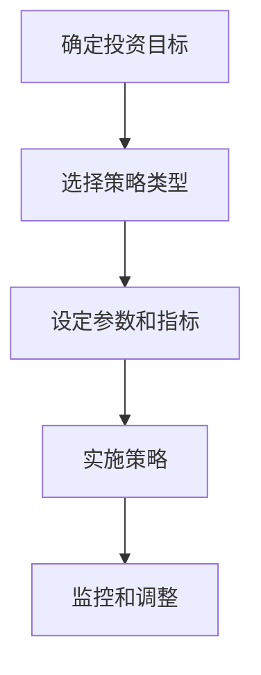

                 


```markdown
# 特价股票投资中的心理偏差和如何克服

> 关键词：特价股票投资，心理偏差，投资决策，行为金融学，风险管理

> 摘要：特价股票投资是投资者追求超额收益的重要策略，但心理偏差往往导致投资失败。本文系统分析了常见的心理偏差，如过度自信、从众心理和损失厌恶，并结合行为金融学理论，提出了克服这些偏差的具体策略和方法，帮助投资者实现理性的投资决策。

---

## 第一部分：特价股票投资的背景与心理偏差概述

### 第1章：特价股票投资的背景与核心概念

#### 1.1 特价股票投资的定义与特点
- **1.1.1 什么是特价股票**：特价股票是指市场中被低估的股票，通常具有较高的安全边际。
- **1.1.2 特价股票投资的核心特点**：低估值、高潜在回报、逆向思维。
- **1.1.3 特价股票投资的边界与外延**：包括价值投资、成长投资和趋势投资。

#### 1.2 投资者心理偏差的背景与影响
- **1.2.1 心理偏差在股票投资中的普遍性**：心理偏差是人类决策的固有特征。
- **1.2.2 心理偏差对投资决策的具体影响**：导致非理性决策，如追涨杀跌。
- **1.2.3 心理偏差与投资失败的关联性分析**：心理偏差是投资失败的主要原因之一。

---

## 第二部分：常见心理偏差的分析与案例

### 第2章：常见心理偏差的类型与特征

#### 2.1 过度自信偏差
- **2.1.1 过度自信偏差的表现形式**：投资者过度相信自己的判断能力。
- **2.1.2 过度自信偏差对投资决策的影响**：可能导致过度交易和错失投资机会。
- **2.1.3 典型案例分析**：投资者在市场上涨时买入，市场下跌时卖出，违背价值投资原则。

#### 2.2 从众心理偏差
- **2.2.1 从众心理偏差的定义与特征**：投资者倾向于跟随市场的主流观点。
- **2.2.2 从众心理偏差在股票投资中的表现**：导致投资者在市场高点买入，在低点卖出。
- **2.2.3 典型案例分析**：2015年A股市场的杠杆牛市与随后的崩盘，投资者盲目跟风导致重大损失。

#### 2.3 损失厌恶偏差
- **2.3.1 损失厌恶偏差的定义与特征**：投资者对损失的厌恶程度远超过对收益的追求。
- **2.3.2 损失厌恶偏差对投资行为的影响**：导致投资者在亏损时过于保守，错失反弹机会。
- **2.3.3 典型案例分析**：投资者在市场下跌时急于止损，导致仓位过低，无法在后续反弹中获利。

---

## 第三部分：克服心理偏差的策略与方法

### 第3章：心理偏差克服的理论基础

#### 3.1 理性决策框架
- **3.1.1 理性决策的定义与特点**：理性决策强调基于事实和数据的决策。
- **3.1.2 理性决策与心理偏差的关系**：理性决策是克服心理偏差的核心方法。
- **3.1.3 理性决策框架在股票投资中的应用**：通过数据驱动的投资策略，减少情绪化决策。

#### 3.2 行为金融学视角
- **3.2.1 行为金融学的核心观点**：人类决策的非理性是金融市场波动的主要原因。
- **3.2.2 行为金融学对心理偏差的解释**：通过心理实验和行为研究，揭示投资者的决策偏差。
- **3.2.3 行为金融学在投资策略中的应用**：通过调整心理预期，优化投资组合。

### 第4章：克服心理偏差的具体策略

#### 4.1 建立科学的投资决策系统
- **4.1.1 投资决策系统的构建逻辑**：数据收集、模型建立、风险评估。
- **4.1.2 系统化投资决策的优势**：减少主观判断，提高决策的客观性和准确性。
- **4.1.3 系统化投资决策的实施步骤**：
  1. 确定投资目标和风险承受能力。
  2. 选择合适的估值指标和筛选标准。
  3. 设定买入和卖出的触发条件。
  4. 定期复盘和优化策略。

#### 4.2 培养投资纪律性
- **4.2.1 纪律性在投资中的重要性**：纪律性是克服心理偏差的关键。
- **4.2.2 如何培养投资纪律性**：
  1. 制定详细的投资计划。
  2. 避免频繁查看账户，减少情绪波动。
  3. 建立止损和止盈机制。
- **4.2.3 纪律性与心理偏差克服的关系**：纪律性是克服心理偏差的重要保障。

#### 4.3 提高信息筛选能力
- **4.3.1 信息筛选能力的核心作用**：准确筛选信息，减少噪声干扰。
- **4.3.2 如何提高信息筛选能力**：
  1. 多来源交叉验证信息。
  2. 坚持基本面分析。
  3. 避免被市场情绪影响。
- **4.3.3 信息筛选能力与心理偏差的关系**：信息筛选能力越强，越能避免情绪化决策。

---

## 第四部分：系统化投资策略与风险管理

### 第5章：系统化投资策略的设计与实施

#### 5.1 系统化投资策略的核心要素
- **5.1.1 系统化投资策略的定义**：基于数据和模型的投资策略。
- **5.1.2 系统化投资策略的特点**：科学性、纪律性、可复制性。
- **5.1.3 系统化投资策略的核心要素**：
  1. 明确的投资目标。
  2. 严格的投资纪律。
  3. 可靠的数据支持。

#### 5.2 系统化投资策略的实施步骤
- **5.2.1 确定投资目标**：明确投资期限、风险承受能力和收益目标。
- **5.2.2 选择合适的策略**：根据市场环境和个人能力选择策略。
- **5.2.3 设定参数和指标**：如估值指标、技术指标等。
- **5.2.4 实施和监控**：严格按照策略执行，定期监控和调整。

### 第6章：风险管理与心理偏差的克服

#### 6.1 风险管理的核心原则
- **6.1.1 风险管理的定义**：识别、评估和控制投资风险。
- **6.1.2 风险管理的核心原则**：分散投资、止损控制、动态调整。
- **6.1.3 风险管理与心理偏差的关系**：良好的风险管理能减少心理偏差的影响。

#### 6.2 风险管理的具体方法
- **6.2.1 分散投资**：通过投资不同资产类别和行业降低风险。
- **6.2.2 设置止损**：避免重大损失，保护投资本金。
- **6.2.3 动态调整**：根据市场变化和个人情况调整投资策略。

---

## 第五部分：项目实战与案例分析

### 第7章：项目实战：系统化投资策略的实现

#### 7.1 项目背景与目标
- **7.1.1 项目背景**：通过系统化策略实现稳定收益。
- **7.1.2 项目目标**：构建一个基于价值投资的系统化策略。

#### 7.2 系统设计与实现
- **7.2.1 数据收集与处理**：收集历史股价、财务数据和市场指标。
- **7.2.2 策略开发与回测**：开发价值投资策略并进行历史回测。
- **7.2.3 系统实现与监控**：开发实时监控系统，及时调整策略。

#### 7.3 实际案例分析
- **7.3.1 案例背景**：2019年A股市场的某只低价股。
- **7.3.2 策略应用**：如何通过系统化策略发现并投资该股票。
- **7.3.3 投资结果**：投资收益与策略表现。

---

## 第六部分：总结与展望

### 第8章：总结与未来展望

#### 8.1 全文总结
- **8.1.1 特价股票投资的核心内容**：低估值、高安全边际。
- **8.1.2 心理偏差的主要类型**：过度自信、从众心理、损失厌恶。
- **8.1.3 克服心理偏差的具体策略**：理性决策、系统化投资、风险管理。

#### 8.2 未来展望
- **8.2.1 投资心理学的发展趋势**：行为金融学的进一步研究。
- **8.2.2 系统化投资策略的优化方向**：人工智能在投资决策中的应用。
- **8.2.3 未来投资环境的挑战与机遇**：科技发展对投资的影响。

---

## 附录

### 附录A：常用估值指标公式

- 市盈率（P/E）：$$ P/E = \frac{股票价格}{每股净利润} $$
- 市净率（P/B）：$$ P/B = \frac{股票价格}{每股净资产} $$
- 市销率（P/S）：$$ P/S = \frac{股票价格}{每股营业收入} $$

### 附录B：投资策略选择的流程图



---

## 作者

作者：AI天才研究院/AI Genius Institute & 禅与计算机程序设计艺术 /Zen And The Art of Computer Programming
```

