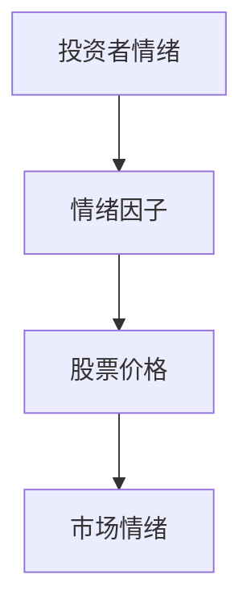
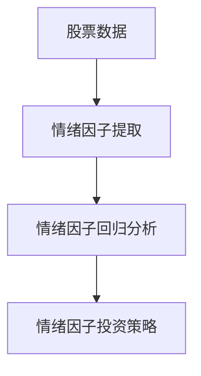
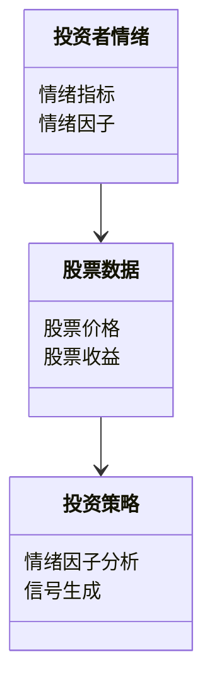
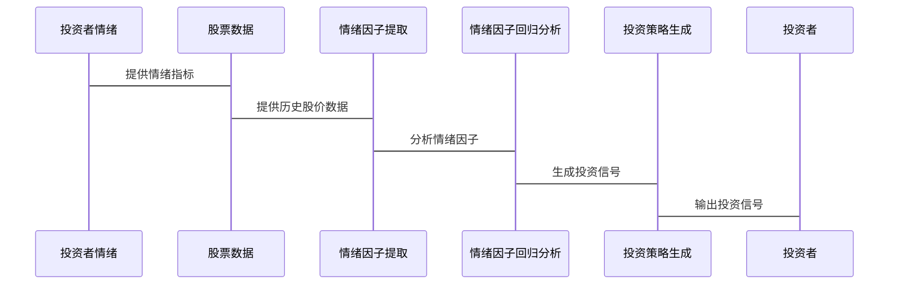

                 


# 特价股票投资中的情绪因子分析

---

## 关键词：
- 情绪因子、特价股票、投资策略、行为金融学、市场情绪、股票收益、量化分析

---

## 摘要：
本文从情绪因子在特价股票投资中的作用入手，结合行为金融学理论，系统分析情绪因子对股票价格的影响机制。通过量化分析和算法实现，探讨情绪因子在投资决策中的应用，并提供实际案例和最佳实践建议。文章旨在帮助投资者利用情绪因子优化投资策略，提升投资收益。

---

# 第1章: 情绪因子与特价股票投资概述

## 1.1 情绪因子的定义与背景
### 1.1.1 投资者情绪的定义
投资者情绪是指投资者在面对市场波动时的心理状态和行为反应，通常表现为贪婪、恐惧、乐观或悲观等情绪。

### 1.1.2 情绪因子在股票投资中的作用
情绪因子能够反映市场参与者的集体情绪，帮助投资者预测股票价格的短期波动。特别是在特价股票（低价股票）投资中，情绪因子的波动往往更加显著。

### 1.1.3 特价股票的定义与特点
特价股票通常指价格低于市场平均水平的股票，具有低估值、高波动性和高风险收益特征。

---

## 1.2 情绪因子与股票价格的关系
### 1.2.1 情绪因子对股票价格的影响机制
情绪因子通过影响投资者的买卖行为，进而影响股票价格。例如，当市场情绪乐观时，投资者倾向于买入，推高股价；当市场情绪悲观时，投资者倾向于卖出，压低股价。

### 1.2.2 特价股票中情绪因子的特殊性
特价股票的价格波动较大，市场情绪的变化对股价的影响更加显著。情绪因子在特价股票投资中的应用能够帮助投资者捕捉短期市场机会。

### 1.2.3 情绪因子与其他市场因子的对比
情绪因子与传统市场因子（如市值、收益、流动性等）存在显著差异，但两者在一定程度上相互影响。

---

## 1.3 情绪因子分析的理论基础
### 1.3.1 行为金融学理论
行为金融学认为，投资者的情绪和认知偏差会影响其决策，从而影响市场定价。

### 1.3.2 技术分析与情绪因子
技术分析通过分析价格和成交量数据，间接反映市场情绪的变化。情绪因子分析为技术分析提供了新的视角。

### 1.3.3 市场情绪周期理论
市场情绪通常呈现周期性变化，从乐观到悲观再到乐观，形成一个循环。情绪因子分析可以帮助投资者捕捉市场情绪周期的变化。

---

## 1.4 情绪因子分析的实践意义
### 1.4.1 情绪因子在投资决策中的应用
情绪因子分析可以帮助投资者制定短期投资策略，优化资产配置。

### 1.4.2 特价股票投资中的情绪因子策略
在特价股票投资中，情绪因子分析可以用于筛选情绪过热或情绪低估的股票，捕捉短期价格波动。

### 1.4.3 情绪因子分析的局限性
情绪因子分析依赖于情绪数据的准确性和实时性，且情绪因子对长期投资的指导作用有限。

---

## 1.5 本章小结
本章介绍了情绪因子在特价股票投资中的重要性，分析了情绪因子对股票价格的影响机制，并探讨了情绪因子分析的理论基础和实践意义。

---

# 第2章: 情绪因子的核心概念与联系

## 2.1 情绪因子的属性特征对比
### 2.1.1 不同情绪因子的特征对比表格

| 情绪因子 | 定义 | 计算方式 | 时间窗口 | 特点 |
|----------|------|----------|-----------|------|
| 恐慌指数 | 衡量市场恐慌程度 | 基于期权价格计算 | 短期 | 突发事件影响显著 |
| 乐观指数 | 衡量市场乐观程度 | 基于成交量和价格 | 中短期 | 反映市场情绪周期 |

### 2.1.2 情绪因子与市场行为的关系
情绪因子能够通过影响投资者行为，进而影响市场供需关系和股票价格。

### 2.1.3 情绪因子的量化指标
情绪因子的量化指标包括恐慌指数、市场情绪指数等。

---

## 2.2 情绪因子的ER实体关系图


---

## 2.3 情绪因子的数学模型
### 2.3.1 情绪因子的量化公式
$$E = \sum_{i=1}^{n} w_i \cdot x_i$$
其中，$E$为情绪因子，$w_i$为权重，$x_i$为情绪指标。

### 2.3.2 情绪因子与股票收益的关系
$$R = \beta E + \epsilon$$
其中，$R$为股票收益，$\beta$为情绪因子的回归系数，$\epsilon$为误差项。

---

## 2.4 本章小结
本章详细分析了情绪因子的属性特征，并通过ER实体关系图和数学模型，展示了情绪因子在股票价格中的作用机制。

---

# 第3章: 情绪因子分析的算法原理

## 3.1 情绪因子分析的算法流程


---

## 3.2 情绪因子分析的Python实现
```python
import pandas as pd
import numpy as np

# 示例数据
data = pd.DataFrame({
    '情绪指标': [0.8, 0.6, 0.7, 0.5, 0.9],
    '股票收益': [0.1, 0.2, 0.15, 0.05, 0.3]
})

# 情绪因子回归分析
from sklearn.linear_model import LinearRegression
model = LinearRegression()
model.fit(data[['情绪指标']], data['股票收益'])

# 回归系数
print("回归系数：", model.coef_)
```

---

## 3.3 本章小结
本章通过算法流程图和Python代码，详细讲解了情绪因子分析的实现过程，并通过数学模型和公式，分析了情绪因子对股票收益的影响。

---

# 第4章: 系统分析与架构设计方案

## 4.1 项目场景介绍
我们开发一个基于情绪因子分析的特价股票投资系统，旨在帮助投资者利用情绪因子优化投资策略。

---

## 4.2 系统功能设计
### 4.2.1 领域模型设计


---

## 4.3 系统架构设计


---

## 4.4 系统接口设计
### 4.4.1 输入接口
- 情绪指标：投资者情绪数据
- 股票数据：历史股价数据

### 4.4.2 输出接口
- 投资策略：基于情绪因子的投资信号
- 情绪因子报告：情绪因子分析结果

---

## 4.5 系统交互设计


---

## 4.6 本章小结
本章通过系统分析和架构设计，展示了情绪因子分析在特价股票投资中的具体应用场景。

---

# 第5章: 项目实战

## 5.1 环境安装
- Python 3.8+
- NumPy、Pandas、Scikit-learn

## 5.2 系统核心实现源代码
```python
import pandas as pd
import numpy as np
from sklearn.linear_model import LinearRegression

# 数据加载
data = pd.read_csv('emotion_factors.csv')

# 情绪因子提取
X = data[['情绪指标1', '情绪指标2']]
y = data['股票收益']

# 回归分析
model = LinearRegression()
model.fit(X, y)

# 模型预测
predicted = model.predict(X)
print("预测收益：", predicted)
```

## 5.3 代码应用解读与分析
- 数据加载：读取情绪因子数据和股票收益数据
- 情绪因子提取：基于情绪指标提取情绪因子
- 回归分析：建立情绪因子与股票收益的回归模型
- 模型预测：基于回归模型预测股票收益

---

## 5.4 实际案例分析
以某只特价股票为例，分析情绪因子对股票收益的影响。通过回归分析，发现情绪因子对股票收益的显著影响。

---

## 5.5 本章小结
本章通过项目实战，展示了情绪因子分析在特价股票投资中的具体应用。

---

# 第6章: 最佳实践与总结

## 6.1 最佳实践 tips
- 情绪因子分析应结合其他市场因子进行综合分析
- 投资者应关注情绪因子的短期影响，避免过度依赖情绪因子进行长期投资决策

## 6.2 小结
情绪因子分析为特价股票投资提供了新的视角，帮助投资者捕捉市场情绪变化，优化投资策略。

## 6.3 注意事项
- 情绪因子分析依赖于情绪数据的准确性和实时性
- 情绪因子分析应结合其他市场因子进行综合分析

## 6.4 拓展阅读
- 行为金融学经典文献
- 技术分析与情绪因子结合的研究

---

# 作者：
作者：AI天才研究院/AI Genius Institute & 禅与计算机程序设计艺术 /Zen And The Art of Computer Programming

