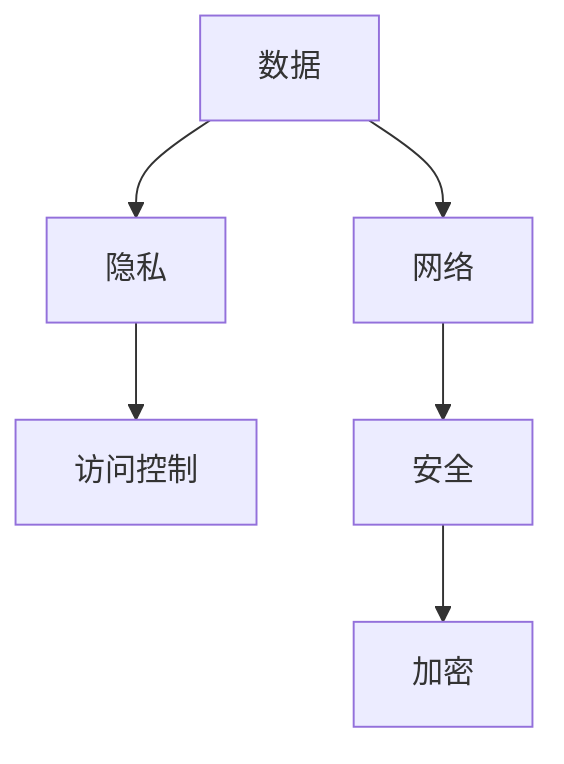

                 


# 特价股票投资中的数据隐私与网络安全风险评估方法

> 关键词：数据隐私，网络安全，风险评估，股票投资，隐私保护，网络安全威胁，风险模型

> 摘要：本文详细探讨了在特价股票投资中如何评估和管理数据隐私与网络安全风险。通过分析数据隐私和网络安全的核心概念，构建风险评估模型，并结合实际案例，提出了一套系统化的解决方案。本文旨在帮助投资者和相关机构更好地理解和应对在特价股票投资中的数据隐私与网络安全挑战。

---

# 第一部分: 特价股票投资中的数据隐私与网络安全概述

## 第1章: 特价股票投资与数据隐私概述

### 1.1 特价股票投资的背景与特点
#### 1.1.1 特价股票投资的定义与特点
特价股票投资是指投资者在特定市场环境下，利用价格波动、市场趋势等信息，以低于市场价买入股票，待价格上涨后卖出，从而获得收益的投资行为。其特点包括高风险、高回报、短期性以及对市场敏感度的高要求。

#### 1.1.2 特价股票投资的核心要素
- 市场分析：通过对宏观经济、行业趋势和公司基本面的分析，判断股票的投资价值。
- 技术分析：利用K线图、均线、成交量等技术指标，预测股票价格的短期走势。
- 风险管理：通过合理的资产配置和止损策略，控制投资风险。

#### 1.1.3 特价股票投资的市场现状与趋势
近年来，随着金融市场的全球化和信息化，特价股票投资逐渐从传统的线下交易转向线上平台。投资者通过互联网平台进行交易，这使得数据隐私和网络安全问题变得更加突出。

---

### 1.2 数据隐私与网络安全的重要性
#### 1.2.1 数据隐私的基本概念
数据隐私是指个人或机构对其数据的控制权和使用权。在特价股票投资中，涉及的敏感数据包括投资者的身份信息、交易记录、账户余额等。这些数据如果被未经授权的第三方获取，可能导致身份盗窃、财务损失等严重问题。

#### 1.2.2 网络安全的核心要素
网络安全是指保护网络系统免受未经授权的访问、破坏、泄露或篡改。在特价股票投资中，网络安全主要涉及以下几个方面：
- 用户身份验证：防止未经授权的用户进入系统。
- 数据加密：保护传输和存储的数据不被 intercepted 或篡改。
- 网络防护：通过防火墙、入侵检测系统等技术，防止网络攻击。

#### 1.2.3 特价股票投资中的数据隐私与网络安全挑战
- **数据泄露风险**：投资者的交易数据可能被黑客攻击或内部人员泄露。
- **网络攻击风险**：黑客可能通过钓鱼邮件、恶意软件等方式入侵投资平台，窃取敏感信息。
- **数据滥用风险**：投资者的交易数据可能被滥用，用于非法目的。

---

### 1.3 风险评估的基本概念与方法
#### 1.3.1 风险评估的定义与作用
风险评估是指对可能影响投资目标的不确定因素进行识别、分析和量化的过程。在特价股票投资中，风险评估可以帮助投资者识别潜在的市场风险、流动性风险以及网络安全风险。

#### 1.3.2 风险评估的基本步骤与流程
1. **识别风险源**：确定可能影响投资的各类风险因素。
2. **分析风险特征**：评估每个风险的发生概率和影响程度。
3. **量化风险**：通过数学模型对风险进行量化，以便进行比较和排序。
4. **制定应对策略**：根据风险评估结果，制定相应的风险管理策略。

#### 1.3.3 特价股票投资中的风险评估应用场景
- **市场风险评估**：评估市场波动对投资组合的影响。
- **流动性风险评估**：评估在市场低迷时卖出股票的难度。
- **网络安全风险评估**：评估投资平台可能面临的数据泄露风险。

---

## 1.4 本章小结
本章介绍了特价股票投资的背景与特点，强调了数据隐私和网络安全的重要性，并提出了风险评估的基本概念和方法。通过这些分析，我们可以更好地理解在特价股票投资中如何保护投资者的隐私和数据安全。

---

# 第二部分: 特价股票投资中的数据隐私与网络安全核心概念

## 第2章: 数据隐私与网络安全的核心概念

### 2.1 数据隐私的核心要素
#### 2.1.1 数据分类与分级
数据分类是指将数据按照一定的标准进行分类，例如按敏感程度、使用权限等。数据分级则是根据数据的重要性进行分级，例如将数据分为“高度敏感”、“中度敏感”和“低度敏感”三级。

#### 2.1.2 数据访问控制
数据访问控制是指通过权限管理、身份验证等技术手段，控制对数据的访问权限。例如，只有授权的用户才能访问敏感数据。

#### 2.1.3 数据加密与匿名化
数据加密是指对数据进行加密处理，防止未经授权的第三方读取数据。数据匿名化是指在数据处理过程中，去除或模糊化数据中的个人信息，以保护隐私。

---

### 2.2 网络安全的核心要素
#### 2.2.1 网络安全威胁的类型
网络安全威胁主要包括以下几种：
- **病毒和恶意软件**：通过感染计算机系统，窃取数据或破坏系统。
- **网络攻击**：通过DDoS攻击、钓鱼攻击等方式，破坏网络服务或窃取数据。
- **内部威胁**：由公司内部员工或合作伙伴发起的恶意行为。

#### 2.2.2 网络安全防御机制
- **防火墙**：通过监控和过滤网络流量，防止未经授权的访问。
- **入侵检测系统（IDS）**：通过监测网络活动，发现并报告可疑行为。
- **加密技术**：对网络传输的数据进行加密，防止数据被 intercepted。

#### 2.2.3 网络安全攻击与防护模型
网络安全攻击与防护模型是一个动态的过程，包括攻击者发起攻击、防御者进行防御，以及双方不断对抗的循环。

---

### 2.3 数据隐私与网络安全的联系与区别
#### 2.3.1 数据隐私与网络安全的联系
- 数据隐私是网络安全的重要组成部分，网络安全是保护数据隐私的手段之一。
- 两者的目标都是保护数据不被未经授权的第三方访问或滥用。

#### 2.3.2 数据隐私与网络安全的区别
- **关注点不同**：数据隐私关注的是数据的机密性、完整性和可用性，而网络安全关注的是网络系统的安全性和防护能力。
- **实施方式不同**：数据隐私主要通过数据分类、访问控制等技术实现，而网络安全主要通过防火墙、入侵检测等技术实现。

#### 2.3.3 数据隐私与网络安全的协同作用
- 数据隐私和网络安全相辅相成，共同保护数据的安全。

---

### 2.4 核心概念对比分析
#### 2.4.1 数据隐私与网络安全的属性对比（表格）
| 属性 | 数据隐私 | 网络安全 |
|------|----------|----------|
| 目标 | 保护数据的机密性、完整性和可用性 | 保护网络系统的安全性和防护能力 |
| 主要技术 | 数据加密、访问控制 | 防火墙、入侵检测 |
| 关注点 | 数据本身 | 网络传输和存储 |

#### 2.4.2 数据隐私与网络安全的ER实体关系图（Mermaid）


---

## 2.5 本章小结
本章详细分析了数据隐私和网络安全的核心概念，强调了两者之间的联系与区别。通过对比分析，我们可以更好地理解如何在特价股票投资中同时保护数据隐私和网络安全。

---

# 第三部分: 特价股票投资中的风险评估方法

## 第3章: 风险评估方法论

### 3.1 风险评估的基本原理
#### 3.1.1 风险评估的数学模型
风险评估的数学模型通常包括以下几个部分：
1. **风险发生概率（P）**：评估某风险发生的概率。
2. **风险影响程度（I）**：评估某风险对投资目标的影响程度。
3. **风险值（R）**：通过公式 $R = P \times I$ 计算风险值，用于排序和优先级处理。

#### 3.1.2 风险评估的指标体系
- **风险发生概率**：高、中、低三个等级。
- **风险影响程度**：重大、较大、一般、轻微四个等级。
- **风险值**：通过公式计算，用于排序和优先级处理。

#### 3.1.3 风险评估的流程与步骤
1. **识别风险源**：列出所有可能影响投资的潜在风险。
2. **分析风险特征**：评估每个风险的发生概率和影响程度。
3. **量化风险**：通过数学模型计算风险值，确定风险的优先级。
4. **制定应对策略**：根据风险评估结果，制定相应的风险管理策略。

---

### 3.2 特价股票投资中的风险评估模型
#### 3.2.1 模型的构建与选择
在特价股票投资中，风险评估模型需要考虑以下因素：
- **市场风险**：市场波动对股票价格的影响。
- **流动性风险**：在市场低迷时卖出股票的难度。
- **网络安全风险**：投资平台可能面临的数据泄露风险。

#### 3.2.2 模型的输入与输出
- **输入**：市场数据、交易数据、网络安全数据。
- **输出**：风险值、风险排序、风险管理策略。

#### 3.2.3 模型的验证与优化
通过历史数据验证模型的准确性，并根据实际情况不断优化模型。

---

### 3.3 风险评估的数学模型与算法
#### 3.3.1 数学模型
$$ R = P \times I $$
其中，$R$ 表示风险值，$P$ 表示风险发生概率，$I$ 表示风险影响程度。

#### 3.3.2 算法实现
```python
def calculate_risk_probability(data):
    # 计算风险发生概率
    return probability

def assess_impact(data):
    # 评估风险影响程度
    return impact

def risk_assessment(data):
    probability = calculate_risk_probability(data)
    impact = assess_impact(data)
    risk_value = probability * impact
    return risk_value
```

---

## 3.4 本章小结
本章详细介绍了风险评估的基本原理和方法，提出了适合特价股票投资的风险评估模型，并通过数学公式和算法示例进行了详细说明。通过这些方法，投资者可以更好地识别和管理投资中的风险。

---

通过以上结构，我们可以系统地分析特价股票投资中的数据隐私与网络安全风险，并制定相应的应对策略。接下来，我将根据这一大纲开始撰写完整的文章内容。

