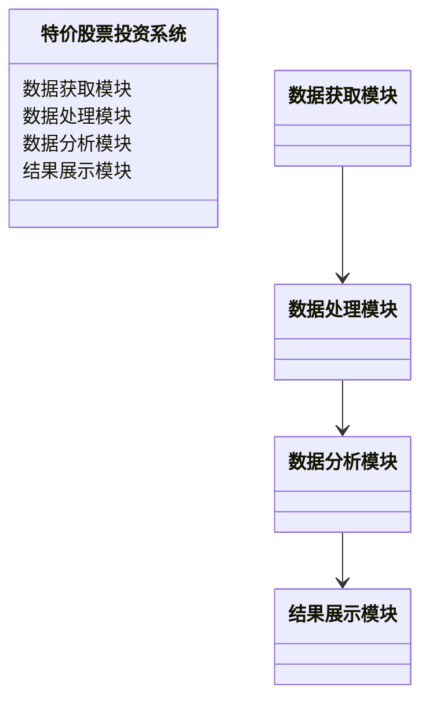
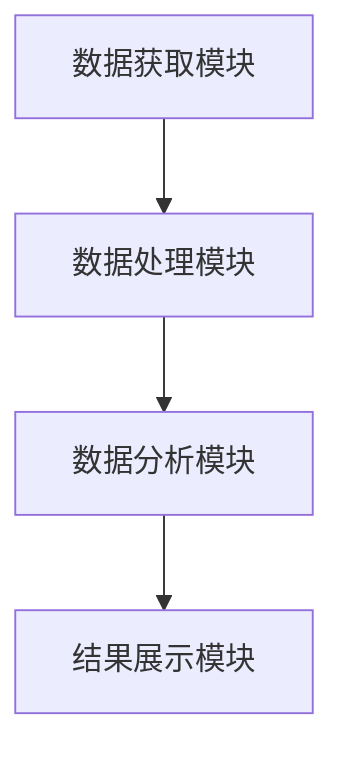
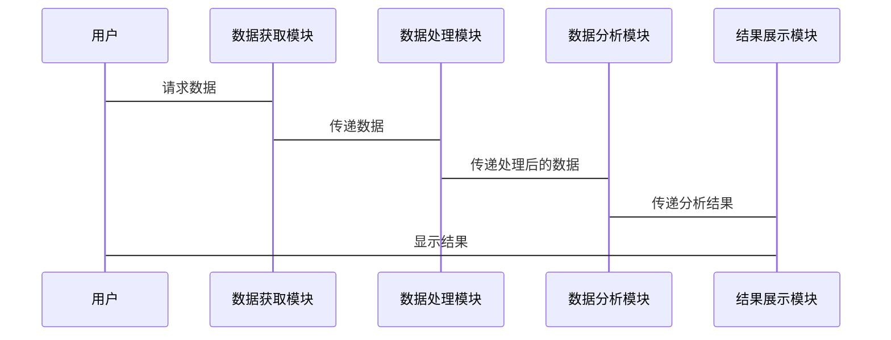

                 


# 特价股票投资中的替代数据分析与应用

> 关键词：特价股票、替代数据、数据分析、股票投资、机器学习

> 摘要：本文深入探讨了特价股票投资中的替代数据分析与应用，从替代数据的定义、收集、处理、分析到系统架构设计，再到项目实战，全面解析了如何利用替代数据提升特价股票投资的效率与准确性。通过实际案例分析和系统设计，本文为读者提供了从理论到实践的完整指南。

---

## 第一部分: 特价股票投资的背景与概述

### 第1章: 特价股票投资的背景与概念

#### 1.1 特价股票的定义与特点

##### 1.1.1 特价股票的定义
特价股票通常指市盈率、市净率等估值指标低于行业平均水平的股票，或具有特殊优惠条件的股票。这些股票通常被认为具有较高的投资价值，但可能存在一定的市场风险。

##### 1.1.2 特价股票的特点
- **低估值**：市盈率、市净率等指标显著低于行业平均水平。
- **高波动性**：价格波动较大，容易受市场情绪影响。
- **信息不对称**：投资者可能难以获取足够的信息来评估其价值。

##### 1.1.3 特价股票与普通股票的区别
- 普通股票：通常具有稳定的估值和较低的波动性。
- 特价股票：估值低但波动性高，信息不对称更为严重。

#### 1.2 特价股票投资的背景

##### 1.2.1 传统股票投资的局限性
- 传统投资依赖财务报表分析，难以捕捉市场情绪和非财务信息。
- 信息滞后性：传统数据来源可能存在延迟，无法及时反映市场变化。

##### 1.2.2 特价股票投资的兴起
- 技术进步：大数据和人工智能技术的快速发展，为替代数据的应用提供了基础。
- 市场需求：投资者对非传统数据的关注度不断提高，推动了特价股票投资的兴起。

##### 1.2.3 特价股票投资的市场环境
- 市场波动性增加：全球市场的不确定性加剧，投资者寻求新的投资策略。
- 数据源丰富：社交媒体、新闻、卫星图像等替代数据的丰富性为投资决策提供了新思路。

---

### 第2章: 替代数据的定义与作用

#### 2.1 替代数据的定义

##### 2.1.1 替代数据的来源
- **社交媒体数据**：Twitter、Facebook等平台上的用户评论和情绪分析。
- **新闻与舆情数据**：新闻标题、财经报道的情绪分析。
- **非传统金融数据**：卫星图像（如港口货物量）、供应链数据等。

##### 2.1.2 替代数据的特点
- 数据类型多样：包括文本、图像、语音等。
- 数据量大：替代数据通常以海量形式存在。
- 数据实时性高：社交媒体和新闻数据通常具有较高的实时性。

##### 2.1.3 替代数据与传统金融数据的对比
| 特性       | 替代数据                     | 传统金融数据             |
|------------|------------------------------|--------------------------|
| 数据类型   | 文本、图像、语音等           | 财务报表、市场指数等     |
| 数据量     | 海量                         | 较小                     |
| 数据实时性 | 高                           | 较低                     |
| 应用场景   | 市场情绪分析、新闻事件影响     | 财务分析、技术分析       |

#### 2.2 替代数据在股票投资中的作用

##### 2.2.1 替代数据的优势
- 提供新的信息来源：替代数据可以捕捉到传统数据无法反映的市场情绪和潜在信息。
- 提高投资决策的及时性：替代数据通常具有较高的实时性，能够帮助投资者更快地做出决策。

##### 2.2.2 替代数据在投资决策中的应用
- **市场情绪分析**：通过社交媒体和新闻数据，分析市场情绪对股价的影响。
- **事件驱动投资**：通过新闻数据，捕捉可能影响股价的重大事件。

##### 2.2.3 替代数据的局限性
- 数据质量参差不齐：替代数据可能存在噪声，需要进行清洗和预处理。
- 数据解释性差：替代数据的分析结果可能缺乏明确的解释性。

---

## 第二部分: 替代数据的收集与处理

### 第3章: 替代数据的收集方法

#### 3.1 数据来源分析

##### 3.1.1 社交媒体数据
- 数据来源：Twitter、Reddit、Facebook等平台。
- 数据类型：文本、情感、用户行为数据。

##### 3.1.2 新闻与舆情数据
- 数据来源：新闻网站、财经媒体、新闻API。
- 数据类型：文本、标题、关键词。

##### 3.1.3 非传统金融数据
- 数据来源：卫星图像、供应链数据、物流信息。
- 数据类型：图像、地理信息、结构化数据。

#### 3.2 数据收集工具与方法

##### 3.2.1 数据爬取工具
- Python库：BeautifulSoup、Scrapy。
- API接口：Twitter API、NewsAPI。

##### 3.2.2 数据预处理步骤
- 数据清洗：去除重复数据、噪声数据。
- 数据转换：文本分词、情感标签化。

---

### 第4章: 替代数据的清洗与预处理

#### 4.1 数据清洗方法

##### 4.1.1 去重与去噪
- 去重：使用哈希表或集合去重。
- 去噪：通过自然语言处理技术去除无关信息。

##### 4.1.2 数据格式统一
- 文本数据：统一编码格式（UTF-8）。
- 结构化数据：统一字段格式。

##### 4.1.3 数据补全与缺失值处理
- 数据补全：使用均值、中位数或插值法填补缺失值。
- 数据删除：删除无法补全的记录。

#### 4.2 数据预处理技术

##### 4.2.1 文本分词与情感分析
- 文本分词：使用jieba库对中文文本进行分词。
- 情感分析：使用机器学习模型（如SVM、随机森林）或深度学习模型（如LSTM）进行情感分类。

##### 4.2.2 数据标准化与归一化
- 数据标准化：使用Z-score标准化。
- 数据归一化：使用Min-Max归一化。

##### 4.2.3 数据特征提取
- 文本特征：TF-IDF、词袋模型。
- 图像特征：主成分分析（PCA）。

---

## 第三部分: 替代数据分析与建模

### 第5章: 文本挖掘与情感分析

#### 5.1 文本挖掘的基本概念

##### 5.1.1 文本挖掘的定义
文本挖掘是指从大量文本数据中提取有用信息的过程，常用于情感分析、关键词提取等任务。

##### 5.1.2 文本挖掘的应用场景
- 情感分析：分析用户对股票的评价情绪。
- 关键词提取：提取与股票相关的关键词。

##### 5.1.3 文本挖掘的关键技术
- 分词：将文本分割成词语或短语。
- 向量表示：将文本转换为向量形式（如Word2Vec）。

#### 5.2 情感分析算法

##### 5.2.1 情感分析的定义
情感分析是指对文本中包含的情感倾向进行分类，通常分为正面、负面和中性三类。

##### 5.2.2 基于机器学习的情感分析
- 特征提取：使用TF-IDF提取文本特征。
- 模型训练：使用SVM或随机森林进行分类。

##### 5.2.3 基于深度学习的情感分析
- 模型选择：使用LSTM或Transformer模型。
- 训练过程：对大规模数据进行预训练和微调。

---

### 第6章: 时间序列分析与预测

#### 6.1 时间序列分析的基本概念

##### 6.1.1 时间序列的定义
时间序列是指按照时间顺序排列的数据，常用于预测未来的趋势。

##### 6.1.2 时间序列分析的应用
- 股价预测：基于历史股价数据预测未来走势。
- 市场情绪预测：基于替代数据预测市场情绪变化。

#### 6.2 时间序列分析的数学模型

##### 6.2.1 ARIMA模型
ARIMA（自回归积分滑动平均模型）是一种常用的时间序列预测模型，其数学公式如下：

$$ ARIMA(p, d, q) $$

其中：
- p：自回归阶数
- d：差分阶数
- q：滑动平均阶数

##### 6.2.2 LSTM模型
LSTM（长短期记忆网络）是一种基于深度学习的时间序列预测模型，其结构包括输入门、遗忘门和输出门。

---

## 第四部分: 系统架构与实现

### 第7章: 系统架构设计

#### 7.1 系统功能设计

##### 7.1.1 领域模型设计


#### 7.2 系统架构设计



#### 7.3 系统接口设计
- 数据获取接口：从社交媒体和新闻网站获取数据。
- 数据处理接口：对获取的数据进行清洗和预处理。
- 数据分析接口：对处理后的数据进行建模和分析。

#### 7.4 系统交互设计



---

## 第五部分: 项目实战

### 第8章: 特价股票投资系统实现

#### 8.1 环境安装

##### 8.1.1 安装Python
```bash
python --version
pip install --upgrade pip
```

##### 8.1.2 安装依赖库
```bash
pip install requests
pip install beautifulsoup4
pip install jieba
pip install pandas
pip install numpy
pip install scikit-learn
pip install keras
pip install tensorflow
```

#### 8.2 核心实现

##### 8.2.1 数据获取
```python
import requests
from bs4 import BeautifulSoup

url = "https://finance.yahoo.com"
response = requests.get(url)
soup = BeautifulSoup(response.text, 'html.parser')
print(soup.title)
```

##### 8.2.2 数据处理
```python
import pandas as pd
import numpy as np

data = pd.DataFrame({
    'date': ['2023-01-01', '2023-01-02', '2023-01-03'],
    'price': [100, 101, 102]
})

data['price'] = data['price'].apply(lambda x: x + np.random.normal(0, 1))
print(data)
```

##### 8.2.3 数据分析
```python
from sklearn.model_selection import train_test_split
from sklearn.linear_model import LinearRegression

X = data[['date']]
y = data['price']

X_train, X_test, y_train, y_test = train_test_split(X, y, test_size=0.2)

model = LinearRegression()
model.fit(X_train, y_train)

predictions = model.predict(X_test)
print('Predictions:', predictions)
```

#### 8.3 项目小结
通过实际案例分析，我们展示了如何利用替代数据进行特价股票投资。从数据获取到数据分析，整个过程需要结合多种技术手段，包括数据清洗、文本挖掘和机器学习等。

---

## 第六部分: 总结与展望

### 第9章: 总结与展望

#### 9.1 总结
本文从替代数据的定义、收集、处理、分析到系统架构设计，全面探讨了替代数据在特价股票投资中的应用。通过实际案例分析，我们展示了如何利用替代数据提升投资决策的效率和准确性。

#### 9.2 展望
未来，随着技术的不断进步，替代数据的应用将更加广泛。投资者可以利用更多的数据源和更先进的分析方法，进一步提升投资决策的精准度。

---

## 作者：AI天才研究院/AI Genius Institute & 禅与计算机程序设计艺术 /Zen And The Art of Computer Programming

