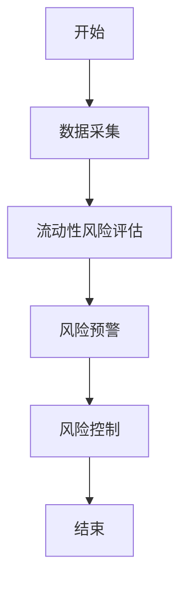

                 


# 特价股票投资中的流动性风险管理

## 关键词：流动性风险管理、特价股票、投资风险、量化分析、系统架构

## 摘要：流动性风险管理在特价股票投资中至关重要。本文通过分析流动性风险的成因、量化方法及系统实现，提出了一套完整的流动性风险管理解决方案，帮助投资者有效规避风险。

---

# 第一部分: 特价股票投资中的流动性风险管理概述

## 第1章: 流动性风险管理的背景与概念

### 1.1 流动性风险管理的背景

#### 1.1.1 特价股票的定义与特点
特价股票通常指价格较低、流通性较差的股票，具有高波动性和高风险的特点。

#### 1.1.2 流动性风险的定义与特征
流动性风险指资产在不损失价值的情况下快速变现的能力不足所导致的风险。

#### 1.1.3 特价股票投资中的流动性风险问题
特价股票的低流动性可能导致投资者难以以合理价格买卖股票，影响投资回报。

### 1.2 流动性风险管理的重要性

#### 1.2.1 流动性风险对投资的影响
流动性风险可能导致投资损失或错过投资机会。

#### 1.2.2 特价股票投资中的流动性风险特点
特价股票的流动性风险主要体现在交易量小、买卖价差大、市场深度不足等方面。

#### 1.2.3 管理流动性风险的必要性
通过有效的流动性风险管理，投资者可以降低投资风险，提高投资收益。

## 第2章: 流动性风险管理的核心概念

### 2.1 流动性风险的成因分析

#### 2.1.1 市场流动性因素
市场整体流动性不足可能导致个股流动性下降。

#### 2.1.2 资金流动性因素
投资者资金流动不畅可能导致无法及时买入或卖出股票。

#### 2.1.3 个股流动性因素
个股自身的交易量、市场深度等因素影响流动性风险。

### 2.2 流动性风险的评估方法

#### 2.2.1 流动性比率分析
通过分析股票的成交额、换手率等指标评估流动性风险。

#### 2.2.2 缺口分析
计算股票的买卖价差，评估流动性风险。

#### 2.2.3 量化分析方法
使用数学模型和算法量化流动性风险，提供更准确的评估。

### 2.3 流动性风险管理的目标与原则

#### 2.3.1 管理目标
确保投资者能够在合理价格下快速买卖股票，降低流动性风险。

#### 2.3.2 管理原则
流动性风险管理应遵循分散投资、动态调整、实时监控等原则。

---

# 第二部分: 流动性风险管理的核心理论

## 第3章: 流动性风险的量化分析

### 3.1 流动性风险的数学模型

#### 3.1.1 流动性缺口模型
通过分析股票的买卖订单量差异，评估流动性缺口。

#### 3.1.2 流动性风险价值模型（VaR）
使用VaR模型量化流动性风险的价值，评估潜在损失。

#### 3.1.3 流动性风险的度量公式
$$ VaR = \sqrt{2 \times \sigma^2 \times T} $$
其中，$\sigma$为流动性风险的标准差，$T$为时间跨度。

### 3.2 流动性风险的量化方法

#### 3.2.1 时间序列分析
通过分析股票价格的时间序列，预测流动性风险的变化。

#### 3.2.2 聚类分析
将流动性风险高的股票归为一类，进行集中管理。

#### 3.2.3 风险因子分析
分析影响流动性风险的因素，如市场波动、交易量等。

## 第4章: 流动性风险管理的算法实现

### 4.1 流动性风险管理算法概述

#### 4.1.1 常见的流动性风险管理算法
包括流动性缺口算法、VaR算法、聚类分析算法等。

#### 4.1.2 算法选择与优化
根据具体需求选择合适的算法，并进行优化以提高效率。

### 4.2 流动性风险管理的Mermaid流程图



### 4.3 流动性风险管理的Python实现

#### 4.3.1 环境安装与配置
安装必要的Python库，如Pandas、NumPy等。

#### 4.3.2 核心算法实现
```python
import pandas as pd
import numpy as np

def calculate_gap(data):
    # 计算买卖订单量差异
    return data['buy'] - data['sell']

# 示例数据
data = pd.DataFrame({
    'buy': [100, 200, 300],
    'sell': [80, 180, 280]
})

gap = calculate_gap(data)
print(gap)
```

---

# 第三部分: 流动性风险管理的系统架构与实现

## 第5章: 流动性风险管理系统的功能设计

### 5.1 系统功能模块划分

#### 5.1.1 数据采集模块
负责采集股票的实时交易数据。

#### 5.1.2 流动性风险评估模块
使用算法对股票的流动性风险进行评估。

#### 5.1.3 风险预警模块
当流动性风险超过阈值时，触发预警。

#### 5.1.4 风险控制模块
根据预警结果，采取相应的风险控制措施。

### 5.2 系统架构设计


### 5.3 系统交互设计


---

# 结论

流动性风险管理在特价股票投资中至关重要。通过量化分析和系统实现，投资者可以有效降低流动性风险，提高投资收益。本文提供了完整的流动性风险管理解决方案，帮助投资者在特价股票投资中规避风险，实现稳健投资。

---

作者：AI天才研究院/AI Genius Institute & 禅与计算机程序设计艺术/Zen And The Art of Computer Programming

