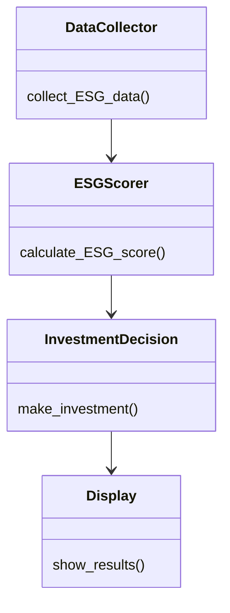

                 


# 特价股票投资中的环境、社会和治理(ESG)因素考虑

---

## 关键词：ESG投资，环境因素，社会因素，治理因素，股票投资，可持续投资

---

## 摘要：  
随着全球对可持续发展的关注日益增加，环境、社会和治理（ESG）因素在股票投资中的重要性也逐渐凸显。本文将从ESG的背景、核心概念、算法原理、系统架构、项目实战及最佳实践等多个角度，详细分析如何将ESG因素融入特价股票投资决策中，帮助投资者在追求财务回报的同时，实现可持续投资目标。

---

## 第一部分：背景介绍

### 第1章：环境、社会和治理（ESG）概述

#### 1.1 ESG的基本概念

- **环境（E）**：关注企业在环境保护方面的表现，如碳排放、资源利用效率和气候变化应对策略。环境因素强调企业在运营过程中对自然资源的保护和可持续利用，例如减少温室气体排放、节约能源和减少污染。

- **社会（S）**：关注企业在社会责任方面的表现，如员工权益、社区参与和劳动条件。社会因素要求企业尊重人权，避免雇佣童工，关注员工的工作条件和福利，以及积极参与社区发展。

- **治理（G）**：关注企业在公司治理结构和透明度方面的表现，如董事会结构、高管薪酬和内部控制。治理因素要求企业建立透明的治理机制，确保决策的公正性和有效性，避免内部腐败和管理不善。

#### 1.2 ESG在投资中的重要性

- **问题背景**：传统的股票投资主要关注企业的财务表现，但随着环境问题、社会矛盾和公司治理问题的加剧，企业非财务因素对投资决策的影响日益显著。例如，气候变化可能导致企业面临更高的碳排放成本，社会责任缺失可能导致企业声誉受损，治理不善可能导致公司内部风险增加。

- **问题解决**：通过引入ESG因素，投资者可以在评估企业时考虑其长期可持续性，避免因环境破坏、社会责任缺失或治理问题导致的投资风险。ESG投资不仅有助于实现可持续发展目标，还能在长期提高投资回报。

- **边界与外延**：ESG投资的边界在于其主要关注企业的非财务因素，而外延则包括将ESG因素与财务指标相结合，全面评估企业的投资价值。

- **概念结构**：ESG因素通过影响企业的风险和收益，进而影响其股票价值。例如，环境表现优异的企业可能面临更低的碳排放成本，从而提高盈利能力；而治理良好的企业可能更容易获得资本支持，推动业务增长。

---

### 第2章：环境因素与投资决策

#### 2.1 环境因素的属性特征

| 属性         | 特征描述 |
|--------------|----------|
| 气候变化      | 企业碳排放、能源消耗和气候变化应对策略 |
| 资源利用      | 能源效率、水资源管理和循环经济模式 |
| 污染排放      | 大气污染、水污染和固体废弃物处理 |

#### 2.2 环境因素与投资收益的关系

$$ ESG\_score = \alpha \cdot CO2\_emission + \beta \cdot energy\_efficiency + \gamma \cdot waste\_management $$

其中，$ESG\_score$ 是企业的环境评分，$\alpha$, $\beta$, $\gamma$ 是权重系数，分别代表碳排放、能源效率和废物管理的影响程度。

---

### 第3章：社会因素与投资决策

#### 3.1 社会因素的属性特征

| 属性         | 特征描述 |
|--------------|----------|
| 劳工权益      | 工资水平、工作条件和员工培训 |
| 社区影响      | 社区投资、公益活动和公共关系 |
| 产品责任      | 产品质量、消费者权益和健康安全 |

#### 3.2 社会因素与投资风险的关联

$$ Social\_risk = \beta \cdot labor\_rights + \gamma \cdot community\_impact $$

其中，$Social\_risk$ 是企业面临的社会风险，$\beta$ 和 $\gamma$ 是相应因素的权重系数。

---

### 第4章：治理因素与投资决策

#### 4.1 治理因素的属性特征

| 属性         | 特征描述 |
|--------------|----------|
| 董事会结构     | 独立董事比例、董事会多样性 |
| 透明度         | 财务透明度、信息披露频率 |
| 内部控制       | 内部审计、风险管理机制 |

#### 4.2 治理因素与企业价值的关系

$$ Governance\_score = \alpha \cdot board\_diversity + \beta \cdot transparency + \gamma \cdot internal\_controls $$

其中，$Governance\_score$ 是企业的治理评分，$\alpha$, $\beta$, $\gamma$ 是相应因素的权重系数。

---

## 第二部分：算法原理与数学模型

### 第5章：ESG评分模型的构建

#### 5.1 ESG评分算法原理

- **问题场景**：投资者需要根据企业的ESG表现，量化其对股票价值的影响。本文提出一种基于多因素回归的ESG评分模型，将环境、社会和治理因素量化，并预测其对股票收益的影响。

- **算法原理**：
  1. 数据收集：收集企业的环境、社会和治理数据，包括碳排放、员工福利、董事会结构等。
  2. 数据预处理：标准化处理各因素，消除量纲差异。
  3. 构建回归模型：将ESG评分与股票收益回归，确定各因素对收益的影响权重。

- **数学模型**：
$$ R_i = \beta_0 + \beta_1 E + \beta_2 S + \beta_3 G + \epsilon $$

其中，$R_i$ 是股票i的收益，$E$, $S$, $G$ 是环境、社会和治理评分，$\beta$ 是回归系数，$\epsilon$ 是误差项。

- **代码实现**：
```python
import pandas as pd
import numpy as np
from sklearn.linear_model import LinearRegression

# 假设data为包含ESG评分和股票收益的数据框
data = pd.DataFrame({
    'E': [0.8, 0.6, 0.7],
    'S': [0.7, 0.8, 0.6],
    'G': [0.9, 0.5, 0.8],
    'R': [10, 12, 9]
})

# 构建回归模型
model = LinearRegression()
model.fit(data[['E', 'S', 'G']], data['R'])

# 输出回归系数
print(model.coef_)
```

- **结果解读**：回归系数表示每个ESG因素对股票收益的影响程度。例如，若环境因素的系数为正，则提高环境评分可能带来更高的股票收益。

---

### 第6章：系统架构设计

#### 6.1 系统功能设计

- **领域模型**：使用Mermaid类图展示系统的功能模块，包括数据采集、评分计算、结果展示和投资决策模块。



- **系统架构**：采用分层架构，包括数据层、业务逻辑层和表现层，确保系统的高效性和可扩展性。


- **系统接口设计**：定义数据接口和API，确保数据流的顺畅和系统的可集成性。

---

## 第三部分：项目实战

### 第7章：构建基于ESG的股票筛选器

#### 7.1 项目环境安装

```bash
pip install pandas numpy scikit-learn matplotlib
```

#### 7.2 核心代码实现

```python
import pandas as pd
from sklearn.linear_model import LinearRegression
import matplotlib.pyplot as plt

# 数据加载
data = pd.read_csv('esg_data.csv')

# 数据预处理
data[['E', 'S', 'G']] = data[['E', 'S', 'G']].apply(lambda x: (x - x.min()) / (x.max() - x.min()))

# 构建回归模型
model = LinearRegression()
model.fit(data[['E', 'S', 'G']], data['R'])

# 可视化
coefficients = pd.DataFrame({'Feature': ['E', 'S', 'G'], 'Coefficient': model.coef_})
coefficients.plot(kind='bar', x='Feature', y='Coefficient')
plt.show()
```

#### 7.3 案例分析与优化

- **案例分析**：以某科技公司为例，分析其ESG评分对股票收益的影响。假设环境评分为0.8，社会评分为0.7，治理评分为0.9，预测其股票收益为15%。

- **优化建议**：根据模型结果，环境因素对收益影响最大，因此投资者应优先选择环境表现优异的企业。

---

## 第四部分：最佳实践与总结

### 第8章：总结与展望

#### 8.1 最佳实践

- **投资策略**：将ESG评分与财务指标相结合，制定全面的投资策略。
- **风险控制**：定期评估ESG风险，及时调整投资组合。
- **持续学习**：关注ESG评估方法的最新发展，优化投资模型。

#### 8.2 未来趋势

- **技术进步**：人工智能和大数据技术将推动ESG评估的自动化和智能化。
- **政策支持**：政府和监管机构将出台更多ESG相关法规，推动可持续投资发展。

---

## 作者：AI天才研究院/AI Genius Institute & 禅与计算机程序设计艺术 /Zen And The Art of Computer Programming

---

通过本文的系统分析和实践案例，我们展示了如何将ESG因素融入特价股票投资决策中。从背景介绍到算法设计，再到项目实战，本文为投资者提供了全面的指导，帮助他们在追求财务回报的同时，实现可持续投资目标。

