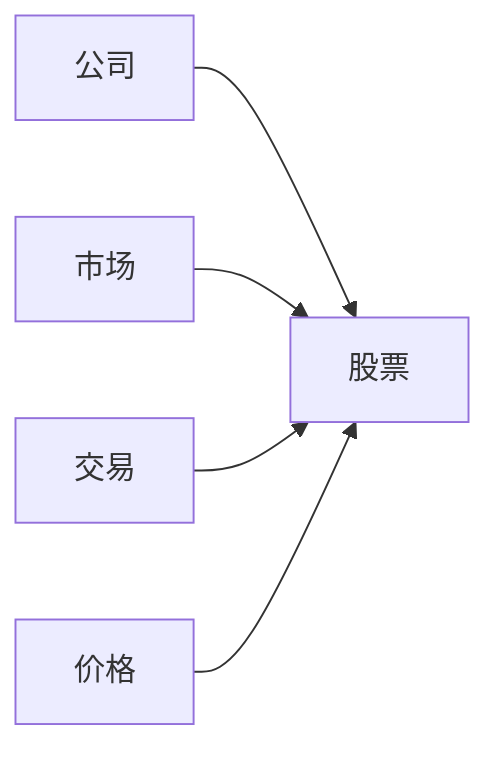
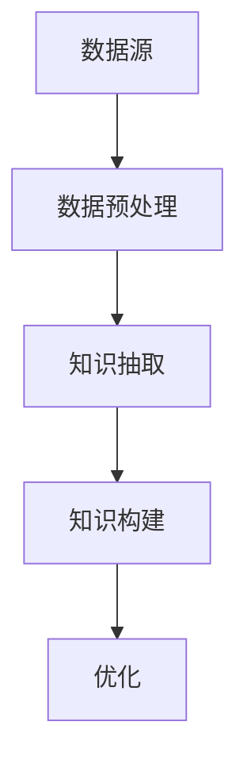
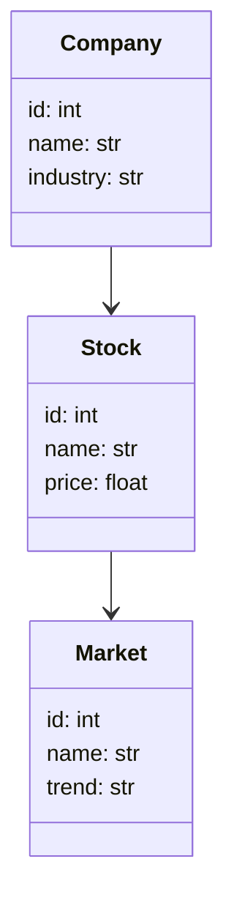
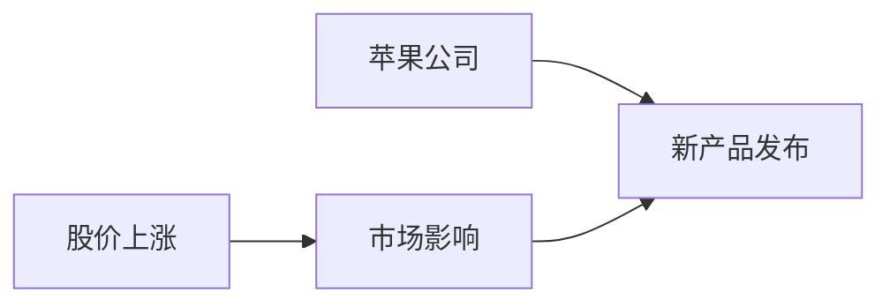

                 


# 特价股票投资中的知识图谱模型构建与优化

## 关键词
- 知识图谱
- 特价股票投资
- 知识图谱构建
- 知识图谱优化
- 股票数据分析
- 人工智能

## 摘要
本文详细探讨了知识图谱在特价股票投资中的构建与优化方法。通过分析股票市场中的实体关系和语义信息，构建高效的知识图谱模型，从而为投资决策提供更精准的支持。文章从背景、概念、算法、系统架构到实战案例，全面解析了知识图谱在金融领域的应用，并提出了优化策略和未来发展方向。

---

# 第1章: 知识图谱与特价股票投资概述

## 1.1 知识图谱的基本概念
### 1.1.1 知识图谱的定义
知识图谱是一种以图结构形式表示知识的语义网络，由实体（节点）和关系（边）组成。实体可以是具体的事物（如公司、股票、市场等），关系描述实体之间的关联（如“公司发行股票”、“股票属于市场”等）。知识图谱通过语义信息的组织，能够有效支持复杂关系的分析与推理。

### 1.1.2 知识图谱的核心特点
- **语义性**：通过实体和关系的语义信息，描述事物之间的关联。
- **结构化**：知识以图结构形式组织，便于计算机理解和推理。
- **动态性**：能够实时更新，反映市场的最新动态。

### 1.1.3 知识图谱与传统数据库的区别
| 属性 | 传统数据库 | 知识图谱 |
|------|-------------|----------|
| 数据结构 | 行数据，关系有限 | 图结构，支持复杂关系 |
| 查询能力 | 基于关系的查询 | 支持语义推理 |
| 应用场景 | 结构化数据分析 | 语义网络分析 |

## 1.2 特价股票投资的背景与需求
### 1.2.1 特价股票投资的定义
特价股票投资是指在特定市场环境下，利用价格波动、市场情绪、公司基本面等信息，寻找被低估的股票进行投资，以获取超额收益。

### 1.2.2 特价股票投资的核心问题
- **信息分散**：股票市场数据分散在多个来源，难以整合。
- **关系复杂**：股票与公司、市场、新闻等实体之间的关系错综复杂。
- **实时性要求高**：需要快速分析市场动态，做出投资决策。

### 1.2.3 知识图谱在特价股票投资中的应用价值
- **语义关联**：通过知识图谱，可以发现隐含的市场关联。
- **决策支持**：基于知识图谱的语义推理，提供投资建议。
- **实时更新**：快速反映市场变化，支持动态决策。

## 1.3 知识图谱在金融领域的应用现状
### 1.3.1 金融领域的知识图谱应用案例
- **风险评估**：通过分析公司间的关联关系，评估投资风险。
- **市场情绪分析**：利用新闻数据构建市场情绪图谱。
- **智能投顾**：基于知识图谱提供个性化投资建议。

### 1.3.2 知识图谱在股票投资中的优势
- **全局视角**：能够从整体上把握市场动态。
- **语义推理**：支持复杂关系的分析与推理。
- **实时更新**：能够快速响应市场变化。

### 1.3.3 当前应用中的挑战与不足
- **数据质量**：市场数据复杂且多源，清洗难度大。
- **计算效率**：大规模图数据的存储与查询效率问题。
- **模型优化**：如何提升知识图谱的准确性和实时性。

---

# 第2章: 特价股票投资中的知识图谱核心概念与联系

## 2.1 知识图谱的核心概念原理
### 2.1.1 实体与属性
- **实体**：股票、公司、市场等具体事物。
- **属性**：如股票的价格、成交量等。

### 2.1.2 关系与规则
- **关系**：如“公司发行股票”、“股票属于市场”。
- **规则**：如市场趋势预测规则。

### 2.1.3 图结构与语义网络
- **图结构**：通过节点和边表示实体及关系。
- **语义网络**：通过语义关联描述市场动态。

## 2.2 核心概念属性对比表格
| 概念 | 属性 | 描述 |
|------|------|------|
| 实体 | 类型 | 公司、股票、市场等 |
| 关系 | 类型 | 股票属于市场，公司发行股票等 |
| 属性 | 类型 | 价格、成交量等 |

## 2.3 ER实体关系图架构



---

# 第3章: 知识图谱构建与优化的算法原理

## 3.1 知识图谱构建流程
### 3.1.1 数据采集
- **数据来源**：股票数据、公司信息、新闻数据等。
- **数据清洗**：去除重复、错误数据。

### 3.1.2 数据预处理
- **实体识别**：识别文本中的实体。
- **关系抽取**：提取实体之间的关系。

### 3.1.3 知识抽取与构建
- **知识抽取**：从文本中提取语义信息。
- **知识构建**：构建知识图谱的节点和边。

### 3.1.4 知识融合与优化
- **知识融合**：整合多个数据源的知识。
- **知识优化**：消除冗余，提升准确率。

## 3.2 算法原理图



## 3.3 算法实现代码
```python
# 知识图谱构建示例代码
from kgtoolkit import *

def build_kg():
    kg = KnowledgeGraph()
    # 添加实体
    company = kg.add_entity("公司", "Company")
    stock = kg.add_entity("股票", "Stock")
    market = kg.add_entity("市场", "Market")
    # 添加关系
    kg.add_relation(company, "发行", stock)
    kg.add_relation(stock, "属于", market)
    return kg

if __name__ == "__main__":
    kg = build_kg()
    kg.visualize()
```

---

# 第4章: 数学模型与优化策略

## 4.1 知识图谱的数学模型
### 4.1.1 图嵌入模型
- **Node2Vec**：通过节点嵌入表示节点的语义信息。
- **公式**：$$ node\_embedding = f(node, context) $$

### 4.1.2 关系推理模型
- **TransE**：通过向量空间表示关系。
- **公式**：$$ head + relation = tail $$

## 4.2 优化策略
### 4.2.1 实体对齐
- **目标**：消除数据中的冗余和冲突。
- **方法**：基于相似度的对齐算法。

### 4.2.2 动态更新
- **目标**：实时更新知识图谱。
- **方法**：基于流数据的增量更新。

---

# 第5章: 系统分析与架构设计方案

## 5.1 问题场景介绍
- **目标**：构建一个支持特价股票投资的知识图谱系统。
- **需求**：支持实时数据接入、知识构建与推理。

## 5.2 系统功能设计
### 5.2.1 领域模型设计


### 5.2.2 系统架构设计


## 5.3 系统接口设计
- **输入接口**：实时数据接口。
- **输出接口**：推理结果接口。

---

# 第6章: 项目实战与案例分析

## 6.1 环境安装
- **工具**：Python、KnowledgeGraph库。

## 6.2 核心代码实现
```python
from kgtoolkit import *

def main():
    # 数据采集
    data = load_data("stock_data.csv")
    # 数据预处理
    preprocessed_data = preprocess(data)
    # 知识构建
    kg = build_kg(preprocessed_data)
    # 知识推理
    result = kg推理("苹果公司", "市场影响")
    # 输出结果
    print(result)

if __name__ == "__main__":
    main()
```

## 6.3 实际案例分析
### 6.3.1 案例背景
- **公司**：苹果公司。
- **事件**：新产品发布会。

### 6.3.2 知识图谱构建与分析


## 6.4 项目小结
- **收获**：掌握了知识图谱的构建与优化方法。
- **挑战**：数据清洗与模型优化。

---

# 第7章: 最佳实践与未来展望

## 7.1 最佳实践
### 7.1.1 数据质量管理
- **建议**：多源数据融合，提升数据质量。

### 7.1.2 模型优化
- **建议**：结合深度学习，提升模型准确性。

## 7.2 小结
知识图谱在特价股票投资中的应用前景广阔，通过构建高效的语义网络，可以为投资决策提供有力支持。

## 7.3 注意事项
- **数据隐私**：注意数据的隐私保护。
- **模型鲁棒性**：确保模型的稳定性和准确性。

## 7.4 拓展阅读
- **推荐书籍**：《知识图谱：概念、方法与应用》。
- **推荐博客**：AI天才研究院。

---

# 作者
作者：AI天才研究院/AI Genius Institute  
作者：禅与计算机程序设计艺术/Zen And The Art of Computer Programming

