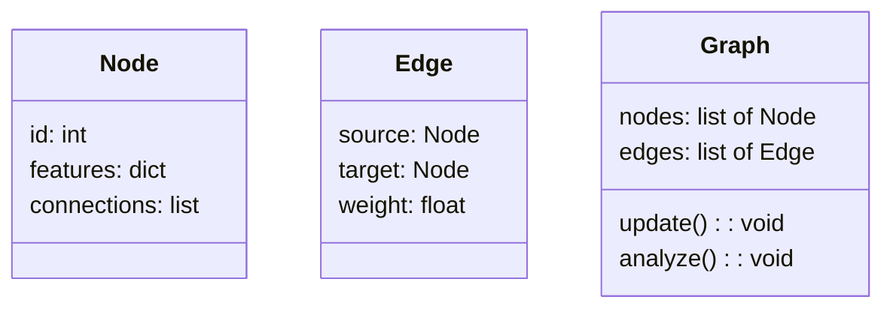
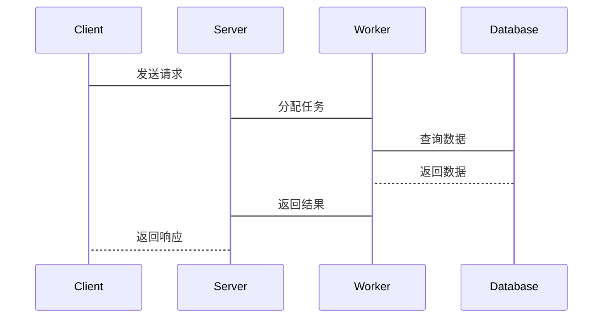

                 


# 特价股票投资中的社交图谱动态分析与应用

## 关键词：特价股票、社交图谱、动态分析、网络分析、股票投资

## 摘要：本文探讨了如何利用社交图谱的动态分析方法来优化特价股票投资策略。通过构建社交网络模型，分析用户行为和市场情绪，预测股票价格波动，帮助投资者做出更明智的投资决策。

---

# 第1章: 特价股票投资与社交图谱概述

## 1.1 特价股票投资的背景与意义
### 1.1.1 特价股票的定义与特点
- 特价股票是指价格低于面值的股票，通常具有较高的投资潜力。
- 特点包括低估值、高成长性和潜在的市场反弹机会。

### 1.1.2 特价股票投资的市场现状
- 投资者普遍关注低价股票，但市场波动较大，投资风险较高。
- 需要借助数据分析工具来提高投资决策的准确性。

### 1.1.3 社交图谱在股票投资中的潜力
- 社交网络数据可以反映市场情绪和投资者行为。
- 通过分析社交图谱，可以预测股票价格的变化趋势。

## 1.2 社交图谱的基本概念
### 1.2.1 社交图谱的定义与特征
- 社交图谱是社交网络的结构化表示，由节点和边组成。
- 节点代表用户，边代表用户之间的互动关系。

### 1.2.2 社交图谱在金融领域的应用
- 用于分析市场情绪、预测价格波动和识别投资机会。
- 通过社交网络的影响力，发现潜在的市场趋势。

### 1.2.3 动态分析的必要性与挑战
- 动态分析需要实时更新社交图谱，捕捉市场变化。
- 挑战包括数据量大、计算复杂和隐私保护等问题。

## 1.3 动态分析的核心要素
### 1.3.1 动态分析的定义与方法
- 动态分析是指对社交图谱随时间变化的模式进行分析。
- 方法包括时间序列分析、网络流分析和异常检测。

### 1.3.2 社交图谱的动态特征提取
- 提取节点的度数、中心性、聚类系数等特征。
- 通过动态特征变化，识别关键节点和趋势变化。

### 1.3.3 动态分析在股票投资中的应用价值
- 帮助投资者发现市场趋势，识别投资机会。
- 提高投资决策的准确性和及时性。

---

# 第2章: 特价股票投资中的社交图谱动态分析原理

## 2.1 社交图谱动态分析的理论基础
### 2.1.1 图论与网络分析基础
- 图论是社交图谱分析的基础，包括节点、边和子图的概念。
- 网络分析方法如PageRank和Louvain算法用于发现社区结构。

### 2.1.2 社交网络的特征与度量
- 度数：节点的连接数，反映节点的影响力。
- 中心性：节点在网络中的中心程度，反映节点的重要性。
- 聚类系数：节点邻居之间的连接密度，反映社区凝聚力。

### 2.1.3 动态网络分析的数学模型
- 动态网络模型表示社交图谱随时间的变化。
- 时间序列模型如ARIMA用于预测网络的变化趋势。

## 2.2 特价股票投资中的社交图谱构建
### 2.2.1 数据来源与采集方法
- 数据来源包括社交媒体、新闻网站和股票论坛。
- 数据采集方法如爬虫和API接口获取实时数据。

### 2.2.2 社交图谱的构建流程
1. 数据清洗：去除无效数据和重复信息。
2. 数据预处理：标准化和格式化数据。
3. 图谱构建：建立节点和边的关系，形成社交图谱。

### 2.2.3 图谱的存储与管理
- 使用图数据库如Neo4j存储社交图谱数据。
- 采用分布式存储和索引技术提高查询效率。

## 2.3 动态分析的核心算法
### 2.3.1 基于图的动态分析算法
- 算法流程：实时更新图谱，计算动态特征，识别异常变化。

### 2.3.2 时间序列分析与动态网络模型
- 使用LSTM网络预测社交图谱的动态变化。
- 模型公式：$$ y_t = \alpha y_{t-1} + \beta y_{t-2} + \epsilon_t $$

### 2.3.3 异常检测与趋势预测
- 异常检测方法：基于统计的孤立森林算法。
- 趋势预测方法：基于聚类的时间序列分析。

---

# 第3章: 基于社交图谱的动态分析算法实现

## 3.1 动态网络分析算法概述
### 3.1.1 基于邻接矩阵的动态分析
- 邻接矩阵表示节点之间的连接关系。
- 动态分析通过矩阵变化检测网络结构的变化。

### 3.1.2 基于边的动态变化检测
- 监测边的添加和删除，识别网络的结构变化。
- 使用边变化率公式：$$ \text{变化率} = \frac{\Delta E}{E} \times 100\% $$

### 3.1.3 基于节点的动态行为分析
- 分析节点的活跃度和影响力变化。
- 使用节点度数变化公式：$$ \Delta d = d_t - d_{t-1} $$

## 3.2 基于社交图谱的动态分析算法
### 3.2.1 算法原理与流程
1. 数据采集：实时获取社交网络数据。
2. 图谱构建：更新社交图谱。
3. 动态特征提取：计算节点和边的动态特征。
4. 异常检测：识别异常变化。
5. 趋势预测：预测网络的未来状态。

### 3.2.2 算法实现的数学模型
- 异常检测模型：$$ \text{异常得分} = \sum_{i=1}^{n} w_i \cdot x_i $$
- 趋势预测模型：$$ y_t = \beta_0 + \beta_1 t + \epsilon_t $$

### 3.2.3 算法实现的Python代码
```python
import networkx as nx
from sklearn.ensemble import IsolationForest

def dynamic_analysis(graph, time_steps):
    for t in range(time_steps):
        current_graph = graph.get_graph_at_time(t)
        # 计算节点度数
        degrees = {node: len(current_graph[node]) for node in current_graph}
        # 检测异常节点
        anomalies = isolation_forest(degrees)
    return anomalies

def isolation_forest(degrees):
    model = IsolationForest(random_state=42)
    model.fit(list(degrees.values()))
    anomalies = model.predict(list(degrees.values()))
    return anomalies
```

---

# 第4章: 系统分析与架构设计

## 4.1 问题场景介绍
- 项目目标：构建基于社交图谱的动态分析系统。
- 项目范围：覆盖数据采集、图谱构建、动态分析和结果展示。

## 4.2 系统功能设计
### 4.2.1 领域模型图


### 4.2.2 系统架构设计


### 4.2.3 系统接口设计
- API接口：RESTful API提供数据查询和分析结果。
- 数据接口：与第三方数据源对接，获取实时数据。

### 4.2.4 系统交互流程


---

# 第5章: 项目实战

## 5.1 环境安装
- 安装必要的库：networkx、numpy、pandas、scikit-learn。

## 5.2 系统核心实现
### 5.2.1 数据采集模块
- 使用爬虫获取社交媒体数据。
- 示例代码：
  ```python
  import requests
  from bs4 import BeautifulSoup

  def fetch_data(url):
      response = requests.get(url)
      soup = BeautifulSoup(response.text, 'html.parser')
      # 提取数据并返回
      return data
  ```

### 5.2.2 动态分析模块
- 实现动态分析算法，识别异常节点。
- 示例代码：
  ```python
  def dynamic_analysis(graph):
      # 提取动态特征
      features = extract_features(graph)
      # 异常检测
      anomalies = detect_anomalies(features)
      return anomalies
  ```

### 5.2.3 结果展示模块
- 使用可视化工具展示分析结果，如Matplotlib和Plotly。

## 5.3 代码应用解读与分析
- 通过实际案例展示如何应用上述代码进行分析。
- 分析结果包括市场情绪变化和投资建议。

## 5.4 案例分析与详细讲解
- 选取具体案例，分析社交图谱的动态变化。
- 通过图表展示分析结果，验证算法的有效性。

## 5.5 项目小结
- 总结项目实现的关键步骤和成果。
- 强调动态分析在投资决策中的重要性。

---

# 第6章: 最佳实践、小结与拓展

## 6.1 最佳实践 tips
- 数据隐私保护：遵守相关法律法规，保护用户隐私。
- 模型优化：定期更新模型，提高分析精度。
- 实时性优化：采用分布式计算和流处理技术。

## 6.2 小结
- 本文详细介绍了社交图谱动态分析在特价股票投资中的应用。
- 展示了如何利用社交网络数据，优化投资策略。

## 6.3 注意事项
- 数据来源的可靠性：确保数据的准确性和及时性。
- 模型的适应性：根据市场变化调整模型参数。
- 风险管理：合理控制投资风险，避免过度依赖模型。

## 6.4 拓展阅读
- 推荐相关书籍和论文，供读者深入学习。
- 提供在线资源和工具，帮助读者实践。

---

# 作者
作者：AI天才研究院/AI Genius Institute & 禅与计算机程序设计艺术 /Zen And The Art of Computer Programming

---

希望这篇文章能为读者提供有价值的信息，帮助他们在特价股票投资中更好地利用社交图谱的动态分析方法。

