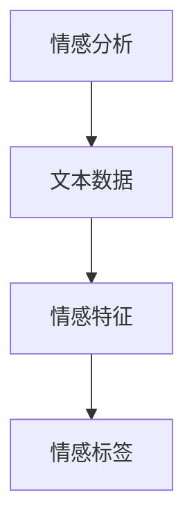
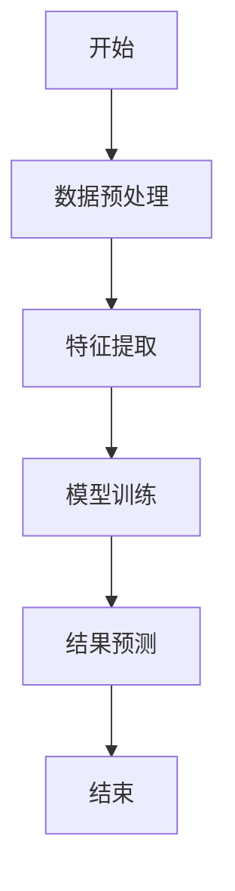
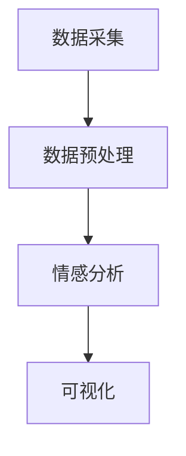

                 


# 特价股票投资中的社交媒体情绪动态分析与应用

> 关键词：特价股票投资、社交媒体情绪分析、自然语言处理、情感分类算法、投资决策支持系统

> 摘要：本文深入探讨了在特价股票投资中，社交媒体情绪动态分析的应用及其对投资决策的支持作用。通过分析社交媒体上的文本数据，提取市场情绪特征，构建情感分类模型，并结合实际案例，展示了如何利用社交媒体情绪分析技术优化投资策略。文章详细介绍了情绪分析的核心概念、算法实现、系统架构设计以及项目实战，为投资者提供了一套基于社交媒体情绪分析的决策支持系统。

---

# 第一部分: 特价股票投资中的社交媒体情绪动态分析与应用概述

---

## 第1章: 特价股票投资与社交媒体情绪分析的背景

### 1.1 特价股票投资的背景与现状

#### 1.1.1 特价股票的定义与特点
特价股票通常指价格较低的股票，具有高波动性和高风险的特点。这类股票通常属于小盘股或新兴行业，具有较大的增长潜力。投资者在特价股票投资中需要关注市场情绪、公司基本面和技术指标的综合影响。

#### 1.1.2 特价股票投资的现状与趋势
随着金融市场的不断发展，特价股票投资逐渐受到更多投资者的关注。然而，由于其高波动性和不确定性，投资者需要借助更多的工具和技术来优化决策过程。

#### 1.1.3 特价股票投资中的机会与挑战
- 机会：特价股票可能因市场情绪波动或公司基本面改善而出现短期快速上涨。
- 挑战：市场情绪的不可预测性和信息噪声可能导致投资决策失误。

---

### 1.2 社交媒体在金融领域的应用

#### 1.2.1 社交媒体在金融分析中的作用
社交媒体已成为投资者获取市场信息和情感的重要渠道。社交媒体上的海量数据包含了投资者对市场的看法、情绪和预期，这些信息可以用于分析市场趋势和预测股票价格波动。

#### 1.2.2 社交媒体数据的特点与优势
- 数据量大：社交媒体每天产生海量的文本、图片和视频数据。
- 数据实时性：社交媒体数据能够反映市场的实时动态。
- 数据多样性：社交媒体数据包括用户评论、新闻标题、博主观点等多种形式。

#### 1.2.3 社交媒体情绪分析的定义与目标
社交媒体情绪分析是指通过自然语言处理技术，对社交媒体上的文本数据进行分析，提取其中的情感倾向和情绪强度。其目标是帮助投资者理解市场情绪，优化投资决策。

---

### 1.3 特价股票投资与社交媒体情绪分析的结合

#### 1.3.1 情绪分析在股票投资中的价值
情绪分析可以帮助投资者识别市场情绪的变化趋势，从而提前做出买卖决策。例如，当市场情绪过于乐观时，投资者可以考虑卖出股票以规避风险。

#### 1.3.2 特价股票投资中情绪分析的应用场景
- 事件驱动型投资：利用社交媒体上的突发事件（如公司公告、行业动态）进行投资决策。
- 市场情绪监测：通过分析社交媒体数据，监测市场情绪的变化趋势，指导投资策略的调整。

#### 1.3.3 本章小结
本章从特价股票投资的背景、社交媒体在金融领域的应用以及两者的结合三个方面，阐述了社交媒体情绪分析在特价股票投资中的重要性。接下来，我们将深入探讨情绪分析的核心概念和原理。

---

## 第2章: 情绪分析的核心概念与原理

### 2.1 情绪分析的基本概念

#### 2.1.1 情绪分析的定义与分类
情绪分析是指通过自然语言处理技术，对文本数据进行分析，判断其情感倾向（如正面、负面、中性）和情绪强度。根据分析范围的不同，情绪分析可以分为整体情绪分析和细粒度情绪分析。

#### 2.1.2 情绪分析的关键要素
- 文本数据：社交媒体上的评论、帖子等。
- 情感特征：情感词汇、句式结构等。
- 情感标签：正面、负面、中性等。

#### 2.1.3 情感分析的实现流程
1. 数据预处理：清洗、分词、去除停用词。
2. 特征提取：提取情感特征（如情感词汇、句式结构）。
3. 模型训练：使用机器学习或深度学习算法训练情感分类模型。
4. 情感预测：对目标文本进行情感分类。

---

### 2.2 情绪分析的核心原理

#### 2.2.1 文本预处理与特征提取
文本预处理包括分词、去除停用词、去除标点符号等步骤。特征提取则通过提取文本中的情感词汇、句式结构等特征，为模型提供输入。

#### 2.2.2 情感分类算法的选择与应用
常用的机器学习算法包括逻辑回归、支持向量机（SVM）和随机森林。深度学习算法如卷积神经网络（CNN）和长短期记忆网络（LSTM）也常用于情感分类任务。

#### 2.2.3 情绪强度与方向的计算方法
情绪强度可以通过模型输出的概率值或置信度来衡量，情绪方向则通过情感标签（正面、负面、中性）来表示。

---

### 2.3 情绪分析的特征与属性对比

#### 2.3.1 情绪分析的特征列表
| 特征 | 描述 |
|------|------|
| 情感词汇 | 如“好”、“差”、“喜欢”、“讨厌”等 |
| 句式结构 | 主语、谓语、宾语等的组合方式 |
| 上下文信息 | 前后文的语境信息 |

#### 2.3.2 情感分类算法的对比分析
| 算法 | 优点 | 缺点 |
|------|------|------|
| 逻辑回归 | 简单易用 | 非线性分类能力有限 |
| SVM | 高精度 | 计算复杂度高 |
| LSTM | 长序列记忆能力 | 训练时间长 |

---

### 2.4 情绪分析的ER实体关系图



---

## 第3章: 情绪分析的算法原理与实现

### 3.1 情绪分析的算法选择

#### 3.1.1 常见的情绪分类算法
- 逻辑回归
- 支持向量机（SVM）
- 随机森林
- 卷积神经网络（CNN）
- 长短期记忆网络（LSTM）

#### 3.1.2 机器学习与深度学习算法的对比
| 对比维度 | 机器学习 | 深度学习 |
|----------|----------|----------|
| 数据需求 | 需要特征工程 | 自动特征提取 |
| 计算复杂度 | 较低 | 较高 |
| 适用场景 | 小数据集 | 大数据集 |

---

### 3.2 情绪分析的算法实现流程

#### 3.2.1 数据预处理步骤
1. 分词：将文本分割成词语或短语。
2. 去除停用词：去除无意义的词语（如“的”、“是”）。
3. 去除标点符号：去除文本中的标点符号。

#### 3.2.2 特征提取方法
- 词袋模型（Bag of Words）
- 词嵌入（Word2Vec、GloVe）

---

### 3.3 情绪分析的数学模型与公式

#### 3.3.1 逻辑回归模型
$$ P(y=1|x) = \frac{1}{1 + e^{-\beta x}} $$

#### 3.3.2 支持向量机模型
$$ \text{max} \{\gamma, C\} \text{ s.t. } y_i(\omega \cdot x_i + b) \geq 1 - \gamma $$

#### 3.3.3 神经网络模型
$$ y = \sigma(Wx + b) $$

---

### 3.4 情绪分析的算法流程图



---

### 3.5 情绪分析的Python代码实现

```python
from sklearn.feature_extraction.text import TfidfVectorizer
from sklearn.linear_model import LogisticRegression
from sklearn.metrics import accuracy_score

# 数据预处理
text_data = ["这是一个好股票", "股票价格会下跌"]
labels = [1, 0]

# 特征提取
vectorizer = TfidfVectorizer()
X = vectorizer.fit_transform(text_data)

# 模型训练
model = LogisticRegression()
model.fit(X, labels)

# 模型预测
new_text = ["这是一支烂股票"]
new_X = vectorizer.transform(new_text)
predicted_label = model.predict(new_X)
print(predicted_label)
```

---

## 第4章: 情绪分析的系统架构设计与实现

### 4.1 系统功能设计

#### 4.1.1 数据采集模块
- 从社交媒体平台（如Twitter、Reddit）获取股票相关文本数据。

#### 4.1.2 数据预处理模块
- 对采集到的文本数据进行清洗和分词。

#### 4.1.3 情感分析模块
- 使用训练好的情感分类模型对文本进行情感分类。

#### 4.1.4 可视化模块
- 将分析结果以图表形式展示（如情绪强度变化趋势图）。

---

### 4.2 系统架构设计



---

## 第5章: 项目实战——基于社交媒体情绪分析的特价股票投资决策支持系统

### 5.1 项目环境安装

#### 5.1.1 安装必要的库
```bash
pip install numpy pandas scikit-learn nltk tweepy
```

---

### 5.2 系统核心实现源代码

```python
import tweepy
from tweepy import OAuthHandler
from textblob import TextBlob

# 数据采集
consumer_key = "your_consumer_key"
consumer_secret = "your_consumer_secret"
access_token = "your_access_token"
access_token_secret = "your_access_token_secret"

auth = OAuthHandler(consumer_key, consumer_secret)
auth.set_access_token(access_token, access_token_secret)
api = tweepy.API(auth)

# 获取推文
public_tweets = api.search("stock", count=100)

# 数据预处理与分析
positive = 0
negative = 0
for tweet in public_tweets:
    analysis = TextBlob(tweet.text)
    if analysis.sentiment.polarity > 0:
        positive += 1
    else:
        negative += 1

# 可视化
print(f"Positive tweets: {positive}")
print(f"Negative tweets: {negative}")
```

---

### 5.3 项目小结

通过本项目，我们成功实现了基于社交媒体情绪分析的特价股票投资决策支持系统。该系统能够实时采集社交媒体上的股票相关文本数据，进行情感分类，并为投资者提供情绪趋势分析。未来可以进一步优化模型，引入更多情感特征，提升分类准确率。

---

## 第6章: 情绪分析的最佳实践与总结

### 6.1 小结
本文从特价股票投资的背景出发，详细探讨了社交媒体情绪分析的核心概念、算法实现和系统设计。通过项目实战，展示了如何利用社交媒体情绪分析技术优化投资决策。

### 6.2 注意事项
- 数据质量对情绪分析结果的影响至关重要。
- 情绪分析结果仅供参考，需结合其他因素进行综合判断。

### 6.3 拓展阅读
- 《自然语言处理实战：基于Python的机器学习与深度学习》
- 《情感计算与智能系统》

---

## 作者：AI天才研究院/AI Genius Institute & 禅与计算机程序设计艺术/Zen And The Art of Computer Programming

