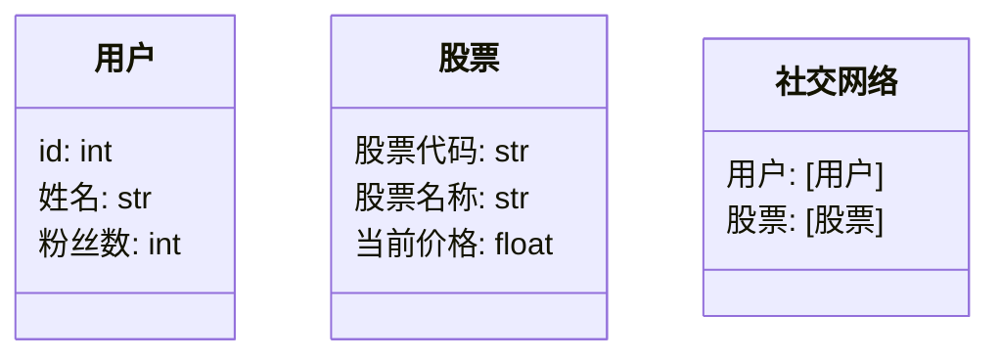
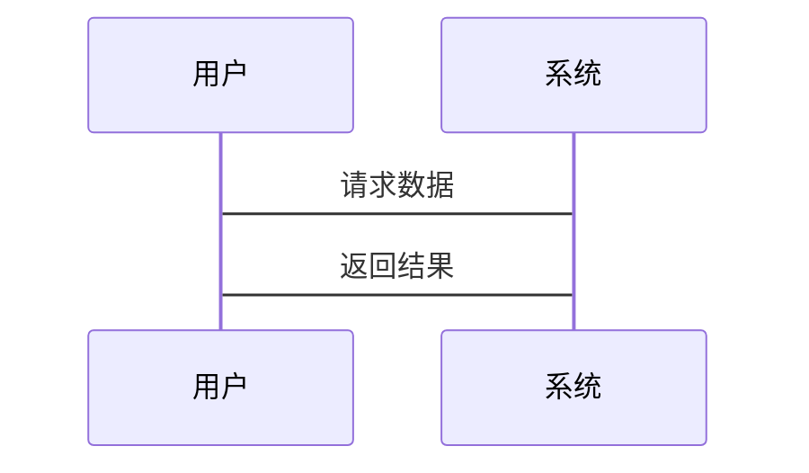

                 


# 特价股票投资中的社交网络影响力分析与应用

## 关键词：
- 特价股票投资
- 社交网络影响力
- 影响力传播模型
- 机器学习
- 金融数据分析

## 摘要：
随着社交媒体的快速发展，社交网络影响力在金融领域的应用越来越受到关注。本文从特价股票投资的角度出发，详细探讨了社交网络影响力分析的核心概念、算法原理、系统架构以及实际应用。通过分析社交网络数据，结合影响力传播模型和机器学习技术，本文提出了有效的社交网络影响力分析方法，并通过实际案例展示了其在特价股票投资中的应用效果。

---

# 第一部分: 特价股票投资中的社交网络影响力分析概述

## 第1章: 特价股票投资与社交网络影响力概述

### 1.1 特价股票投资的基本概念
#### 1.1.1 特价股票的定义与特点
特价股票是指在特定时间段内，由于市场波动、公司公告或其他因素影响，价格出现显著波动的股票。其特点包括高波动性、短期投资机会和潜在高回报。

#### 1.1.2 特价股票投资的基本原理
特价股票投资的核心在于捕捉市场波动中的短期机会，投资者通过分析市场情绪、公司基本面和市场趋势来做出投资决策。

#### 1.1.3 特价股票投资的市场现状与发展趋势
随着金融市场的日益复杂化，投资者 increasingly rely on 多样化的数据源，包括社交媒体数据，来辅助投资决策。特价股票投资的市场呈现出高度竞争和数据驱动的趋势。

### 1.2 社交网络影响力的基本概念
#### 1.2.1 社交网络的定义与特点
社交网络是指由用户生成内容（UGC）构成的在线平台，用户通过发布观点、评论和互动行为形成信息传播网络。其特点包括实时性、互动性和信息传播的快速性。

#### 1.2.2 社交网络影响力的核心要素
社交网络影响力主要由用户的行为数据、社交关系和内容传播效果构成。影响力强度通常通过用户活跃度、粉丝数和互动率来衡量。

#### 1.2.3 社交网络影响力在金融领域的应用前景
社交网络影响力分析在金融领域具有广泛的应用前景，尤其是在市场情绪分析、舆情监控和投资决策辅助方面。

### 1.3 特价股票投资中的社交网络影响力分析
#### 1.3.1 社交网络影响力对股票价格的影响机制
社交网络影响力通过影响市场情绪和投资者行为间接影响股票价格。具体机制包括情绪传播、信息扩散和市场共识的形成。

#### 1.3.2 特价股票投资中社交网络数据的获取与处理
社交网络数据的获取涉及API接口调用和数据爬取，数据处理包括清洗、特征提取和情感分析。

#### 1.3.3 社交网络影响力分析的挑战与机遇
挑战主要体现在数据噪声、信息过载和模型复杂性；机遇则在于通过技术创新提高分析精度和投资收益。

### 1.4 本章小结
本章介绍了特价股票投资和社交网络影响力的基本概念，并分析了两者的结合方式及其在投资中的应用潜力。

---

# 第二部分: 社交网络影响力分析的核心概念与原理

## 第2章: 社交网络影响力分析的核心概念

### 2.1 社交网络影响力分析的基本原理
#### 2.1.1 影响力传播模型的定义与特点
影响力传播模型是一种描述信息在社交网络中传播过程的数学模型，其核心是通过节点之间的关系描述信息扩散的路径和速度。

#### 2.1.2 影响力传播模型的核心要素
影响力传播模型通常包括传播网络、传播规则和传播动力学参数。传播网络可以用图论中的图结构表示，传播规则则定义了信息扩散的概率和条件。

#### 2.1.3 影响力传播模型的数学表达
影响力传播模型的数学表达可以表示为：
$$
P(i) = \sum_{j} P(j) \cdot P(i|j)
$$
其中，$P(i)$ 表示节点 $i$ 被影响的概率，$P(j)$ 表示节点 $j$ 的初始影响力，$P(i|j)$ 表示节点 $i$ 受节点 $j$ 影响的概率。

### 2.2 社交网络影响力分析的核心算法
#### 2.2.1 基于图论的影响力传播算法
基于图论的影响力传播算法通过构建社交网络的图结构，利用图的遍历算法模拟信息传播过程。常用算法包括广度优先搜索（BFS）和深度优先搜索（DFS）。

#### 2.2.2 基于概率论的影响力传播模型
基于概率论的影响力传播模型通过概率分布描述信息传播的过程。常用的模型包括随机传播模型和马尔可夫链模型。

#### 2.2.3 基于机器学习的影响力预测算法
基于机器学习的影响力预测算法利用历史数据训练模型，预测未来的信息传播效果。常用的算法包括逻辑回归、支持向量机（SVM）和深度学习模型。

### 2.3 社交网络影响力分析的实体关系图
通过 Mermaid 绘制实体关系图，清晰展示社交网络影响力分析中的核心要素及其关系。


### 2.4 本章小结
本章详细介绍了社交网络影响力分析的核心概念和算法原理，为后续的系统设计和应用实现奠定了基础。

---

# 第三部分: 社交网络影响力分析的算法原理与实现

## 第3章: 影响力传播模型的算法原理

### 3.1 基于图论的影响力传播模型
#### 3.1.1 图论基础
图论是描述社交网络结构的基础数学工具，包括节点、边和图的属性。

#### 3.1.2 基于图论的影响力传播算法
基于图论的影响力传播算法通过构建传播网络，模拟信息在社交网络中的传播过程。常用的算法包括广度优先搜索（BFS）和深度优先搜索（DFS）。

#### 3.1.3 算法的数学模型与公式
基于图论的影响力传播模型可以表示为：
$$
P(i) = \sum_{j} P(j) \cdot P(i|j)
$$
其中，$P(i)$ 表示节点 $i$ 被影响的概率，$P(j)$ 表示节点 $j$ 的初始影响力，$P(i|j)$ 表示节点 $i$ 受节点 $j$ 影响的概率。

### 3.2 基于概率论的影响力传播模型
#### 3.2.1 概率论基础
概率论是描述随机事件发生可能性的数学工具，常用于模型化信息传播的过程。

#### 3.2.2 基于概率论的影响力传播算法
基于概率论的影响力传播算法通过概率分布描述信息传播的过程。常用的模型包括随机传播模型和马尔可夫链模型。

#### 3.2.3 算法的数学模型与公式
基于概率论的影响力传播模型可以表示为：
$$
P(i) = \prod_{j} P(i|j)
$$
其中，$P(i)$ 表示节点 $i$ 被影响的概率，$P(i|j)$ 表示节点 $i$ 受节点 $j$ 影响的概率。

### 3.3 基于机器学习的影响力传播模型
#### 3.3.1 机器学习基础
机器学习是通过数据训练模型，实现对未知数据的预测和分类的数学方法。

#### 3.3.2 基于机器学习的影响力传播算法
基于机器学习的影响力传播算法利用历史数据训练模型，预测未来的信息传播效果。常用的算法包括逻辑回归、支持向量机（SVM）和深度学习模型。

#### 3.3.3 算法的数学模型与公式
基于机器学习的影响力传播模型可以表示为：
$$
y = f(X)
$$
其中，$y$ 表示目标变量，$X$ 表示输入特征，$f$ 表示训练好的模型。

### 3.4 算法实现与代码示例
#### 3.4.1 环境安装与配置
安装 Python 环境，配置必要的库（如 NumPy、Pandas、Matplotlib）。

#### 3.4.2 算法实现代码
以下是一个基于图论的影响力传播算法的 Python 实现示例：

```python
import numpy as np
from collections import deque

def influence_spread(graph, initial_nodes):
    n = len(graph)
    infected = np.zeros(n, dtype=int)
    for node in initial_nodes:
        infected[node] = 1
    queue = deque(initial_nodes)
    while queue:
        u = queue.popleft()
        for v in graph[u]:
            if infected[v] == 0:
                infected[v] = 1
                queue.append(v)
    return infected
```

#### 3.5 本章小结
本章详细介绍了影响力传播模型的算法原理，并通过代码示例展示了算法的实现过程。

---

# 第四部分: 特价股票投资中的社交网络影响力分析系统设计

## 第4章: 系统分析与架构设计

### 4.1 项目介绍
本项目旨在通过分析社交网络数据，利用影响力传播模型辅助特价股票投资决策。

### 4.2 系统功能设计
#### 4.2.1 领域模型
通过 Mermaid 绘制领域模型类图，展示系统的功能模块及其关系。



#### 4.2.2 系统架构设计
通过 Mermaid 绘制系统架构图，展示系统的模块划分和交互流程。


### 4.3 系统接口设计
#### 4.3.1 API 接口
设计 RESTful API 接口，用于数据获取和分析结果返回。

#### 4.3.2 数据接口
定义数据格式和接口协议，确保数据的高效传输和处理。

### 4.4 系统交互设计
通过 Mermaid 绘制系统交互序列图，展示用户与系统之间的交互流程。



### 4.5 本章小结
本章详细介绍了系统的架构设计和接口设计，为后续的项目实现奠定了基础。

---

# 第五部分: 项目实战与应用

## 第5章: 项目实战

### 5.1 环境安装与配置
安装 Python 环境，配置必要的库（如 NumPy、Pandas、Matplotlib）。

### 5.2 系统核心实现
实现社交网络影响力分析的核心算法，并结合特价股票数据进行分析。

#### 5.2.1 核心代码实现
以下是一个社交网络影响力分析的 Python 实现示例：

```python
import numpy as np
from collections import deque

def influence_spread(graph, initial_nodes):
    n = len(graph)
    infected = np.zeros(n, dtype=int)
    for node in initial_nodes:
        infected[node] = 1
    queue = deque(initial_nodes)
    while queue:
        u = queue.popleft()
        for v in graph[u]:
            if infected[v] == 0:
                infected[v] = 1
                queue.append(v)
    return infected
```

### 5.3 代码应用解读与分析
分析核心代码的功能和实现逻辑，解释其在社交网络影响力分析中的作用。

### 5.4 实际案例分析
通过具体案例分析，展示社交网络影响力分析在特价股票投资中的实际应用效果。

### 5.5 项目小结
总结项目实现的关键点和应用价值，提出改进建议和未来发展方向。

---

# 第六部分: 最佳实践与总结

## 第6章: 最佳实践 tips

### 6.1 数据获取与处理
确保数据的准确性和完整性，合理选择数据来源和处理方法。

### 6.2 模型选择与优化
根据具体需求选择合适的模型，并通过参数调优和模型评估提高分析精度。

### 6.3 系统设计与实现
注重系统的模块化设计和代码复用，确保系统的可扩展性和可维护性。

### 6.4 风险管理与伦理规范
在实际应用中，注重风险管理和社会责任，确保分析结果的合理性和合规性。

## 第7章: 总结与展望

### 7.1 本章总结
总结全文的主要内容和研究成果，强调社交网络影响力分析在特价股票投资中的重要性。

### 7.2 未来展望
展望未来的研究方向和发展趋势，提出进一步的研究问题和应用前景。

---

# 作者：AI天才研究院/AI Genius Institute & 禅与计算机程序设计艺术 /Zen And The Art of Computer Programming

