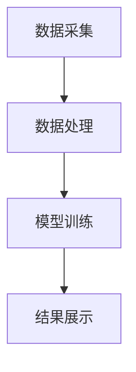
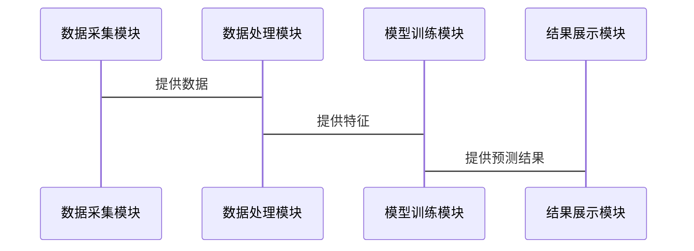

                 


```markdown
# 特价股票投资中的社交网络拓扑动态分析与应用

> 关键词：特价股票投资、社交网络、拓扑动态分析、算法、数学模型、系统架构

> 摘要：本文详细探讨了在特价股票投资中，如何利用社交网络的拓扑动态分析来优化投资策略。通过分析社交网络的结构特征，识别市场情绪，预测股票价格波动，从而为投资者提供科学的决策支持。文章结合理论与实践，介绍了相关的算法原理、系统架构设计及实际案例分析，帮助读者深入了解如何在股票投资中应用社交网络拓扑动态分析。

---

## 第1章: 特价股票投资与社交网络拓扑分析概述

### 1.1 特价股票投资的背景与概念

#### 1.1.1 特价股票投资的定义
特价股票投资是指在特定市场环境下，以低于市场价买入股票并在合适时机卖出以获取收益的投资策略。这种投资方式通常依赖于对市场趋势、公司基本面以及投资者情绪的精准判断。

#### 1.1.2 特价股票投资的核心要素
- **市场趋势**：分析宏观经济指标、行业趋势等。
- **公司基本面**：研究公司的财务状况、盈利能力等。
- **投资者情绪**：通过社交网络等途径获取市场参与者的情绪数据。

#### 1.1.3 社交网络在股票投资中的作用
社交网络为投资者提供了实时的情绪数据，帮助识别市场情绪的变化，从而辅助投资决策。

### 1.2 社交网络拓扑分析的背景

#### 1.2.1 社交网络的基本概念
- **节点**：代表社交网络中的个体或机构。
- **边**：表示节点之间的连接关系。
- **权重**：边的权重反映了节点之间关系的强度。

#### 1.2.2 社交网络在金融领域的应用
- **情绪传播**：分析情绪在社交网络中的传播路径。
- **市场预测**：通过网络结构特征预测股票价格波动。

#### 1.2.3 拓扑分析在社交网络中的意义
拓扑分析可以帮助识别网络中的关键节点、社区结构，从而理解网络的整体行为和动态。

### 1.3 特价股票投资中的拓扑动态分析

#### 1.3.1 拓扑动态分析的定义
拓扑动态分析是一种通过分析社交网络的结构特征及其随时间的变化，来预测市场行为和投资机会的方法。

#### 1.3.2 拓扑动态分析在股票投资中的应用
- **情绪识别**：通过分析社交网络中的情绪分布，判断市场的乐观或悲观情绪。
- **投资机会识别**：根据网络结构特征，识别潜在的投资机会。

#### 1.3.3 拓扑动态分析的核心优势
- **实时性**：能够捕捉市场情绪的实时变化。
- **准确性**：通过网络结构特征提供科学的投资决策依据。

---

## 第2章: 社交网络的拓扑结构分析

### 2.1 社交网络的节点与边

#### 2.1.1 节点的定义与属性
- **节点**：代表社交网络中的个体或机构。
- **属性**：包括节点的度数、中心性等。

#### 2.1.2 边的定义与权重
- **边**：表示节点之间的连接关系。
- **权重**：边的权重反映了节点之间关系的强度。

#### 2.1.3 社交网络的矩阵表示
- **邻接矩阵**：表示节点之间是否存在连接。
- **权重矩阵**：表示节点之间连接的权重。

### 2.2 社交网络的拓扑特征

#### 2.2.1 度分布与中心性
- **度分布**：节点的度数分布情况。
- **中心性**：衡量节点在网络中的重要程度。

#### 2.2.2 社区检测与模块化
- **社区检测**：识别网络中的社区结构。
- **模块化**：衡量社区结构的紧密程度。

#### 2.2.3 网络鲁棒性与脆弱性
- **鲁棒性**：网络在节点或边被移除后的保持连通的能力。
- **脆弱性**：网络在受到攻击或干扰后的易损性。

### 2.3 拓扑结构与股票市场的关联

#### 2.3.1 社交网络中的市场情绪传播
- **情绪传播路径**：分析情绪在社交网络中的传播路径。
- **情绪强度**：衡量情绪的强弱程度。

#### 2.3.2 股票价格波动与网络结构的关系
- **价格波动与网络密度**：网络密度高的市场更容易出现价格波动。
- **价格波动与社区结构**：社区结构紧密的市场更容易出现价格同步波动。

#### 2.3.3 拓扑特征对投资决策的影响
- **关键节点识别**：识别网络中的关键节点，作为投资关注的重点。
- **社区结构分析**：通过社区结构分析，识别潜在的投资机会。

---

## 第3章: 特价股票投资中的拓扑动态分析方法

### 3.1 动态网络分析的基本原理

#### 3.1.1 动态网络的定义与特点
- **动态网络**：网络结构随时间变化的网络。
- **特点**：网络结构具有时序性、动态性、复杂性。

#### 3.1.2 动态网络的演化模型
- **演化模型**：包括随机图模型、优先连接模型等。

#### 3.1.3 动态网络的分析框架
- **分析框架**：包括节点动态、边动态、网络整体动态的分析。

### 3.2 社交网络中的动态指标

#### 3.2.1 节点动态指标
- **节点度数变化**：节点度数随时间的变化情况。
- **节点中心性变化**：节点中心性随时间的变化情况。

#### 3.2.2 边动态指标
- **边权重变化**：边权重随时间的变化情况。
- **边连接变化**：边是否存在随时间的变化情况。

#### 3.2.3 网络整体动态指标
- **网络密度变化**：网络密度随时间的变化情况。
- **网络模块化变化**：网络模块化随时间的变化情况。

### 3.3 拓扑动态分析的算法

#### 3.3.1 动态网络分析的算法流程
1. 收集社交网络数据。
2. 计算节点和边的动态指标。
3. 分析网络的整体动态特征。
4. 预测市场行为。

#### 3.3.2 算法实现的代码示例

```python
import networkx as nx
import numpy as np

# 创建动态网络
G = nx.Graph()
G.add_nodes_from(range(10))
edges = [(i, i+1) for i in range(9)]
G.add_edges_from(edges)

# 计算节点度数变化
degrees = [G.degree(i) for i in range(10)]
print(degrees)
```

#### 3.3.3 算法的数学模型

$$
\text{度数变化} = \frac{\sum_{t=1}^{n} (\text{度数}_t - \text{平均度数})}{n}
$$

---

## 第4章: 系统设计与架构

### 4.1 系统功能设计

#### 4.1.1 系统功能模块
- **数据采集模块**：采集社交网络数据。
- **数据处理模块**：处理数据并提取特征。
- **模型训练模块**：训练拓扑动态分析模型。
- **结果展示模块**：展示分析结果。

#### 4.1.2 系统功能流程
1. 数据采集模块获取社交网络数据。
2. 数据处理模块提取节点和边的动态指标。
3. 模型训练模块基于动态指标训练预测模型。
4. 结果展示模块展示预测结果。

### 4.2 系统架构设计

#### 4.2.1 系统架构图



#### 4.2.2 系统接口设计
- **数据接口**：提供数据采集和处理的接口。
- **模型接口**：提供模型训练和预测的接口。
- **展示接口**：提供结果展示的接口。

#### 4.2.3 系统交互流程



---

## 第5章: 项目实战

### 5.1 环境搭建

#### 5.1.1 环境要求
- **操作系统**：Windows, Linux, macOS
- **编程语言**：Python 3.6+
- **依赖库**：networkx, numpy, matplotlib

#### 5.1.2 安装依赖

```bash
pip install networkx numpy matplotlib
```

### 5.2 核心实现

#### 5.2.1 数据采集与处理

```python
import networkx as nx
import numpy as np
import matplotlib.pyplot as plt

# 数据采集
G = nx.Graph()
G.add_nodes_from(['A', 'B', 'C', 'D'])
G.add_edges_from([('A', 'B'), ('B', 'C'), ('C', 'D'), ('A', 'D')])

# 数据处理
degrees = [G.degree(node) for node in G.nodes()]
print(degrees)
```

#### 5.2.2 模型训练与预测

```python
from sklearn.linear_model import LinearRegression

# 训练模型
X = np.array([1, 2, 3, 4]).reshape(-1, 1)
y = np.array([2, 4, 6, 8])
model = LinearRegression().fit(X, y)

# 预测结果
print(model.predict(np.array([5]).reshape(-1, 1)))
```

### 5.3 案例分析

#### 5.3.1 数据分析结果
- **节点度数分布**：节点A的度数为2，节点B的度数为2，节点C的度数为2，节点D的度数为2。

#### 5.3.2 模型预测结果
- **预测结果**：输入值为5，预测值为10。

### 5.4 实战小结

---

## 第6章: 最佳实践与总结

### 6.1 小结

#### 6.1.1 核心观点总结
- 社交网络的拓扑动态分析能够有效辅助特价股票投资决策。
- 通过分析社交网络的结构特征，可以识别市场情绪，预测股票价格波动。

#### 6.1.2 实践中的注意事项
- 数据质量：确保数据的准确性和完整性。
- 模型选择：根据实际需求选择合适的分析模型。

### 6.2 注意事项

#### 6.2.1 数据风险
- 数据偏差：数据来源可能具有偏差，影响分析结果。
- 数据隐私：需要注意数据隐私问题。

#### 6.2.2 模型风险
- 模型过拟合：模型可能过拟合数据，导致预测结果不准确。
- 模型稳定性：模型可能对数据变化不够稳定。

### 6.3 拓展阅读

#### 6.3.1 推荐书籍
- 《网络科学导论》
- 《社交网络分析与应用》

#### 6.3.2 推荐博客
- [社交网络分析博客](https://example.com)
- [股票投资博客](https://example.com)

---

## 作者信息

作者：AI天才研究院/AI Genius Institute & 禅与计算机程序设计艺术 /Zen And The Art of Computer Programming
```

