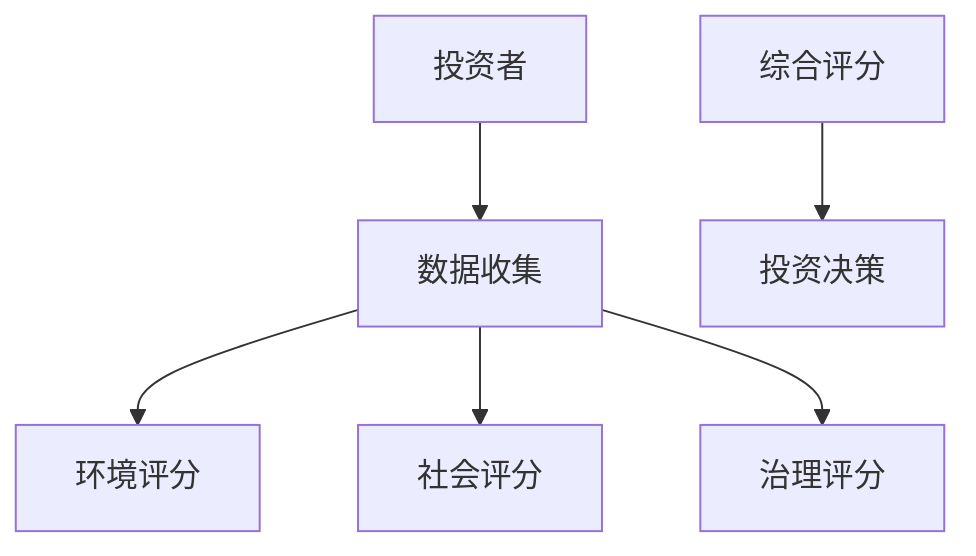
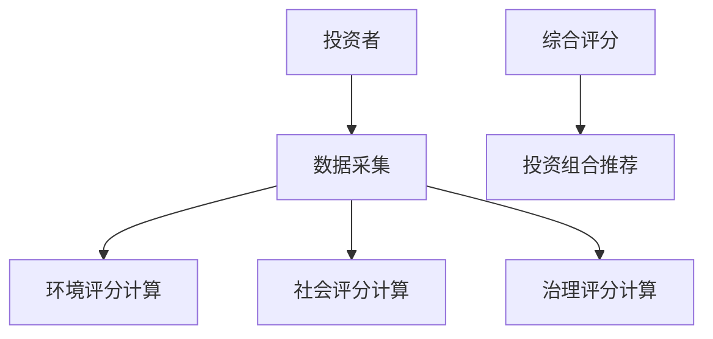

                 


# 特价股票投资中的社会责任投资因素考量

> **关键词**：特价股票、社会责任投资（SRI）、投资决策、SRI因素量化、投资系统架构

> **摘要**：本文探讨了在特价股票投资中如何将社会责任投资（SRI）因素纳入考量。文章首先介绍了特价股票和SRI的基本概念，然后分析了SRI因素对投资决策的影响，详细讲解了SRI因素的量化模型和算法原理。接着，文章通过系统架构设计展示了如何构建一个支持SRI因素考量的投资系统，并通过实际案例分析了系统功能和项目实战。最后，文章总结了最佳实践和注意事项，为投资者提供了有价值的参考。

---

# 第一部分: 特价股票投资中的社会责任投资（SRI）背景介绍

## 第1章: 特价股票投资概述

### 1.1 特价股票的定义与特点

#### 1.1.1 特价股票的定义
特价股票是指市场价格低于其内在价值的股票。这种股票通常因为市场波动、公司短期问题或其他外部因素导致价格被低估。投资者认为这些股票具有长期增值的潜力，因此愿意以低于市场价买入。

#### 1.1.2 特价股票的特点
- **低估性**：市场价格低于内在价值。
- **潜在增值**：长期来看，价格可能回归其真实价值。
- **风险与机会并存**：低估可能源于负面因素，投资者需谨慎选择。

#### 1.1.3 特价股票的市场机制
特价股票通常出现在市场下跌周期或行业低迷时期。投资者通过基本面分析和估值指标（如市盈率、市净率）来识别低估股票。

---

### 第2章: 社会责任投资（SRI）概述

#### 2.1 社会责任投资的核心概念
- **定义**：SRI是一种投资策略，考虑环境、社会和治理（ESG）因素，选择在这些方面表现良好的公司。
- **核心要素**：环境（如碳排放）、社会（如员工权益）、治理（如董事会结构）。

#### 2.2 SRI的起源与发展
SRI起源于20世纪60年代的环境运动，随着全球对可持续发展的关注，SRI逐渐成为主流投资策略。

#### 2.3 SRI与传统投资的对比
| **方面** | **SRI** | **传统投资** |
|----------|----------|---------------|
| 投资目标 | 长期增值与社会责任 | 追求最大收益 |
| 选股标准 | ESG表现 | 财务指标为主 |
| 风险考量 | 包括社会风险 | 仅考虑财务风险 |

---

### 第3章: 特价股票与社会责任投资的结合

#### 3.1 SRI对投资决策的影响
- **影响投资筛选**：SRI因素成为选股的重要标准。
- **影响投资回报**：研究表明，ESG表现良好的公司长期回报更高。

#### 3.2 SRI在特价股票筛选中的作用
- **过滤低质量公司**：排除在环境或社会方面表现不佳的公司。
- **增强投资组合的稳定性**：通过ESG筛选，降低投资风险。

#### 3.3 SRI与投资回报的关系
- **正相关性**：ESG表现良好的公司通常具有更高的长期回报。
- **风险管理**：SRI有助于规避因环境或社会问题引发的系统性风险。

---

# 第二部分: 特价股票投资中的社会责任投资因素分析

## 第4章: 社会责任投资的核心概念与联系

### 4.1 SRI的核心概念原理

#### 4.1.1 SRI的评价体系
- **环境（E）**：碳排放、能源使用效率。
- **社会（S）**：员工权益、社区贡献。
- **治理（G）**：董事会结构、公司透明度。

#### 4.1.2 SRI与企业治理的关系
良好的公司治理是企业长期稳定发展的基础，直接影响企业价值和投资回报。

#### 4.1.3 SRI与企业社会责任的关联
企业社会责任（CSR）是SRI的重要组成部分，体现在企业对环境、员工和社会的贡献。

---

### 4.2 SRI核心概念对比表格

| **方面** | **SRI** | **传统投资** |
|----------|----------|---------------|
| 评价体系 | ESG因素 | 财务指标为主 |
| 投资目标 | 可持续回报 | 最大化收益 |
| 风险考量 | 包括社会风险 | 仅考虑财务风险 |

---

### 4.3 SRI的ER实体关系图

```mermaid
erDiagram
    actor 投资者 {
        string 账号
        string 资金
    }
    actor 公司 {
        string 名称
        string 行业
    }
    entity ESG指标 {
        string 环境评分
        string 社会评分
        string 治理评分
    }
    company ->(ESG指标)
    投资者 ->(ESG指标)
    投资者 -> 公司
```

---

## 第5章: 特价股票投资中的SRI因素考量

### 5.1 SRI因素对投资决策的影响

#### 5.1.1 SRI因素的量化评估
- **环境评分**：基于碳排放、能源使用效率。
- **社会评分**：基于员工权益、社区贡献。
- **治理评分**：基于公司透明度、董事会结构。

#### 5.1.2 SRI因素对投资风险的影响
- **降低风险**：通过ESG筛选，避免因公司治理问题引发的财务危机。
- **长期稳定性**：ESG表现良好的公司更具抗风险能力。

#### 5.1.3 SRI因素对投资收益的影响
- **长期回报**：研究表明，ESG表现良好的公司长期回报更高。
- **市场波动**：SRI投资在市场波动中表现更为稳定。

---

### 5.2 SRI因素对股票价值的影响

#### 5.2.1 SRI因素对股价波动的影响
- **正面影响**：公司良好的ESG表现可能提升股价。
- **负面影响**：环境或社会问题可能导致股价下跌。

#### 5.2.2 SRI因素对长期投资回报的影响
- **长期优势**：ESG表现良好的公司通常具有更高的长期回报。
- **市场趋势**：随着可持续发展成为主流，SRI投资更具前景。

#### 5.2.3 SRI因素对投资者决策的影响
- **理性决策**：SRI因素帮助投资者做出更全面的决策。
- **价值观驱动**：符合投资者价值观的投资更可能带来满足感。

---

## 第6章: 特价股票投资中的SRI因素算法原理

### 6.1 SRI因素的量化模型

#### 6.1.1 SRI因素的加权评分系统



#### 6.1.2 SRI因素的加权计算公式
$$
\text{综合评分} = \alpha \times \text{环境评分} + \beta \times \text{社会评分} + \gamma \times \text{治理评分}
$$
其中，$\alpha + \beta + \gamma = 1$，权重根据行业和公司具体情况调整。

---

### 6.2 SRI因素对投资收益的算法实现

#### 6.2.1 基于Python的SRI评分计算

```python
import pandas as pd

# 示例数据
data = {
    '公司': ['公司A', '公司B', '公司C'],
    '环境评分': [0.8, 0.6, 0.7],
    '社会评分': [0.9, 0.5, 0.8],
    '治理评分': [0.7, 0.6, 0.9]
}

df = pd.DataFrame(data)

# 计算综合评分
alpha = 0.4
beta = 0.3
gamma = 0.3

df['综合评分'] = alpha * df['环境评分'] + beta * df['社会评分'] + gamma * df['治理评分']

print(df)
```

---

### 6.3 SRI因素对投资风险的算法分析

#### 6.3.1 SRI因素的风险评估模型

$$
\text{风险评分} = \beta \times \text{环境风险} + \gamma \times \text{社会风险} + \delta \times \text{治理风险}
$$

---

# 第三部分: 系统分析与架构设计方案

## 第7章: 系统架构设计

### 7.1 问题场景介绍

#### 7.1.1 投资者需求
- **筛选符合SRI标准的特价股票**
- **评估公司ESG表现**

#### 7.1.2 系统功能
- 数据采集与处理
- ESG评分计算
- 投资组合优化

---

### 7.2 系统功能设计

#### 7.2.1 系统功能模块
- 数据采集模块：收集公司数据。
- 评分计算模块：计算ESG评分。
- 投资组合优化模块：基于评分推荐股票。

#### 7.2.2 系统功能流程



---

## 第8章: 项目实战

### 8.1 环境安装

#### 8.1.1 安装Python和相关库
- 安装Python 3.8及以上版本。
- 安装pandas、numpy、scikit-learn等库。

### 8.2 系统核心实现源代码

#### 8.2.1 数据处理代码

```python
import pandas as pd
import numpy as np

# 示例数据
data = {
    '公司': ['公司A', '公司B', '公司C'],
    '环境评分': [0.8, 0.6, 0.7],
    '社会评分': [0.9, 0.5, 0.8],
    '治理评分': [0.7, 0.6, 0.9]
}

df = pd.DataFrame(data)

# 计算综合评分
alpha = 0.4
beta = 0.3
gamma = 0.3

df['综合评分'] = alpha * df['环境评分'] + beta * df['社会评分'] + gamma * df['治理评分']

print(df)
```

---

## 第9章: 最佳实践、小结、注意事项、拓展阅读

### 9.1 最佳实践

#### 9.1.1 定期更新数据
- 市场和公司情况变化，需定期更新ESG评分。

#### 9.1.2 综合考虑多因素
- 不仅考虑SRI因素，还需结合其他财务指标。

### 9.2 小结

本文详细探讨了如何在特价股票投资中融入社会责任投资因素，通过量化模型和系统设计，帮助投资者做出更全面的投资决策。

### 9.3 注意事项

- **数据质量**：确保数据来源可靠。
- **模型调整**：根据市场变化调整权重。
- **长期视角**：SRI投资需长期持有，避免短期波动影响判断。

### 9.4 拓展阅读

- **书籍**：《可持续投资：理论与实践》
- **报告**：联合国责任投资原则（PRI）发布的相关报告

---

# 结语

通过本文的分析，投资者可以在追求超额收益的同时，兼顾社会责任，实现可持续投资目标。SRI不仅是一种投资策略，更是一种价值观的体现。

---

**作者：AI天才研究院/AI Genius Institute & 禅与计算机程序设计艺术 /Zen And The Art of Computer Programming**

