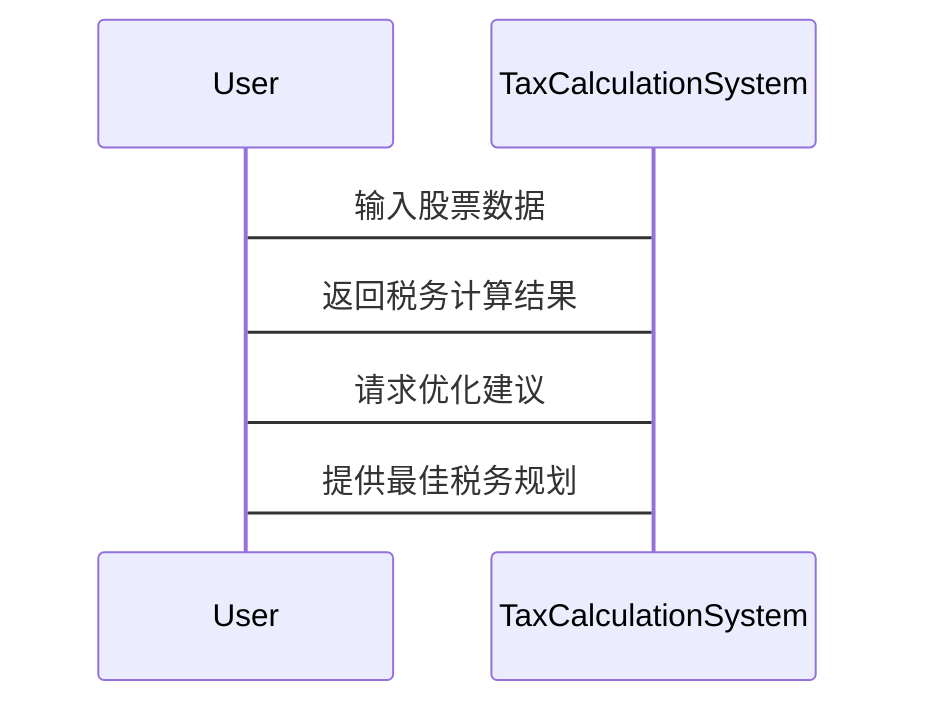

                 


# 特价股票投资中的税收考虑

## 关键词：特价股票，税收，投资，税务规划，资本利得税，股息税，税务优化

## 摘要：本文深入探讨了在特价股票投资中税收的各个方面，包括税收的基本概念、特价股票投资中的税收政策、税务计算与规划策略，以及项目实战和最佳实践。通过详细分析和实例讲解，本文为投资者提供了如何在投资过程中合理规划税务、优化投资回报的专业指导。

---

## 第1章: 特价股票投资概述

### 1.1 特价股票的基本概念

#### 1.1.1 特价股票的定义  
特价股票是指以低于市场价购买的股票，通常在市场低迷或公司面临短期困境时出现。投资者通过低价买入，期望在市场恢复后以更高价格卖出，从而获得超额收益。

#### 1.1.2 特价股票的分类  
- **根据市场情况分类**：  
  - 周期性特价股票：受经济周期影响较大，如制造业和能源行业的股票。  
  - 结构性特价股票：因行业结构调整导致股价下跌，如传统行业转型期的股票。  
- **根据公司状况分类**：  
  - 重组特价股票：公司正在进行资产重组或破产重整的股票。  
  - 亏损特价股票：公司当前处于亏损状态，但有扭亏为盈的潜力。  

#### 1.1.3 特价股票的投资特点  
- 高波动性：股价受市场情绪和公司基本面影响较大。  
- 高风险与高回报并存：低价买入可能带来高回报，但也可能因公司基本面恶化而亏损。  
- 投资门槛低：适合不同资金规模的投资者。  

### 1.2 税收的基本概念

#### 1.2.1 税收的定义与分类  
- **定义**：税收是国家为实现公共服务而向企业和个人征收的强制性费用。  
- **分类**：  
  - 流转税：如增值税、消费税，适用于商品和服务的交易。  
  - 所得税：对个人或企业所得征收的税，包括工资税、资本利得税等。  
  - 财产税：对财产（如房地产）征收的税。  

#### 1.2.2 税收在投资中的作用  
- 税收是投资成本的重要组成部分，直接影响投资回报。  
- 税收政策引导投资行为，例如通过税收优惠吸引长期投资。  

#### 1.2.3 税收对投资收益的影响  
- 税收会减少投资收益，因此在投资决策中需要考虑税后收益。  
- 税收差异可能导致不同投资策略的选择，例如短期交易与长期持有的税务处理不同。  

### 1.3 特价股票投资中的税收问题

#### 1.3.1 税收对投资决策的影响  
- 税收影响投资成本：高税率可能导致投资者调整投资策略。  
- 税收影响投资回报：税后收益是投资者最终获得的收益，需综合考虑。  

#### 1.3.2 特价股票投资中的主要税收种类  
- **资本利得税**：对股票买卖价差收益征收的税。  
- **股息税**：对公司分配的股息收入征收的税。  
- **印花税**：对股票交易行为征收的税，通常由卖方承担。  

#### 1.3.3 特价股票投资中的税收优惠政策  
- **税收减免**：如特定地区或行业的税收优惠。  
- **长期持有优惠**：部分国家对长期持有的股票资本利得税较低或豁免。  

---

## 第2章: 特价股票投资中的税收政策

### 2.1 税收政策的基本框架

#### 2.1.1 税收政策的制定原则  
- **公平原则**：确保税收政策公平，避免累进税制中的不合理负担。  
- **效率原则**：税收政策应尽量减少对市场效率的负面影响。  
- **可操作性原则**：税收政策应便于实施和监管。  

#### 2.1.2 税收政策的实施主体  
- **政府**：主要的税收制定和征收主体。  
- **税务机关**：具体执行税收政策和征收工作。  

#### 2.1.3 税收政策的调整机制  
- **定期调整**：根据经济发展情况调整税率和优惠政策。  
- **临时调整**：应对突发事件或市场变化的临时性税收调整。  

### 2.2 特价股票投资中的税收优惠政策

#### 2.2.1 税收优惠的种类  
- **税率优惠**：如降低资本利得税税率。  
- **税收抵免**：允许投资者用符合条件的支出抵免应缴税款。  
- **退税优惠**：对符合条件的投资行为退还部分税款。  

#### 2.2.2 税收优惠的适用条件  
- **投资期限**：如长期持有特定股票可享受优惠。  
- **行业限制**：如投资于特定行业或地区可享受优惠。  

#### 2.2.3 税收优惠的实施效果  
- **促进投资**：税收优惠降低了投资成本，吸引更多投资者。  
- **调节市场**：税收优惠政策可以引导资金流向特定领域，优化经济结构。  

### 2.3 税收政策对投资行为的影响

#### 2.3.1 税收政策对投资者行为的影响  
- 投资者可能因税收优惠调整投资策略，如选择长期持有以享受低税率。  
- 高税率可能导致投资者减少投资或选择其他投资方式。  

#### 2.3.2 税收政策对市场结构的影响  
- 税收政策可能导致市场资金流向特定行业或地区，改变市场结构。  
- 税收政策可能影响股票流动性，如高印花税可能降低交易活跃度。  

#### 2.3.3 税收政策对经济发展的促进作用  
- 税收优惠可以吸引资金流入实体经济，促进经济增长。  
- 合理的税收政策有助于优化资源配置，推动技术创新。  

---

## 第3章: 特价股票投资中的税务计算与规划

### 3.1 税务计算的基本方法

#### 3.1.1 税基的确定  
- **资本利得**：卖出价 - 买入价。  
- **股息收入**：公司分配的股息金额。  

#### 3.1.2 税率的确定  
- **资本利得税税率**：根据持有时间长短和收入来源确定。  
- **股息税税率**：通常根据个人所得税税率表确定。  

#### 3.1.3 应纳税额的计算  
- **资本利得税计算公式**：  
  $$ \text{资本利得税} = (\text{卖出价} - \text{买入价}) \times \text{税率} $$  
- **股息税计算公式**：  
  $$ \text{股息税} = \text{股息收入} \times \text{税率} $$  

### 3.2 特价股票投资中的税务规划策略

#### 3.2.1 税务规划的基本原则  
- **合法性原则**：确保税务规划符合法律法规。  
- **最大化收益原则**：通过合理规划降低税负，提高投资回报。  
- **灵活性原则**：根据市场变化和政策调整及时优化税务规划。  

#### 3.2.2 税务规划的主要方法  
- **选择合适的持有期限**：长期持有可能享受较低税率或免税政策。  
- **合理利用税收优惠**：如利用税收抵免或退税政策降低税负。  
- **分散投资**：通过投资不同类型资产分散税务风险。  

#### 3.2.3 税务规划的实施步骤  
1. **评估投资目标**：明确投资目标和风险承受能力。  
2. **分析税收政策**：研究相关税收政策和优惠措施。  
3. **制定规划方案**：根据分析结果制定税务优化方案。  
4. **实施与监控**：执行规划并定期评估效果。  

### 3.3 税务规划中的风险与应对

#### 3.3.1 税务规划中的主要风险  
- **政策变化风险**：税收政策可能调整，影响规划的稳定性。  
- **合规性风险**：税务规划需符合法律法规，否则可能面临处罚。  
- **市场风险**：市场波动可能影响投资收益和税务计算。  

#### 3.3.2 税务规划中的风险应对策略  
- **多元化投资**：通过多样化投资降低市场风险。  
- **密切关注政策**：及时了解税收政策变化，调整规划。  
- **咨询专业机构**：寻求专业税务顾问帮助制定合理规划。  

#### 3.3.3 税务规划的合规性要求  
- 确保税务规划符合国家法律法规。  
- 保留相关投资记录，以备税务审查。  

---

## 第4章: 项目实战与最佳实践

### 4.1 环境安装与工具准备

#### 4.1.1 环境安装  
- 安装Python编程语言和相关开发工具。  
- 安装数据分析库（如Pandas、NumPy）和可视化库（如Matplotlib）。  

#### 4.1.2 工具准备  
- 数据分析工具：Excel、Python Pandas。  
- 税务计算工具：在线税务计算器或自定义脚本。  

### 4.2 系统功能设计与实现

#### 4.2.1 功能模块设计  
- 数据输入模块：输入股票买入价、卖出价、持有时间等信息。  
- 税务计算模块：根据输入数据计算资本利得税、股息税等。  
- 税务优化模块：提供税务优化建议，如最佳持有时间、投资组合配置。  

#### 4.2.2 系统架构设计  


#### 4.2.3 系统接口设计  
- API接口：提供与外部数据源（如股票价格数据）的接口。  
- 用户界面：友好的GUI界面供用户输入数据和查看结果。  

#### 4.2.4 系统交互流程  


### 4.3 项目实战与代码实现

#### 4.3.1 环境配置  
```bash
pip install pandas numpy matplotlib
```

#### 4.3.2 核心代码实现  
```python
import pandas as pd
import numpy as np

# 示例数据
data = {
    '股票代码': ['A', 'B', 'C'],
    '买入价': [10, 15, 20],
    '卖出价': [15, 20, 25],
    '持有时间': ['长期', '短期', '长期']
}

df = pd.DataFrame(data)

# 计算资本利得税
df['资本利得'] = df['卖出价'] - df['买入价']
df['资本利得税'] = df.apply(lambda x: x['资本利得'] * 0.15 if x['持有时间'] == '短期' else x['资本利得'] * 0.1, axis=1)

print(df)
```

#### 4.3.3 代码应用解读  
- 上述代码计算了每只股票的资本利得，并根据持有时间确定税率，展示了如何通过Python进行税务计算。  

### 4.4 实际案例分析与优化建议

#### 4.4.1 案例分析  
假设投资者购买某股票，买入价为10元，卖出价为15元，持有时间为1个月。  
- 短期资本利得税率为15%，应纳税额为：(15-10) * 0.15 = 0.75元。  
- 若持有时间改为6个月，长期资本利得税率为10%，应纳税额为：(15-10) * 0.1 = 0.5元。  
- 通过延长持有时间，投资者可以降低税负，提高投资回报。  

#### 4.4.2 优化建议  
- 选择长期持有策略，享受较低税率。  
- 利用税收优惠，如投资于特定行业或地区，以享受更多税务减免。  

### 4.5 最佳实践与注意事项

#### 4.5.1 最佳实践  
- 定期评估投资组合的税务负担，及时优化。  
- 利用专业工具和数据分析提高税务计算的准确性。  

#### 4.5.2 注意事项  
- 税务政策可能变化，需密切关注政策调整。  
- 确保税务规划的合规性，避免法律风险。  

#### 4.5.3 项目小结  
通过合理规划税务，投资者可以在特价股票投资中降低税负，提高投资收益。  

---

## 作者：AI天才研究院/AI Genius Institute & 禅与计算机程序设计艺术 /Zen And The Art of Computer Programming

