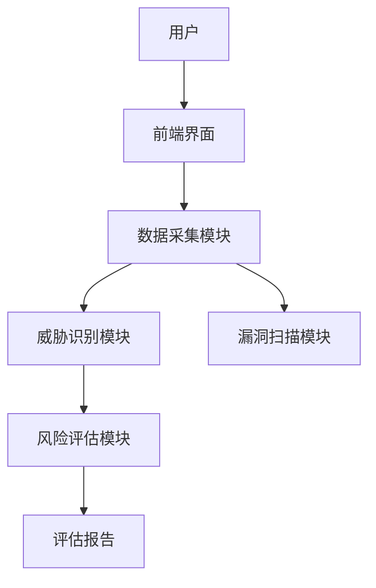
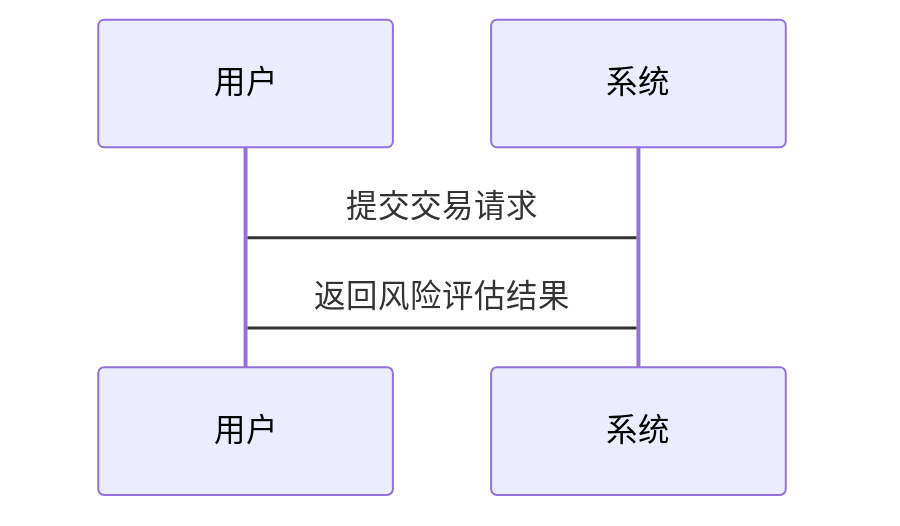

                 


# 特价股票投资中的网络安全风险评估方法

## 关键词：网络安全，风险评估，股票投资，层次分析法，模糊综合评价法

## 摘要：  
特价股票投资是一种通过寻找市场低估的股票来实现超额收益的投资策略。然而，在数字化交易环境下，网络安全风险已成为影响投资决策和资产安全的重要因素。本文从网络安全风险评估的视角，分析特价股票投资中的潜在威胁，并提出基于定量和定性分析相结合的方法，构建网络安全风险评估模型，以帮助投资者在数字化投资环境中规避风险，实现稳健收益。

---

# 第一章：引言

## 1.1 特价股票投资的定义与特点  
特价股票投资是指在市场波动或公司特定事件中，寻找被市场低估的股票进行投资，以期在市场回归合理估值时获得收益。其特点包括：  
1. **低估值**：投资标的通常价格低于市场公允价值。  
2. **逆向思维**：在市场恐慌或低迷时寻找投资机会。  
3. **周期性**：依赖市场周期波动，适合长期价值投资者。  

## 1.2 网络安全风险的定义与特点  
网络安全风险是指由于网络攻击、数据泄露或其他网络安全事件导致的信息系统或数据的损坏、泄露或不可用风险。其特点包括：  
1. **隐蔽性**：攻击者可能隐藏在系统中，不易被发现。  
2. **多样性**：攻击手段多样化，包括病毒、钓鱼攻击、DDoS等。  
3. **动态性**：网络安全威胁随技术发展不断变化。  

## 1.3 特价股票投资中的网络安全风险  
在特价股票投资中，网络安全风险主要体现在以下方面：  
1. **交易系统被攻击**：交易平台被黑客入侵可能导致交易数据泄露或订单被篡改。  
2. **数据泄露**：投资者的敏感信息（如账户、交易记录）可能被窃取。  
3. **虚假信息传播**：网络上散布的虚假信息可能影响投资者决策。  

## 1.4 本书的目的与结构安排  
本文旨在通过网络安全风险评估的方法，帮助投资者在特价股票投资中识别和规避风险。文章结构如下：  
- **第二章**：介绍网络安全风险评估的核心概念。  
- **第三章**：分析网络安全风险评估的算法原理。  
- **第四章**：设计网络安全风险评估系统架构。  
- **第五章**：通过实际案例分析网络安全风险评估的实战应用。  
- **第六章**：总结全文并展望未来研究方向。

---

# 第二章：网络安全风险评估的核心概念

## 2.1 网络安全风险评估的基本原理  
网络安全风险评估是通过分析潜在威胁、漏洞和影响，量化或定性描述网络安全风险的过程。其基本步骤包括：  
1. **识别威胁**：分析可能的网络安全威胁。  
2. **评估漏洞**：识别系统中存在的安全漏洞。  
3. **计算风险**：评估威胁发生概率和潜在影响。  

## 2.2 网络安全风险评估的关键指标  
### 2.2.1 风险暴露程度  
风险暴露程度反映资产在特定威胁下的脆弱性。指标包括：  
- 资产价值（Asset Value）  
- 威胁可能性（Threat Likelihood）  
- 漏洞利用难易程度（Exploitability）  

### 2.2.2 风险影响程度  
风险影响程度衡量威胁发生后对资产和业务的破坏程度。指标包括：  
- 财产损失（Financial Loss）  
- 业务中断时间（Downtime）  
- 品牌声誉损失（Reputation Damage）  

## 2.3 网络安全风险评估的数学模型  
网络安全风险评估模型可以表示为：  
$$ \text{风险值} = \text{威胁发生概率} \times \text{威胁影响程度} $$  
其中，威胁发生概率可以通过历史数据或专家评估确定，威胁影响程度则通过资产价值和业务影响评估得出。

---

# 第三章：网络安全风险评估的算法原理

## 3.1 风险评估的层次分析法（AHP）  
层次分析法是一种将复杂问题分解为多个因素，并通过层次结构进行评估的方法。  

### 3.1.1 层次分析法的基本原理  
1. **构建层次结构**：将问题分解为目标层、准则层和方案层。  
2. **构造判断矩阵**：根据专家意见构造比较矩阵。  
3. **计算权重**：通过特征值法或几何平均法计算各层次的权重。  

### 3.1.2 层次分析法的优缺点  
- **优点**：适用于多因素决策问题，结果直观。  
- **缺点**：依赖专家判断，可能存在主观偏差。  

## 3.2 风险评估的模糊综合评价法  
模糊综合评价法适合处理模糊性问题，如网络安全风险评估。  

### 3.2.1 模糊综合评价法的基本原理  
1. **建立评价指标体系**：包括风险暴露程度和影响程度等指标。  
2. **构造模糊关系矩阵**：根据专家意见或数据构造模糊矩阵。  
3. **计算综合评价结果**：通过模糊运算得出最终评价结果。  

### 3.2.2 模糊综合评价法的优缺点  
- **优点**：适用于模糊性和不确定性较高的问题。  
- **缺点**：计算过程复杂，结果解释性较差。  

## 3.3 风险评估的贝叶斯网络方法  
贝叶斯网络是一种基于概率推理的图形化模型，适合动态风险评估。  

### 3.3.1 贝叶斯网络的基本原理  
1. **构建网络结构**：定义变量之间的依赖关系。  
2. **设定概率参数**：根据历史数据或专家意见设定先验概率。  
3. **推理与更新**：根据新数据更新概率分布。  

### 3.3.2 贝叶斯网络的优缺点  
- **优点**：适合动态风险评估，计算效率高。  
- **缺点**：模型构建复杂，需要大量历史数据。  

---

# 第四章：网络安全风险评估系统设计

## 4.1 系统功能设计  
### 4.1.1 功能模块  
- **威胁识别模块**：识别潜在的网络安全威胁。  
- **漏洞扫描模块**：扫描系统漏洞并生成报告。  
- **风险评估模块**：计算风险值并生成评估报告。  

### 4.1.2 系统架构设计  
使用 Mermaid 绘制系统架构图如下：  


## 4.2 系统接口设计  
系统主要接口包括：  
1. **用户输入接口**：接收用户输入的交易数据。  
2. **数据接口**：与第三方威胁情报平台对接。  
3. **输出接口**：生成风险评估报告并发送至用户终端。  

## 4.3 系统交互设计  
使用 Mermaid 绘制系统交互序列图如下：  


---

# 第五章：项目实战与案例分析

## 5.1 环境配置  
项目实战环境包括：  
- 操作系统：Linux Ubuntu 20.04  
- 开发工具：Python 3.8，Django 2.2  
- 数据库：PostgreSQL 13  

## 5.2 数据收集与预处理  
### 5.2.1 数据来源  
- 交易数据：包括股票价格、成交量等。  
- 威胁数据：包括网络攻击日志、漏洞报告等。  

## 5.3 系统实现  
### 5.3.1 威胁识别模块实现  
```python
def detect_threats(data):
    # 数据预处理
    preprocess_data = data.dropna()
    # 使用机器学习模型识别威胁
    model = joblib.load('threat_detection_model.pkl')
    predictions = model.predict(preprocess_data)
    return predictions
```

### 5.3.2 风险评估模块实现  
```python
def calculate_risk(threat_prob, impact_score):
    risk_value = threat_prob * impact_score
    return risk_value
```

## 5.4 案例分析  
假设某投资者投资一只低估股票，系统评估其交易风险为中等偏高。投资者可以根据评估结果调整投资策略，例如增加资产分散配置或提高交易安全防护。

---

# 第六章：总结与展望

## 6.1 全文总结  
本文从网络安全风险评估的角度，探讨了特价股票投资中的潜在风险。通过层次分析法、模糊综合评价法和贝叶斯网络等多种方法，构建了网络安全风险评估模型，并设计了完整的系统架构。

## 6.2 未来研究方向  
1. **动态风险评估**：研究如何实时更新风险评估结果。  
2. **多因素模型**：引入更多影响因素，提高评估精度。  
3. **人工智能应用**：利用深度学习技术提高威胁识别能力。  

---

# 作者：AI天才研究院/AI Genius Institute & 禅与计算机程序设计艺术 /Zen And The Art of Computer Programming

