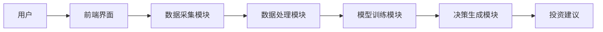

                 


# 特价股票投资中的自然语言处理与生成式AI辅助决策系统

> 关键词：自然语言处理，生成式AI，股票投资，文本挖掘，市场情绪分析

> 摘要：本文探讨了自然语言处理（NLP）与生成式人工智能（AI）在特价股票投资中的应用。通过分析市场情绪、解读公司财报和新闻，生成式AI能够辅助投资者做出更明智的决策。文章详细介绍了NLP和生成式AI的基本原理，分析了它们在股票投资中的具体应用，并通过实际案例展示了如何利用这些技术构建辅助决策系统。

---

## 第一部分：背景介绍

### 第1章：特价股票投资与AI辅助决策概述

#### 1.1 特价股票投资的基本概念

特价股票投资是指在股票市场中寻找被低估的股票进行投资，以期在股价回升时获得收益。这种投资策略依赖于对市场趋势、公司基本面和外部事件的深入分析。然而，面对海量的信息和复杂的数据，投资者需要借助工具来提高决策效率。

#### 1.2 自然语言处理与生成式AI在股票投资中的作用

自然语言处理（NLP）技术能够从新闻、社交媒体和公司财报中提取有价值的信息，帮助投资者理解市场情绪和公司动向。生成式AI则可以自动生成投资建议、市场分析报告，并模拟不同场景下的交易策略，为投资者提供决策支持。

---

## 第二部分：核心概念与技术原理

### 第2章：自然语言处理在股票分析中的应用

#### 2.1 基于NLP的市场情绪分析

市场情绪分析是通过分析新闻、社交媒体和评论等文本数据，判断市场的乐观或悲观情绪。这有助于投资者预测股价走势。

**步骤说明：**

1. **数据预处理**：清洗文本数据，去除停用词和标点符号。
2. **特征提取**：使用词袋模型或TF-IDF提取文本特征。
3. **情绪分类**：利用机器学习模型（如SVM、随机森林）或深度学习模型（如LSTM）进行情绪分类。

**代码示例：**

```python
from sklearn.feature_extraction.text import TfidfVectorizer
from sklearn.svm import SVC

# 数据预处理
texts = ["市场表现强劲", "公司业绩不佳", "投资者信心下降"]
vectorizer = TfidfVectorizer()
X = vectorizer.fit_transform(texts)

# 情绪分类
model = SVC()
model.fit(X, [1, 0, -1])

# 预测
test_text = ["股价上涨预期"]
test_X = vectorizer.transform([test_text])
print(model.predict(test_X))
```

### 第3章：生成式AI在股票决策中的应用

#### 3.1 基于生成式AI的投资建议生成

生成式AI可以通过分析市场数据和历史趋势，生成个性化的投资建议。

**步骤说明：**

1. **数据收集**：获取历史股价数据和市场新闻。
2. **模型训练**：使用生成对抗网络（GAN）或变体自动编码器（VAE）生成投资策略。
3. **策略优化**：结合专家意见调整生成的策略。

**代码示例：**

```python
import tensorflow as tf
from tensorflow.keras import layers

# 定义生成器
def generator():
    model = tf.keras.Sequential()
    model.add(layers.Dense(256, activation='relu', input_shape=(100,)))
    model.add(layers.Dense(50, activation='relu'))
    model.add(layers.Dense(10, activation='sigmoid'))
    return model

# 定义判别器
def discriminator():
    model = tf.keras.Sequential()
    model.add(layers.Dense(256, activation='relu', input_shape=(10,)))
    model.add(layers.Dense(1, activation='sigmoid'))
    return model
```

---

## 第三部分：系统架构与实现

### 第4章：系统架构设计

#### 4.1 系统功能模块划分

1. **数据采集模块**：实时获取市场新闻、公司财报等文本数据。
2. **数据处理模块**：清洗、标注和转换数据。
3. **模型训练模块**：训练NLP和生成式AI模型。
4. **决策生成模块**：根据模型输出生成投资建议。

#### 4.2 系统架构设计

使用微服务架构，模块间通过API通信。前端提供用户界面，后端负责数据处理和模型推理。

**系统架构图（Mermaid）：**



---

## 第四部分：项目实战

### 第5章：系统实现与项目实战

#### 5.1 环境搭建与数据准备

1. **环境安装**：安装Python、TensorFlow、Keras等工具。
2. **数据获取**：使用API获取历史股价和新闻数据。

#### 5.2 系统核心实现

1. **基于NLP的情感分析**：判断市场情绪。
2. **基于生成式AI的投资建议生成**：自动生成买卖策略。

**代码示例：**

```python
import pandas as pd
from tensorflow.keras.preprocessing.text import Tokenizer

# 数据预处理
df = pd.read_csv('market_news.csv')
tokenizer = Tokenizer(num_words=1000)
tokenizer.fit_on_texts(df['news'])
sequences = tokenizer.texts_to_sequences(df['news'])

# 模型训练
model = tf.keras.Sequential()
model.add(layers.Embedding(1000, 64, input_length=100))
model.add(layers.LSTM(32))
model.add(layers.Dense(1, activation='sigmoid'))
model.compile(loss='binary_crossentropy', optimizer='adam', metrics=['accuracy'])
model.fit(sequences, df['sentiment'], epochs=10, batch_size=32)
```

---

## 第五部分：总结与展望

### 第6章：总结与展望

#### 6.1 系统总结

本文详细介绍了自然语言处理与生成式AI在特价股票投资中的应用，展示了如何通过技术手段提高投资决策的效率和准确性。

#### 6.2 未来展望

未来，随着AI技术的进步，生成式AI将更加智能化，能够处理更复杂的市场场景，为投资者提供更精准的支持。

---

## 附录

### 附录A：数据来源与处理

包括数据清洗、特征提取和模型训练的具体步骤。

### 附录B：代码仓库

提供完整的Python代码仓库，方便读者复现。

---

作者：AI天才研究院（AI Genius Institute） & 禅与计算机程序设计艺术（Zen And The Art of Computer Programming）

