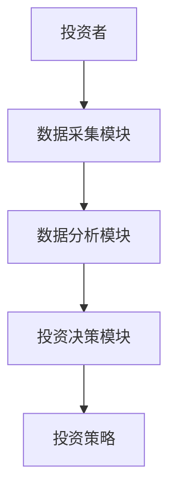
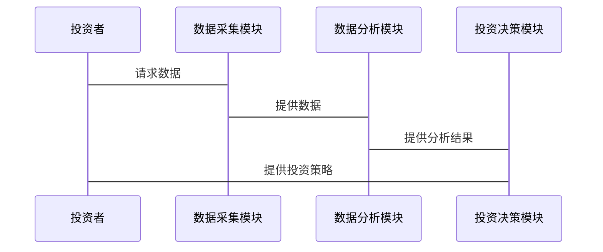

                 


# 特价股票投资中的行业周期性考虑

> 关键词：特价股票投资、行业周期性、股票价格预测、时间序列分析、数学模型、回归分析

> 摘要：本文探讨了特价股票投资中的行业周期性考虑，分析了行业周期性对股票价格的影响，构建了行业周期性模型，并结合实际案例进行了详细分析。文章还介绍了时间序列分析和回归分析等数学模型的应用，并提供了系统架构设计和项目实战指导。

---

## 第一部分: 特价股票投资中的行业周期性概述

### 第1章: 特价股票投资的背景与概念

#### 1.1 特价股票投资的定义与特点

##### 1.1.1 特价股票的定义
特价股票是指价格低于其内在价值，具有投资潜力的股票。这类股票通常被市场低估，适合长期投资者。

##### 1.1.2 特价股票投资的核心特点
- **低估性**：价格低于市场价值。
- **周期性**：受行业周期影响较大。
- **价值回归**：长期表现优于市场平均。

##### 1.1.3 特价股票与普通股票的区别
| 特性 | 特价股票 | 普通股票 |
|------|----------|----------|
| 价格 | 低于内在价值 | 靠近市场价值 |
| 风险 | 较高 | 较低 |
| 收益 | 较高 | 平均 |

#### 1.2 行业周期性与股票投资的关系

##### 1.2.1 行业周期性的基本概念
行业周期性指行业在经济周期中的波动，通常分为复苏、增长、成熟和衰退四个阶段。

##### 1.2.2 行业周期性对股票价格的影响
行业周期性直接影响股票的供需关系和盈利能力，进而影响股票价格。

##### 1.2.3 行业周期性与投资策略的关系
投资者需要根据行业周期选择投资时机和策略，以最大化收益。

#### 1.3 特价股票投资中的行业周期性考虑

##### 1.3.1 特价股票与行业周期性的结合
在行业复苏或增长阶段，特价股票的投资价值较高。

##### 1.3.2 行业周期性对投资决策的影响
行业周期性分析帮助投资者识别投资机会和风险。

##### 1.3.3 特价股票投资中的周期性分析方法
结合行业周期性分析和股票基本面分析。

---

### 第2章: 特价股票投资中的核心概念与行业周期性模型

#### 2.1 特价股票投资的核心概念

##### 2.1.1 特价股票的市场定位
特价股票通常出现在市场低迷或行业低谷阶段。

##### 2.1.2 特价股票的投资价值评估
基于公司基本面和行业前景的综合评估。

##### 2.1.3 特价股票的市场风险与收益分析
风险较高，但潜在收益较大。

#### 2.2 行业周期性模型的构建

##### 2.2.1 行业周期的四个阶段
- **复苏阶段**：行业开始复苏，股票价格逐渐回升。
- **增长阶段**：行业快速发展，股票价格大幅上涨。
- **成熟阶段**：行业增长放缓，股票价格趋于稳定。
- **衰退阶段**：行业低迷，股票价格下跌。

##### 2.2.2 行业周期性模型的构建方法
- 数据收集：收集历史行业数据。
- 数据分析：识别行业周期性特征。
- 模型构建：构建行业周期性模型。

##### 2.2.3 行业周期性模型的验证与优化
通过历史数据验证模型，并不断优化以提高准确性。

#### 2.3 特价股票与行业周期性模型的关系

##### 2.3.1 行业周期性对特价股票投资的影响
行业周期性影响特价股票的供需和价格波动。

##### 2.3.2 特价股票在不同行业周期阶段的表现
- **衰退阶段**：特价股票价格低，投资价值高。
- **复苏阶段**：股票价格开始回升。
- **增长阶段**：股票价格上涨，投资收益高。
- **成熟阶段**：股票价格稳定，收益稳定。

##### 2.3.3 行业周期性模型在特价股票投资中的应用
用于预测行业周期变化，指导投资决策。

---

### 第3章: 特价股票投资中的行业周期性分析方法

#### 3.1 行业周期性分析的基本方法

##### 3.1.1 宏观经济指标分析
分析GDP、利率、通货膨胀等宏观经济指标对行业的影响。

##### 3.1.2 行业供需分析
分析行业供需关系的变化。

##### 3.1.3 历史周期性数据的分析与总结
通过历史数据分析行业周期性特征。

#### 3.2 特价股票投资中的行业周期性分析步骤

##### 3.2.1 确定投资行业的周期性特征
选择具有周期性波动的行业。

##### 3.2.2 选择合适的周期性分析指标
如行业销售收入增长率、利润增长率等。

##### 3.2.3 构建行业周期性分析模型
基于数据分析构建周期性模型。

#### 3.3 特价股票投资中的行业周期性分析工具

##### 3.3.1 数据分析工具的使用
如Python、R等工具进行数据处理和分析。

##### 3.3.2 行业周期性分析的可视化工具
如Matplotlib、Tableau等工具进行数据可视化。

##### 3.3.3 周期性分析模型的优化与调整
通过反馈和数据验证不断优化模型。

---

### 第4章: 特价股票投资中的行业周期性策略

#### 4.1 行业周期性策略的基本概念

##### 4.1.1 周期性投资策略的定义
基于行业周期性变化进行投资的策略。

##### 4.1.2 周期性投资策略的分类
包括防御型、进攻型和平衡型策略。

##### 4.1.3 周期性投资策略的特点
灵活性高，风险可控。

#### 4.2 特价股票投资中的周期性策略选择

##### 4.2.1 不同行业周期阶段的策略选择
根据行业所处阶段选择合适的策略。

##### 4.2.2 特价股票在周期性策略中的应用
在行业低谷阶段投资特价股票。

##### 4.2.3 周期性策略的优劣势分析
优势：风险较低，收益稳定；劣势：需要精准判断行业周期。

#### 4.3 特价股票投资中的周期性策略实施

##### 4.3.1 确定投资目标
选择具有周期性波动的行业和公司。

##### 4.3.2 制定投资计划
包括资金分配、投资时间表等。

##### 4.3.3 实施投资策略
根据周期性变化进行买卖操作。

---

## 第二部分: 特价股票投资中的数学模型与系统架构

### 第5章: 时间序列分析与行业周期性预测

#### 5.1 时间序列分析的基本原理

##### 5.1.1 时间序列分析的定义
对按时间顺序排列的数据进行分析。

##### 5.1.2 时间序列分析的分类
包括趋势分析、季节性分析和周期性分析。

##### 5.1.3 时间序列分析的应用
用于预测行业周期性变化。

#### 5.2 ARIMA模型在行业周期性预测中的应用

##### 5.2.1 ARIMA模型的定义
自回归积分滑动平均模型，用于时间序列预测。

##### 5.2.2 ARIMA模型的参数选择
选择合适的p、d、q参数。

##### 5.2.3 ARIMA模型的实现步骤
数据预处理、模型训练、模型预测。

#### 5.3 时间序列分析的数学公式

##### 5.3.1 ARIMA模型的数学表达式
$$ ARIMA(p, d, q) $$
$$ y_t = \phi_1 y_{t-1} + \dots + \phi_p y_{t-p} + \theta_1 \epsilon_{t-1} + \dots + \theta_q \epsilon_{t-q} + \epsilon_t $$

#### 5.4 时间序列分析的Python代码实现

```python
import pandas as pd
from statsmodels.tsa.arima_model import ARIMA
import matplotlib.pyplot as plt

# 数据加载
data = pd.read_csv('industry_data.csv')

# 数据预处理
data['date'] = pd.to_datetime(data['date'])
data.set_index('date', inplace=True)

# 模型训练
model = ARIMA(data['value'], order=(5, 1, 2))
model_fit = model.fit()

# 模型预测
forecast = model_fit.forecast(steps=10)

# 结果可视化
plt.plot(data['value'], label='实际值')
plt.plot(forecast[0], label='预测值')
plt.legend()
plt.show()
```

### 第6章: 回归分析与行业周期性影响

#### 6.1 回归分析的基本原理

##### 6.1.1 回归分析的定义
研究变量之间关系的统计方法。

##### 6.1.2 回归分析的分类
包括线性回归和非线性回归。

##### 6.1.3 回归分析的应用
用于预测行业周期性对股票价格的影响。

#### 6.2 回归分析在行业周期性预测中的应用

##### 6.2.1 回归分析的基本步骤
数据收集、模型选择、参数估计、模型验证。

##### 6.2.2 回归分析的数学公式
$$ y = \beta_0 + \beta_1 x_1 + \beta_2 x_2 + \dots + \beta_n x_n + \epsilon $$

##### 6.2.3 回归分析的Python代码实现

```python
import pandas as pd
import numpy as np
from sklearn.linear_model import LinearRegression

# 数据加载
data = pd.read_csv('industry_data.csv')

# 数据预处理
X = data[['x1', 'x2', 'x3']]
y = data['y']

# 模型训练
model = LinearRegression()
model.fit(X, y)

# 模型预测
new_data = pd.DataFrame([[1, 2, 3]])
预测 = model.predict(new_data)

print(预测)
```

---

## 第三部分: 系统分析与架构设计

### 第7章: 系统架构设计

#### 7.1 问题场景介绍
投资者需要基于行业周期性进行特价股票投资决策。

#### 7.2 系统功能设计
- 数据采集模块：采集行业数据。
- 数据分析模块：进行周期性分析。
- 投资决策模块：基于分析结果制定投资策略。

#### 7.3 系统架构设计


#### 7.4 系统接口设计
- 数据接口：与数据源对接。
- 分析接口：提供周期性分析结果。
- 决策接口：输出投资策略。

#### 7.5 系统交互设计


---

## 第四部分: 项目实战

### 第8章: 环境安装与核心代码实现

#### 8.1 环境安装
- 安装Python、Pandas、NumPy、Scikit-learn等工具。

#### 8.2 系统核心代码实现

##### 8.2.1 数据采集模块
```python
import requests
import pandas as pd

def get_industry_data():
    url = 'https://api.example.com/industry_data'
    response = requests.get(url)
    data = response.json()
    df = pd.DataFrame(data)
    return df
```

##### 8.2.2 数据分析模块
```python
def analyze_industry_cycle(data):
    # 时间序列分析
    model = ARIMA(data['value'], order=(5, 1, 2))
    model_fit = model.fit()
    forecast = model_fit.forecast(steps=10)
    return forecast
```

##### 8.2.3 投资决策模块
```python
def make_investment_decision(forecast):
    if forecast['value'] > current_price:
        return '买入'
    else:
        return '卖出'
```

#### 8.3 代码解读与分析
详细解读每个模块的功能和实现细节。

#### 8.4 实际案例分析
以具体行业为例，进行周期性分析和投资决策。

---

## 第五部分: 最佳实践与总结

### 第9章: 投资中的注意事项

#### 9.1 风险控制
合理分散投资，避免过度集中。

#### 9.2 数据来源
确保数据的准确性和及时性。

#### 9.3 持续学习
关注行业动态和市场变化。

### 第10章: 项目小结

#### 10.1 投资策略总结
基于行业周期性分析进行特价股票投资。

#### 10.2 投资技巧总结
选择合适的行业和时机，合理分散投资。

#### 10.3 未来展望
结合更多数学模型和工具，提升投资决策的准确性。

---

## 作者信息

作者：AI天才研究院/AI Genius Institute & 禅与计算机程序设计艺术 /Zen And The Art of Computer Programming

