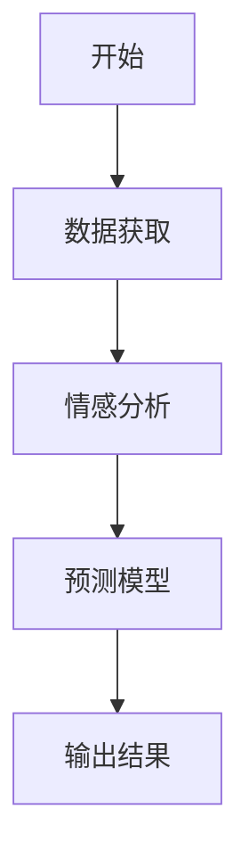
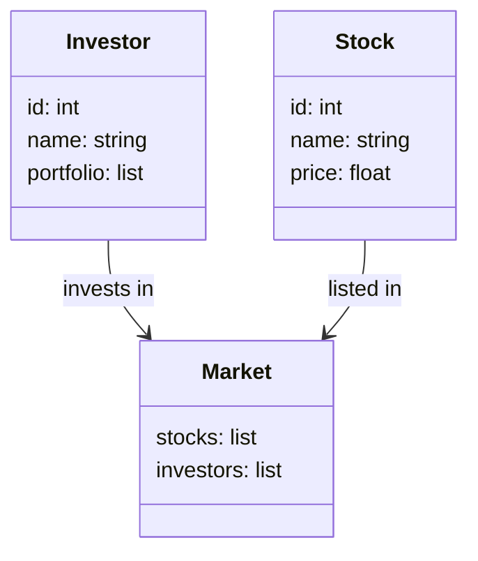
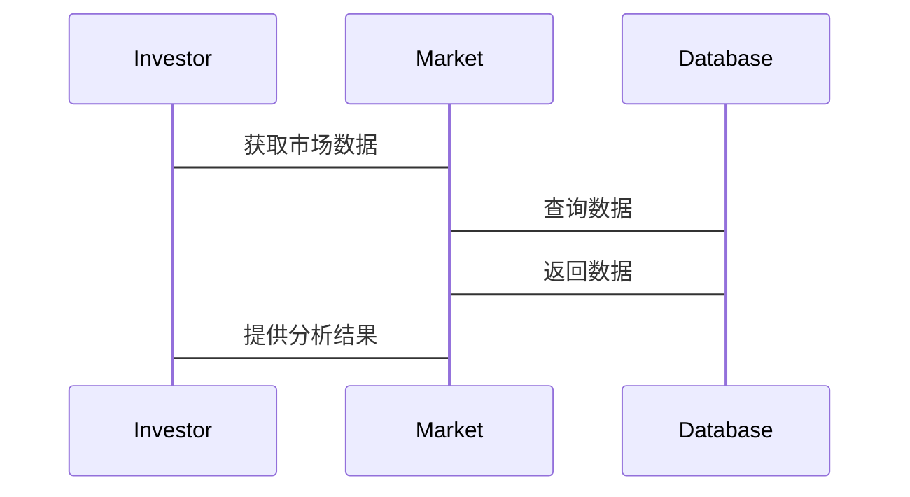

                 


# 特价股票投资中的行为金融学陷阱

> 关键词：特价股票，行为金融学，投资者情绪，认知偏差，投资陷阱

> 摘要：本文深入探讨了特价股票投资中的行为金融学陷阱，分析了投资者在低价股票投资中常见的认知偏差和情绪影响，并结合实际案例和数学模型，提出了如何识别和避免这些陷阱的策略。通过行为金融学的视角，本文为投资者提供了科学的投资决策框架和实际操作建议。

---

# 第1章: 特价股票投资与行为金融学概述

## 1.1 特价股票投资的基本概念

### 1.1.1 特价股票的定义与分类
特价股票通常指价格低于某一特定阈值的股票，如低于5美元的股票。这类股票通常被认为是高风险高回报的投资对象，因其价格低廉，吸引了一些投资者。

### 1.1.2 特价股票投资的历史发展
特价股票投资的历史可以追溯到华尔街的早期，但随着金融市场的成熟，投资者对特价股票的态度逐渐趋于理性。

### 1.1.3 特价股票投资的特点与风险
- **特点**：价格低廉、流动性较低、波动性较大。
- **风险**：市场流动性风险、公司基本面风险、投资者情绪风险。

---

## 1.2 行为金融学的基本原理

### 1.2.1 行为金融学的定义与研究对象
行为金融学是研究投资者心理和行为如何影响金融市场决策的学科。

### 1.2.2 行为金融学与传统金融学的区别
- **传统金融学**：假设投资者是理性的，市场是有效的。
- **行为金融学**：考虑投资者的非理性行为对市场的影响。

### 1.2.3 行为金融学的核心理论与模型
- ** prospect theory**：描述了投资者在面对收益和损失时的不同决策倾向。
- **情绪周期理论**：强调市场情绪波动对股票价格的影响。

---

## 1.3 特价股票投资中的行为金融学陷阱

### 1.3.1 什么是行为金融学陷阱
行为金融学陷阱是指投资者因认知偏差和情绪影响而做出的非理性投资决策。

### 1.3.2 特价股票投资中常见行为偏差
- **过度自信偏差**：投资者认为自己能够准确预测市场走势。
- **可得性偏差**：投资者过度依赖容易获取的信息做出决策。

### 1.3.3 行为金融学陷阱对投资者的影响
- 导致投资决策失误，造成经济损失。

---

# 第2章: 特价股票投资中的认知偏差

## 2.1 常见的认知偏差类型

### 2.1.1 过度自信偏差
投资者往往高估自己的能力，认为自己能够准确预测市场。

### 2.1.2 可得性偏差
投资者倾向于根据容易获取的信息做出决策，而忽略其他重要信息。

### 2.1.3 锚定效应
投资者在决策时过于依赖某个初始信息，导致判断失误。

---

## 2.2 特价股票投资中的认知偏差表现

### 2.2.1 对低价股票的过度乐观
投资者认为低价股票有更大的上涨空间，忽视其潜在风险。

### 2.2.2 对高价股票的过度悲观
投资者认为高价股票已经过高，忽视其长期增长潜力。

### 2.2.3 认知偏差对投资决策的影响
- 导致投资者在市场波动中做出错误决策。

---

## 2.3 如何识别和避免认知偏差

### 2.3.1 认知偏差的识别方法
- **自我反思**：定期回顾自己的投资决策，识别偏差。
- **多元化投资**：分散投资以降低单一决策的影响。

### 2.3.2 如何通过行为调整避免偏差
- **制定投资计划**：避免情绪化决策。
- **学习和培训**：提高金融知识，减少认知偏差。

### 2.3.3 建立科学的投资决策框架
- **数据驱动决策**：依赖客观数据而非主观判断。

---

## 2.4 本章小结
本章分析了投资者在特价股票投资中常见的认知偏差，探讨了如何识别和避免这些偏差的影响，为投资者提供了科学的决策框架。

---

# 第3章: 特价股票投资中的情绪影响

## 3.1 投资者情绪对股票价格的影响

### 3.1.1 情绪周期与市场波动
市场情绪波动会影响股票价格，投资者情绪高亢时，股票价格上涨；情绪低落时，股价下跌。

### 3.1.2 情绪如何影响投资者决策
投资者情绪影响其风险偏好和投资行为，可能导致非理性决策。

### 3.1.3 情绪与股票价格的关系
情绪是影响股票价格的重要因素之一，尤其是在市场波动较大的情况下。

---

## 3.2 特价股票投资中的情绪陷阱

### 3.2.1 情绪驱动的非理性投资行为
投资者因情绪波动而做出冲动性投资决策。

### 3.2.2 情绪波动对低价股票的影响
情绪波动可能导致低价股票价格的过度波动，投资者容易被情绪误导。

### 3.2.3 如何通过情绪分析识别陷阱
- **情绪指标分析**：利用技术指标识别市场情绪。
- **市场情绪周期分析**：通过历史数据识别市场情绪周期。

---

## 3.3 情绪驱动的市场周期分析

### 3.3.1 市场周期的定义与特征
市场周期包括牛市、熊市等不同阶段，情绪波动影响每个阶段的市场表现。

### 3.3.2 情绪周期对特价股票的影响
情绪周期变化对低价股票的影响更为显著。

### 3.3.3 如何利用情绪周期进行投资
- **识别市场情绪阶段**：在牛市中增加投资，在熊市中减少投资。

---

## 3.4 本章小结
本章探讨了投资者情绪对特价股票投资的影响，分析了情绪陷阱的表现，并提出了通过情绪分析识别陷阱的策略。

---

# 第4章: 行为金融学陷阱的数学模型与算法

## 4.1 基于 prospect theory 的投资决策模型

### 4.1.1 prospect theory 的基本原理
prospect theory 描述了投资者在面对收益和损失时的风险偏好。

### 4.1.2 数学模型
$$
V = \sum_{i=1}^{n} w_i u(x_i)
$$
其中，\(V\) 是整体效用，\(w_i\) 是概率权重，\(u(x_i)\) 是单个结果的效用。

### 4.1.3 应用示例
通过实际案例分析，说明如何利用 prospect theory 进行投资决策。

---

## 4.2 情绪驱动的股票价格预测算法

### 4.2.1 基于情感分析的预测模型
利用自然语言处理技术分析新闻和社交媒体中的情感，预测股票价格。

### 4.2.2 算法流程图


### 4.2.3 算法实现代码
```python
import pandas as pd
from sklearn.model_selection import train_test_split
from sklearn.linear_model import LinearRegression

# 数据加载
data = pd.read_csv('stock_data.csv')

# 数据分割
X = data[['price', 'volume']]
y = data['target']
X_train, X_test, y_train, y_test = train_test_split(X, y, test_size=0.2)

# 模型训练
model = LinearRegression()
model.fit(X_train, y_train)

# 预测结果
predictions = model.predict(X_test)
```

---

## 4.3 情绪周期与投资策略优化

### 4.3.1 情绪周期识别
通过时间序列分析识别市场情绪周期。

### 4.3.2 投资策略优化
根据情绪周期调整投资策略，优化投资回报。

---

## 4.4 本章小结
本章通过数学模型和算法，探讨了如何利用行为金融学理论识别和避免投资陷阱。

---

# 第5章: 系统分析与架构设计方案

## 5.1 问题场景介绍
投资者在面对特价股票投资时，如何利用行为金融学理论和技术工具进行科学决策。

## 5.2 系统功能设计

### 5.2.1 领域模型


### 5.2.2 系统架构


### 5.2.3 接口设计
- **数据接口**：提供市场数据接口。
- **用户接口**：提供投资者交互界面。

### 5.2.4 交互流程


---

## 5.3 本章小结
本章通过系统架构设计，展示了如何利用技术手段辅助投资者进行科学决策。

---

# 第6章: 项目实战

## 6.1 环境安装与配置
- **工具安装**：安装Python、Pandas、Scikit-learn等工具。

## 6.2 核心代码实现

### 6.2.1 情感分析代码
```python
from textblob import TextBlob

def get_sentiment(text):
    return TextBlob(text).sentiment.polarity
```

### 6.2.2 模型训练代码
```python
from sklearn.metrics import accuracy_score
from sklearn.tree import DecisionTreeClassifier

# 数据加载
data = pd.read_csv('sentiment_data.csv')

# 数据分割
X = data[['text']]
y = data['label']
X_train, X_test, y_train, y_test = train_test_split(X, y, test_size=0.2)

# 模型训练
model = DecisionTreeClassifier()
model.fit(X_train.values.reshape(-1, 1), y_train)

# 预测结果
y_pred = model.predict(X_test.values.reshape(-1, 1))
print(accuracy_score(y_test, y_pred))
```

---

## 6.3 案例分析与结果解读

### 6.3.1 案例分析
通过具体案例分析，说明如何利用情感分析模型进行投资决策。

### 6.3.2 结果解读
解读模型输出结果，分析其对投资决策的影响。

---

## 6.4 本章小结
本章通过项目实战，展示了如何利用行为金融学理论和技术工具进行投资分析。

---

# 第7章: 最佳实践与总结

## 7.1 小结
本文深入探讨了特价股票投资中的行为金融学陷阱，分析了认知偏差和情绪影响，并提出了科学的投资决策框架。

## 7.2 注意事项
- 投资者应避免情绪化决策。
- 投资者应多元化投资，分散风险。

## 7.3 拓展阅读
推荐相关书籍和文章，供读者进一步学习。

---

# 作者信息

作者：AI天才研究院/AI Genius Institute & 禅与计算机程序设计艺术/Zen And The Art of Computer Programming

---

本文通过系统分析和实践案例，为投资者提供了科学的投资决策框架，帮助投资者识别和避免行为金融学陷阱，实现稳健投资。

