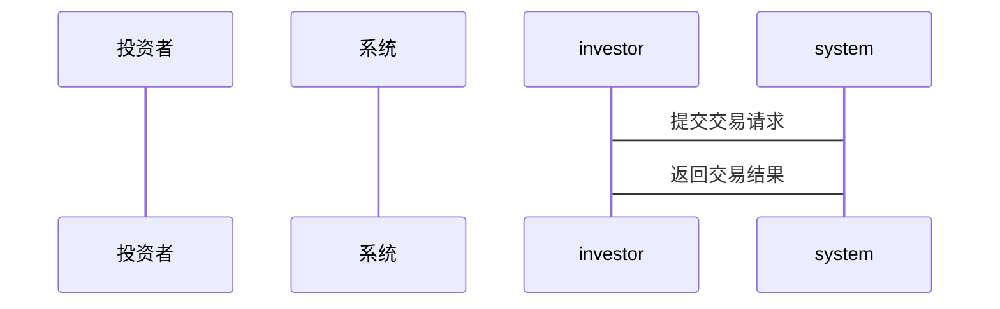

                 


# 特价股票投资中的计算社会科学与行为金融学应用

> 关键词：计算社会科学、行为金融学、特价股票、社会网络分析、情绪分析、投资者行为、算法模型

> 摘要：本文探讨了计算社会科学和行为金融学在特价股票投资中的应用，分析了投资者心理、市场行为及算法模型，结合实际案例，提出了系统的解决方案。

---

# 第一部分: 特价股票投资的背景与概述

## 第1章: 特价股票投资的基本概念

### 1.1 特价股票的定义与特征
#### 1.1.1 特价股票的基本定义
特价股票是指股价低于面值的股票，通常被视为市场低估的表现。

#### 1.1.2 特价股票的市场特征
- 价格波动性大
- 市场流动性较低
- 投机性较强

#### 1.1.3 特价股票的投资价值分析
通过基本面分析和市场情绪分析，判断其潜在投资价值。

### 1.2 投资者的心理特征
#### 1.2.1 理性与非理性决策
- 理性决策：基于逻辑和数据
- 非理性决策：受情绪影响

#### 1.2.2 认知偏差与行为偏差
- 代表性偏差：过度依赖典型例子
- 可用性偏差：高估易获取信息的重要性
- 从众心理：跟随市场趋势

### 1.3 市场运行机制
#### 1.3.1 供需关系
- 供大于求，价格下跌
- 需大于供，价格上涨

#### 1.3.2 价格波动规律
- 市场情绪影响价格波动
- 市场参与者的预期影响价格

#### 1.3.3 市场风险与收益分析
- 风险与收益的权衡
- 投资组合的优化配置

---

# 第二部分: 计算社会科学在股票投资中的应用

## 第2章: 社会网络分析与股票投资

### 2.1 社会网络分析的基本原理
#### 2.1.1 社会网络分析的核心概念
- 节点（投资者）和边（交易关系）构成网络

#### 2.1.2 社会网络分析的数学模型
- 图论基础：节点度、中心性、社群检测

#### 2.1.3 应用潜力
- 情感传播分析
- 网络影响力评估

### 2.2 基于社会网络的情感传播分析
#### 2.2.1 情感传播的定义与特征
- 情感在投资者间的传播影响市场情绪

#### 2.2.2 情感传播的网络模型
- 使用图论模型表示情感传播路径

#### 2.2.3 情感传播对股票价格的影响
- 正面情感推高股价，负面情感拉低股价

### 2.3 社会网络分析的算法实现
#### 2.3.1 常见算法
- 社会网络分析算法：如PageRank、Louvain算法

#### 2.3.2 算法实现步骤
1. 数据收集：获取投资者交易数据
2. 网络构建：建立投资者间的关系图
3. 算法应用：计算节点的影响力

#### 2.3.3 代码示例
```python
import networkx as nx
G = nx.Graph()
G.add_nodes_from([1,2,3])
G.add_edges_from([(1,2),(2,3)])
print(nx.degree_centrality(G))
```

### 2.4 本章小结
社会网络分析为理解市场情绪提供了新视角，但需结合其他因素进行综合分析。

---

# 第三部分: 行为金融学的核心理论与应用

## 第3章: 行为金融学中的投资者行为分析

### 3.1 行为金融学的基本理论
#### 3.1.1 行为金融学的定义与核心假设
- 研究投资者心理和行为对市场的影响

#### 3.1.2 与传统金融学的区别
- 传统金融学：假设市场有效
- 行为金融学：考虑市场失灵和人类因素

### 3.2 投资者行为偏差分析
#### 3.2.1 行为偏差类型
- 代表性偏差、可用性偏差、从众心理

#### 3.2.2 行为偏差对投资决策的影响
- 投资者可能做出非理性决策，影响市场价格

### 3.3 行为金融学中的情绪与认知偏差
#### 3.3.1 情绪在投资决策中的作用
- 情绪波动影响投资者决策

#### 3.3.2 认知偏差的类型与影响
- 过度自信、确认偏差

### 3.4 本章小结
投资者行为分析对理解市场波动有重要意义，但需结合社会网络分析等方法进行综合研究。

---

# 第四部分: 算法与模型在特价股票投资中的应用

## 第4章: 基于计算社会科学的算法模型

### 4.1 算法模型的基本原理
#### 4.1.1 算法模型的定义与分类
- 机器学习模型、统计模型

#### 4.1.2 算法模型的核心要素
- 数据特征、模型结构、训练参数

### 4.2 常见算法模型的实现与应用
#### 4.2.1 社会网络分析算法
- 使用Python的NetworkX库进行网络分析

#### 4.2.2 情绪分析算法
- 使用自然语言处理技术分析投资者评论

#### 4.2.3 机器学习模型
- 使用随机森林或神经网络预测股价波动

### 4.3 数学模型与公式
#### 情感分析模型
$$ P(\text{positive}) = \frac{\sum w_i}{\sum |w_i|} $$

#### 社会网络影响力模型
$$ I = \sum_{j} A_{ij} \cdot C_j $$

### 4.4 本章小结
算法模型的应用为特价股票投资提供了新的工具，但需结合实际情况进行调整。

---

# 第五部分: 系统设计与实现

## 第5章: 系统设计与实现

### 5.1 系统架构设计
#### 5.1.1 系统组件划分
- 数据采集模块、分析模块、决策支持模块

#### 5.1.2 数据流设计
1. 数据采集：获取市场数据和投资者行为数据
2. 数据处理：清洗和预处理数据
3. 模型计算：应用算法进行分析
4. 结果展示：生成可视化报告

#### 5.1.3 系统交互图


### 5.2 系统实现
#### 5.2.1 环境安装
- 安装Python、TensorFlow、NetworkX等库

#### 5.2.2 核心代码实现
```python
import numpy as np
import pandas as pd
from sklearn.ensemble import RandomForestClassifier
# 数据处理与建模
model = RandomForestClassifier()
model.fit(X_train, y_train)
y_pred = model.predict(X_test)
```

### 5.3 本章小结
系统设计与实现为投资者提供了一个高效、智能的投资决策支持工具。

---

# 第六部分: 项目实战与案例分析

## 第6章: 项目实战与案例分析

### 6.1 项目实战
#### 6.1.1 数据收集与处理
- 获取历史股价数据和投资者评论

#### 6.1.2 模型训练
- 应用社会网络分析和情绪分析模型

#### 6.1.3 结果分析
- 预测股价波动，评估模型性能

### 6.2 案例分析
#### 6.2.1 案例背景
- 某公司发布利好消息，股价短期波动

#### 6.2.2 案例分析
- 应用算法分析投资者情绪变化，预测股价走势

### 6.3 本章小结
项目实战和案例分析验证了算法的有效性，为实际投资提供了参考。

---

# 第七部分: 总结与展望

## 第7章: 总结与展望

### 7.1 总结
- 计算社会科学与行为金融学的结合为特价股票投资提供了新思路
- 算法模型的应用提高了投资决策的科学性

### 7.2 展望
- 进一步研究复杂网络分析
- 探索更多行为金融学理论在投资中的应用

---

作者：AI天才研究院 & 禅与计算机程序设计艺术

