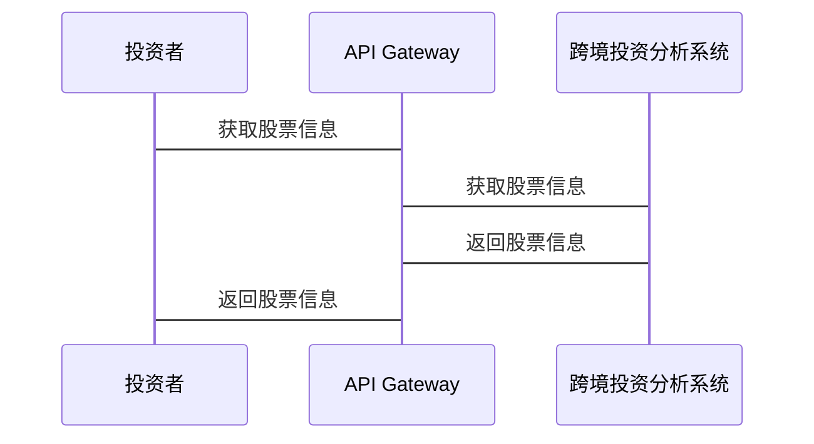

                 


# 特价股票投资中的跨境投资策略

---

## 关键词：特价股票、跨境投资、股票策略、量化分析、投资策略

---

## 摘要：  
本文深入探讨了特价股票投资中的跨境投资策略，从背景分析、核心概念、策略制定、量化分析到系统设计与实战案例，全面解析了如何在跨境市场中利用特价股票进行有效投资。通过结合量化分析和算法策略，本文为投资者提供了科学的投资方法和实战技巧。

---

## 第1章: 特价股票与跨境投资的背景介绍

### 1.1 特价股票的定义与特点

#### 1.1.1 特价股票的定义  
特价股票是指价格相对较低的股票，通常具有较高的市净率（P/B）或市盈率（P/E）比率，表明其市场价格低于其内在价值。这类股票往往被市场低估，具有较大的上涨潜力。

#### 1.1.2 特价股票的特点  
- **低估值**：市盈率和市净率较低，表明股票价格被市场低估。  
- **高潜力**：潜在的上涨空间较大，适合长期投资。  
- **高波动性**：价格波动较大，适合短期交易者。  
- **行业集中**：多集中于周期性行业，如金融、能源等。  

#### 1.1.3 特价股票的市场定位  
特价股票通常在市场低迷或行业不景气时出现，投资者需要结合宏观经济环境和行业趋势进行判断。

---

### 1.2 跨境投资的基本概念

#### 1.2.1 跨境投资的定义  
跨境投资是指投资者在本国以外的市场进行资产配置，包括股票、债券、基金等。  

#### 1.2.2 跨境投资的主要形式  
- **直接投资**：通过开立境外账户直接购买股票。  
- **间接投资**：通过购买ETF、基金等金融产品间接投资。  

#### 1.2.3 跨境投资与国内投资的区别  
- **市场环境**：境外市场受不同经济政策和法规影响。  
- **汇率风险**：涉及外汇兑换，增加了投资风险。  
- **信息不对称**：境外市场信息获取难度较大。  

---

### 1.3 特价股票与跨境投资的结合

#### 1.3.1 特价股票在跨境投资中的地位  
特价股票在跨境投资中具有重要地位，尤其是当目标市场存在低估资产时。  

#### 1.3.2 跨境投资对特价股票的影响  
- **价格发现**：跨境投资者可能发现被低估的股票价值。  
- **流动性提升**：更多的投资者参与交易，提高股票流动性。  

#### 1.3.3 特价股票跨境投资的市场现状  
随着全球化进程加快，跨境投资成为趋势，特价股票因其高潜力受到投资者关注。

---

## 1.4 本章小结  
本章介绍了特价股票和跨境投资的基本概念，分析了两者的结合及其在投资中的重要性，为后续策略分析奠定了基础。

---

## 第2章: 特价股票与跨境投资的核心概念分析

### 2.1 特价股票的核心要素

#### 2.1.1 特价股票的市场价值  
- **市盈率（P/E）**：股价与每股收益的比率，衡量股票估值。  
- **市净率（P/B）**：股价与每股净资产的比率，反映资产价值。  

#### 2.1.2 特价股票的风险特征  
- **流动性风险**：部分特价股票流动性较差。  
- **行业风险**：集中于周期性行业，受经济波动影响较大。  

#### 2.1.3 特价股票的流动性分析  
流动性差的特价股票可能难以快速变现，需关注交易量和换手率。

---

### 2.2 跨境投资的核心要素

#### 2.2.1 跨境投资的市场环境  
- **全球经济趋势**：影响跨境投资的收益与风险。  
- **地缘政治风险**：如贸易摩擦、政策变化等。  

#### 2.2.2 跨境投资的政策环境  
- **外汇管制**：部分国家对外汇交易有限制。  
- **税收政策**：不同国家的税务政策差异影响投资成本。  

#### 2.2.3 跨境投资与经济周期的关系  
经济周期波动会影响跨境投资的收益和风险。

---

### 2.3 特价股票与跨境投资的关联性

#### 2.3.1 特价股票在跨境投资中的优势  
- **估值优势**：境外市场可能存在被低估的股票。  
- **分散风险**：通过跨境投资降低单一市场的风险。  

#### 2.3.2 跨境投资对特价股票的影响机制  
- **价格发现**：跨境投资者推动股票价格回归合理水平。  
- **流动性提升**：增加交易量，改善流动性。  

#### 2.3.3 特价股票与跨境投资的协同效应  
通过跨境投资，投资者可以利用不同市场的价格差异，挖掘特价股票的投资机会。

---

## 2.4 本章小结  
本章分析了特价股票和跨境投资的核心要素及其关联性，为后续策略制定提供了理论基础。

---

## 第3章: 特价股票跨境投资策略的制定与实施

### 3.1 确定投资目标与风险偏好

#### 3.1.1 投资目标的设定  
- **短期目标**：如套利机会。  
- **长期目标**：如资产增值。  

#### 3.1.2 风险偏好的分析  
- **保守型**：低风险偏好，注重本金安全。  
- **激进型**：高风险偏好，追求高收益。  

#### 3.1.3 投资期限的规划  
长期投资适合价值发现，短期投资适合套利机会。

---

### 3.2 特价股票的选择标准

#### 3.2.1 市场估值分析  
- 低市盈率（P/E）和低市净率（P/B）是重要指标。  

#### 3.2.2 公司基本面分析  
- **盈利能力**：ROE（净资产收益率）高。  
- **财务健康**：低债务比例，现金流充裕。  

#### 3.2.3 行业地位与竞争优势  
- 行业龙头或具有竞争优势的企业更具有投资价值。

---

### 3.3 跨境投资中的风险控制

#### 3.3.1 市场风险的管理  
- 分散投资，避免过度集中。  

#### 3.3.2 汇率风险的应对  
- 使用金融衍生工具对冲汇率风险。  

#### 3.3.3 政治经济风险的防范  
- 关注目标国家的政策变化和经济状况。

---

### 3.4 投资策略的实施步骤

#### 3.4.1 策略制定  
- 明确投资目标和风险偏好。  

#### 3.4.2 策略执行  
- 选择目标市场和具体股票。  

#### 3.4.3 策略调整与优化  
- 定期评估投资组合，根据市场变化进行调整。

---

## 3.5 本章小结  
本章详细阐述了特价股票跨境投资策略的制定与实施步骤，强调了风险管理和策略调整的重要性。

---

## 第4章: 量化分析在特价股票跨境投资中的应用

### 4.1 量化分析的基本概念

#### 4.1.1 量化分析  
量化分析通过数学模型和算法对市场数据进行分析，帮助投资者做出决策。

---

### 4.2 技术指标分析

#### 4.2.1 常用技术指标  
- **相对强弱指数（RSI）**：衡量股票超买或超卖状态。  
- **移动平均线（MA）**：用于判断趋势方向。  

#### 4.2.2 技术指标的交叉应用  
通过结合多个指标，提高分析的准确性。

---

### 4.3 机器学习模型的应用

#### 4.3.1 机器学习在股票预测中的优势  
- 能够捕捉复杂市场规律。  

#### 4.3.2 常用算法  
- **线性回归**：用于预测股票价格。  
- **支持向量机（SVM）**：用于分类问题。  

#### 4.3.3 Python代码实现  
```python
import numpy as np
import pandas as pd
from sklearn.svm import SVC
from sklearn.metrics import accuracy_score

# 数据预处理
data = pd.read_csv('stock_data.csv')
X = data.drop('target', axis=1)
y = data['target']

# 训练模型
model = SVC()
model.fit(X, y)

# 预测
y_pred = model.predict(X)

# 评估
print(accuracy_score(y, y_pred))
```

---

### 4.4 本章小结  
本章介绍了量化分析在特价股票跨境投资中的应用，包括技术指标和机器学习算法，为投资者提供了科学的分析工具。

---

## 第5章: 系统分析与架构设计

### 5.1 系统功能设计

#### 5.1.1 领域模型  
- **实体**：股票、投资者、交易记录。  
- **关系**：投资者持有股票，交易记录反映交易行为。  

```mermaid
classDiagram
    class 股票 {
        ID: int
        名称: string
        价格: float
        行业: string
    }
    class 投资者 {
        ID: int
        名称: string
        资产: float
    }
    class 交易记录 {
        ID: int
        时间: datetime
        数量: int
        价格: float
    }
    股票 --o> 交易记录
    投资者 --o> 交易记录
```

---

### 5.2 系统架构设计


---

### 5.3 系统接口设计

#### 5.3.1 API接口  
- **GET /stock-info**：获取股票信息。  
- **POST /trade**：提交交易请求。  

---

### 5.4 系统交互设计



---

## 5.5 本章小结  
本章通过系统分析与架构设计，为特价股票跨境投资提供了技术支持，包括功能设计、架构设计和接口设计。

---

## 第6章: 项目实战

### 6.1 环境安装

#### 6.1.1 安装Python环境  
- 安装Python和必要的库（如Pandas、NumPy、Matplotlib）。  

#### 6.1.2 安装量化分析工具  
- 安装TradingView或其他量化分析工具。  

---

### 6.2 核心实现源代码

#### 6.2.1 数据获取与处理  
```python
import pandas as pd
import pandas_datareader as pdr

# 获取数据
data = pdr.get_data_yahoo('AAPL', start='2020-01-01', end='2023-12-31')

# 数据处理
data['MA_50'] = data['Close'].rolling(50).mean()
data['MA_200'] = data['Close'].rolling(200).mean()
```

#### 6.2.2 策略实现  
```python
from backtrader import Strategy, Broker

class MyStrategy(Strategy):
    def __init__(self):
        self.add_indicator('MA_50', 'MA_200')

    def next(self):
        if self.data.MA_50 > self.data.MA_200:
            self.buy()
        else:
            self.sell()

# 初始化交易环境
cerebro = bt.Cerebro()
cerebro.addstrategy(MyStrategy)
cerebro.broker = Broker()
```

---

### 6.3 实际案例分析

#### 6.3.1 案例分析  
以A股和港股为例，分析其关联性及投资机会。

#### 6.3.2 案例解读  
通过量化模型分析，发现某些行业在特定经济周期中的投资机会。

---

## 6.4 本章小结  
本章通过项目实战，展示了如何利用量化分析工具和算法策略进行特价股票跨境投资，提供了实际操作的指导。

---

## 第7章: 总结与展望

### 7.1 总结  
本文从背景、核心概念、策略制定、量化分析到系统设计与实战案例，全面解析了特价股票跨境投资的策略与方法。

### 7.2 未来展望  
随着技术进步和市场发展，量化分析和人工智能在投资中的应用将更加广泛，投资者需不断学习和适应新的工具与方法。

---

## 作者：AI天才研究院/AI Genius Institute & 禅与计算机程序设计艺术 /Zen And The Art of Computer Programming

