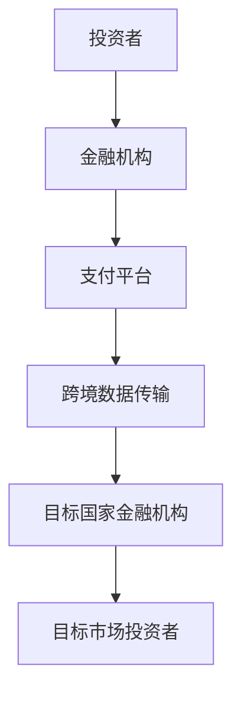
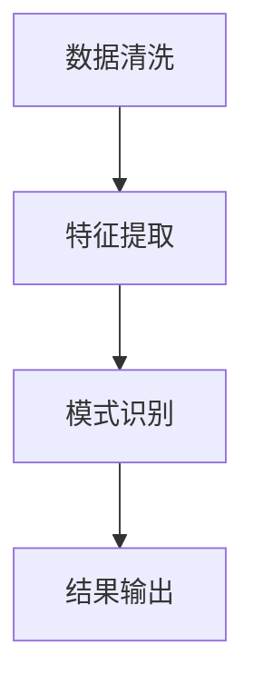
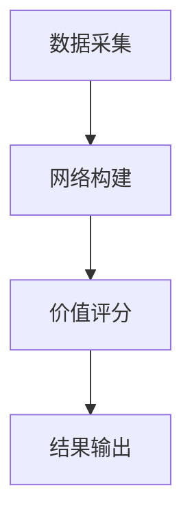
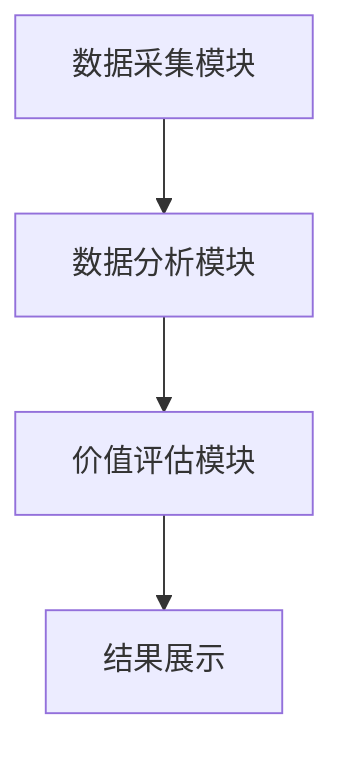

                 


```markdown
# 特价股票投资中的跨境数据流动与数字资产价值网络评估策略

## 关键词：特价股票投资、跨境数据流动、数字资产、价值网络、算法评估

## 摘要：本文深入探讨了特价股票投资中跨境数据流动的重要性，分析了数字资产价值网络的构建与评估策略，提出了基于数据流动分析的算法和系统架构设计，为投资者提供了高效的数据驱动决策方法。

---

# 第一部分: 特价股票投资与跨境数据流动概述

## 第1章: 特价股票投资的定义与特点

### 1.1 特价股票的定义
- **特价股票**：指市场价格低于其内在价值的股票，通常被认为是被市场低估的投资机会。
- **内在价值**：基于公司基本面分析（如盈利能力、成长性等）确定的股票真实价值。

### 1.2 特价股票投资的核心特点
- **低估值**：市场价格与内在价值的差距提供安全边际。
- **逆向投资**：在市场恐慌时买入，恐慌时贪婪。
- **长期视角**：关注企业的长期价值，而非短期波动。

### 1.3 特价股票投资的市场定位
- **价值投资**：以巴菲特、彼得·林奇为代表的投资策略。
- **市场周期**：在市场底部或回调时寻找特价股票。

---

## 第2章: 跨境数据流动的背景与挑战

### 2.1 跨境数据流动的定义
- **数据流动**：指数据在不同实体之间的传输和处理。
- **跨境数据流动**：跨越国界的跨国数据传输，涉及金融、贸易等多个领域。

### 2.2 跨境数据流动的主要驱动因素
- **全球化**：跨国公司运营需要跨境数据支持。
- **金融科技**：数字化转型推动跨境金融数据流动。
- **政策需求**：各国为促进经济发展，推动数据自由流动。

### 2.3 跨境数据流动的法律与技术挑战
- **法律风险**：数据隐私、跨境传输的法律限制。
- **技术挑战**：数据传输延迟、网络稳定性等问题。
- **安全风险**：数据泄露、网络攻击。

---

## 第3章: 数字资产价值网络的兴起

### 3.1 数字资产的定义与分类
- **数字资产**：以数字形式存在的资产，包括比特币、以太坊等。
- **分类**：加密货币、代币、NFTs等。

### 3.2 数字资产价值网络的概念
- **价值网络**：数字资产在不同参与者之间的价值传递网络。
- **网络效应**：数字资产通过网络连接，形成价值增值。

### 3.3 数字资产价值网络的经济意义
- **去中心化**：降低中间机构的成本。
- **高效价值转移**：提升跨境支付效率。
- **资产流动性**：增强数字资产的流动性和可兑换性。

---

# 第二部分: 跨境数据流动与数字资产价值网络的核心概念

## 第4章: 跨境数据流动的机制

### 4.1 数据流动的基本原理
- **数据传输**：数据从源点到目标的物理传输。
- **数据处理**：数据在传输过程中的处理和转换。

### 4.2 跨境数据流动的关键环节
- **数据生成**：数据的产生和收集。
- **数据传输**：跨境传输的技术实现。
- **数据存储**：数据的存储和管理。

### 4.3 跨境数据流动的实体关系图



---

## 第5章: 数字资产价值网络的构建

### 5.1 数字资产价值网络的组成要素
- **数字资产**：比特币、以太坊等。
- **参与者**：投资者、交易所、开发者。
- **交易行为**：买卖、转账等。

### 5.2 数字资产价值网络的属性特征对比表

| 特性 | 数字资产 | 传统资产 |
|------|----------|----------|
| 所有权 | 去中心化 | 中心化   |
| 转移成本 | 低       | 高       |
| 可追溯性 | 高       | 中       |

### 5.3 数字资产价值网络的ER实体关系图

```mermaid
entity 投资者
entity 数字资产
entity 交易行为
investor -[拥有]-> digital_asset
digital_asset -[参与]-> transaction_behavior
```

---

# 第三部分: 数字资产价值网络评估的算法原理

## 第6章: 数据流动分析算法

### 6.1 数据流动分析的基本思路
- **数据清洗**：去除无效数据。
- **特征提取**：提取关键特征。
- **模式识别**：识别数据流动模式。

### 6.2 数据流动分析的实现流程



### 6.3 数据流动分析的数学模型
- **数据相似性计算**：使用余弦相似度。
  $$ \text{相似度} = \frac{\sum a_i b_i}{\sqrt{\sum a_i^2} \sqrt{\sum b_i^2}} $$
- **聚类分析**：K-means算法。
  $$ \text{目标} = \sum_{i=1}^k \sum_{j=1}^n (x_j - c_i)^2 $$

## 第7章: 数字资产价值网络评估算法

### 7.1 价值网络评估的基本原理
- **网络结构分析**：节点和边的分析。
- **价值评分**：基于网络结构计算节点价值。

### 7.2 价值网络评估的实现步骤



### 7.3 价值网络评估的数学公式
- **节点价值评分**：
  $$ \text{评分} = \sum_{i=1}^{n} w_i \times v_i $$
  其中，\( w_i \) 是权重，\( v_i \) 是节点的特征值。

---

# 第四部分: 数字资产价值网络评估的系统架构设计

## 第8章: 系统功能设计

### 8.1 数据采集模块
- **功能**：采集跨境数据和数字资产数据。
- **技术**：使用API接口获取实时数据。

### 8.2 数据分析模块
- **功能**：分析数据流动和价值网络。
- **技术**：使用Python的Pandas库进行数据分析。

### 8.3 价值评估模块
- **功能**：评估数字资产的价值。
- **技术**：基于机器学习模型进行预测。

## 第9章: 系统架构设计

### 9.1 系统架构图



---

# 第五部分: 项目实战

## 第10章: 项目环境安装

### 10.1 安装Python
- 下载Python 3.9及以上版本。
- 安装常用库：Pandas、NumPy、Scikit-learn。

### 10.2 安装其他工具
- 安装Jupyter Notebook用于数据分析。
- 安装PostgreSQL用于数据存储。

## 第11章: 核心代码实现

### 11.1 数据采集代码

```python
import pandas as pd
from requests import get

def fetch_data(url):
    response = get(url)
    data = response.json()
    df = pd.DataFrame(data)
    return df

# 示例URL
url = "https://api.example.com/data"
df = fetch_data(url)
print(df)
```

### 11.2 数据分析代码

```python
from sklearn.cluster import KMeans

def analyze_data(df):
    # 特征提取
    features = df[['feature1', 'feature2']].values
    # K-means聚类
    model = KMeans(n_clusters=3)
    model.fit(features)
    return model.labels_

labels = analyze_data(df)
print(labels)
```

---

## 第12章: 实际案例分析

### 12.1 案例背景
- 某跨国企业欲进行数字资产投资，需评估其价值网络。

### 12.2 数据分析流程
1. 采集相关数据。
2. 构建价值网络。
3. 评估价值并制定投资策略。

---

# 第六部分: 最佳实践与总结

## 第13章: 最佳实践

### 13.1 小结
- 数据流动与价值网络评估是特价股票投资的重要工具。
- 通过算法优化和系统设计，提升投资决策的科学性。

### 13.2 注意事项
- 数据隐私和安全风险需严格控制。
- 算法模型需定期更新和优化。

### 13.3 拓展阅读
- 《数据挖掘导论》
- 《区块链与数字资产》

---

# 作者

**作者：AI天才研究院 & 禅与计算机程序设计艺术**

**联系方式：contact@aitianji.com**

**版权声明：本文版权归作者所有，转载请注明出处。**
```

