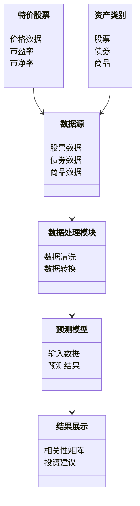

                 


# 特价股票投资中的跨资产类别数字相关性预测分析

> **关键词**：特价股票，跨资产类别，数字相关性，预测分析，投资策略  
> **摘要**：本文探讨了在特价股票投资中，如何通过跨资产类别的数字相关性预测分析来优化投资组合。文章从背景介绍、核心概念、算法原理、系统架构到项目实战，全面分析了这一主题，并提出了实际应用中的最佳实践。

---

## 第1章: 特价股票投资与跨资产类别相关性概述

### 1.1 特价股票投资的基本概念

#### 1.1.1 特价股票的定义与特征
特价股票通常指价格低于市场平均水平的股票，具有低估值、高成长潜力的特点。其特征包括：
- 低市盈率（P/E ratio）：市盈率低于行业平均水平。
- 高股息率（Dividend Yield）：股息支付率较高，吸引寻求稳定收益的投资者。
- 低市值（Market Cap）：通常为中小型企业，成长空间较大。

#### 1.1.2 特价股票投资的动机与目标
投资者选择特价股票的动机包括：
- 寻找被市场低估的投资机会。
- 追求高回报潜力。
- 分散投资风险，降低波动性。

目标通常是实现资本增值和稳定收益。

#### 1.1.3 特价股票投资的市场环境分析
市场环境对特价股票的影响因素包括：
- 宏观经济环境：如利率、通货膨胀、GDP增速等。
- 行业周期：如科技股周期性波动。
- 公司基本面：如盈利能力、财务状况等。

---

### 1.2 跨资产类别投资的基本概念

#### 1.2.1 跨资产类别投资的定义
跨资产类别投资指同时投资于股票、债券、商品（如黄金、原油）等多种资产类别，以分散风险、优化回报。

#### 1.2.2 跨资产类别投资的主要形式
包括：
- 多资产配置：将资金分配到不同资产类别中。
- 对冲基金：利用多空头寸对冲风险。
- 基金组合：通过组合不同基金降低风险。

#### 1.2.3 跨资产类别投资的优势与挑战
优势：
- 分散风险：通过多样化投资降低单一资产的风险。
- 抓住不同资产的市场机会。
- 提高整体投资回报。

挑战：
- 资产间相关性较高，可能降低分散效果。
- 管理复杂性增加，需监控多种资产。
- 不同资产的流动性差异可能影响操作。

---

### 1.3 相关性预测的背景与意义

#### 1.3.1 相关性预测的基本概念
相关性衡量两个资产价格变动的关联程度，通常用相关系数（从-1到+1）表示。正相关系数表示资产价格同向变动，负相关表示反向变动。

#### 1.3.2 特价股票与跨资产类别相关性的重要性
了解不同资产的相关性有助于：
- 优化投资组合：降低整体风险。
- 抓住市场机会：利用相关性变化进行套利。
- 提高预测准确性：通过分析相关性预测市场走势。

#### 1.3.3 数字技术在相关性预测中的作用
数字技术（大数据、AI）的应用使相关性预测更加精准，主要体现在：
- 数据量增大：利用海量数据进行分析。
- 分析方法进步：引入机器学习模型，提高预测准确性。
- 实时监控：快速捕捉市场变化，及时调整策略。

---

## 第2章: 特价股票投资中的跨资产类别相关性分析框架

### 2.1 相关性分析的基本原理

#### 2.1.1 统计学视角的相关性分析
统计学方法包括：
- Pearson相关系数：衡量线性相关性。
- Spearman相关系数：衡量秩相关性。

#### 2.1.2 机器学习视角的相关性预测
机器学习模型包括：
- 线性回归：预测资产价格变动。
- 聚类分析：识别相关资产。
- 时间序列分析：预测未来价格走势。

#### 2.1.3 数字技术在相关性分析中的应用
数字技术的应用包括：
- 数据挖掘：从海量数据中提取相关信息。
- 机器学习：构建预测模型。
- 自然语言处理：分析新闻对市场的影响。

---

### 2.2 跨资产类别相关性分析的框架构建

#### 2.2.1 数据收集与处理流程
1. 数据收集：获取股票、债券、商品等历史价格数据。
2. 数据清洗：处理缺失值、异常值。
3. 数据转换：标准化、归一化处理。

#### 2.2.2 相关性分析的指标体系
包括：
- 相关性系数：Pearson、Spearman等。
- 波动率：衡量资产价格波动程度。
- 风险调整后收益：如夏普比率。

#### 2.2.3 相关性分析的模型选择
选择模型时需考虑：
- 数据特征：线性或非线性相关。
- 模型复杂度：简单或复杂模型。
- 预测目标：短期或长期预测。

---

### 2.3 数字相关性预测的实现步骤

#### 2.3.1 数据预处理与特征提取
- 数据预处理：清洗、转换。
- 特征提取：选择影响相关性的重要特征。

#### 2.3.2 模型训练与优化
- 选择模型：如随机森林、支持向量机。
- 调参优化：通过网格搜索等方法优化模型。

#### 2.3.3 模型评估与验证
- 交叉验证：评估模型泛化能力。
- 回测：验证模型在历史数据中的表现。

---

## 第3章: 相关性预测的核心概念与联系

### 3.1 相关性预测的核心概念

#### 3.1.1 统计相关性与数字相关性的区别
- 统计相关性：基于数据分布计算相关系数。
- 数字相关性：通过算法预测未来相关性。

#### 3.1.2 数字相关性预测的数学模型
常用模型包括：
- 自回归模型（AR）：基于历史数据预测未来值。
- 自回归移动平均模型（ARIMA）：结合趋势和季节性。
- 长短期记忆网络（LSTM）：处理时间序列数据。

#### 3.1.3 数字相关性预测的算法选择
选择算法时考虑：
- 数据类型：时间序列或横截面数据。
- 预测目标：相关系数或资产价格。
- 数据量：小样本或大数据。

---

### 3.2 跨资产类别相关性的属性特征对比

#### 3.2.1 不同资产类别的相关性特征
| 资产类别 | 相关性特征 |
|----------|------------|
| 股票     | 波动性高，相关性受宏观经济影响大。 |
| 债券     | 相关性与利率相关，通常与股票呈负相关。 |
| 商品     | 如黄金与股票通常负相关，原油与股票正相关。 |

#### 3.2.2 特价股票与其他资产的相关性对比
- 特价股票与债券：通常负相关，因为债券收益率上升可能吸引资金流出股市。
- 特价股票与商品：相关性较低，但在特定情况下（如通货膨胀）可能正相关。

#### 3.2.3 相关性强度与投资策略的关系
- 高相关性：适合对冲风险，但需谨慎选择资产。
- 低相关性：适合分散投资，降低整体波动性。

---

## 第4章: 相关性预测的数学模型与算法实现

### 4.1 算法原理

#### 4.1.1 Pearson相关系数计算
Pearson相关系数公式：
$$ r = \frac{\sum (x_i - \bar{x})(y_i - \bar{y})}{\sqrt{\sum (x_i - \bar{x})^2} \sqrt{\sum (y_i - \bar{y})^2}} $$

其中，$\bar{x}$和$\bar{y}$分别是$x$和$y$的平均值。

#### 4.1.2 协方差矩阵计算
协方差矩阵表示资产之间的协方差，公式为：
$$ \text{Cov}(x, y) = \frac{1}{n-1} \sum_{i=1}^{n} (x_i - \bar{x})(y_i - \bar{y}) $$

#### 4.1.3 主成分分析（PCA）
PCA用于降维，提取主要影响资产相关性的特征。步骤包括：
1. 计算协方差矩阵。
2. 计算特征值和特征向量。
3. 选择主要成分。

---

## 第5章: 系统分析与架构设计方案

### 5.1 系统功能设计

#### 5.1.1 领域模型（Mermaid类图）


#### 5.1.2 系统架构设计（Mermaid架构图）


---

## 第6章: 项目实战

### 6.1 环境安装与配置

#### 6.1.1 安装Python环境
安装Python和必要的库：
```bash
pip install numpy pandas scikit-learn matplotlib
```

#### 6.1.2 数据获取
使用Yahoo Finance获取数据：
```python
import pandas_datareader as pdr
data = pdr.get_data_yahoo(tickers, start, end)
```

---

### 6.2 核心代码实现

#### 6.2.1 数据预处理
```python
import pandas as pd
import numpy as np

# 数据清洗
data.dropna(inplace=True)
# 标准化处理
from sklearn.preprocessing import StandardScaler
scaler = StandardScaler()
data_scaled = pd.DataFrame(scaler.fit_transform(data), columns=data.columns)
```

#### 6.2.2 模型训练
```python
from sklearn.linear_model import LinearRegression
model = LinearRegression()
model.fit(X_train, y_train)
```

#### 6.2.3 结果展示
```python
import matplotlib.pyplot as plt
plt.scatter(y_true, y_pred)
plt.xlabel('Actual')
plt.ylabel('Predicted')
plt.show()
```

---

## 第7章: 总结与展望

### 7.1 本章小结
本文通过分析特价股票与跨资产类别相关性，构建了预测模型，并提出了优化投资组合的策略。

### 7.2 未来展望
未来研究方向包括：
- 更复杂模型的应用，如深度学习。
- 多因素模型的优化。
- 实时预测系统的开发。

---

## 参考文献

- 《投资学》（书籍）
- 《机器学习实战》（书籍）
- 相关学术论文

---

**作者：AI天才研究院 & 禅与计算机程序设计艺术**

---

以上是文章的完整内容，涵盖了从理论到实践的各个方面，确保读者能够系统地理解和掌握相关知识。

