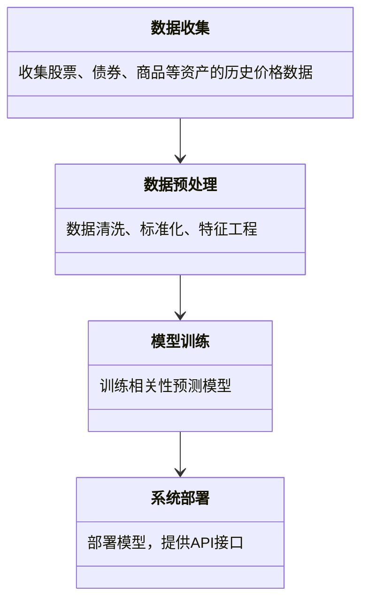
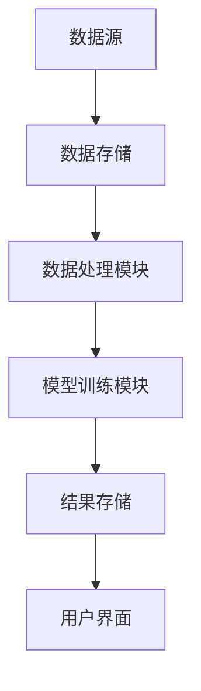
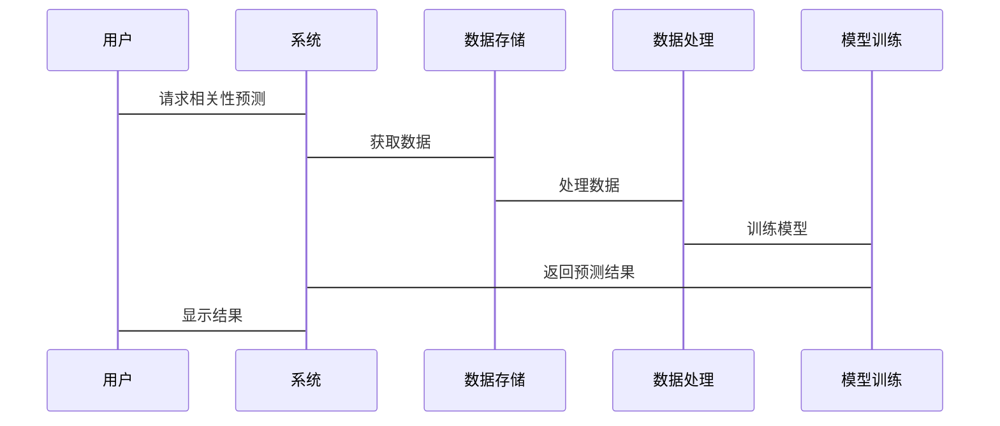

                 


# 特价股票投资中的跨资产类别相关性预测分析

## 关键词：特价股票投资，跨资产相关性，预测分析，协方差，多元回归

## 摘要：本文探讨了特价股票投资中跨资产类别相关性预测的重要性，通过分析相关性矩阵和时间序列数据，结合数学模型和算法，提出了优化投资组合的策略。文章从背景介绍、核心概念、算法原理、系统设计到项目实战，全面解析了如何通过跨资产相关性预测提升投资收益。

---

# 目录大纲：特价股票投资中的跨资产类别相关性预测分析

## 第一部分：背景介绍

### 第1章：特价股票投资与跨资产相关性概述

#### 1.1 特价股票投资的基本概念

- 1.1.1 特价股票的定义与特点
  - 特价股票是指价格低于其内在价值的股票，通常具有较高的潜在回报。
  - 特价股票的特点包括低估值、高分红率、市场流动性较低等。

- 1.1.2 特价股票投资的基本原理
  - 基于价值投资理念，寻找被市场低估的股票。
  - 分析公司基本面，如盈利能力、财务状况、行业地位等。

- 1.1.3 特价股票投资的市场环境
  - 市场周期性波动对特价股票的影响。
  - 宏观经济因素如利率、通货膨胀对股票市场的影响。

#### 1.2 跨资产类别相关性的概念

- 1.2.1 资产类别概述
  - 股票、债券、商品、房地产等主要资产类别。
  - 每类资产的特点及其在投资组合中的作用。

- 1.2.2 跨资产相关性的定义与作用
  - 相关性是指不同资产价格变动的联动性。
  - 跨资产相关性的作用包括分散风险、优化资产配置、提高投资收益。

- 1.2.3 跨资产相关性在投资中的应用
  - 通过分析相关性矩阵，选择相关性较低的资产以分散风险。
  - 利用相关性动态变化，捕捉投资机会。

#### 1.3 特价股票与跨资产相关性的关联

- 1.3.1 特价股票投资中的资产配置
  - 在投资组合中加入特价股票以提高收益。
  - 需要考虑与其他资产的相关性以分散风险。

- 1.3.2 跨资产相关性对特价股票投资的影响
  - 相关性高的资产可能同时受市场波动影响，增加投资风险。
  - 通过分析相关性，选择互补性资产以优化投资组合。

- 1.3.3 特价股票投资中的风险与收益平衡
  - 高收益通常伴随着高风险。
  - 通过跨资产相关性分析，平衡风险与收益，实现稳健投资。

---

## 第二部分：核心概念与联系

### 第2章：跨资产相关性分析的原理与方法

#### 2.1 相关性分析的数学基础

- 2.1.1 协方差与相关系数的定义
  - 协方差（Covariance）：衡量两个变量变化的方向和程度。
  - 相关系数（Correlation Coefficient）：标准化的协方差，衡量相关性的强弱和方向。

  $$ Cov(X, Y) = E[(X - \mu_X)(Y - \mu_Y)] $$
  
  $$ Corr(X, Y) = \frac{Cov(X, Y)}{\sigma_X \sigma_Y} $$

- 2.1.2 相关系数的计算公式
  - 皮尔逊相关系数（Pearson's r）：
  
  $$ r = \frac{\sum (x_i - \bar{x})(y_i - \bar{y})}{\sqrt{\sum (x_i - \bar{x})^2 \sum (y_i - \bar{y})^2}} $$

- 2.1.3 相关系数的性质与局限性
  - 相关系数的范围在-1到1之间，绝对值越大，相关性越强。
  - 皮尔逊相关系数假设变量服从正态分布，适用于线性关系，对非线性关系可能不适用。

#### 2.2 资产类别与相关性矩阵

- 2.2.1 资产类别的分类标准
  - 主要资产类别包括股票、债券、商品（如黄金、原油）、房地产等。
  - 每类资产具有不同的风险收益特征。

- 2.2.2 相关性矩阵的构建与解读
  - 通过计算各资产类别之间的协方差或相关系数，构建相关性矩阵。
  - 相关性矩阵的对角线通常为1，表示资产与其自身的相关性。

- 2.2.3 资产类别间的动态相关性
  - 不同资产类别的相关性会随市场环境变化而变化。
  - 经济危机时，股票和债券的相关性可能上升，黄金作为避险资产，相关性可能下降。

#### 2.3 跨资产相关性分析的可视化

- 2.3.1 使用热力图展示相关性矩阵
  - 热力图通过颜色深浅表示相关性强度。
  - 例如，红色表示正相关，蓝色表示负相关。

- 2.3.2 用散点图分析资产间的相关性
  - 散点图显示两个资产价格变动的关系。
  - 点分布的紧密程度反映相关性强度。

- 2.3.3 动态相关性的时间序列分析
  - 利用时间序列数据，分析相关性随时间的变化趋势。
  - 可使用动态相关系数（Dynamic Correlation）方法。

---

## 第三部分：算法原理讲解

### 第3章：相关性预测的算法原理

#### 3.1 协方差与相关系数的计算

- 3.1.1 协方差的计算公式

$$ Cov(X, Y) = \frac{\sum_{i=1}^{n} (x_i - \bar{x})(y_i - \bar{y})}{n-1} $$

- 3.1.2 相关系数的计算公式

$$ Corr(X, Y) = \frac{Cov(X, Y)}{S_X S_Y} $$

其中，$S_X$ 和 $S_Y$ 分别是X和Y的标准差。

- 3.1.3 示例计算与结果解读
  - 通过具体数据计算协方差和相关系数，分析资产之间的相关性。

#### 3.2 多元回归模型在相关性预测中的应用

- 3.2.1 多元回归模型的基本原理
  - 多元回归模型用于预测一个因变量与多个自变量之间的关系。
  - 模型形式：

$$ y = \beta_0 + \beta_1 x_1 + \beta_2 x_2 + \dots + \beta_k x_k + \epsilon $$

- 3.2.2 模型中的变量选择与处理
  - 使用逐步回归法选择显著变量。
  - 处理多重共线性问题，如使用主成分分析。

- 3.2.3 模型的评估与优化
  - 使用R²、调整R²、AIC、BIC等指标评估模型。
  - 通过交叉验证优化模型参数。

#### 3.3 时间序列分析在相关性预测中的应用

- 3.3.1 时间序列分析的基本概念
  - 时间序列数据是指按时间顺序排列的数据。
  - 常用模型包括ARIMA、GARCH等。

- 3.3.2 自回归模型

$$ y_t = \alpha + \beta y_{t-1} + \epsilon_t $$

- 3.3.3 动态相关性模型
  - 通过动态相关系数模型（Dynamic Conditional Correlation, DCC）捕捉相关性的时变性。

---

## 第四部分：系统分析与架构设计方案

### 第4章：跨资产相关性预测系统的构建

#### 4.1 问题场景介绍

- 投资者希望通过分析跨资产相关性，优化投资组合。
- 需要构建一个实时或近实时的相关性预测系统。

#### 4.2 项目介绍

- 项目目标：构建一个跨资产相关性预测系统，帮助投资者优化资产配置。
- 项目范围：包括数据收集、处理、建模和可视化。

#### 4.3 系统功能设计（领域模型）



#### 4.4 系统架构设计



#### 4.5 系统接口设计

- 数据接口：提供API获取实时数据。
- 模型接口：提供API进行相关性预测。
- 用户界面：提供可视化结果展示。

#### 4.6 系统交互设计



---

## 第五部分：项目实战

### 第5章：跨资产相关性预测系统的实现

#### 5.1 环境安装

- 安装Python、Pandas、NumPy、Scikit-learn、Plotly等库。
  ```bash
  pip install pandas numpy scikit-learn plotly
  ```

#### 5.2 系统核心实现源代码

- 数据收集与预处理：
  ```python
  import pandas as pd
  import numpy as np

  # 数据收集
  data = pd.read_csv('asset_prices.csv')
  ```

- 相关性矩阵计算：
  ```python
  # 计算相关性矩阵
  correlation_matrix = data.corr()
  ```

- 模型训练：
  ```python
  from sklearn.linear_model import LinearRegression

  # 特征矩阵和目标向量
  X = data[['stock', 'bond']]
  y = data['gold']

  # 训练模型
  model = LinearRegression()
  model.fit(X, y)
  ```

#### 5.3 代码应用解读与分析

- 数据预处理：包括数据清洗、缺失值处理、标准化等。
- 模型训练：选择合适的算法，如线性回归、随机森林等。
- 结果分析：通过可视化工具展示相关性矩阵和预测结果。

#### 5.4 实际案例分析

- 以某段时间内的股票、债券、黄金为例，计算相关性矩阵。
- 分析不同市场环境下的相关性变化，优化投资组合。

#### 5.5 项目小结

- 项目实现了跨资产相关性预测系统。
- 系统能够帮助投资者优化资产配置，降低风险。

---

## 第六部分：总结与扩展

### 第6章：总结与最佳实践

#### 6.1 总结

- 本文详细介绍了特价股票投资中的跨资产相关性预测分析。
- 通过数学模型和算法，构建了相关性预测系统。
- 系统能够帮助投资者优化投资组合，实现稳健收益。

#### 6.2 最佳实践 tips

- 定期更新模型，适应市场变化。
- 结合其他因素，如宏观经济指标，提高预测准确性。
- 风险管理是投资成功的关键，合理控制仓位和杠杆。

#### 6.3 小结

- 跨资产相关性分析是投资组合优化的重要工具。
- 通过动态分析和模型优化，可以提高投资收益，降低风险。

#### 6.4 注意事项

- 数据质量对预测结果影响重大，确保数据准确性和完整性。
- 模型选择应根据具体情况，避免盲目使用复杂算法。
- 风险提示：投资有风险，入市需谨慎。

#### 6.5 拓展阅读

- 阅读相关书籍：《投资学》、《风险管理》。
- 关注学术论文，了解相关性预测的最新研究。

---

## 作者：AI天才研究院/AI Genius Institute & 禅与计算机程序设计艺术 /Zen And The Art of Computer Programming

---

本文通过系统地分析特价股票投资中的跨资产相关性预测，结合数学模型和实际案例，为投资者提供了优化资产配置的科学方法。希望本文能为读者在投资决策中提供有价值的参考。

