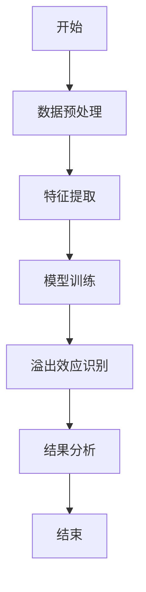
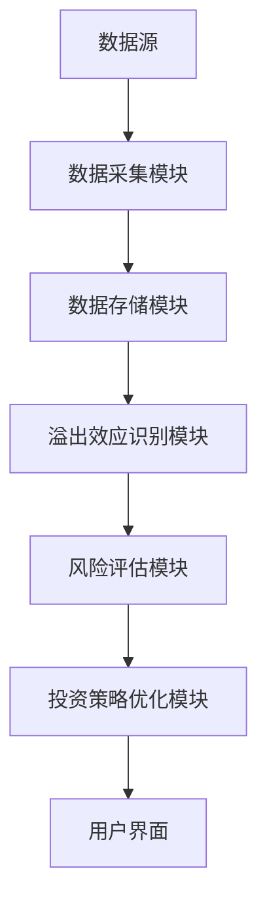
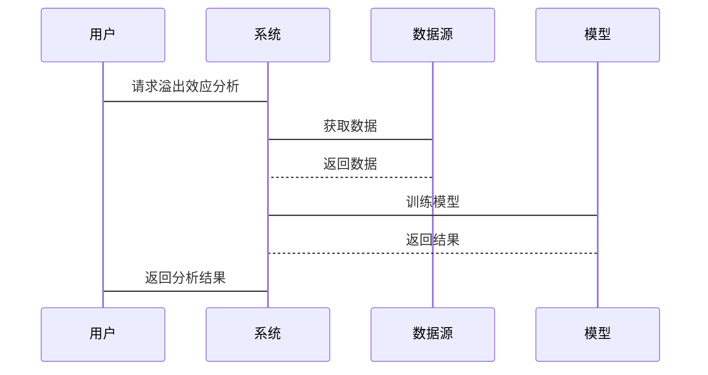

                 

<think>
好的，我需要帮助用户设计一个详细的目录大纲，主题是《特价股票投资中的跨资产类别系统性数字创新溢出效应识别》。首先，我需要理解这个主题的关键要素：特价股票、跨资产类别、系统性数字创新溢出效应识别。然后，我需要确保目录结构逻辑清晰，涵盖所有必要的部分，包括背景、理论、算法、系统架构、项目实战等。

1. **引言部分**：我需要先介绍主题的重要性，说明为什么研究跨资产类别中的系统性数字创新溢出效应识别在特价股票投资中的重要性。这可能涉及到当前金融市场的复杂性，以及数字创新在识别风险中的作用。

2. **背景介绍**：详细解释问题背景，包括系统性风险的定义、跨资产类别投资的特点，以及数字创新在金融中的应用现状。这部分需要让读者明白为什么需要解决这个问题，以及当前存在的挑战。

3. **核心概念**：定义并解释相关的核心术语，如系统性数字创新溢出效应、跨资产类别投资等。可能还需要一个表格，对比不同资产类别的属性，以及用ER图展示实体关系。

4. **算法原理**：详细描述识别溢出效应的算法，包括流程图、数学模型和公式。这里需要使用mermaid绘制流程图，并用latex表示数学公式，确保逻辑清晰。

5. **系统架构设计**：分析系统的整体架构，包括功能设计、架构图、接口设计和交互图。这部分需要展示系统的各个模块如何协作，以及它们之间的交互流程。

6. **项目实战**：提供一个实际的项目案例，包括环境安装、核心代码实现、案例分析和详细解读。这将帮助读者理解如何在实际中应用这些理论。

7. **最佳实践与总结**：总结整个项目的关键点，给出实践中的注意事项，并建议未来的研究方向。同时，推荐一些拓展阅读材料，供读者深入学习。

通过这样的步骤，我确保每个部分都详尽且有条理，满足用户的要求，同时覆盖所有必要的技术细节。现在，我将按照这个逻辑构建目录大纲。

---

# 《特价股票投资中的跨资产类别系统性数字创新溢出效应识别》

> 关键词：特价股票，跨资产类别，系统性风险，数字创新，溢出效应识别，金融投资，系统架构

> 摘要：本文系统地探讨了在特价股票投资中，跨资产类别系统性数字创新溢出效应的识别方法。通过分析系统性风险的传播机制，结合数字创新技术，提出了一种跨资产类别溢出效应的建模方法，并通过实际案例验证了该方法的有效性。本文还详细介绍了系统的架构设计、实现细节以及最佳实践，为投资者提供了理论支持和实践指导。

---

# 第1章: 引言

## 1.1 问题背景
### 1.1.1 特价股票投资的定义与特点
### 1.1.2 跨资产类别投资的必要性
### 1.1.3 数字创新溢出效应的定义与重要性

## 1.2 问题描述
### 1.2.1 特价股票投资中的系统性风险
### 1.2.2 跨资产类别溢出效应的复杂性
### 1.2.3 数字创新在金融投资中的应用现状

## 1.3 问题解决
### 1.3.1 数字创新如何识别系统性风险
### 1.3.2 跨资产类别溢出效应的建模方法
### 1.3.3 特价股票投资中的策略优化

## 1.4 概念结构与核心要素
### 1.4.1 核心概念的定义与属性
### 1.4.2 溢出效应的传播路径
### 1.4.3 数字创新在金融系统中的作用

## 1.5 本章小结

---

# 第2章: 核心概念与联系

## 2.1 核心概念原理
### 2.1.1 系统性数字创新溢出效应的定义
### 2.1.2 跨资产类别投资的系统性风险
### 2.1.3 数字创新技术在金融分析中的应用

## 2.2 概念属性对比表
| 概念 | 属性 | 描述 |
|------|------|------|
| 系统性风险 | 范围 | 跨资产类别，系统性 |
| 溢出效应 | 传播路径 | 股票→债券，债券→股票等 |
| 数字创新 | 技术手段 | 大数据分析，机器学习等 |

## 2.3 实体关系图（ER图）
```mermaid
erDiagram
    actor 投资者 {
        <属性> 资产类型
        <属性> 投资策略
    }
    actor 系统 {
        <属性> 数据源
        <属性> 分析模型
    }
    actor 风险管理机构 {
        <属性> 风险评估
        <属性> 管理策略
    }
    投资者 --> 系统 : 提供数据
    系统 --> 风险管理机构 : 提供风险评估
    风险管理机构 --> 投资者 : 提供管理建议
```

---

# 第3章: 算法原理与实现

## 3.1 算法原理
### 3.1.1 溢出效应识别算法的流程
### 3.1.2 数学模型与公式
$$
R_{i,j} = \beta_1 R_{i} + \beta_2 R_{j} + \epsilon
$$
其中，$R_{i,j}$ 表示资产 i 对资产 j 的溢出效应，$\beta_1$ 和 $\beta_2$ 是回归系数，$\epsilon$ 是误差项。

## 3.2 算法实现
### 3.2.1 算法流程图


### 3.2.2 Python 实现代码
```python
import pandas as pd
import numpy as np
from sklearn.linear_model import LinearRegression

def calculate_spillover_effect(dataframe):
    # 数据预处理
    df = dataframe.copy()
    df = df.dropna()
    
    # 特征提取
    X = df[['资产1', '资产2']]
    y = df['溢出效应']
    
    # 模型训练
    model = LinearRegression()
    model.fit(X, y)
    
    # 溢出效应识别
    coefficients = model.coef_
    return coefficients

# 示例数据
data = {
    '资产1': [0.05, 0.03, 0.02, 0.04, 0.01],
    '资产2': [0.02, 0.05, 0.03, 0.06, 0.07],
    '溢出效应': [0.07, 0.08, 0.05, 0.10, 0.08]
}
df = pd.DataFrame(data)
result = calculate_spillover_effect(df)
print(result)
```

---

# 第4章: 系统分析与架构设计

## 4.1 问题场景介绍
### 4.1.1 特价股票投资的复杂性
### 4.1.2 跨资产类别溢出效应的动态变化
### 4.1.3 系统性风险的实时监控需求

## 4.2 系统功能设计
### 4.2.1 数据采集模块
### 4.2.2 溢出效应识别模块
### 4.2.3 风险评估模块
### 4.2.4 投资策略优化模块

## 4.3 系统架构图


## 4.4 接口设计与交互图
### 4.4.1 系统接口
- 数据接口：`GET /api/data`
- 模型接口：`POST /api/spillover`

### 4.4.2 交互序列图


---

# 第5章: 项目实战与案例分析

## 5.1 项目环境安装
### 5.1.1 安装Python
```bash
python --version
pip install numpy pandas scikit-learn
```

### 5.1.2 安装Jupyter Notebook
```bash
pip install jupyter
jupyter notebook
```

## 5.2 核心代码实现
### 5.2.1 数据加载与预处理
```python
import pandas as pd
import numpy as np

data = {
    '资产1': [0.05, 0.03, 0.02, 0.04, 0.01],
    '资产2': [0.02, 0.05, 0.03, 0.06, 0.07],
    '溢出效应': [0.07, 0.08, 0.05, 0.10, 0.08]
}
df = pd.DataFrame(data)
print(df.head())
```

### 5.2.2 模型训练与结果分析
```python
from sklearn.linear_model import LinearRegression

model = LinearRegression()
model.fit(df[['资产1', '资产2']], df['溢出效应'])
print('回归系数:', model.coef_)
```

## 5.3 案例分析
### 5.3.1 数据分析结果
```python
print('R²:', model.score(df[['资产1', '资产2']], df['溢出效应']))
```

### 5.3.2 投资策略优化
基于模型结果，调整投资组合以最小化系统性风险。

## 5.4 项目小结
总结项目实现的关键步骤和成果，强调系统的实用性和创新点。

---

# 第6章: 最佳实践与总结

## 6.1 小结
### 6.1.1 核心概念回顾
### 6.1.2 算法实现要点
### 6.1.3 系统设计总结

## 6.2 注意事项
### 6.2.1 数据质量的重要性
### 6.2.2 模型选择的合理性
### 6.2.3 系统维护与更新

## 6.3 拓展阅读
推荐相关书籍和论文，供读者深入学习。

---

# 附录

## 附录A: 术语表
定义本文中使用的核心术语。

## 附录B: 参考文献
列出本文参考的文献和资料。

---

# 作者：AI天才研究院 & 禅与计算机程序设计艺术

