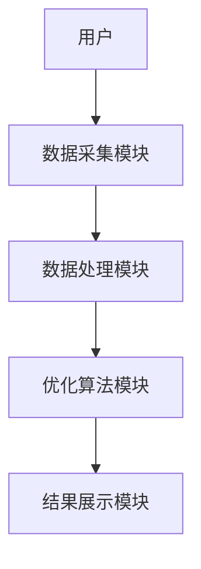

                 


# 特价股票投资中的跨资产类别配置方法

## 关键词：
- 特价股票投资
- 跨资产类别配置
- 投资组合优化
- 风险管理
- 股票投资策略

## 摘要：
本文系统地探讨了特价股票投资中的跨资产类别配置方法，从理论到实践，详细介绍了如何通过跨资产配置优化投资组合。文章首先介绍了特价股票投资的背景和跨资产配置的重要性，接着深入分析了跨资产配置的核心概念与不同资产类别的特性。随后，通过数学模型和算法原理，阐述了如何利用均值-方差模型优化资产配置。在系统设计部分，提出了一个智能投资管理系统，并通过项目实战展示了如何在实际操作中应用这些方法。最后，总结了跨资产配置的优势和未来的发展趋势。

---

# 第一部分: 特价股票投资的背景与概述

## 第1章: 特价股票投资的背景与概述

### 1.1 特价股票投资的定义与特点
#### 1.1.1 特价股票的定义
特价股票是指在特定市场条件下，价格被低估的股票。通常出现在市场波动、经济危机或公司困境时期，投资者可以以低于其内在价值的价格购买这些股票，以期在未来市场恢复时获得超额收益。

#### 1.1.2 特价股票投资的核心特点
- **低估值**：特价股票的价格通常低于其内在价值。
- **高波动性**：这类股票的价格波动较大，既有下跌风险，也有上涨机会。
- **逆向投资**：投资者在市场恐慌时买入，市场乐观时卖出。

#### 1.1.3 特价股票与普通股票的区别
| 属性         | 特价股票               | 普通股票               |
|--------------|------------------------|------------------------|
| 估值         | 通常低于内在价值       | 通常接近或高于内在价值 |
| 波动性       | 高                    | 中等或低              |
| 投资策略     | 逆向投资为主           | 随市投资为主           |

### 1.2 跨资产类别配置的必要性
#### 1.2.1 跨资产配置的定义
跨资产配置是指将投资组合分散到不同资产类别（如股票、债券、基金、黄金等）中，以降低风险并优化收益。

#### 1.2.2 跨资产配置的优势
- **分散风险**：通过投资不同资产，降低单一资产带来的风险。
- **优化收益**：不同资产在不同市场环境下表现不同，组合投资可平衡收益。

#### 1.2.3 跨资产配置在投资中的作用
跨资产配置能够帮助投资者在市场波动中保持投资组合的稳定性，同时捕捉不同资产的收益机会。

### 1.3 当前市场中的跨资产配置现状
#### 1.3.1 现今市场的多样性
当前市场中，投资者可以接触到多种资产类别，包括股票、债券、房地产信托基金（REITs）、加密货币等。

#### 1.3.2 跨资产配置的实际案例
例如，在2020年新冠疫情爆发期间，投资者将部分资金从股票转移到债券，以规避市场波动风险。

#### 1.3.3 跨资产配置的未来趋势
随着金融市场的全球化和多样化，跨资产配置将更加重要，投资者需要更加灵活地调整资产配置以应对市场变化。

---

# 第二部分: 跨资产类别配置的核心概念与联系

## 第2章: 跨资产类别配置的核心概念与联系

### 2.1 跨资产配置的基本原理
#### 2.1.1 跨资产配置的理论基础
跨资产配置基于现代投资组合理论（MPT），通过优化资产组合的期望收益和风险，实现收益最大化或风险最小化。

#### 2.1.2 跨资产配置的核心要素
- **资产类别选择**：根据市场环境选择合适的资产类别。
- **权重分配**：确定每种资产在组合中的权重。
- **再平衡**：定期调整资产配置以维持目标比例。

#### 2.1.3 跨资产配置的数学模型
现代投资组合理论的核心是均值-方差模型，用于优化资产组合的风险和收益。

### 2.2 资产类别对比分析
#### 2.2.1 股票、债券、基金的对比
| 资产类别 | 风险 | 收益 | 流动性 |
|----------|------|------|--------|
| 股票     | 高   | 高   | 好     |
| 债券     | 中   | 中   | 好     |
| 基金     | 中   | 中   | 好     |

#### 2.2.2 不同资产类别的风险收益比
通过对比不同资产的风险和收益，投资者可以更好地进行资产配置。

---

# 第三部分: 財務分析与算法原理

## 第3章: 財務分析与算法原理

### 3.1 投資組合優化的數學模型
#### 3.1.1 均值-方差模型
均值-方差模型是投资组合优化的基础，目标是最小化组合风险或最大化组合收益。

公式：
$$
\text{Minimize } \sigma^2 \quad \text{subject to } E[r] = \text{目标收益}
$$

其中，$\sigma^2$是组合的方差，$E[r]$是组合的期望收益。

#### 3.1.2 数学模型的实现步骤
1. 收集各资产的历史收益率数据。
2. 计算各资产的协方差矩阵。
3. 建立优化问题，使用拉格朗日乘数法求解。

### 3.2 股票投資策略的具體實現
#### 3.2.1 数据获取与预处理
使用Python的pandas库获取历史数据，并进行缺失值处理。

```python
import pandas as pd
data = pd.read_csv('stock_data.csv')
data.dropna(inplace=True)
```

#### 3.2.2 优化模型的实现
使用scipy.optimize.minimize函数实现均值-方差优化。

```python
from scipy.optimize import minimize

def portfolio_optimization(returns):
    n = len(returns.columns)
    mu = returns.mean()
    sigma = returns.cov()
    bounds = [(0, 1) for _ in range(n)]
    result = minimize(lambda w: (w.T @ sigma @ w - 2 * w.T @ mu).item(), 
                     [0.5]*n, bounds=bounds)
    return result.x

weights = portfolio_optimization(data.pct_change().dropna())
```

#### 3.2.3 优化结果分析
分析优化后的权重分布，评估组合的风险和收益。

---

# 第四部分: 系統分析與架構設計方案

## 第4章: 系統分析與架構設計方案

### 4.1 系統功能設計
#### 4.1.1 系統介紹
智能投资管理系统是一个基于跨资产配置的股票投资工具。

#### 4.1.2 系統架構設計
使用Mermaid图展示系统架构：



#### 4.1.3 系統功能模塊
- 数据采集模块：收集股票、债券等数据。
- 数据处理模块：清洗和转换数据。
- 优化算法模块：实现投资组合优化。
- 结果展示模块：展示优化后的资产配置建议。

### 4.2 系統接口設計
系统提供API接口，方便与其他平台集成。

---

# 第五部分: 項目實戰與總結

## 第5章: 項目實戰與總結

### 5.1 環境安裝與配置
#### 5.1.1 安裝必要的Python庫
```bash
pip install numpy pandas scipy matplotlib
```

#### 5.1.2 数据来源
使用Yahoo Finance获取股票数据。

### 5.2 核心代码實現
#### 5.2.1 数据预处理
```python
import pandas_datareader as pdr
data = pdr.get_data_yahoo('AAPL', start='2020-01-01', end='2023-12-31')
```

#### 5.2.2 优化算法实现
```python
from scipy.optimize import minimize

def portfolio_optimization(returns):
    n = len(returns.columns)
    mu = returns.mean()
    sigma = returns.cov()
    bounds = [(0, 1) for _ in range(n)]
    result = minimize(lambda w: (w.T @ sigma @ w - 2 * w.T @ mu).item(), 
                     [0.5]*n, bounds=bounds)
    return result.x

returns = data.pct_change().dropna()
weights = portfolio_optimization(returns)
```

### 5.3 總結與啟示
跨资产配置能够有效降低投资风险，提高收益稳定性。投资者应根据市场变化定期调整资产配置，以实现长期稳健的投资回报。

---

# 作者：AI天才研究院/AI Genius Institute & 禅与计算机程序设计艺术 /Zen And The Art of Computer Programming

---

**注意：** 本文内容为简化示例，实际应用中需结合具体情况，并考虑专业投资建议。

