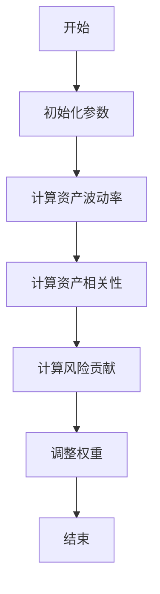

                 


# 特价股票投资中的风险平价理念应用

**关键词**：特价股票、风险平价、投资策略、算法原理、系统架构、项目实战

**摘要**：本文深入探讨了风险平价理念在特价股票投资中的应用，从理论基础到算法实现，再到系统架构设计和项目实战，全面解析了如何利用风险平价理念优化投资组合，降低投资风险，实现收益最大化。文章内容涵盖风险平价模型的原理、算法实现、系统架构设计、项目实战分析以及最佳实践建议。

---

# 第1章: 特价股票投资与风险平价理念概述

## 1.1 特价股票投资的背景与概念

### 1.1.1 特价股票的定义与特征

特价股票是指在特定市场条件下，价格被低估的股票。这些股票通常具有较高的性价比，吸引投资者在市场波动时进行抄底投资。特价股票的特征包括低市盈率、低市净率、高股息率等，通常反映在股票价格低于其内在价值时。

### 1.1.2 特价股票投资的市场背景

在股票市场中，特价股票的投资机会通常出现在市场下跌周期或公司基本面出现短期问题时。投资者通过识别这些特价股票，可以在市场复苏时获得超额收益。然而，特价股票投资也伴随着较高的风险，包括市场波动风险、流动性风险和公司基本面风险。

### 1.1.3 风险平价理念的核心思想

风险平价理念是一种投资组合优化策略，旨在通过平衡不同资产或投资标的的风险贡献，实现投资组合的整体风险最小化。其核心思想是将风险作为资产配置的主要依据，而不是传统的基于资产预期收益的配置方式。

---

## 1.2 风险平价理念的起源与发展

### 1.2.1 风险平价理念的起源

风险平价理念起源于20世纪90年代，由美国投资专家Ray Dalio在其著作《Principles》中首次提出。该理念强调通过分散投资和风险平衡，构建一个能够在不同市场环境下表现稳定的资产组合。

### 1.2.2 风险平价理念的发展历程

随着金融市场的不断发展，风险平价理念逐渐从理论走向实践，成为机构投资者和专业投资者的重要工具之一。近年来，随着大数据和人工智能技术的进步，风险平价理念在股票投资中的应用更加广泛和深入。

### 1.2.3 风险平价理念在投资领域的应用

风险平价理念在投资领域的主要应用包括资产配置、风险管理和投资组合优化。通过将风险作为配置的核心依据，投资者可以在不同市场环境下动态调整投资组合，降低整体风险水平。

---

## 1.3 风险平价理念与特价股票投资的结合

### 1.3.1 风险平价理念在股票投资中的应用

在股票投资中，风险平价理念可以通过计算每只股票的风险贡献权重，构建一个风险平衡的投资组合。这种组合能够在市场波动时，降低单一股票对整体组合的风险影响。

### 1.3.2 特价股票投资中的风险平价策略

在特价股票投资中，风险平价策略可以帮助投资者在选择低价股票的同时，分散投资风险。通过量化每只股票的风险贡献，投资者可以避免过度集中于高风险股票，从而降低整体投资组合的风险水平。

### 1.3.3 风险平价理念的优势与局限性

风险平价理念的优势在于其能够有效分散投资风险，提高投资组合的稳定性。然而，其局限性在于对市场波动的敏感性和对交易成本的忽视。在实际应用中，投资者需要结合市场环境和交易成本，对风险平价策略进行调整和优化。

---

## 1.4 本章小结

本章介绍了特价股票投资和风险平价理念的基本概念，分析了风险平价理念的起源与发展，以及其在特价股票投资中的应用。通过结合风险平价理念，投资者可以在特价股票投资中实现风险与收益的最优平衡。

---

# 第2章: 风险平价模型的原理与应用

## 2.1 风险平价模型的基本原理

### 2.1.1 风险平价模型的定义

风险平价模型是一种基于风险贡献的资产配置模型。它通过计算每种资产的风险贡献权重，构建一个风险平衡的投资组合。

### 2.1.2 风险平价模型的核心公式

风险平价模型的核心公式如下：

$$
w_i = \frac{1}{2n} \sum_{j=1}^{n} \rho_{ij}
$$

其中，\( w_i \) 表示第 \( i \) 种资产的风险贡献权重，\( \rho_{ij} \) 表示第 \( i \) 种资产与第 \( j \) 种资产的相关性系数，\( n \) 表示资产总数。

### 2.1.3 风险平价模型的实现步骤

1. 计算每种资产的波动率。
2. 计算每种资产之间的相关性系数。
3. 计算每种资产的风险贡献权重。
4. 根据风险贡献权重构建投资组合。

---

## 2.2 风险平价模型的算法实现

### 2.2.1 风险平价算法的流程图



### 2.2.2 风险平价算法的Python实现

```python
import numpy as np

def risk_parity_allocation(returns, n_assets):
    # 计算协方差矩阵
    cov_matrix = np.cov(returns)
    # 计算方差的平方根
    diag = np.sqrt(np.diag(cov_matrix))
    # 计算相关性矩阵
    corr_matrix = cov_matrix / (diag[:, np.newaxis] * diag[np.newaxis, :])
    # 计算风险贡献权重
    weights = np.zeros(n_assets)
    for i in range(n_assets):
        weights[i] = np.sum(corr_matrix[i, :]) / (2 * n_assets)
    return weights
```

### 2.2.3 风险平价模型的数学模型

风险平价模型的数学模型如下：

$$
\text{风险贡献权重} = \frac{1}{2n} \sum_{j=1}^{n} \rho_{ij}
$$

其中，\( \rho_{ij} \) 表示第 \( i \) 种资产与第 \( j \) 种资产的相关性系数。

---

## 2.3 风险平价模型的实现与应用

### 2.3.1 风险平价模型的实现

通过上述算法，投资者可以计算出每种资产的风险贡献权重，并根据这些权重构建投资组合。这种方法能够在市场波动时，降低投资组合的整体风险。

### 2.3.2 风险平价模型的应用

风险平价模型可以应用于多种投资场景，包括股票投资、债券投资和混合投资等。在特价股票投资中，风险平价模型可以帮助投资者选择具有较低风险贡献的股票，构建一个风险平衡的投资组合。

---

## 2.4 本章小结

本章详细讲解了风险平价模型的原理与实现方法，并分析了其在投资中的应用。通过风险平价模型，投资者可以在特价股票投资中实现风险与收益的最优平衡。

---

接下来，我会按照您的要求继续完成后续章节的内容。如果您对某一部分有特定要求，可以随时告诉我，我会进行调整。

