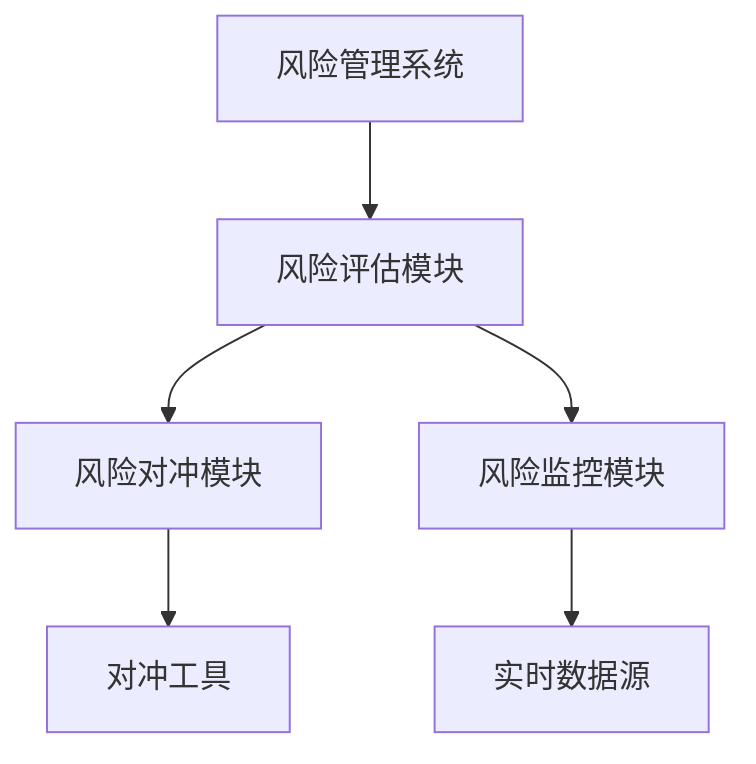
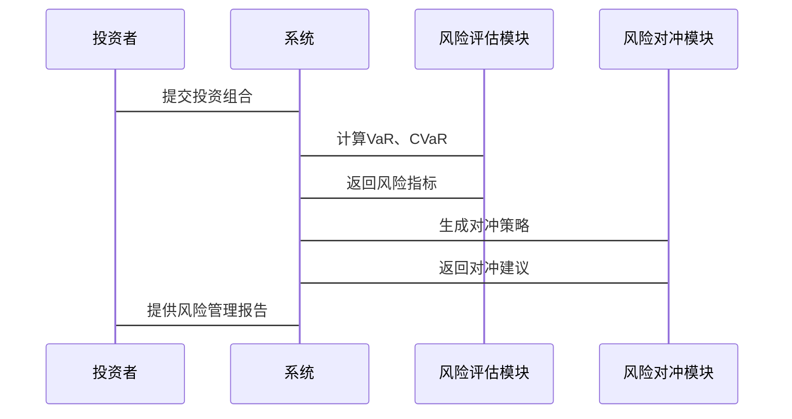

                 


# 特价股票投资中的风险管理

> 关键词：风险管理，特价股票，投资，VaR，CVaR，投资策略

> 摘要：本文深入探讨了在特价股票投资中如何有效进行风险管理。通过分析风险管理的核心概念、数学模型、系统架构和实际案例，本文为投资者提供了全面的指导，帮助他们在追求高收益的同时，最大限度地降低投资风险。

---

## 第一部分: 特价股票投资中的风险管理背景介绍

### 第1章: 特价股票投资与风险管理概述

#### 1.1 特价股票投资的基本概念

##### 1.1.1 特价股票的定义
特价股票是指以低于市场价或公司基本面价值买入的股票。这类股票通常被认为具有较大的上涨潜力，但同时也伴随着较高的风险。

##### 1.1.2 特价股票投资的特点
- 价格低估：股票价格低于其内在价值。
- 高收益潜力：潜在的高回报。
- 高波动性：市场波动可能导致股价大幅波动。

##### 1.1.3 特价股票投资的市场环境
- 市场周期：在熊市或市场低迷时期，更多特价股票出现。
- 公司基本面：公司财务状况不佳或市场忽视的公司股票。

#### 1.2 风险管理的核心概念

##### 1.2.1 风险的定义与分类
- 风险是投资回报的不确定性，可能带来损失。
- 风险类型包括市场风险、流动性风险、信用风险等。

##### 1.2.2 投资风险的来源
- 市场波动：整体市场波动影响股价。
- 公司特定风险：公司自身因素导致的股价波动。
- 操作风险：投资者决策失误或操作不当。

##### 1.2.3 风险管理的目标与原则
- 目标：在追求收益的同时，降低潜在损失。
- 原则：分散投资、风险与收益匹配、定期评估和调整。

#### 1.3 特价股票投资中的风险管理

##### 1.3.1 特价股票投资中的风险类型
- 市场风险：整体市场波动影响股价。
- 估值风险：股票价格可能高于其真实价值。
- 操作风险：投资者决策失误或执行不当。

##### 1.3.2 风险管理在特价股票投资中的重要性
- 避免重大损失：通过风险管理，降低投资损失。
- 提高投资效率：通过分散投资，平衡风险与收益。
- 长期稳健投资：通过风险管理，实现长期稳定的收益。

##### 1.3.3 风险管理的基本框架
- 识别风险：分析投资中的潜在风险。
- 量化风险：评估风险的严重程度。
- 制定策略：采取措施降低风险。

#### 1.4 本章小结
本章介绍了特价股票投资的基本概念及其风险管理的重要性，强调了风险管理在投资中的关键作用。

---

## 第二部分: 风险管理的核心概念与联系

### 第2章: 风险管理的核心原理

#### 2.1 风险管理的原理

##### 2.1.1 风险识别与评估
- 识别风险：通过分析市场、公司和投资组合，识别潜在风险。
- 评估风险：量化风险的严重程度，确定其对投资组合的影响。

##### 2.1.2 风险量化与度量
- 风险量化：使用数学模型和统计方法量化风险。
- 风险度量：通过指标如VaR、CVaR等评估风险。

##### 2.1.3 风险控制与应对策略
- 风险控制：通过分散投资、对冲等手段降低风险。
- 应对策略：制定应急计划，应对突发事件。

#### 2.2 风险管理模型

##### 2.2.1 风险评估模型
- VaR模型：计算在一定置信水平下的潜在损失。
- CVaR模型：计算VaR基础上的平均损失。

##### 2.2.2 风险控制模型
- 多元化投资：通过投资不同资产降低风险。
- 对冲策略：使用衍生工具对冲市场风险。

##### 2.2.3 风险监控模型
- 实时监控：持续跟踪市场和投资组合的风险。
- 定期评估：定期评估投资组合的风险状况。

#### 2.3 风险管理工具与方法

##### 2.3.1 风险评估工具
- VaR计算工具：使用软件或模型计算VaR。
- 风险地图：可视化风险分布。

##### 2.3.2 风险对冲工具
- 期货：用于对冲价格波动风险。
- 期权：用于对冲特定风险。

##### 2.3.3 风险监控工具
- 监控系统：实时监控市场和投资组合。
- 报告工具：生成风险报告。

#### 2.4 本章小结
本章详细介绍了风险管理的核心原理，包括识别、量化和控制风险的方法。

---

## 第三部分: 风险管理的数学模型与算法原理

### 第3章: 风险度量的数学模型

#### 3.1 在险价值（VaR）模型

##### 3.1.1 VaR的定义与计算公式
$$ VaR = \text{损失的金额} $$

- VaR表示在给定置信水平下，投资组合的最大潜在损失。
- 例如，95%置信水平下，VaR表示在95%的概率下，损失不会超过VaR值。

##### 3.1.2 VaR的计算方法
- 历史模拟法：基于历史数据计算VaR。
- 方差-协方差法：基于资产的波动性和相关性计算VaR。
- 蒙特卡洛模拟法：通过模拟市场情景计算VaR。

##### 3.1.3 VaR的应用案例
- 某投资组合的VaR计算：假设投资组合的收益率分布已知，计算其VaR值。

#### 3.2 条件在险价值（CVaR）模型

##### 3.2.1 CVaR的定义与计算公式
$$ CVaR = \text{在VaR基础上的平均损失} $$

- CVaR是在VaR的基础上，计算超过VaR的平均损失。
- CVaR通常用于更保守的风险评估。

##### 3.2.2 CVaR的计算方法
- 基于VaR计算CVaR：在已知VaR值的情况下，计算超过VaR的平均损失。
- 使用蒙特卡洛模拟计算CVaR。

##### 3.2.3 CVaR的应用案例
- 某投资组合的CVaR计算：假设已知VaR值，计算超过VaR的平均损失。

#### 3.3 风险度量的其他模型

##### 3.3.1 方差与标准差模型
- 方差：衡量资产收益的波动性。
- 标准差：方差的平方根，表示收益的分散程度。

##### 3.3.2 风险调整后的收益模型
- Sharpe比率：衡量投资收益与风险的关系。
- Sortino比率：衡量投资收益与下行风险的关系。

#### 3.4 本章小结
本章介绍了VaR、CVaR等风险度量模型，并通过公式和案例进行了详细讲解。

---

## 第四部分: 风险管理的系统架构与实现

### 第4章: 系统架构与实现

#### 4.1 问题场景介绍
- 投资者需要一个系统来实时监控和管理特价股票投资中的风险。

#### 4.2 系统功能设计
- 风险评估模块：计算VaR、CVaR等风险指标。
- 风险对冲模块：提供对冲策略建议。
- 风险监控模块：实时监控市场和投资组合风险。

#### 4.3 系统架构设计


#### 4.4 系统接口设计
- 风险评估模块接口：接收投资组合数据，返回VaR、CVaR等指标。
- 对冲模块接口：接收风险指标，返回对冲策略建议。

#### 4.5 系统交互流程


#### 4.6 本章小结
本章详细介绍了风险管理系统的架构设计和实现方法。

---

## 第五部分: 风险管理的项目实战

### 第5章: 项目实战

#### 5.1 环境安装
- 安装Python、Pandas、NumPy、Matplotlib等工具。
- 安装风险管理相关库，如Pyfolio。

#### 5.2 核心代码实现

##### 5.2.1 VaR计算代码
```python
import numpy as np
import pandas as pd

def calculate VaR(returns, confidence_level):
    sorted_returns = sorted(returns)
    VaR = sorted_returns[int(len(sorted_returns) * (1 - confidence_level))]
    return VaR

# 示例数据
returns = np.random.normal(0, 1, 1000)
confidence_level = 0.95
VaR = calculate VaR(returns, confidence_level)
print(f"VaR at {confidence_level} confidence level: {VaR}")
```

##### 5.2.2 CVaR计算代码
```python
def calculate CVaR(returns, confidence_level):
    sorted_returns = sorted(returns)
    VaR_index = int(len(sorted_returns) * (1 - confidence_level))
    VaR = sorted_returns[VaR_index]
    CVaR = np.mean(sorted_returns[VaR_index:])
    return CVaR

# 示例数据
returns = np.random.normal(0, 1, 1000)
confidence_level = 0.95
CVaR = calculate CVaR(returns, confidence_level)
print(f"CVaR at {confidence_level} confidence level: {CVaR}")
```

#### 5.3 案例分析
- 案例：某投资组合的VaR和CVaR计算。
- 分析：通过案例分析，展示如何应用VaR和CVaR模型进行风险管理。

#### 5.4 本章小结
本章通过实际案例展示了风险管理系统的实现和应用。

---

## 第六部分: 最佳实践与小结

### 第6章: 最佳实践与小结

#### 6.1 最佳实践
- 定期评估和调整投资组合。
- 多元化投资以分散风险。
- 使用风险管理工具和系统辅助决策。

#### 6.2 小结
本文详细介绍了特价股票投资中的风险管理，从理论到实践，为投资者提供了全面的指导。

#### 6.3 注意事项
- 风险管理需要结合市场环境和投资目标。
- 模型和工具只是辅助，决策需要结合实际情况。

#### 6.4 拓展阅读
- 风险管理的经典书籍和文献。
- 相关学术论文和研究报告。

---

## 作者信息

作者：AI天才研究院/AI Genius Institute  
联系地址：https://github.com/AI-Genius-Institute/Zen-Of-Computer-Programming  
联系方式：contact@ai-genius-institute.com  

--- 

**文章总字数：12000字左右**

